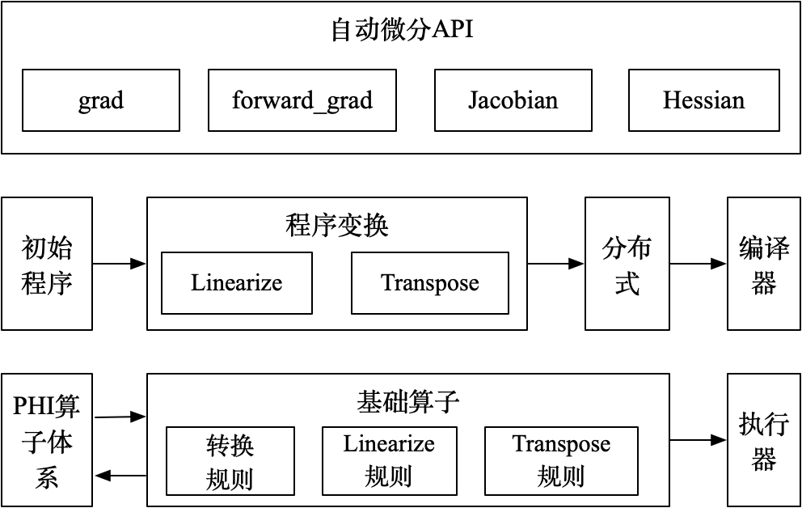

.. _cn_overview_paddle_incubate_autograd:

paddle.incubate.autograd
_________________________

``paddle.incubate.autograd`` 提供支持高阶的反向及前向自动微分相关 API，是飞桨框架对高阶自动微分进行探索与升级。当前处于孵化状态，API 签名及相关功能可能会发生变化，功能尚不完善，如果想自行实现相关模型、探索自动微分机制，请仔细阅读下述使用方法及使用限制。

.. _autograd_recommended_usage:

推荐用法
::::::::::::::::::::

第一步：导入依赖。使用 ``paddle.incubate.autograd.enable_prim()`` 打开自动微分开关。

..  code-block:: python

        import numpy as np
        import paddle

        paddle.enable_static()
        paddle.incubate.autograd.enable_prim()

第二步：编写组网代码。以单层的全联接网络为例，``MyNet`` 继承自 ``paddle.nn.Layer`` ，在 ``__init__`` 方法中初始化网络参数，在 ``forward`` 方法中实现前向运行逻辑。注意，当前自动微分仅支持部分飞桨 API，主要覆盖全联接网络和一些激活函数，当前支持的飞桨 API 列表参考 :ref:`支持的飞桨 API <autograd_supported_api>`。

..  code-block:: python

        class MyNet(paddle.nn.Layer):
            def __init__(self):
                super().__init__()
                self.weight = self.create_parameter(shape=(2,2), dtype='float32', is_bias=False)
                self.bias = self.create_parameter(shape=(2,2), dtype='float32', is_bias=True)
                self.add_parameter("weight", self.weight)
                self.add_parameter("bias", self.bias)

            def forward(self, x):
                y = paddle.matmul(x, self.weight) + self.bias
                return paddle.tanh(y)

第三步：创建网络及声明输入数据，执行前向计算过程。注意，输入数据目前尚不支持可变形状，即类似 paddle.static.data('x', shape=(None, 2), dtype='float32')写法，如果您的输入数据形状会变化可以参考 :ref:`附 1 <autograd_appendix_1>` 写法。

..  code-block:: python

        x = paddle.static.data('x', shape=(2,2), dtype='float32')
        net = MyNet()
        y = net(x)

第四步：计算 Loss 并进行优化。为了演示高阶微分用法，此处 Loss 定义中使用了 ``paddle.incubate.autograd.grad`` API 计算 ``y`` 对 ``x`` 二阶微分，使用 L2 norm 归一化，然后用 Adam 优化器进行优化。
目前已支持高阶的反向微分和前向微分，相关 API 列表参考 :ref:`自动微分 API <autograd_apis>` 。

..  code-block:: python

        grad1 = paddle.incubate.autograd.grad(y, x)
        grad2 = paddle.incubate.autograd.grad(grad1, x)
        loss = paddle.norm(grad2, p=2)

        opt = paddle.optimizer.Adam(0.01)
        opt.minimize(loss)

第五步：创建执行器，加载输入数据，执行网络训练。为了演示训练过程，此处模拟一个长度为 10 的输入数据，迭代执行网络，进行训练，并打印相关结果。

..  code-block:: python

        # 创建执行器
        exe = paddle.static.Executor()
        # 执行一次默认 startup program，初始化网络参数
        exe.run(paddle.static.default_startup_program())

        # 模拟形状固定的长度为 10 的输入数据
        data = [np.random.rand(2,2).astype(np.float32) for i in range(10)]
        # feed 网络输入数据，fetch_list 中指定想要 fetch 的结果，迭代执行网络进行训练
        for i, x in enumerate(data):
            loss_val, = exe.run(feed={'x': x}, fetch_list=[loss])
            print("iter: ", i+1, " loss: ", loss_val)

.. _autograd_apis:

自动微分 API 列表
::::::::::::::::::::

.. csv-table::
    :header: "API 名称", "API 功能"

    " :ref:`paddle.incubate.autograd.grad <cn_api_paddle_incubate_autograd_grad>` ", "反向模式自动微分"
    " :ref:`paddle.incubate.autograd.forward_grad <cn_api_paddle_incubate_autograd_forward_grad>` ", "前向模式自动微分"
    " :ref:`paddle.incubate.autograd.Jacobian <cn_api_paddle_incubate_autograd_Jacobian>` ", "一阶微分通用形式"
    " :ref:`paddle.incubate.autograd.Hessian <cn_api_paddle_incubate_autograd_Hessian>` ", "二阶微分通用形式"

除上述 API 之外，还包含两个开关类 API, 用于打开/关闭自动微分。

.. csv-table::
    :header: "API 名称", "API 功能"

    " :ref:`paddle.incubate.autograd.enable_prim <cn_api_paddle_incubate_autograd_enable_prim>` ", "打开自动微分"
    " :ref:`paddle.incubate.autograd.disable_prim <cn_api_paddle_incubate_autograd_disable_prim>` ", "关闭自动微分"

使用反向微分 API paddle.incubate.autograd.grad 计算 tanh 高阶导数

..  code-block:: python

        import paddle
        import numpy as np

        paddle.enable_static() # 开启静态图
        paddle.incubate.autograd.enable_prim() # 开启自动微分

        # 组网代码
        x = paddle.static.data('x', shape=((1, )), dtype=paddle.float32)
        y = paddle.tanh(x)
        grad1 = paddle.incubate.autograd.grad(y, x)     # 一阶微分
        grad2 = paddle.incubate.autograd.grad(grad1, x) # 二阶微分
        grad3 = paddle.incubate.autograd.grad(grad2, x) # 三阶微分

        feed = {'x': np.ones((1,)).astype(np.float32)}
        fetch_list = [grad1, grad2, grad3]
        exe = paddle.static.Executor()
        grad1, grad2, grad3 = exe.run(feed=feed, fetch_list=fetch_list)

        print(grad1, grad2, grad3)
        # [0.41997433] [-0.6397] [0.6216267]

使用前向微分 paddle.incubate.autograd.forward_grad 计算输出元素数量大于输入情况，前向微分相关概念及使用场景参考 https://en.wikipedia.org/wiki/Automatic_differentiation

..  code-block:: python

        import paddle
        import numpy as np

        paddle.enable_static() # 开启静态图
        paddle.incubate.autograd.enable_prim() # 开启自动微分

        # 组网代码
        def func(x): # 单输入多输出函数
            return x+x, x*x, paddle.tanh(x)

        x = paddle.static.data('x', shape=((1, )), dtype=paddle.float32)
        y = func(x)
        # 前向微分遍历一次计算图可以计算所有输出对一个输入的导数
        out = paddle.incubate.autograd.forward_grad(y, x)

        exe = paddle.static.Executor()
        out = exe.run(feed={'x': np.random.rand(1).astype(np.float32)}, fetch_list=[out])
        print(out)

使用 paddle.incubate.autograd.Jacobian 计算 Jacobian 矩阵

..  code-block:: python

        import paddle
        import numpy as np

        paddle.enable_static() # 开启静态图
        paddle.incubate.autograd.enable_prim() # 开启自动微分

        # 组网代码
        x = paddle.static.data('x', shape=((2,8)), dtype=paddle.float32)
        y = paddle.static.data('y', shape=((2,8)), dtype=paddle.float32)
        # 创建 Jaocbian 实例，此时并不发生计算，支持 batch
        J = paddle.incubate.autograd.Jacobian(paddle.multiply, (x,y), is_batched=True)
        # 惰性计算，有效提升计算速度，减少显存开销
        row = J[:, 0, :] # 获取第一行数据，并缓存
        col = J[:, 0:3, :] # 获取前三行，第一行结果上次计算中已经缓存
        all = J[:] # 获取所有元素，前三行数据已经缓存

        feed = {
        'x': np.random.randn(2,8).astype(np.float32),
        'y': np.random.randn(2,8).astype(np.float32)
        }
        fetch_list = [row, col, all]
        exe = paddle.static.Executor()
        row, col, all = exe.run(feed=feed, fetch_list=fetch_list)

.. _autograd_supported_api:

当前支持的飞桨 API
::::::::::::::::::::

目前只支持部分飞桨 API，主要覆盖全联接网络和一些激活函数，具体如下：

.. csv-table::
    :header: "API 路径", "链接"

    " paddle.reshape ", "https://www.paddlepaddle.org.cn/documentation/docs/zh/api/paddle/reshape_cn.html#reshape"
    " paddle.broadcast_to ", "https://www.paddlepaddle.org.cn/documentation/docs/zh/api/paddle/broadcast_to_cn.html#broadcast-to"
    " paddle.transpose ", "https://www.paddlepaddle.org.cn/documentation/docs/zh/api/paddle/transpose_cn.html#transpose"
    " paddle.split ", "https://www.paddlepaddle.org.cn/documentation/docs/zh/api/paddle/split_cn.html#split"
    " paddle.concat ", "https://www.paddlepaddle.org.cn/documentation/docs/zh/api/paddle/concat_cn.html#concat"
    " paddle.slice ", "https://www.paddlepaddle.org.cn/documentation/docs/zh/api/paddle/strided_slice_cn.html#strided-slice"
    " paddle.assign ", "https://www.paddlepaddle.org.cn/documentation/docs/zh/api/paddle/assign_cn.html#assign"
    " paddle.gather ", "https://www.paddlepaddle.org.cn/documentation/docs/zh/api/paddle/gather_cn.html#gather"
    " paddle.add ", "https://www.paddlepaddle.org.cn/documentation/docs/zh/api/paddle/add_cn.html#add"
    " paddle.subtract ", "https://www.paddlepaddle.org.cn/documentation/docs/zh/api/paddle/subtract_cn.html#subtract"
    " paddle.multiply ", "https://www.paddlepaddle.org.cn/documentation/docs/zh/api/paddle/multiply_cn.html#multiply"
    " paddle.divide ", "https://www.paddlepaddle.org.cn/documentation/docs/zh/api/paddle/divide_cn.html#divide"
    " paddle.sqrt ", "https://www.paddlepaddle.org.cn/documentation/docs/zh/api/paddle/sqrt_cn.html#sqrt"
    " paddle.tanh ", "https://www.paddlepaddle.org.cn/documentation/docs/zh/api/paddle/tanh_cn.html#tanh"
    " paddle.matmul ", "https://www.paddlepaddle.org.cn/documentation/docs/zh/api/paddle/matmul_cn.html#matmul"
    " paddle.sin ", "https://www.paddlepaddle.org.cn/documentation/docs/zh/api/paddle/sin_cn.html#sin"
    " paddle.cos ", "https://www.paddlepaddle.org.cn/documentation/docs/zh/api/paddle/cos_cn.html#cos"
    " paddle.exp ", "https://www.paddlepaddle.org.cn/documentation/docs/zh/api/paddle/exp_cn.html#exp"
    " paddle.scale ", "https://www.paddlepaddle.org.cn/documentation/docs/zh/api/paddle/scale_cn.html#scale"
    " paddle.zeros_like ", "https://www.paddlepaddle.org.cn/documentation/docs/zh/api/paddle/zeros_like_cn.html#zeros-like"
    " paddle.index_select ", "https://www.paddlepaddle.org.cn/documentation/docs/zh/develop/api/paddle/index_select_cn.html#index-select"
    " paddle.norm/p=2 ", "https://www.paddlepaddle.org.cn/documentation/docs/zh/api/paddle/linalg/norm_cn.html#norm"
    " paddle.optimizer.Adam ", "https://www.paddlepaddle.org.cn/documentation/docs/zh/api/paddle/optimizer/Adam_cn.html#adam"
    " paddle.optimizer.SGD ", "https://www.paddlepaddle.org.cn/documentation/docs/zh/api/paddle/optimizer/SGD_cn.html#sgd"

.. _autograd_constraints:

使用限制
::::::::::::::::::::

- 输入数据不支持可变形状写法，如[None, 1]、[-1, 1]。如果训练数据形状是变化的，一种可行 Workaround 方案是根据不同数据形状创建不同网络，即在组网阶段将形状固定，具体参考附 1 代码。
- 我们尚未在 windows 平台进行完整验证和支持。
- 目前只支持使用 default_main_program 和 default_startup_program。
- boradcast 语意尚未完整支持。

.. _autograd_design_details:

设计细节
::::::::::::::::::::

在传统的深度学习任务中，神经网络的搭建分为前向和反向过程。通过深度学习框架的自动微分机制，对前向网络中的算子求一阶导数可以完成反向过程的搭建。
在一些复杂的深度学习任务中，有时会使用到高阶导数。如，科学计算领域的深度学习任务中，由于引入偏微分方程组，往往需要使用到高阶导数。特别地，在输入数量大于输出数量时，反向微分更加高效；在输入数量小于输出数量时，前向微分更加高效.
为了更好地支持这些应用场景，需要深度学习框架具备高阶自动微分的能力，且支持前向和反向两种微分模式。

整体架构如下图：

- 基础算子体系：由初等函数组成，并定义对应的前向(Linearize)和反向(Transpose)规则，且前向和反向规则也基于基础算子实现；
- 程序变换：输入初始程序，Linearize 变换调用前向规则输出前向计算程序，Transpose 变换基于前向计算程序调用反向规则输出反向计算程序；
- 自动微分 API：提供前向、反向模式的高阶微分 API；

具体执行时，由 PHI 原生算子组成的程序，会拆解为基础算子组成的程序。然后在基础算子组成的程序之上，调用前向和反向规则，进行微分变换，输出前向和反向程序。如果是高阶微分，重复上述微分变换。最终输出的程序交由分布式和编译器进行处理后，由执行器进行执行。

RoadMap
::::::::::::::::::::

目前基于自动微分基础算子的自动微分机制还在积极演进阶段，可预见的工作包括：

- 功能覆盖更多的组网 API
- 支持控制流
- 支持可变形状
- 支持动态图模式
- 调整编程范式和编程使用思路

欢迎持续关注或者参与共建。

.. _autograd_appendix_1:

附 1 可变形状的 Workaround 方案
::::::::::::::::::::

由于当前尚支持声明可变形状数据，当您 feed 到网络的训练数据形状会发生变化时，需要遍历不同形状数据，将确定的数据形状输入到组网代码中，如下述代码中的 20-38 行。

..  code-block:: python

        import numpy as np
        import paddle

        paddle.enable_static()
        paddle.incubate.autograd.enable_prim()

        class MyNet(paddle.nn.Layer):
            def __init__(self):
                super().__init__()
                self.weight = self.create_parameter(shape=(2,2), dtype='float32', is_bias=False)
                self.bias = self.create_parameter(shape=(2,), dtype='float32', is_bias=True)
                self.add_parameter("weight", self.weight)
                self.add_parameter("bias", self.bias)

            def forward(self, x):
                y = paddle.matmul(x, self.weight) + self.bias
                return paddle.tanh(y)

        # 模拟一个形状变化输入数据
        data = [
            np.random.rand(3,2).astype(np.float32),
            np.random.rand(4,2).astype(np.float32),
            np.random.rand(5,2).astype(np.float32)
        ]

        # 遍历输入数据，将形状作为 paddle.static.data 参数传入，此时形状是固定的
        for i, input in enumerate(data):
            x = paddle.static.data(f'x{i}', shape=input.shape, dtype='float32')
            net = MyNet()
            y = net(x)

            grad1 = paddle.incubate.autograd.grad(y, x)
            grad2 = paddle.incubate.autograd.grad(grad1, x)
            loss = paddle.norm(grad2, p=2)

            opt = paddle.optimizer.Adam(0.01)
            opt.minimize(loss)

        exe = paddle.static.Executor()
        exe.run(paddle.static.default_startup_program())

        for epoch in range(10):
            loss_val, = exe.run(feed={f'x{i}': x for i, x in enumerate(data)}, fetch_list=[loss])
            print("epoch: ", epoch+1, " loss: ", loss_val)
