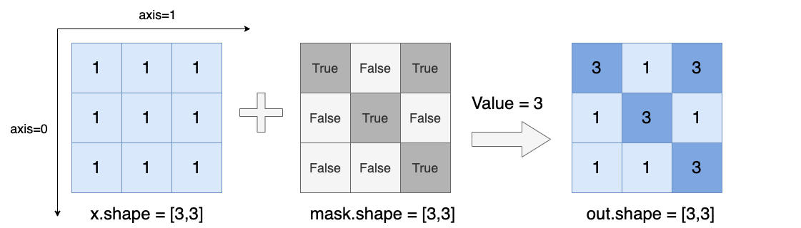

.. _cn_api_paddle_masked_fill:

masked_fill
-------------------------------

.. py:function:: paddle.masked_fill(x, mask, value, name=None)

返回一个 1-D 的 Tensor，Tensor 的值是根据 ``mask`` 信息，将 ``value`` 中的值填充到 ``x`` 中 ``mask`` 对应为 ``True`` 的位置，``mask`` 的数据类型是 bool。

下图展示了一个例子：假设我们有一个所有元素值为 1 的 3x3 矩阵 `x` 和一个相同尺寸的掩码矩阵 `Mask`，`Value` 值为 3。

参数
::::::::::::

    - **x** (Tensor) - 输入 Tensor，数据类型为 float，double，int，int64_t，float16 或者 bfloat16。
    - **mask** (Tensor) - 布尔张量，表示要填充的位置。mask 的数据类型必须为 bool。
    - **value** (Scalar or 0-D Tensor)：用于填充目标张量的值，数据类型为 float，double，int，int64_t，float16 或者 bfloat16。
    - **name** (str，可选) - 具体用法请参见 :ref:`api_guide_Name`，一般无需设置，默认值为 None。

返回
::::::::::::
返回一个根据 ``mask`` 将对应位置填充为 ``value`` 的 Tensor，数据类型与 ``x`` 相同。

代码示例
::::::::::::

COPY-FROM: paddle.masked_fill
