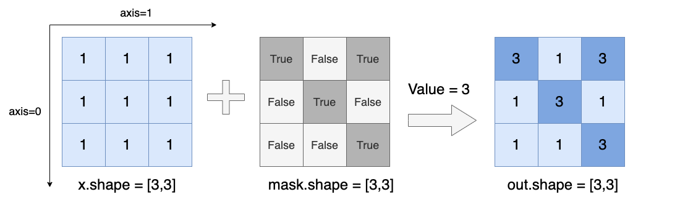

.. _cn_api_paddle_masked_fill:

masked_fill
-------------------------------

.. py:function:: paddle.masked_fill(x, mask, value, name=None)

在 mask 为 True 的位置用 value 填充 x 中的元素。mask 的形状必须与 x 的形状可广播。

下图展示了一个例子：假设我们有一个所有元素值为 1 的 3x3 矩阵 ``x`` 和一个相同尺寸的掩码矩阵 ``Mask``，``Value`` 值为 3。

参数
::::::::::::

    - **x** (Tensor) - 输入 Tensor，数据类型为 float，double，int，int64_t，float16 或者 bfloat16。别名 ``input``。
    - **mask** (Tensor) - 布尔张量，表示要填充的位置。mask 的形状必须与 x 的形状可广播。mask 的数据类型必须为 bool。
    - **value** (Scalar or 0-D Tensor) - 用于填充目标张量的值，数据类型为 float，double，int，int64_t，float16 或者 bfloat16。
    - **name** (str，可选) - 具体用法请参见 :ref:`api_guide_Name`，一般无需设置，默认值为 None。

返回
::::::::::::
Tensor，与 ``x`` 具有相同形状和数据类型的 Tensor。

代码示例
::::::::::::

COPY-FROM: paddle.masked_fill
