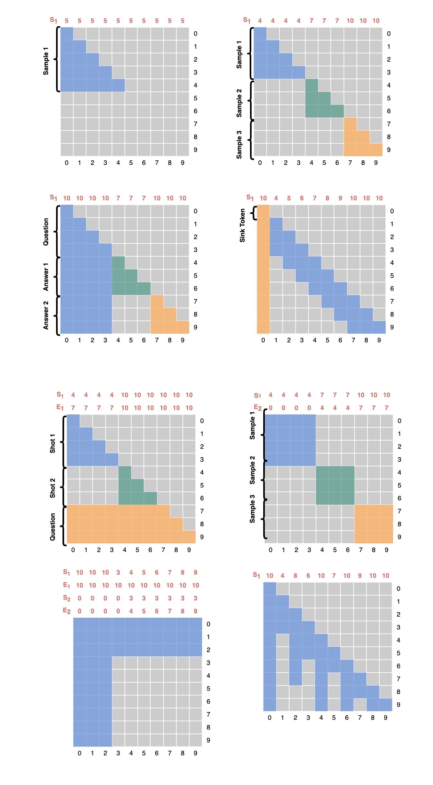

.. _cn_api_paddle_nn_functional_flashmask_attention:

flashmask_attention
-------------------------------

.. py:function:: paddle.nn.functional.flashmask_attention(query, key, value, startend_row_indices, dropout=0.0, causal=False, return_softmax_lse=False, return_seed_offset=False, fixed_seed_offset=None, rng_name="", training=True, name=None)

用稀疏的 flashmask 表达的 flash_attention。
flashmask 将通过参数 `startend_row_indices` 表示作用在 Attention Score 矩阵上的 mask ， Attention Score 矩阵指的是 :math:`Q * K^T` ，元素被 mask 指的是将 Score 矩阵中对应位置设置为 :math:`-inf`
下图展示了多种 mask 的示例，图中为 Score 矩阵，灰色区域元素表示被 mask ，上方数字表示 startend_row_indices 的值，一行数字表明 startend_row_indices 的 shape 为 [batch_size, num_heads, seq_len, 1] ，二行数字表明 startend_row_indices 的 shape 为 [batch_size, num_heads, seq_len, 2]。

.. math::

    result = softmax(\frac{ Q * K^T }{\sqrt{d}} + mask) * V

参数
::::::::::::

    - **query** (int) - 输入 Query Tensor，shape =[batch_size, seq_len, num_heads, head_dim]，数据类型为 float16 或 bfloat16。
    - **key** (Tensor) - 输入 Key Tensor，shape 以及 dtype 和 query 相同。
    - **value** (Tensor) - 输入 Value Tensor，shape 以及 dtype 和 query 相同。
    - **startend_row_indices** (Tensor) - 稀疏掩码索引，shape 为 [batch_size, num_heads, seq_len, {1, 2, 4}]，数据类型为 int32。
                                       num_heads 为 1 或与 k 的 num_heads 相同，num_heads 取 1 时将被广播到与 k 的 num_heads 相同。
                                       根据 causal 参数的取值不同，startend_row_indices 可取不同形状并具有不同含义。
            - 当 `causal=True` 且 shape 取 [batch_size, num_heads, seq_len, 1] 时,
              startend_row_indices 的值 r 表示 Score 矩阵中左下三角从第 r 行下方（包括）的元素将被 mask
            - 当 `causal=True` 且 shape 取 [batch_size, num_heads, seq_len, 2] 时,
              startend_row_indices 的值 r1,r2 表示 Score 矩阵中左下三角从第 r1 行下方（包括）但在第 r2 行上方（不包括）的元素将被 mask
            - 当 `causal=False` 且 shape 取 [batch_size, num_heads, seq_len, 2] 时,
              startend_row_indices 的值 r1,r2 表示 Score 矩阵中左下三角从第 r1 行下方（包括）的元素将被 mask，右上三角从第 r2 行上方（不包括）的元素将被 mask
            - 当 `causal=False` 且 shape 取 [batch_size, num_heads, seq_len, 4] 时 （尚未支持）,
              startend_row_indices 的值 r1,r2,r3,r4 表示 Score 矩阵中左下三角从第 r1 行下方（包括）但在第 r2 行上方（不包括）的元素将被 mask，右上三角从第 r3 行下方（包括）但在第 r4 行上方（不包括）的元素将被 mask
    - **dropout** (bool，可选) – dropout 概率值，默认值为 0。
    - **causal** (bool，可选) - 是否使用 causal 模式，默认值：False。
    - **return_softmax_lse** (bool，可选) - 是否返回 softmax_lse 的结果。默认值为 False。
    - **return_seed_offset** (bool，可选) - 是否返回 seed_offset 的结果。默认值为 False。
    - **fixed_seed_offset** (Tensor，可选) - 固定 Dropout 的 offset seed.
    - **rng_name** (str，可选) - 随机数生成器名称
    - **training** (bool，可选) - 指示是否为训练模式。默认值为 True。
    - **name** (str，可选) - 具体用法请参见 :ref:`api_guide_Name`，一般无需设置，默认值为 None。

返回
::::::::::::
`Tensor`，attention 的结果。
`softmax_lse`，当 return_softmax_lse 为 True 时，返回的 softmax_lse 的值
`seed_offset`，当 return_seed_offset 为 True 时，返回的 seed_offset 的值

代码示例
::::::::::::

COPY-FROM: paddle.nn.functional.flashmask_attention
