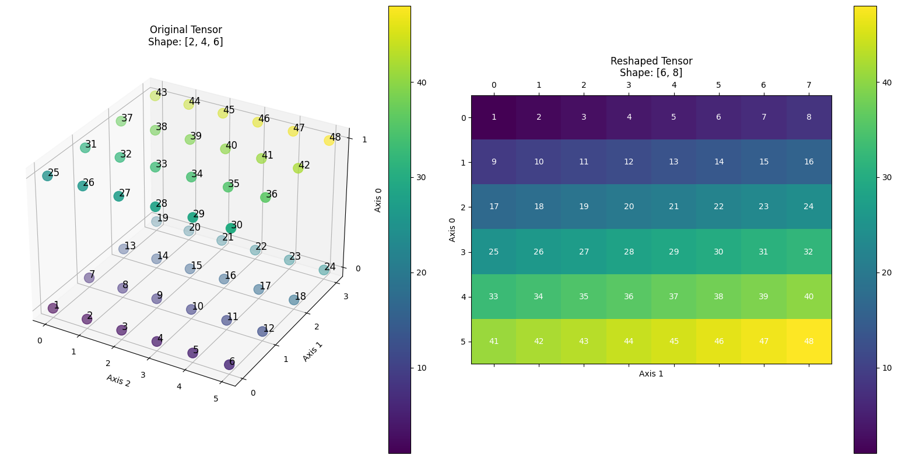

.. _cn_api_paddle_reshape:

reshape
-------------------------------

.. py:function::  paddle.reshape(x, shape, name=None)

在保持输入 ``x`` 数据不变的情况下，改变 ``x`` 的形状。

请注意，在动态图模式下，输出 Tensor 将与输入 Tensor 共享数据，并且没有 Tensor 数据拷贝的过程。
如果不希望输入与输出共享数据，请使用 `Tensor.clone`，例如 `reshape_clone_x = x.reshape([-1]).clone()` 。

在指定目标 shape 时存在一些技巧：

  - 1. -1 表示这个维度的值是从 x 的元素总数和剩余维度推断出来的。因此，有且只有一个维度可以被设置为-1。
  - 2. 0 表示实际的维数是从 x 的对应维数中复制出来的，因此 shape 中 0 的索引值不能超过 x 的维度。

这里有一些例子来解释它们：

  - 1。给定一个形状为[2,4,6]的三维 Tensor x，目标形状为[6,8]，则将 x 变换为形状为[6,8]的 2-D Tensor，且 x 的数据保持不变。
  - 2。给定一个形状为[2,4,6]的三维 Tensor x，目标形状为[2,3,-1,2]，则将 x 变换为形状为[2,3,4,2]的 4-D Tensor，且 x 的数据保持不变。在这种情况下，目标形状的一个维度被设置为-1，这个维度的值是从 x 的元素总数和剩余维度推断出来的。
  - 3。给定一个形状为[2,4,6]的三维 Tensor x，目标形状为[-1,0,3,2]，则将 x 变换为形状为[2,4,3,2]的 4-D Tensor，且 x 的数据保持不变。在这种情况下，0 对应位置的维度值将从 x 的对应维数中复制，-1 对应位置的维度值由 x 的元素总数和剩余维度推断出来。

下图展示了第一个例子中的情形——一个形状为[2,4,6]的三维张量通过 reshape 操作转变为形状为[6,8]的二维张量，同时保持了张量中元素的顺序和值不变。通过比较，可以清晰地看到张量形状变化前后各元素的对应关系。

参数
::::::::::::

  - **x** (Tensor) - N-D ``Tensor``，数据类型为 ``float16``, ``float32``, ``float64``, ``int16``, ``int32``, ``int64``, ``int8``, ``uint8``, ``complex64``, ``complex128``, ``bfloat16`` 或 ``bool``。
  - **shape** (list|tuple|Tensor) - 数据类型是 ``int32``。定义目标形状。目标形状最多只能有一个维度为-1。如果 ``shape`` 的类型是 list 或 tuple，它的元素可以是整数或者形状为[]的 ``Tensor``。如果 ``shape`` 的类型是 ``Tensor``，则是 1-D 的 ``Tensor``。
  - **name** (str，可选) - 具体用法请参见 :ref:`api_guide_Name`，一般无需设置，默认值为 None。

返回
:::::::::

``Tensor``，改变形状后的 ``Tensor``，数据类型与 ``x`` 相同。

代码示例
::::::::::::

COPY-FROM: paddle.reshape
