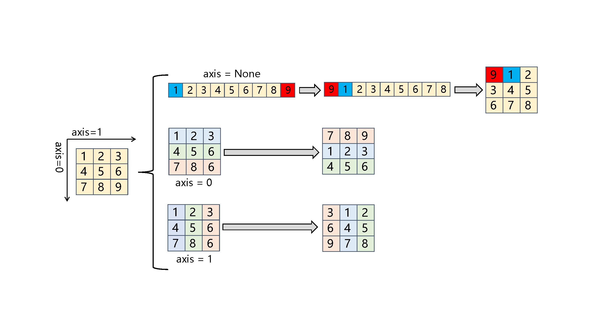

.. _cn_api_paddle_roll:

roll
-------------------------------

.. py:function:: paddle.roll(x, shifts, axis=None, name=None)

沿着指定维度 ``axis`` 对输入 ``x`` 进行循环滚动，当元素移动到最后位置时，会从第一个位置重新插入。如果 ``axis`` 为 ``None``，则输入在被循环滚动之前，会先展平成 ``1-D Tensor``，滚动操作完成后恢复成原来的形状。

参数
:::::::::

    - **x** （Tensor）– 输入的 Tensor。
    - **shifts** (int|list|tuple) - 滚动位移。如果 ``shifts`` 是一个元组或者列表，则 ``axis`` 必须是相同大小的元组或者列表，输入 Tensor 将依次沿着每个维度滚动相应的数值。
    - **axis** (int|list|tuple，可选) – 滚动轴。默认值为 None。
    - **name** (str，可选) - 具体用法请参见 :ref:`api_guide_Name`，一般无需设置，默认值为 None。

下图展示了一个形状为 ``[[1,2,3],[4,5,6],[7,8,9]]`` 的二维张量通过 ``roll`` 操作转变为形状不同的张量。

- 当 ``axis = None`` 时，张量会被展平成一维，然后进行循环滚动，再恢复原状
- 当 ``axis=0`` 时，张量沿着0轴方向进行循环滚动
- 当 ``axis=1`` 时，张量沿着1轴方向进行循环滚动

由于 ``axis`` 参数的取值不同，对应的滚动操作也不同，由图可以看到每个元素在不同滚动操作下的位置变化。

返回
:::::::::

    - **Tensor**，数据类型同输入。

代码示例
:::::::::

COPY-FROM: paddle.roll
