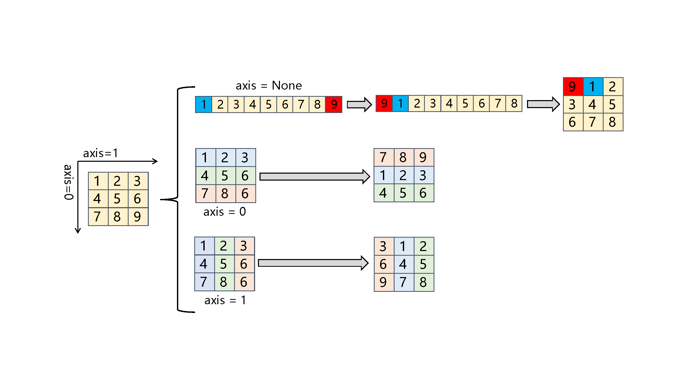

.. _cn_api_paddle_scatter_nd:

scatter_nd
-------------------------------

.. py:function:: paddle.scatter_nd(index, updates, shape, name=None)

根据 :code:`index`，将 :code:`updates` 添加到一个新的 Tensor 中，从而得到输出的 Tensor。这个操作与 :code:`scatter_nd_add` 类似，除了形状为 :code:`shape` 的 Tensor 是通过零初始化的。相应地，:code:`scatter_nd(index, updates, shape)` 等价于 :code:`scatter_nd_add(fluid.layers.zeros(shape, updates.dtype), index, updates)`。如果 :code:`index` 有重复元素，则将累积相应的更新，因此，由于数值近似问题，索引中重复元素的顺序不同可能会导致不同的输出结果。具体的计算方法可以参见 :code:`scatter_nd_add`。该 OP 是 :code:`gather_nd` 的反函数。

**图解说明**：

下图展示了一个形状为 [3, 4] 的张量，使用 paddle.scatter_nd 操作根据 index 指定的位置更新张量为对应的 update 的数据。通过比较，可以清晰地看到张量形状变化前后各元素的对应关系。

参数
::::::::::::

    - **index** (Tensor) - 输入的索引 Tensor，数据类型为非负 int32 或非负 int64。它的维度 :code:`index.ndim` 必须大于等于 1，并且 :code:`index.shape[-1] <= len(shape)`
    - **updates** (Tensor) - 输入的更新 Tensor。形状必须是 :code:`index.shape[:-1] + shape[index.shape[-1]:]`。数据类型可以是 float32，float64。
    - **shape** (tuple|list) - 要求输出 Tensor 的形状。类型是 tuple 或者 list。
    - **name** (str，可选) - 具体用法请参见 :ref:`api_guide_Name`，一般无需设置，默认值为 None。

返回
::::::::::::
Tensor，数据类型与 :code:`updates` 相同，形状是 :code:`shape` 。

代码示例
::::::::::::

COPY-FROM: paddle.scatter_nd
