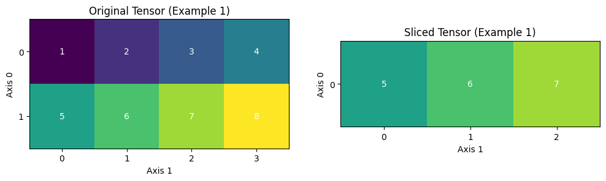

.. _cn_api_paddle_slice:

slice
-------------------------------

.. py:function:: paddle.slice(input, axes, starts, ends)

沿多个轴生成 ``input`` 的切片。与 numpy 类似：https://docs.scipy.org/doc/numpy/reference/arrays.indexing.html 该 OP 使用 ``axes`` 、 ``starts`` 和 ``ends`` 属性来指定轴列表中每个轴的起点和终点位置，并使用此信息来对 ``input`` 切片。如果向 ``starts`` 或 ``ends`` 传递负值如 :math:`-i`，则表示该轴的反向第 :math:`i-1` 个位置（这里以 0 为初始位置）。如果传递给 ``starts`` 或 ``end`` 的值大于 n（维度中的元素数目），则表示 n。当切片一个未知数量的维度时，建议传入 ``INT_MAX``。 ``axes`` 、 ``starts`` 和 ``ends`` 三个参数的元素数目必须相等。以下示例将解释切片如何工作：

::

        示例 1：
                给定：
                     data=[[1,2,3,4],[5,6,7,8],]
                     axes=[0,1]
                     starts=[1,0]
                     ends=[2,3]
                则：
                     result=[[5,6,7],]

        示例 2：
                给定：
                     data=[[1,2,3,4],[5,6,7,8],]
                     starts=[0,1]
                     ends=[-1,1000]    # 此处-1 表示第 0 维的反向第 0 个位置，索引值是 1。
                则：
                     result=[[2,3,4],] # 即 data[0:1, 1:4]

下图展示了示例 1 中的情形——一个形状为[2, 4]的二维张量通过切片操作转变为形状为[1, 3]的二维张量。切片操作指定了在第 0 轴和第 1 轴上的起始和结束索引,可以清晰地看到切片操作前后张量中各元素的对应关系。

参数
::::::::::::

        - **input** （Tensor）- 多维 ``Tensor``，数据类型为 ``float16``， ``float32``，``float64``，``int32``，或 ``int64``。
        - **axes** （list|tuple）- 数据类型是 ``int32``。表示进行切片的轴。
        - **starts** （list|tuple|Tensor）- 数据类型是 ``int32``。如果 ``starts`` 的类型是 list 或 tuple，它的元素可以是整数或者形状为[]的 ``0-D Tensor``。如果 ``starts`` 的类型是 ``Tensor``，则是 1-D ``Tensor``。表示在各个轴上切片的起始索引值。
        - **ends** （list|tuple|Tensor）- 数据类型是 ``int32``。如果 ``ends`` 的类型是 list 或 tuple，它的元素可以是整数或者形状为[]的 ``0-D Tensor``。如果 ``ends`` 的类型是 ``Tensor``，则是 1-D ``Tensor``。表示在各个轴上切片的结束索引值。

返回
::::::::::::
多维 ``Tensor``，数据类型与 ``input`` 相同。

代码示例
::::::::::::

COPY-FROM: paddle.slice
