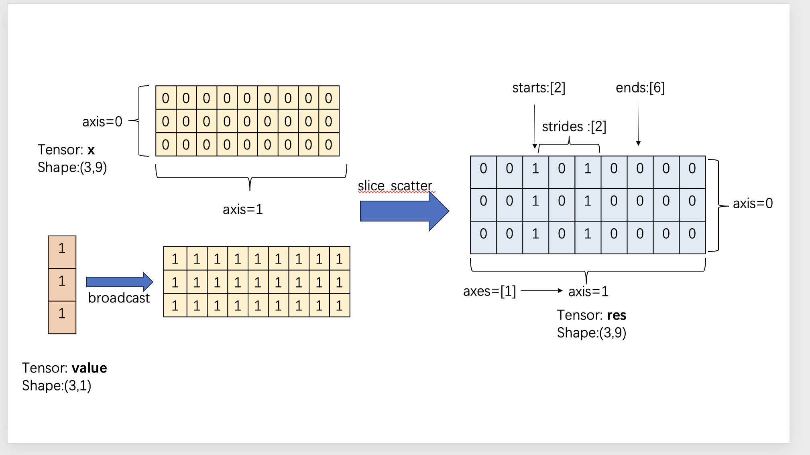

.. _cn_api_paddle_slice_scatter:

slice_scatter
-------------------------------

.. py:function:: paddle.slice_scatter(x, value, axes=None, starts=None, ends=None, strides=None)

沿着 ``axes`` 将 ``value`` 矩阵的值嵌入到 ``x`` 矩阵。返回一个新的 Tensor 而不是视图。 ``axes`` 需要与 ``starts``, ``ends`` 和 ``strides`` 尺寸一致。

.. note::
    此 API 有两种调用方式：
    1. ``paddle.slice_scatter(x, value, axes=None, starts=None, ends=None, strides=None)`` (Paddle 风格)：沿多个维度嵌入 value 张量
    2. ``paddle.slice_scatter(input, src, dim=0, start=None, end=None, step=1)`` (PyTorch 风格)：沿单个维度嵌入 src 张量

图示展示了示例二 ——一个形状为 [3, 9] 的张量 x，在 axis 1  上使用 slice scatter 操作，将 [3, 1] 的 value 张量嵌入到指定的范围内。图中显示了原始张量、value 张量以及操作后的结果。

参数
:::::::::
    - **x**  (Tensor) - 输入的 Tensor 作为目标矩阵，数据类型为： ``bool``、 ``float16``、 ``float32``、 ``float64``、 ``uint8``、 ``int8``、 ``int16``、 ``int32``、 ``int64``、 ``bfloat16``、 ``complex64``、 ``complex128``。别名 ``input``。
    - **value**  (Tensor) - 需要插入的值，数据类型为： ``bool``、 ``float16``、 ``float32``、 ``float64``、 ``uint8``、 ``int8``、 ``int16``、 ``int32``、 ``int64``、 ``bfloat16``、 ``complex64``、 ``complex128``。别名 ``src``。
    - **axes**  (list|tuple，可选) - 指定沿着哪几个维度嵌入对应的值。别名 ``dim``。
    - **starts**  (list|tuple，可选) - 嵌入的起始索引。别名 ``start``。
    - **ends**  (list|tuple，可选) - 嵌入的截止索引。别名 ``end``。
    - **strides**  (list|tuple，可选) - 嵌入的步长。别名 ``step``。

返回
:::::::::

Tensor， 与 ``x`` 数据类型与形状相同。

代码示例
:::::::::

COPY-FROM: paddle.slice_scatter
