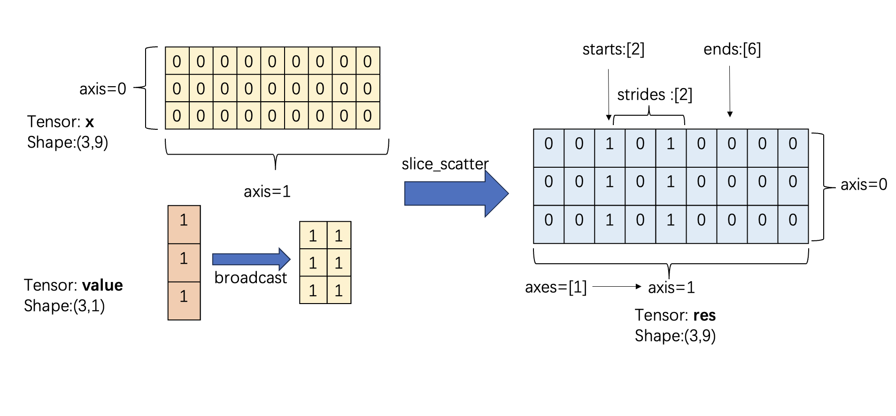

.. _cn_api_paddle_slice_scatter:

slice_scatter
-------------------------------

.. py:function:: paddle.slice_scatter(x, value, axes, starts, ends, strides, name=None)

沿着 `axes` 将 `value` 矩阵的值嵌入到 `x` 矩阵。返回一个新的 Tensor 而不是视图。 `axes` 需要与 `starts`, `ends` 和 `strides` 尺寸一致。

图示展示了示例二，——一个形状为 [3, 9] 的张量 x，在 Axis 1  上使用 slice scatter 操作，将 [3, 1] 的 value 张量嵌入到指定的范围内。图中显示了原始张量、value 张量以及操作后的结果。

参数
:::::::::
    - **x**  (Tensor) - 输入的 Tensor 作为目标矩阵，数据类型为： `bool`、 `float16`、 `float32`、 `float64`、 `uint8`、 `int8`、 `int16`、 `int32`、 `int64`、 `bfloat16`、 `complex64`、 `complex128`。
    - **value**  (Tensor) - 需要插入的值，数据类型为： `bool`、 `float16`、 `float32`、 `float64`、 `uint8`、 `int8`、 `int16`、 `int32`、 `int64`、 `bfloat16`、 `complex64`、 `complex128`。
    - **axes**  (list|tuple) - 指定沿着哪几个维度嵌入对应的值。
    - **starts**  (list|tuple) - 嵌入的起始索引。
    - **ends**  (list|tuple) - 嵌入的截止索引。
    - **strides**  (list|tuple) - 嵌入的步长。
    - **name**  (str，可选) - 具体用法请参见 :ref:`api_guide_Name`，一般无需设置，默认值为 `None`。

返回
:::::::::

Tensor， 与 ``x`` 数据类型与形状相同。

代码示例
:::::::::

COPY-FROM: paddle.slice_scatter
