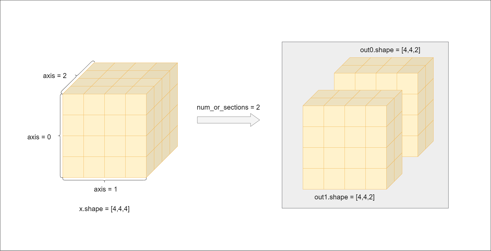

.. _cn_api_paddle_split:

split
-------------------------------

.. py:function:: paddle.split(x, num_or_sections, axis=0, name=None)

将输入 Tensor 分割成多个子 Tensor。

下图展示了一个 split 的情形——一个形状为[2,3,2]的三维张量在进行 split 操作, 其中参数 num_or_sections = [1, 2], axis = 1 。通过比较，可以清晰地看到张量在切割前后的变化。

参数
:::::::::
       - **x** (Tensor) - 输入变量，数据类型为 bool、float16、float32、float64、uint8、int8、int32、int64 的多维 Tensor。
       - **num_or_sections** (int|list|tuple) - 如果 ``num_or_sections`` 是一个整数，则表示 Tensor 平均划分为相同大小子 Tensor 的数量。如果 ``num_or_sections`` 是一个 list 或 tuple，那么它的长度代表子 Tensor 的数量，它的元素可以是整数或者形状为[]的 0-D Tensor，依次代表子 Tensor 需要分割成的维度的大小。list 或 tuple 的长度不能超过输入 Tensor 待分割的维度的大小。在 list 或 tuple 中，至多有一个元素值为-1，表示该值是由 ``x`` 的维度和其他 ``num_or_sections`` 中元素推断出来的。例如对一个维度为[4, 6, 6] Tensor 的第三维进行分割时，指定 ``num_or_sections=[2,-1,1]``，输出的三个 Tensor 维度分别为：[4, 6, 2]，[4, 6, 3]，[4, 6, 1]。
       - **axis** (int|Tensor，可选) - 整数或者形状为[]的 0-D Tensor，数据类型为 int32 或 int64。表示需要分割的维度。如果 ``axis < 0``，则划分的维度为 ``rank(x) + axis``。默认值为 0。
       - **name** (str，可选) - 具体用法请参见 :ref:`api_guide_Name`，一般无需设置，默认值为 None。

返回
:::::::::
分割后的 Tensor 列表。

代码示例
:::::::::

COPY-FROM: paddle.split
