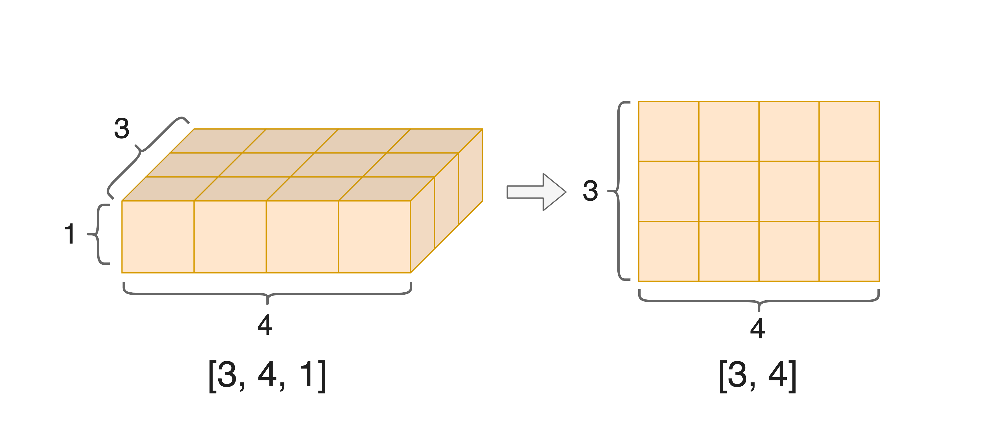

.. _cn_api_paddle_squeeze:

squeeze
-------------------------------

.. py:function:: paddle.squeeze(x, axis=None, name=None)

删除输入 Tensor 的 Shape 中尺寸为 1 的维度。如果指定了 axis，则会删除 axis 中指定的尺寸为 1 的维度。如果没有指定 axis，那么所有等于 1 的维度都会被删除。

请注意，在动态图模式下，输出 Tensor 将与输入 Tensor 共享数据，并且没有 Tensor 数据拷贝的过程。
如果不希望输入与输出共享数据，请使用 `Tensor.clone` ，例如 `squeeze_clone_x = x.squeeze().clone()` 。

.. code-block:: text

    Case 1:

        Input:
        x.shape = [1, 3, 1, 5]  # If axis is not provided, all dims equal of size 1 will be removed.
        axis = None
        Output:
        out.shape = [3, 5]

    Case 2:

        Input:
        x.shape = [1, 3, 1, 5]  # If axis is provided, it will remove the dimension(s) by given axis that of size 1.
        axis = 0
        Output:
        out.shape = [3, 1, 5]

    Case 3:

        Input:
        x.shape = [1, 3, 1, 5]  # If the dimension of one given axis (3) is not of size 1, the dimension remain unchanged.
        axis = [0, 2, 3]
        Output:
        out.shape = [3, 5]

    Case 4:

        Input:
        x.shape = [1, 3, 1, 5]  # If axis is negative, axis = axis + ndim (number of dimensions in x).
        axis = [-2]
        Output:
        out.shape = [1, 3, 5]

下图展示了 squeeze 操作的一个典型情况——一个形状为 [3, 4, 1] 的三维度张量通过 squeeze 操作删除了所有尺寸为 1 的维度，即维度3。我们可以看到该张量变为了一个形状为 [3, 4] 的二维张量。

参数
:::::::::
        - **x** (Tensor) - 输入的 `Tensor` ，数据类型为：float32、float64、bool、int8、int32、int64。
        - **axis** (int|list|tuple，可选) - 输入一个或一列整数，代表要压缩的轴。axis 的范围： [−ndim(x), ndim(x))] 。 如果 axis 为负数， 则 axis=axis+ndim(x) 。默认为 None，表示对所有尺寸为 1 的维度进行压缩。
        - **name** (str，可选) - 具体用法请参见 :ref:`api_guide_Name`，一般无需设置，默认值为 None。

返回
:::::::::
对维度进行压缩后的 Tensor，数据类型与输入 Tensor 一致。

代码示例
:::::::::

COPY-FROM: paddle.squeeze
