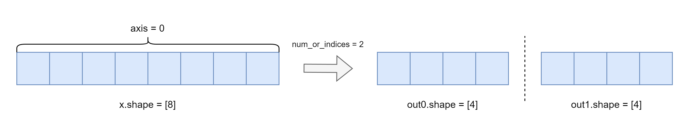
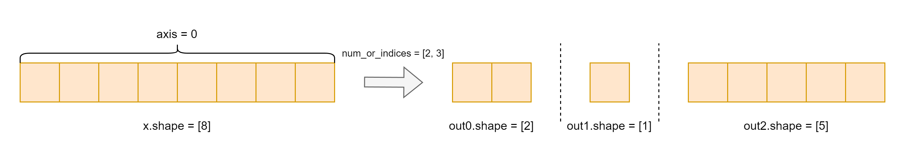
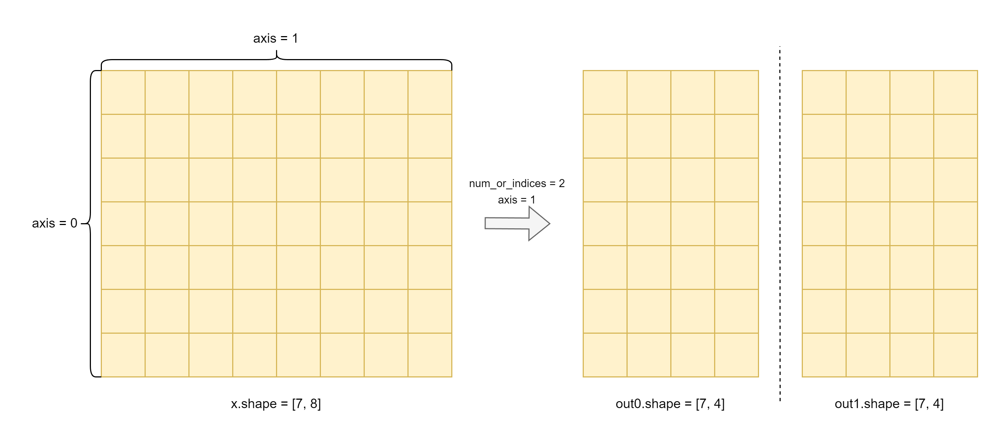

.. _cn_api_paddle_tensor_split:

tensor_split
-------------------------------

.. py:function:: paddle.tensor_split(x, num_or_indices, axis=0, name=None)

将输入 Tensor 沿着轴 ``axis`` 分割成多个子 Tensor，允许进行不等长地分割。

如下图，Tenser ``x`` 的 shape 为[6]，经过 ``paddle.tensor_split(x, num_or_indices=4)`` 变换后，得到 ``out0``，``out1``，``out2``，``out3`` 四个子 Tensor :

其中，由于 x 在 axis = 0 方向上的长度 6 不能被 num_or_indices = 4 整除，故分割后前 int(6 % 4) 个部分的大小将是 int(6 / 4) + 1 ，其余部分的大小将是 int(6 / 4) 。

参数
:::::::::
       - **x** (Tensor) - 输入变量，数据类型为 bool、bfloat16、float16、float32、float64、uint8、int8、int32、int64 的多维 Tensor，其维度必须大于 0。
       - **num_or_indices** (int|list|tuple) - 如果 ``num_or_indices`` 是一个整数 ``n`` ，则 ``x`` 沿 ``axis`` 拆分为 ``n`` 部分。如果 ``x`` 可被 ``n`` 整除，则每个部分都是 ``x.shape[axis]/n`` 。如果 ``x`` 不能被 ``n`` 整除，则前 ``int(x.shape[axis]%n)`` 个部分的大小将是 ``int(x.shape[axis]/n)+1`` ，其余部分的大小将是 ``int(x.shape[axis]/n)`` 。如果 ``num_or_indices`` 是整数索引的列表或元组，则在每个索引处沿 ``axis`` 分割 ``x`` 。例如， ``num_or_indices=[2, 4]`` 在 ``axis=0`` 时将沿轴 0 将 ``x`` 拆分为 ``x[：2]`` 、 ``x[2:4]`` 和 ``x[4:]`` 。
       - **axis** (int|Tensor，可选) - 整数或者形状为[]的 0-D Tensor，数据类型为 int32 或 int64。表示需要分割的维度。如果 ``axis < 0``，则划分的维度为 ``rank(x) + axis`` 。默认值为 0。
       - **name** (str，可选) - 具体用法请参见 :ref:`api_guide_Name`，一般无需设置，默认值为 None。

返回
:::::::::

list[Tensor]，分割后的 Tensor 列表。

代码示例 1
:::::::::

COPY-FROM: paddle.tensor_split:tensor-split-example-1

代码示例 2
:::::::::::

COPY-FROM: paddle.tensor_split:tensor-split-example-2

代码示例 3
:::::::::::

COPY-FROM: paddle.tensor_split:tensor-split-example-3

代码示例 4
:::::::::::

COPY-FROM: paddle.tensor_split:tensor-split-example-4

代码示例 5
:::::::::::

COPY-FROM: paddle.tensor_split:tensor-split-example-5

