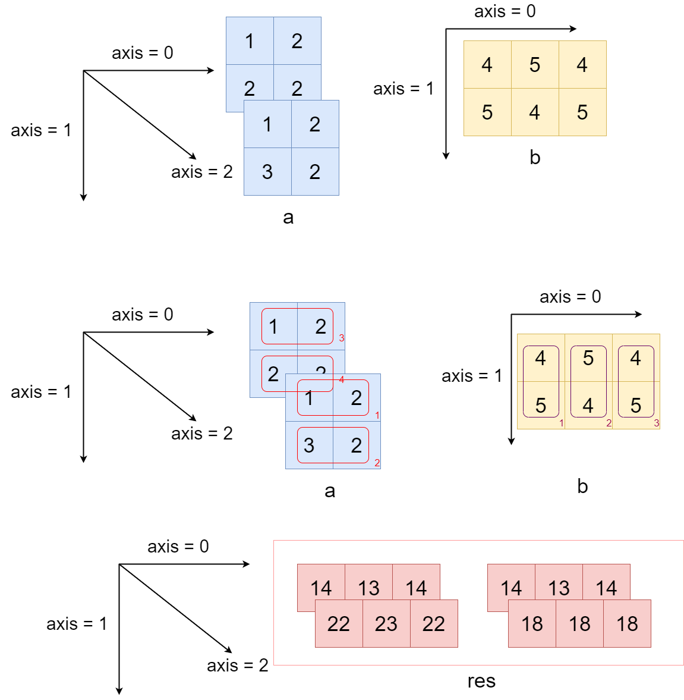

.. _cn_api_paddle_tensordot:

tensordot
-------------------------------

.. py:function:: paddle.tensordot(x, y, axes=2, name=None)

Tensor 缩并运算（Tensor Contraction），即沿着 axes 给定的多个轴对两个 Tensor 对应元素的乘积进行加和操作。
可以选择沿一个或多个轴进行点积操作,操作后返回的结果张量维度是 A 和 B 上未参与点积的维度的并集。
图例中展示了一个 shape = [2,2,2]的 a 张量,和 shape = [2,3]的 b 张量
shape = [2,2,3]的 res 张量为 a,b 两个张量沿着 a 张量的最后一个轴和 b 张量的第一个轴进行缩并的结果
res = paddle.tensordot(x, y, axes = 1)

参数
::::::::::::

    - **x** （Tensor）- 缩并运算操作的左 Tensor，数据类型为 ``float16`` 或 ``float32`` 或 ``float64``。
    - **y** （Tensor）- 缩并运算操作的右 Tensor，与 ``x`` 具有相同的数据类型。
    - **axes** （int|tuple|list|Tensor）- 指定对 ``x`` 和 ``y`` 做缩并运算的轴，默认值为整数 2。

        1. ``axes`` 可以是一个非负整数。若输入的是一个整数 ``n``，则表示对 ``x`` 的后 ``n`` 个轴和对 ``y`` 的前 ``n`` 个轴进行缩并运算。

        2. ``axes`` 可以是一个一维的整数 tuple 或 list，表示 ``x`` 和 ``y`` 沿着相同的轴方向进行缩并运算。例如，``axes`` =[0, 1]表示 ``x`` 的前两个轴和 ``y`` 的前两个轴对应进行缩并运算。

        3. ``axes`` 可以是一个 tuple 或 list，其中包含一个或两个一维的整数 tuple|list|Tensor。如果 ``axes`` 包含一个 tuple|list|Tensor，则对 ``x`` 和 ``y`` 的相同轴做缩并运算，具体轴下标由该 tuple|list|Tensor 中的整数值指定。如果 ``axes`` 包含两个 tuple|list|Tensor，则第一个指定 ``x`` 做缩并运算的轴下标，第二个指定 ``y`` 的对应轴下标。如果 ``axes`` 包含两个以上的 tuple|list|Tensor，只有前两个会被作为轴下标序列使用，其它的将被忽略。

        4. ``axes`` 可以是一个 Tensor，这种情况下该 Tensor 会被转换成 list，然后应用前述规则确定做缩并运算的轴。请注意，输入 Tensor 类型的 ``axes`` 只在动态图模式下可用。
    - **name** (str，可选) - 具体用法请参见 :ref:`api_guide_Name`，一般无需设置，默认值为 None。

返回
::::::::::::
一个 ``Tensor``，表示 Tensor 缩并的结果，数据类型与 ``x`` 和 ``y`` 相同。一般情况下，有 :math:`output.ndim = x.ndim + y.ndim - 2 \times n_{axes}`，其中 :math:`n_{axes}` 表示做 Tensor 缩并的轴数量。

.. note::

1. 本 API 支持 Tensor 维度广播，``x`` 和 ``y`` 做缩并操作的对应维度 size 必须相等，或适用于广播规则。
2. 本 API 支持 axes 扩展，当指定的 ``x`` 和 ``y`` 两个轴序列长短不一时，短的序列会自动在末尾补充和长序列相同的轴下标。例如，如果输入 ``axes`` =[[0, 1, 2, 3], [1, 0]]，则指定 ``x`` 的轴序列是[0, 1, 2, 3]，对应 ``y`` 的轴序列会自动从[1,0]扩展成[1, 0, 2, 3]。

代码示例
::::::::::::

COPY-FROM: paddle.tensordot
