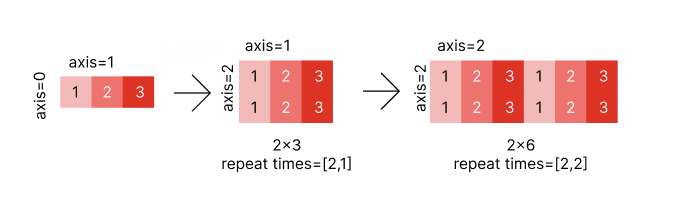

.. _cn_api_paddle_tile:

tile
-------------------------------

.. py:function:: paddle.tile(x, repeat_times, name=None)

根据参数 ``repeat_times`` 对输入 ``x`` 的各维度进行复制。平铺后，输出的第 ``i``  个维度的值等于 ``x.shape[i]*repeat_times[i]`` 。

``x`` 的维数和 ``repeat_times`` 中的元素数量应小于等于 6。

下图展示了内容为 [1, 2, 3]的一个一维张量沿着第一个维度重复 2 次，沿着第二个维度重复 1 次，结果是一个形状为 [2, 3] 的二维张量；以及沿着第一个维度重复 2 次，沿着第二个维度也重复 2 次。结果是一个形状为 [2, 6] 的张量。

参数
:::::::::
    - **x** (Tensor) - 输入的 Tensor，数据类型为：bool、float16、float32、float64、int32 或 int64。
    - **repeat_times** (list|tuple|Tensor) - 指定输入 ``x`` 每个维度的复制次数。如果 ``repeat_times`` 的类型是 list 或 tuple，它的元素可以是整数或者数据类型为 int32 的 1-D Tensor。如果 ``repeat_times`` 的类型是 Tensor，则是数据类型为 int32 的 1-D Tensor。
    - **name** (str，可选) - 具体用法请参见 :ref:`api_guide_Name`，一般无需设置，默认值为 None。

返回
:::::::::
``Tensor``，数据类型与 ``x`` 相同。返回值的第 i 维的大小等于 ``x[i] * repeat_times[i]`` 。

代码示例
::::::::::::

COPY-FROM: paddle.tile
