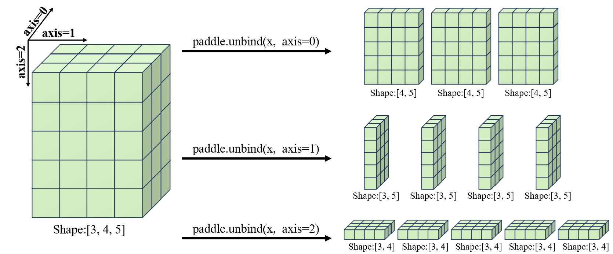

.. _cn_api_paddle_unbind:

unbind
-------------------------------

.. py:function:: paddle.unbind(input, axis=0)

将输入 Tensor 按照指定的维度分割成多个子 Tensor。

下面展示了将一个形状为[3,4,5]的向量通过 unbind 操作，沿着 Axis=0 维度分割，转为为三个形状为[4,5]的二维张量的例子。通过比较，可以清晰地看到转变前后各个元素的对应关系。值得注意的是，沿着 Axis=0 维度分割，仅能 unbind 出三个张量，同理，沿着 Axis=1，仅能 unbind 出四个张量，以此类推。

参数
:::::::::
       - **input** (Tensor) - 输入变量，数据类型为 float16、loat32、float64、int32、int64、complex64、complex128 的多维 Tensor。
       - **axis** (int32|int64，可选) - 数据类型为 int32 或 int64，表示需要分割的维度。如果 axis < 0，则划分的维度为 rank(input) + axis。默认值为 0。

返回
:::::::::
Tensor，分割后的 Tensor 列表。

代码示例
:::::::::

COPY-FROM: paddle.unbind
