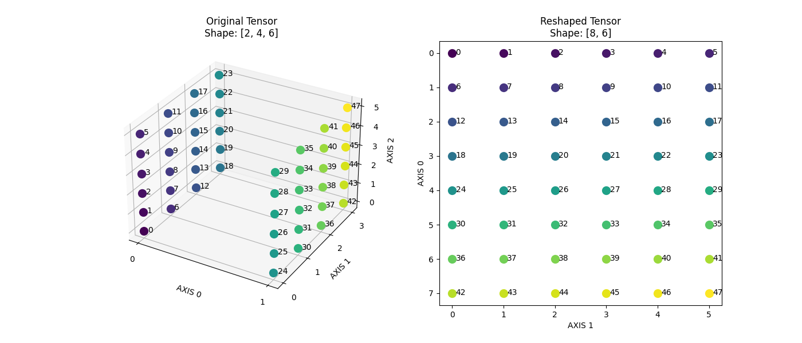

.. _cn_api_paddle_view_as:

view_as
--------------------------------

.. py:function:: paddle.view_as(x, other, name=None)

使用 other 的 shape，返回 x 的一个 view Tensor。

仅在动态图下可用，返回的 Tensor 和 x 共享内存。

下图展示了一个 view_as 操作的情形——一个形状为 [2, 4, 6] 的三维张量通过 view_as 操作转变为形状为 [8, 6] 的二维张量，我们可以清晰地看到转变前后各元素的对应关系。

参数
:::::::::

    - **x** (Tensor) - 输入多维 Tensor，可选的数据类型为 'float16'、'float32'、'float64'、'int16'、'int32'、'int64'、'bool'、'uint16'。
    - **other** (Tensor) - 与返回 Tensor shape 相同的 Tensor。
    - **name** (str，可选) - 具体用法请参见 :ref:`api_guide_Name`，一般无需设置，默认值为 None。

返回
:::::::::
Tensor，x 的一个 view Tensor。

代码示例
:::::::::

COPY-FROM: paddle.view_as
