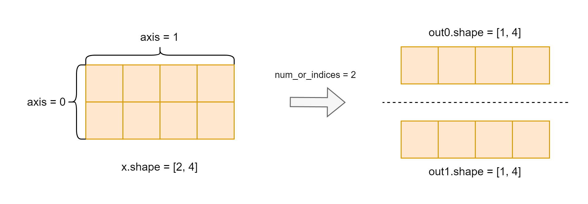
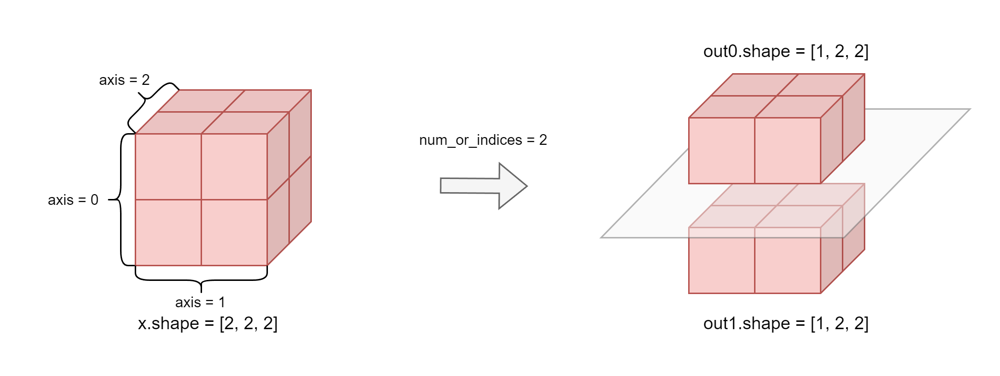

.. _cn_api_paddle_vsplit:

vsplit
-------------------------------

.. py:function:: paddle.vsplit(x, num_or_indices, name=None)

``vsplit`` 全称 Vertical Split 即垂直分割） - 用于将张量沿垂直方向分割成多个子张量。 轴分割成多个子 Tensor，将输入 Tensor 沿着垂直轴分割成多个子 Tensor，等价于将 :ref:`cn_api_paddle_tensor_split` API 的参数 axis 固定为 0。

当 Tensor 维度数量为 1 时：

当 Tensor 维度数量大于 1 时：

参数
:::::::::
       - **x** (Tensor) - 输入变量，数据类型为 bool、bfloat16、float16、float32、float64、uint8、int8、int32、int64 的多维 Tensor，其维度必须大于 1。
       - **num_or_indices** (int|list|tuple) - 如果 ``num_or_indices`` 是一个整数 ``n`` ，则 ``x`` 拆分为 ``n`` 部分。如果 ``num_or_indices`` 是整数索引的列表或元组，则在每个索引处分割 ``x`` 。
       - **name** (str，可选) - 具体用法请参见 :ref:`api_guide_Name`，一般无需设置，默认值为 None。

返回
:::::::::

list[Tensor]，分割后的 Tensor 列表。

代码示例
:::::::::

COPY-FROM: paddle.vsplit
