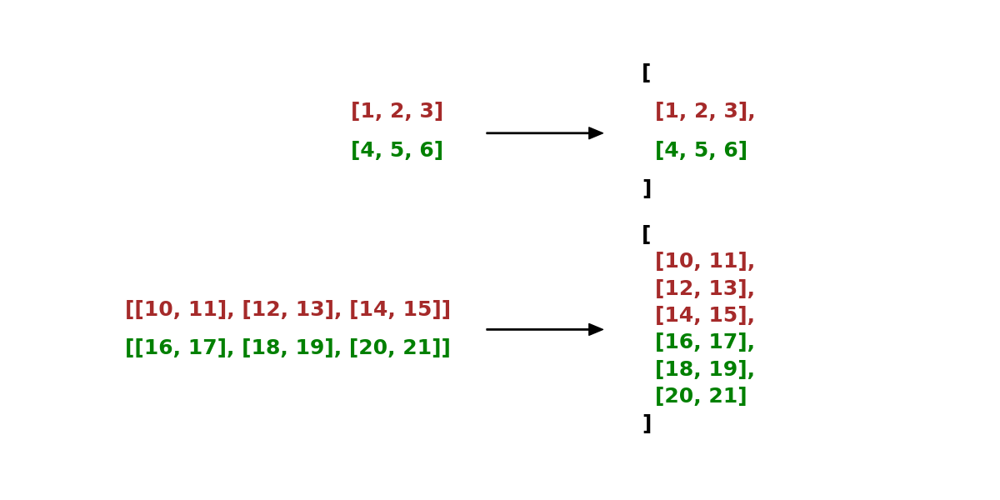

.. _cn_api_paddle_vstack:

vstack
-------------------------------

.. py:function:: paddle.vstack(x, name=None)

沿垂直轴堆叠输入 ``x`` 中的所有张量。所有张量必须具有相同的数据类型。

参数
::::::::::::

    - **x** (list[Tensor]|tuple[Tensor]) - 输入 ``x`` 可以是张量的 list 或 tuple， ``x`` 中张量的数据类型必须相同。支持的数据类型： ``float16`` 、 ``float32`` 、 ``float64`` 、 ``int32`` 、 ``int64`` 或 ``bfloat16`` 。
    - **name** (str，可选) - 具体用法请参见 :ref:`api_guide_Name`，一般无需设置，默认值为 None。

返回
::::::::::::
Tensor，与输入数据类型相同的堆叠张量。

也可以参考下方的图示来理解 ``vstack`` 是如何对张量进行变换的。

代码示例
::::::::::::

COPY-FROM: paddle.vstack
