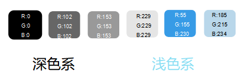
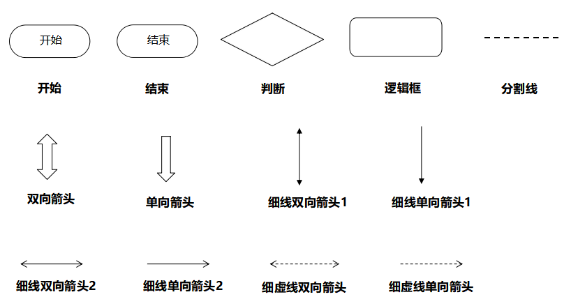
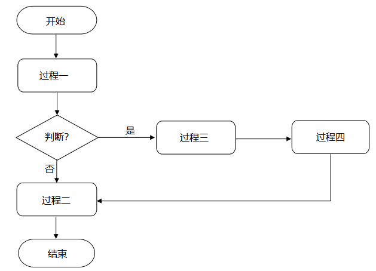
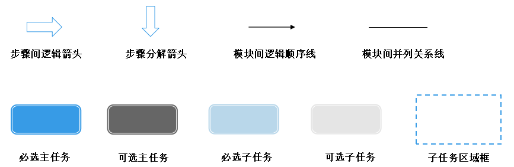
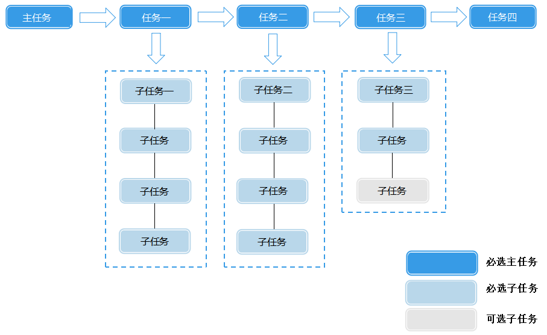

作图规范

# 作图规范

包括以下几方面，可点击链接跳转到相应内容。

- 色板

- 程序流程图常用图元

- 程序流程图样例

- 配置流程图常用图元

- 配置流程图样例

- 功能结构图常用的色彩搭配

## 色板

## 程序流程图常用图元

## 程序流程图样例

### 格式要求

- 字体：中文—微软雅黑，英文—Arial。

- 字号：正文12PT，如有辅助说明，使用10PT

- 横向在同一行的图元高度应相等，纵向在同一列的图元宽度应相等。

- 图元分布间距相等。

- 文字在框中居中。

- 判断框中的文本要简短，文本末尾必须加“？”。

### 设计建议

- 流程图禁止死循环。

- 选定程序流程图的主方向（横向或者竖向），判断分支中的“是”分支都沿着主方向。

- 明确的出口标准。程序流程图中要有单一的入口（一个“开始”）和一个或者多个的出口（一个或者多个“结束”）。

- 流程图中的连线尽量避免交叉。

## 配置流程图常用图元

## 配置流程图样例

### 格式要求

- 用户一般的阅读习惯是从左到右，此类横向流程图，为避免流程图超宽，没有开始结束步骤。

- 字体：中文微软雅黑；英文Arial。

- 字号：主任务与子任务字号一样12PT, 如有辅助说明，使用10PT。

- 横向在同一行的图元高度应相等，纵向在同一列的图元宽度应相等。

- 文字在框中居中。

- 图元说明建议放置于流程图右下角，竖版排列。

### 设计建议

- 明确流程中所有的操作以及操作的目的，把所有操作划分为若干步骤。步骤间连线使用“步骤间逻辑箭头”。

- 把每个步骤划分为子步骤，子步骤间可以为先后顺序，也可以为并列顺序。步骤与子步骤间连线使用“步骤分解箭头”。

- 每个子步骤分若干操作，子步骤和操作间连线使用“模块间并列关系线”。

- 每个子步骤下的所有操作用虚线框圈起。

## 功能结构图常用的色彩搭配

### 格式要求

- 字体：中文—微软雅黑，英文—Arial。

- 字号：正文12PT，如有辅助说明，使用10PT。

- 横向在同一行的图元高度应相等，纵向在同一列的图元宽度应相等。

- 文字在框中居中

- 相等级别的模块，在图形中颜色必须一样。

- 尽量不超过3套颜色

- 模块应使用外框或者或者底框对比明显。