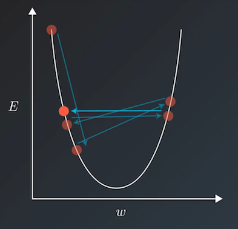

.. _api_guide_learning_rate_scheduler:

############
学习率调度器
############

当我们使用诸如梯度下降法等方式来训练模型时，一般会兼顾训练速度和损失(loss)来选择相对合适的学习率。但若在训练过程中一直使用一个学习率，训练集的损失下降到一定程度后便不再继续下降，而是在一定范围内震荡。其震荡原理如下图所示，即当损失函数收敛到局部极小值附近时，会由于学习率过大导致更新步幅过大，每步参数更新会反复越过极小值而出现震荡。

学习率调度器定义了常用的学习率衰减策略来动态生成学习率，学习率衰减函数以 epoch 或 step 为参数，返回一个随训练逐渐减小的学习率，从而兼顾降低训练时间和在局部极小值能更好寻优两个方面。

下面介绍学习率调度器中相关的 Api：

======

* :code:`NoamDecay`: 诺姆衰减，相关算法请参考 `《Attention Is All You Need》 <https://arxiv.org/pdf/1706.03762.pdf>`_ 。
  相关 API Reference 请参考 :ref:`cn_api_paddle_optimizer_lr_NoamDecay`

* :code:`ExponentialDecay`: 指数衰减，即每次将当前学习率乘以给定的衰减率得到下一个学习率。
  相关 API Reference 请参考 :ref:`cn_api_paddle_optimizer_lr_ExponentialDecay`

* :code:`NaturalExpDecay`: 自然指数衰减，即每次将当前学习率乘以给定的衰减率的自然指数得到下一个学习率。
  相关 API Reference 请参考 :ref:`cn_api_paddle_optimizer_lr_NaturalExpDecay`

* :code:`InverseTimeDecay`: 逆时间衰减，即得到的学习率与当前衰减次数成反比。
  相关 API Reference 请参考 :ref:`cn_api_paddle_optimizer_lr_InverseTimeDecay`

* :code:`PolynomialDecay`: 多项式衰减，即得到的学习率为初始学习率和给定最终学习之间由多项式计算权重定比分点的插值。
  相关 API Reference 请参考 :ref:`cn_api_paddle_optimizer_lr_PolynomialDecay`

* :code:`PiecewiseDecay`: 分段衰减，即由给定 step 数分段呈阶梯状衰减，每段内学习率相同。
  相关 API Reference 请参考 :ref:`cn_api_paddle_optimizer_lr_PiecewiseDecay`

* :code:`CosineAnnealingDecay`: 余弦式衰减，即学习率随 step 数变化呈余弦函数周期变化。
  相关 API Reference 请参考 :ref:`cn_api_paddle_optimizer_lr_CosineAnnealingDecay`

* :code:`LinearWarmup`: 学习率随 step 数线性增加到指定学习率。
  相关 API Reference 请参考 :ref:`cn_api_paddle_optimizer_lr_LinearWarmup`

* :code:`StepDecay`: 学习率每隔一定的 step 数进行衰减，需要指定 step_size。
  相关 API Reference 请参考 :ref:`cn_api_paddle_optimizer_lr_StepDecay`

* :code:`MultiStepDecay`: 学习率在指定的 step 数时进行衰减，需要指定衰减的节点位置。
  相关 API Reference 请参考 :ref:`cn_api_paddle_optimizer_lr_MultiStepDecay`

* :code:`LambdaDecay`: 学习率根据自定义的 lambda 函数进行衰减。
  相关 API Reference 请参考 :ref:`cn_api_paddle_optimizer_lr_LambdaDecay`

* :code:`ReduceOnPlateau`: 学习率根据当前监控指标（一般为 loss）来进行自适应调整，当 loss 趋于稳定时衰减学习率。
  相关 API Reference 请参考 :ref:`cn_api_paddle_optimizer_lr_ReduceOnPlateau`

* :code:`MultiplicativeDecay`: 每次将当前学习率乘以 lambda 函数得到下一个学习率。
  相关 API Reference 请参考 :ref:`cn_api_paddle_optimizer_lr_MultiplicativeDecay`

* :code:`OneCycleLR`: One Cycle 衰减，学习率上升至最大，再下降至最小.
  相关 API Reference 请参考 :ref:`cn_api_paddle_optimizer_lr_OneCycleLR`

* :code:`CyclicLR`: 学习率根据指定的缩放策略以固定频率在最小和最大学习率之间进行循环。
  相关 API Reference 请参考 :ref:`_cn_api_paddle_optimizer_lr_CyclicLR`

* :code:`LinearLR`: 学习率随 step 数线性增加到指定学习率。
  相关 API Reference 请参考 :ref:`_cn_api_paddle_optimizer_lr_LinearLR`

* :code:`CosineAnnealingWarmRestarts`: 余弦退火学习率，即学习率随 step 数变化呈余弦函数周期变化。
  相关 API Reference 请参考 :ref:`cn_api_paddle_optimizer_lr_CosineAnnealingWarmRestarts`
