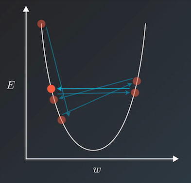

.. _api_guide_learning_rate_scheduler_en:

########################
Learning rate scheduler
########################

When we use a method such as the gradient descent method to train the model, the training speed and loss are generally taken into consideration to select a relatively appropriate learning rate. However, if a fixed learning rate is used throughout the training process, the loss of the training set will not continue to decline after falling to a certain extent, but will 'jump' within a certain range. The jumping principle is shown in the figure below. When the loss function converges to the local minimum value, the update step will be too large due to the excessive learning rate. The parameter update will repeatedly *jump over* the local minimum value and an oscillation-like phenomenon will occur.

The learning rate scheduler defines a commonly used learning rate decay strategy to dynamically generate the learning rate. The learning rate decay function takes epoch or step as the parameter and returns a learning rate that gradually decreases with training. Thereby it reduces the training time and finds the local minimum value at the same time.

The following content describes the APIs related to the learning rate scheduler:

======

* :code:`NoamDecay`: Noam decay. Please refer to `Attention Is All You Need <https://arxiv.org/pdf/1706.03762.pdf>`_ for related algorithms. For related API Reference please refer to :ref:`api_paddle_optimizer_lr_NoamDecay`

* :code:`ExponentialDecay`: Exponential decay. That is, each time the current learning rate is multiplied by the given decay rate to get the next learning rate. For related API Reference please refer to :ref:`api_paddle_optimizer_lr_ExponentialDecay`

* :code:`NaturalExpDecay`: Natural exponential decay. That is, each time the current learning rate is multiplied by the natural exponent of the given decay rate to get the next learning rate. For related API Reference please refer to :ref:`api_paddle_optimizer_lr_NaturalExpDecay`

* :code:`InverseTimeDecay`: Inverse time decay. The decayed learning rate is inversely proportional to the current number of decays. For related API Reference please refer to :ref:`api_paddle_optimizer_lr_InverseTimeDecay`

* :code:`PolynomialDecay`: Polynomial decay, i.e. the decayed learning rate is calculated in a polynomial format with the initial learning rate and the end learning rate. For related API Reference please refer to :ref:`api_paddle_optimizer_lr_PolynomialDecay`

* :code:`PiecewiseDecay`: Piecewise decay. That is, the stair-like decay for a given number of steps, the learning rate stays the same within each step. For related API Reference please refer to :ref:`api_paddle_optimizer_lr_PiecewiseDecay`

* :code:`CosineAnnealingDecay`: Cosine attenuation. It means the learning rate changes with the number of steps in the form of a cosine function. For related API Reference please refer to :ref:`api_paddle_optimizer_lr_CosineAnnealingDecay`

* :code:`LinearWarmup`: The learning rate increases linearly to an appointed rate with the number of steps. For related API Reference please refer to :ref:`api_paddle_optimizer_lr_LinearWarmup`

* :code:`StepDecay`: Decay the learning rate every certain number of steps, and ``step_size`` needs to be specified. For related API Reference please refer to :ref:`api_paddle_optimizer_lr_StepDecay`

* :code:`MultiStepDecay`: Decay the learning rate at specified step, and ``milestones`` needs to be specified. For related API Reference please refer to :ref:`api_paddle_optimizer_lr_MultiStepDecay`

* :code:`LambdaDecay`: Decay the learning rate by lambda function. For related API Reference please refer to :ref:`api_paddle_optimizer_lr_LambdaDecay`

* :code:`ReduceOnPlateau`: Adjuge the learning rate according to monitoring index(In general, it's loss), and decay the learning rate when monitoring index becomes stable. For related API Reference please refer to :ref:`api_paddle_optimizer_lr_ReduceOnPlateau`

* :code:`OneCycleLR`: One cycle decay. That is, the initial learning rate first increases to maximum learning rate, and then it decreases to minimum learning rate which is much less than initial learning rate. For related API Reference please refer to :ref:`cn_api_paddle_optimizer_lr_OneCycleLR`

* :code:`CyclicLR`: Cyclic decay. That is, the learning rate cycles between minimum and maximum learning rate with a constant frequency in specified a sacle method. For related API Reference please refer to :ref:`api_paddle_optimizer_lr_CyclicLR`
