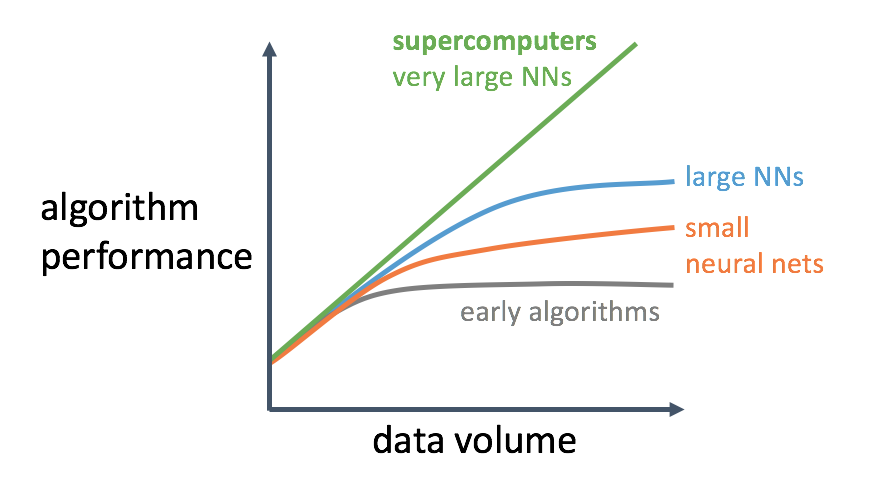
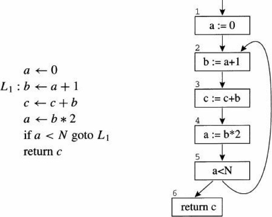

# Memory Optimization


## Problem

In a lecture from Andrew Ng, he attributes the recent sucess of AI due to a combination of these:

- Availability of Big Data
- Supercomputing power to process this Big Data over very large neural networks
- Modern algorithms

Following graph shows the details:



Larger model usually bring better performance. However, GPU memory is limited. For example, the memory size of a GTX TITAN X is only 12GB. To train complex and large models, we have to take care of memory usage. Besides, memory optimization is also necessary in both online/mobile inference.

## Solution

### Basic Strategy

There are some basic strategies to improve memory usage, including in-place operations and memory sharing.

#### In-place Operation
In a relu activation operator：

$y = \max(x, 0)$

If the variable x is not used in any other operator, we can make an in-place operation. In other words, the memory block of variable y and variable x will be the same. In-place operations will save 50% memory occupancy immediately.

#### Memory Sharing

Not all operators support in-place operations. Memory sharing is a more general strategy.

Following is an example:

```
a = op1(b, c);
d = op2(a)
e = op3(d, f)
```

In this case, variable a is no longer used, and op2 does not support in-place operation. After op2 finishes, we can put the memory of variable a to a memory pool. Then, variable e can share the memory of variable a from the pool.


### Live Variable Analysis

It's not enough to only have some basic strategies. The pre-requisite of memory optimization is to know if a variable is still "live" after an operation.

In our design, the neural network topology is defined as a program. Luckily, [live variable analysis](https://en.wikipedia.org/wiki/Live_variable_analysis) is a classic problem in compilers which can be used in many stages, such as register allocation.

In compilers, the front end of the compiler translates programs into an intermediate language with an unbounded number of temporary variables. This program must run on a machine with a bounded number of registers. Two temporary variables a and b can fit into the same register, if a and b are never "in use" at the same time. Thus, many temporary variables can fit in few registers; if they don't all fit, the excess tempory variables can be kept in memory.

Therefore, the compiler needs to analyze the intermediate-representation program to determine which temporary variables are in use at the same time. We say a variable is "live" if it holds a value that may be needed in the future, so this analysis is called liveness analysis.

We can leran these techniques from compilers. There are mainly two stages to make live variable analysis:

- construct a control flow graph
- solve the dataflow equations


#### Control Flow Graph
To perform analysis on a program, it is often useful to make a control flow graph. A [control flow graph](https://en.wikipedia.org/wiki/Control_flow_graph) (CFG) in computer science is a representation, using graph notation, of all paths that might be traversed through a program during its execution. Each statement in the program is a node in the flow graph; if statemment x can be followed by statement y, there is an egde from x to y.

Following is the flow graph for a simple loop.



#### Dataflow Analysis

Liveness of variable "flows" around the edges of the control flow graph; determining the live range of each variable is an example of a dataflow problem. [Dataflow analysis](https://en.wikipedia.org/wiki/Data-flow_analysis) is a technique for gathering information about the possible set of values calculated at various points in a computer program.

A simple way to perform data-flow analysis of programs is to set up dataflow equations for each node of the control flow graph and solve them by repeatedly calculating the output from the input locally at each node until the whole system stabilizes.

- Flow Graph Terminology

A flow graph node has out-edges that lead to sucessor nodes, and in-edges that come from predecessor nodes. The set *pred[n]* is all the predecessors of node n, and *succ[n]* is the set of sucessors.
In former control flow graph, the out-edges of node 5 are 5 --> 6 and 5 --> 2, and *succ[5]* = {2, 6}. The in-edges of 2 are 5 --> 2 and 1 --> 2, and *pred[2]* = {1, 5}.

- Uses and Defs

An assignmemt to a variable or temporary defines that variable. An occurence of a variable on the right-hand side of an assginment(or in other expressions) uses the variable. We can define the *def* of a variable as the set of graph nodes that define it; or the *def* of a graph node as the set of variables that it defines; and the similarly for the *use* of a variable or graph node. In former control flow graph, *def(3)* = {c}, *use(3)* = {b, c}.

- Liveness

A variable is *live* on an edge if there is a directed path from that edge to a *use* of the variable that does not go through any *def*. A variable is *live-in* at a node if it is live on any of the in-edges of that node; it is *live-out* at a node if it is live on any of the out-edges of the node.


The calcution of liveness can be solved by iteration until a fixed pointer is reached. Following is the recursive formula:


### Memory optimization transpiler

At last, we take basic strategy and liveness analysis techniques learning from compilers to implement our memory optimization transpiler.

#### add in-place attribute

In-place is a built-in attribute of an operator. Since we treat in-place and other operators differently, we have to add an in-place attribute for every operator.


#### contruct control flow graph

Following is the ProgramDesc protobuf of [machine translation](https://github.com/PaddlePaddle/Paddle/blob/develop/python/paddle/fluid/tests/book/test_machine_translation.py) example.

- Block0:

```
lookup_table
mul
...
while(sub-block idx 1)
...
array_to_lod_tensor
cross_entropy
...
while_grad(sub-block idx 2)
read_from_array
array_to_lod_tensor
...
```

- Block1

```
read_from_array
read_from_array
...
write_to_array
increment
write_to_array
less_than
```

- Block2

```
read_from_array
increment
...
write_to_array
write_to_array
```

We can transfer all the operators and variables in ProgramDesc to build a control flow graph.

```python
class ControlFlowGraph:
    def __init__(self, Program):
        self._sucessors = defaultdict(set)
        self._presucessors = defaultdict(set)
        self._uses = defaultdict(set)
        self._defs = defaultdict(set)
        self._live_in = defaultdict(set)
        self._live_out = defaultdict(set)
        self._program = Program

    def build(self):
        pass

    def dataflow_analysis(self):
        pass

    def memory_optimization(self):
        pass

    def get_program(self):
        return self._program
```

#### Make dataflow analysis

We follow the guide from compilers and try to solve the dataflow equation to get liveness of every variable. If the live-in of an operator node is different from the live-out, then we can make memory sharing.

For example:

```
a = op1(b, c);
d = op2(a)
e = op3(d, f)
```

The dataflow analysis result is:

```
live_in(op1) = {b, c, f}
live_out(op1) = {a, f}

live_in(op2) = {a, f}
live_out(op2) = {d, f}

live_in(op3) = {d, f}
live_out(op3) = {}
```

After op1, we can process variable b and variable c; After op2, we can process variable a. After op3, we can process variable d and variable f.

#### memory sharing policy

A memory pool will be mantained in the stage of memory optimization. Each operator node will be scanned to determine memory optimization is done or not. If an operator satifies the requirement, following policy will be taken to handle input/output variables.

```
if op.support_inplace():
    i --> pool
    pool --> o
else:
    pool --> o
    i --> pool
```


## Reference

- [Lecture Notes From Artificial Intelligence Is The New Electricity By Andrew Ng](https://manavsehgal.com/lecture-notes-from-artificial-intelligence-is-the-new-electricity-by-andrew-ng-4712dcbf26e5)
- Modern compiler implementation in ML, by Andrew W. Appel
- [Optimizing Memory Consumption in Deep learning](https://mxnet.incubator.apache.org/architecture/note_memory.html)
