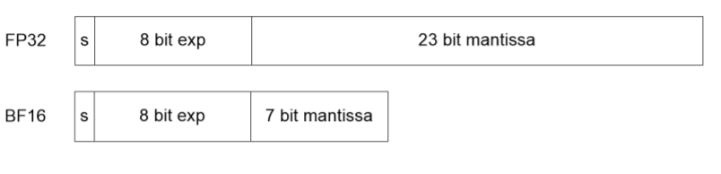

# Design Doc: oneDNN Bfloat16 support

## Bfloat16 data type

The bfloat16 (Brain Floating Point) floating-point format is a computer number format occupying 16 bits in computer memory. This format is a truncated (16-bit) version of the 32-bit IEEE 754 single-precision floating-point format (float32). It retains the approximate dynamic range of 32-bit floating point numbers, keeping the 8 bits of the exponent, but only supports 8-bit precision, which in float32 is 24-bit. Bfloat16 is used to reduce storage requirements and increase the computation speed of machine learning algorithms. More details of the bfloat16 data type can be found at [Intel's site](https://software.intel.com/sites/default/files/managed/40/8b/bf16-hardware-numerics-definition-white-paper.pdf)



## Bfloat16 enablement in PaddlePaddle

#### Data type
Bfloat16 is not a common data type, so this type had to be added to the PaddlePaddle as the Bfloat16 class. Due to the similarity of 16 bits of float32 with bfloat16, the most important type conversion was required from bfloat16 to float32 and vice versa.
* conversion from `float32` to `bfloat16` - is a copy of the first 16 bits of `float32` to a variable (uint16) of `bfloat16` class
* conversion from `bfloat16` to `float32` - it is copying the variable of class `bfloat16` and pasting as the first 16 bits of `float32` and filling the rest of the bits with zeros

The rest of the conversion from other types is done by converting the values to `float32` first.

#### OneDNN support
OneDNN introduced bfloat16 support for most primitives, supporting inference and training. Some operators have introduced that the output can be bfloat16 as well as float32. One of the advantages of using bfloat16 versus float32 is reduced memory footprint and, hence, increased memory access throughput. Additionally, when executing on hardware that supports [Intel DL Boost bfloat16 instructions](https://software.intel.com/sites/default/files/managed/c5/15/architecture-instruction-set-extensions-programming-reference.pdf), bfloat16 may offer an increase in computational throughput.

If the CPU does not have instructions to support the `bfloat16` primitives, the OneDNN runs an evaluation that is possible using the `AVX512BW, AVX512VL, and AVX512DQ` instructions.

In order to prevent testing the bfloat16 functionality on non-supporting machines, an appropriate check should be used:
* **Python**  `paddle.fluid.core.supports_bfloat16()`
* **C++** `paddle::platform::MayIUse(platform::cpu_isa_t::avx512_core)`

### Bfloat16 Inference

So far, only bfloat16 inference support has been added to the PaddlePaddle. An option has been introduced that, if enabled, will automatically replace all possible operators in the graph with bfloat16 kernels.

#### API

To enable the bfloat16 enable option, use:
* **Python** `AnalysisConfig.enable_mkldnn_bfloat16()`
* **C++** `AnalysisConfig::EnableMkldnnBfloat16 ()`

This option will replace all possible operators with bfloat16. However, if you want to decide for yourself what operators you want to replace, you can use the `SetBfloat16Op` option in which you must provide a list of operators.

* **Python** `AnalysisConfig.set_bfloat16_op({"conv2d", "pool2d"})`
* **C++** `AnalysisConfig::SetBfloat16Op({"conv2d", "pool2d"})`

#### Bfloat16 passes

The option to turn on the bfloat16 option runs two passes through the graph:
* cpu_bfloat16_placement_pass,
* cpu_bfloat16_pass

The first one `cpu_bfloat16_placement_pass` goes through the entire graph and sets the `mkldnn_data_type` attribute to `bfloat16`, for all operators that support bfloat16, or all operators that were given by users with the `SetBfloat16Op` option that support bfloat16 too. Then patterns are searched where the operator in the centre is marked with `bfloat16` and the two operators, one before and another after are marked, with `float32`. In this case, the middle operator is changed to float32 as well.

The next pass `cpu_bfloat16_pass` adds reorders between the `bloat16` and `float32` operators.
Adding a reorder before `conv2d` is not required due to the automatic conversion in the convolution kernel itself.
Also, it is not required to add a reorder after the operator such as `matmul, fc, conv2d` because in the operator’s primitives itself you can force outputs as `float32`. Therefore, `force_fp32_output` attribute is used, which is set to true.

In the best scenario, before one of the initial operators, it will insert one reorder that changes float32 to bfloat16, and at the end of the graph it will add a reorder from bfloat16 to float32. Unfortunately, since not all operators have mkldnn or bfloat16 support, the number of added reorders may be different for different models.


#### Bfloat16 enabled operators

Bfloat16 inference support has been added for the following operators:
* concat,
* conv2d,
* conv2d_transpose,
* elementwise_add,
* elementwise_mul,
* fc,
* fusion_gru,
* fusion_lstm,
* gelu,
* layer_norm,
* matmul,
* matmul_v2,
* pool2d,
* prelu,
* relu,
* reshape2,
* softmax,
* split,
* sum,
* transpose2

#### Model results

The test with the bfloat16 image classification models is added to PaddlePaddle release2.0 rc1 version. The table below shows the results of the 4 models tested on a two-socket machine - ` Intel(R) Xeon(R) Platinum 8371HC CPU @ 3.30GHz`

```
batch_size=1  nr_threads=1
```


| Full   dataset | BF16 fps improvement compared to MKLDNN FP32  | TOP1 acc MKLDNN   FP32 | TOP1 acc MKLDNN   BF16 | TOP1 acc drop |
|----------------|:----------------------------------------------:|:----------------------:|:----------------------:|:-------------:|
|    resnet50    |                      1.85x                     |         0.7663         |         0.7656         |    0.00091    |
|    googlenet   |                      1.61x                     |          0.705         |         0.7049         |    0.00014    |
|   mobilenetV1  |                      1.71x                     |         0.7078         |         0.7071         |    0.00099    |
|   mobilenetV2  |                      1.52x                     |          0.719         |         0.7171         |    0.00264    |


###### GRU model
```
batch size = 50 iterations = 160
```

|  FPS       | Naive FP32  |   FP32   |   BF16   | (BF16/FP32) |
|------------|:-----------:|:--------:|:--------:|:-----------:|
| thread = 1 |  2794.97    |  2700.45 |  4210.27 |    1.56x    |
| thread = 4 |  3076.66    |  4756.45 |  6186.94 |    1.30x    |


###### Accuracy

| GRU model  | FP32    | BF16    | diff     |
|------------|---------|---------|----------|
| Precision  | 0.89211 | 0.89225 | -0.00014 |
|  Recall    | 0.89442 | 0.89457 | -0.00015 |
| F1 score   | 0.89326 | 0.89341 | -0.00015 |
