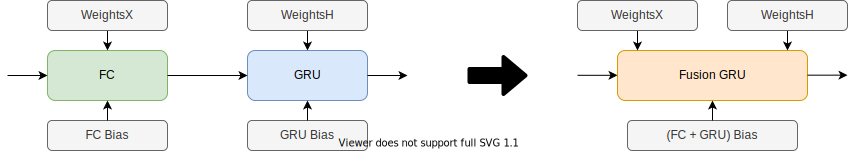
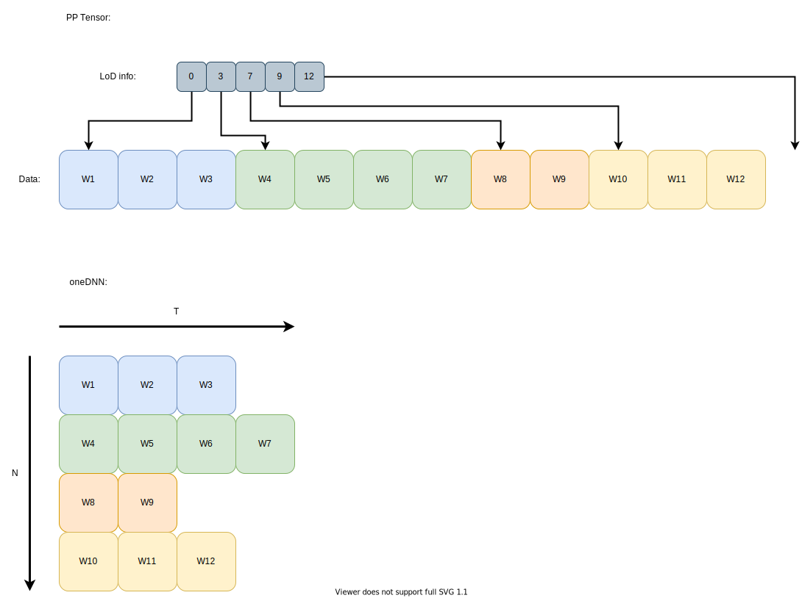
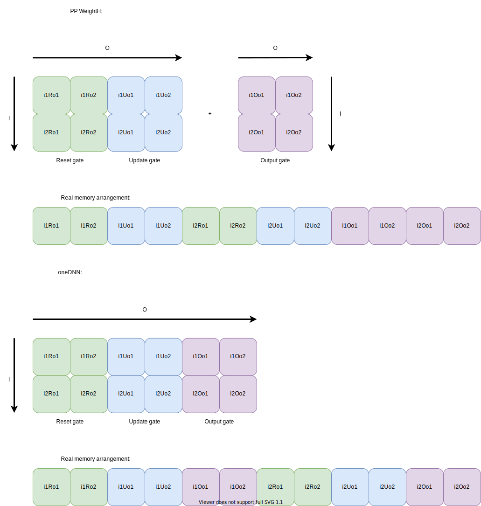

# Design Doc: oneDNN GRU operator

## Difference between PP and oneDNN GRU operator

### FC + GRU fuse pass implementation
PaddlePaddle framework has different meaning of GRU operator than oneDNN. In PP, Fully Connected layer is applied first to input data and then result is fed into GRU operator, where in oneDNN both operations are handled inside execution of GRU primitive.

To bypass this issue, PP `fusion_gru` operator is used as a base for oneDNN kernel. Therefore fuse pass is needed to convert `fc` + `gru` into `fusion_gru` operator. There are 2 such passes: `mul_gru_fuse_pass` and `fc_gru_fuse_pass` that handle both cases, with and without a bias.

Note: `GRU` operator can have `h0` input which is optional. This input is not forwarded to `fusion_gru` inside these passes because it was not used in any evaluated model. However it should be implemented and handled properly inside `fusion_gru` oneDNN code in the future.

### Input/Output representation
The main difference between PP and oneDNN in terms of RNN is sentence data representation. This data for PP is stored in 2D LoD Tensors with dimensions: `[Words, Channels]` and correspondence of these words to sentences are coded inside LoD info. On the other hand, oneDNN expects data tensors to be 3-dimensional with shape: `[Words, Sentences, Channels]`. This creates assumption that all sentences are of equal length which is not true for PP data. Workaround for that is described later in this document.

### Different tensor memory arrangement
Another difference is with memory arrangement of WeightH tensor. For PP `GRU` operator it has `[OC, 2*OC]` + `[OC, OC]` concatenated together. First part is responsible for `reset/update gate` and second for `output gate`. In oneDNN kernel, these weights are grouped together in `[OC, 3, OC]` tensor thus it needs custom reorder.

### Origin mode
In PaddlePaddle, `GRU` operator can operate in two modes with slightly different formulas for calculating new hidden state. It is managed by `origin_mode` attribute. However, oneDNN can only perform calculations for the formula with `origin_mode == true`.

* Origin mode == true:

* Origin mode == false:

This problem can be addressed by modifying particular parts of weights and bias. More precisely, we can multiply in `WeightX`, `WeightH` and `Bias` part responsible for `update gate` by `-1`. By doing that we get `origin_mode==false` formula from original weights.

Proof:

### Activation functions

PaddlePaddle allows user to choose activation functions for update/reset gate and output gate. However, oneDNN supports only default `sigmoid` activation for gates and `tanh` for output. Currently oneDNN operator throws an error when user tries to execute it with other activations.

## oneDNN GRU operator
oneDNN `GRU` operator is based on Paddle Paddle `fusion_gru` operator. It uses primitive/memory caching mechanism called `AcquireAPI`. Handler containg 2 caching key, one dependent on sentence length used in caching input/output and primitive. The other key (`memory_key`) depends only on other, not changing during inference, parameters and is used to cache weights and bias memory.

### Dimensions in oneDNN RNN primitives

* T - length of each sentence in a batch
* N - number of sentences in a batch
* IC - number of input channels
* OC - number of output channels
* L - number of layers (PaddlePaddle does not support stacked GRU layers, thus this dimension is always 1)
* D - number of directions (currently bidirectional GRU is not supported due to limitations described at the bottom of this document, therefore this dimension is always 1)
* G - number of gates in the recurrent unit (for GRU this dimension is 3)

### Input/Output Tensors
#### Inputs
* X - input with a batch of sentences \
**PP**: Original input tensor in PaddlePaddle is of size `(Words, IC)` with LoD information about belonging of words to consecutive sentences.\
**oneDNN**: Expects tensor of size `(T, N, IC)` with memory aligmnent either `TNC` or `NTC`. Name: `src_layer`

* H0 - initial hidden state (optional) \
**PP**: Tensor of size `(N, OC)`.\
**oneDNN**: Expects tensor of size `(L, D, N, OC)` which is `(1, 1, N, OC)` size in non-stacked, single direction case. Therefore it does not need reorder. Name: `src_iter`
* WeightX - input weights of each gate \
**PP**: Tensor of size `(IC, 3*OC)`.\
**oneDNN**: Expects tensor of size `(L, D, IC, G, OC)` which is `(1, 1, IC, 3, OC)` in non-stacked, single direction GRU case. Therefore it does not need reorder. Name: `weights_layer`
* WeightH - hidden weights of each gate \
**PP**: Tensor claimed to be of size `(OC, 3*OC)` which for real is `(OC, 2*OC)` + `(OC, OC)`.\
**oneDNN**: Expects tensor of size `(L, D, OC, G, OC)` which is `(1, 1, OC, 3, OC)` in non-stacked, single direction GRU case. It needs custom reorder due to unusual data alignment in PP tensor. Name: `weights_iter`
* Bias - bias of each gate (optional)\
**PP**: Tensor of size `(1, 3*OC)`.\
**oneDNN**: Expects tensor of size `(L, D, G, OC)` which is `(1, 1, 3, OC)` in non-stacked, single direction GRU case. Therefore it does not need reorder. However, bias has to be passed to oneDNN kernel so it has to be initialized with 0s if user does not provide it. Name: `bias`

#### Outputs
* Hidden - main output of the GRU cell \
**oneDNN**: Tensor of size `(T, N, IC)` with memory alignment either `TNC` or `NTC`\
**PP**: PaddlePaddle LoD Tensor of size (Words, IC) and LoD information about sentences the same as for input. Name: `dst_layer`

* ReorderedH0 - not supported
* XX - not supported
* BatchedInput - not supported
* BatchedOut - not supported

### Attributes
* activation - activation function used in output gate. oneDNN kernel supports only `tanh`.

* gate_activation - activation function used in reset and update gate. oneDNN kernel supports only `sigmoid`.
* is_reverse - whether GRU should be computed from left to right (`is_reverse==false`) or right to left (`is_reverse==true`) on the sentence level.
* use_seq - not supported (not used anymore?).
* origin_mode - whether to use original GRU formula (https://arxiv.org/abs/1412.3555)
* use_mkldnn - switch on using oneDNN kernel instead of plain CPU kernel.

### Required reorders
* PaddlePaddle Input LoD -> oneDNN TNC/NTC\
Every time before executing `GRU`, each batch represented by PP tensor has to be converted into oneDNN tensor representation. It is done first by calculating length of the longest sentence in a batch to get `T` dimension and then creating oneDNN memory (or getting it from oneDNN cache). After that, based on the memory format chosen by oneDNN GRU primitive: `TNC` or `NTC` correct custom reorder is called.\
\
Because oneDNN assumes that all sentences are of equal length, before reorder, whole memory is set to 0 to add padding. Placement of this padding depends also on computation direction that is defined by `is_reverse` attribute. To get correct resuts, if computation is performed from left to right, the padding has to be on the right side of words. Otherwise, for right to left computation, it has to be on the left side.

* PaddlePaddle WeightX -> oneDNN WeightX\
WeightX does not need custom reorders because memory arrangement is the same for both PP and oneDNN. However, it has to be modified if `origin_mode==false` by mulitplying update gate part by `-1`. At the end, oneDNN reorder is called to convert weights to correct type and strides selected by primitive.
* PaddlePaddle WeightH -> oneDNN WeightH\
WeightH tensor has different representation in PP and oneDNN. PaddlePaddle stores it as 2 connected blocks of memory, where first contains reset and update gate recurrent weights, and second stores output gate recurrent weights. In oneDNN, these weights are stored in a single memory block of size `[OC, 3, OC]`. Therefore, custom reorder is needed here. After that, if `origin_mode==false`, update gate part is multiplied by `-1`. At the end, oneDNN reorder is called to convert weights to correct type and strides selected by primitive.

* PaddlePaddle Bias -> oneDNN Bias\
Bias does not require reorder from PP to oneDNN. However, if it is not provided by user, it has to be created and filled with `0.0f` because oneDNN requires it. If it was provided, it has to be modified when `origin_mode==false` by mulitplying update gate part by `-1`. Note: bias is always of `float` data type, even in `int8` and `bfloat16` kernels.
* oneDNN TNC/NTC -> PaddlePaddle Output LoD\
After execution of oneDNN GRU primitive, output tensor has to be converted back to PP representation. It is done in the same way as input reorder but in a reverse manner.

## Pass order problem
Generally, `mkldnn_placement_pass` is called at the beginning of all passes to set `use_mkldnn` attribute to true in all supported operator. However, standard PP `gru` operator does not have `use_mkldnn` attribute so it is not set and later, when fused to `fusion_gru` it also does not have it set. Current solution for that problem is to call `mkldnn_placement_pass` once again somewhere after pass fusing gru. Note: calling placement pass at the end can break other oparators that are conditionally used with oneDNN (`FC` for example) so be aware of that.

## Bidirectional GRU
oneDNN kernel supports `bidirectional` calculations with `sum` or `concat`. It means that primitive calculates both directions `right2left` and `left2right` and then sums/concatenates both outputs. It was implemented in PP as a PoC but had some harsh limitations. Both directions were calculated on the same input, therefore padding input with 0s yield to wrong results. The only scenario when this worked fine were if all sentences in a batch were of equal length or simply `BatchSize==1`. It happened to be so rare scenario that development of bidirectional gru has been postponed.
