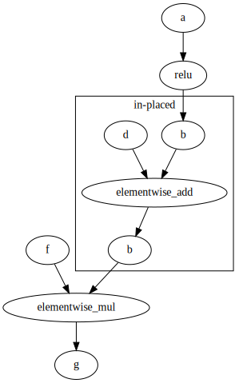
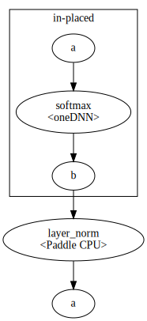
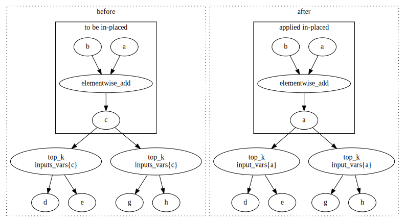

## Introduction

PaddlePaddle is implementing concept of in-place execution of some of operators.
The idea of in-place execution is present on following picture:

Exemplary graph presents three operators where one of them (type of elementwise_add) is to be performing in-place computation. In-place computation means that input variable (Tensor) is used for both input and output. This means that one of inputs will be overwritten with computational results. In presented picture in-place operator (elementwise_add) is
having two input nodes: *b* and *d* and output *b*. So *b* is used for input and output and underneath it is represented by a one, shared Tensor. So this means that variable *b* is initially holding some input data and after the operator computation, input data is lost and replaced by computation's result.

Currently assumption is that if operator can have in-place processing then all its kernel (including oneDNN) should be able to work properly in in-place mode. To match this functionality oneDNN integration was extended to support in-place execution for some of its operators:
- activations
- softmax
- elementwise_add
- gelu*
- sum**

Adventages of in-place computation are:
* lower memory usage
* improved performance of operators

To have in-place computation, we need to analyze graph to search for where in-place execution could happen
and then make some of variables to be shared by input and output of in-place capable operator.

Hence there are two parts of in-place support:
- in-place execution support within an operator
- oneDNN inplace C-API pass

#### in-place execution support within an operator
For in-place execution, oneDNN primitive needs to have the same oneDNN memory object passed as input (src) and output (dst). More precisely, we check if pointers to allocated buffers are the same for input and output
and this indicates if we use one oneDNN memory object or two. For example:

`auto src_memory_p = handler.AcquireSrcMemory(x);`

`auto dst_memory_p = x->IsSharedBufferWith(*y) ?
           src_memory_p : handler.AcquireDstMemory(y);`

#### oneDNN in-place pass
As mentioned earlier, idea of in-place pass is to locate operators with oneDNN kerenels that can perform in-place execution and then modify output node's variables to match input node's variable of the operator.

##### Identifying operators with oneDNN kernels capable of in-place execution
This identification is a result of two checks:
- Whether operator does have *inplaceInferer* structure
- Whether operator is on a list of oneDNN's in-place supported operators

*InplaceInferer* is a struct that declares a mapping (one of inputs to one of outputs) indicating that
considered operator can perform in-place execution and both vars (mentioned input and output in *InplaceInferer*) will
share a tensor. This is not enough for oneDNN in-place C-API execution as oneDNN library may not provide in-place
computation for all required (to have in-place execution) operators of PaddlePaddle and some of operators would have to
simulate in-place computation through the external buffer which would not bring any benefits, so there is no point enabling those in-place computations for C-API inference.

##### Restrictions
oneDNN in-place pass is taking advantage of graph pattern detector. So pattern consists of:
Node (Var 1) -> Node (oneDNN Op to be inplaced) -> Node (Var2) -> Node (next op - any type, oneDNN/native CPU - after in-placed one) -> Node (Var3)
Pattern is restricted so that in-placed to be op is of oneDNN type. Due to fact that some operators have
more than one input and their output may be consumed by more than one operator it is expected that pattern
maybe detected multiple times for the same operator e.g. once for one input, then for second input etc..

Just having oneDNN operator capable of in-place is not enough to have in-place execution enabled, hence follwing rules
are checked by oneDNN in-place pass:
1. If input node to in-place operator is also an input to different operator, then in-place computation cannot be performed, as there is a risk that other operator consuming in-placed op operator will be executed after in-placed operator and therefore get invalid input data (overwritten by in-place computation).
2. If after in-placed operator there is another operator that is reusing in-place op's input var then in-place cannot happen unless next op can perform in-place computation. Next picture presents the idea.

In the picture we are seeing that in-place pass is considering to enable in-place execution for softmax oneDNN kernel. All is fine, but next operator after softmax is layer norm (non-oneDNN). Layer norm is already reusing input of softmax due to some earlier memory optimization pass being applied. If we make softmax op to perform in-place computation, then
it will also make layer norm to work in-place (b -> a). The thing is that layer norm cannot work in-place (InplaceInferer is not present), so if we force it do so layer norm will produce invalid result.

##### In-place pass modification to graph when applied

When sub-graph is aligned with restrictions then in-place computation can be enabled. This is done by:
1. Changing the name of output node of in-place op to be match input node of in-place op.
2. Renaming output var in output lists of node representing operator.
3. Changing the name of input var in next op inputs list.
4. If next Op is performing in-place computation then we need to updated next op's output as well not to break its
   in-place computation.
5. if there are multiple operators after our in-place operator then we need to update all of them (their input vars). Idea is presented in the following picture:

We can see that there are two *top_k* operators after *elementwise_add* operator that is set to work in-placed. Each of *top_k* is having its own list of input vars, so we need to rename relevant input var to new name. As in-place pattern
consists of: input node -> in-place op -> output node -> next op -> next op's output. For presented graph, there will be 8 patterns detected:
- b -> elementwise_add -> c -> top_k (left one) -> d
- b -> elementwise_add -> c -> top_k (left one) -> e
- b -> elementwise_add -> c -> top_k (right one) -> g
- b -> elementwise_add -> c -> top_k (right one) -> h
- a -> elementwise_add -> c -> top_k (left one) -> d
- a -> elementwise_add -> c -> top_k (left one) -> e
- a -> elementwise_add -> c -> top_k (right one) -> g
- a -> elementwise_add -> c -> top_k (right one) -> h

Important thing is to remember original name of output, before it is renamed, so later we can
replace this original name in all of next op instances.

\* oneDNN gelu kernel is able to perform in-place execution, but currently gelu op does not support in-place execution.

\*\* sum kernel is using oneDNN sum primitive that does not provide in-place exection, so in-place computation is done faked through external buffer. So it was not added into oneDNN inplace pass.
