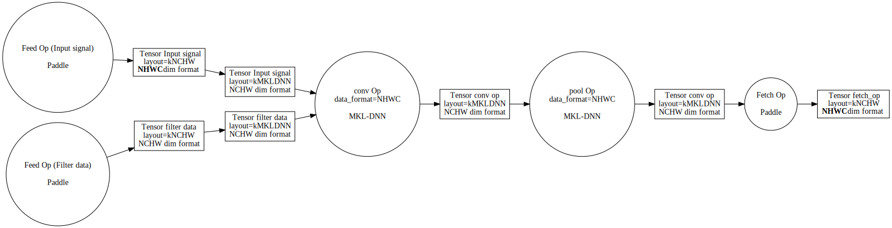
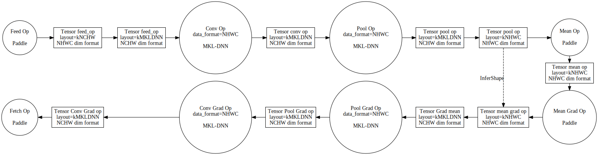

# Design Doc: MKL-DNN NHWC support

This document describes design & implementation of ``NHWC`` models using MKL-DNN engine. For overall
description of Tensors interoperability among Paddle and MKL-DNN Tensors please follow relevant [document](../data_transformation/data_transform.md)

### Introduction

PaddlePaddle does support execution of program/model using ``NCHW`` as well as ``NHWC`` data arrangement. Reasons for introducing data arrangements are:
* Execution performance of some of non MKL-DNN operators in ``NHWC`` may be faster that when ``NCHW`` data arrangement is used
* Convenience of use as sometimes user got his data prepared already in ``NHWC`` data arrangement.

Choice among ``NCHW`` and ``NHWC`` is controlled with ``data_format`` attributes following operators:
* conv
* conv transposed
* pool
* LRN
* batch norm

Other operators (those without data_format) are implemented so that they execute properly regardless the layout, for example elementwise operations.

Having operators to control what layout (data arrangement) input and output data of operators is, allow
in theory to specify models that partially to work on ``NCHW`` and partially to work on ``NHWC`` data arrangement.However it was agreed on that given model will only have one type of data arrangement at during it execution.
Hence either all ``data_format`` attributes are set to ``NCHW`` (default) or to ``NHWC``, there is no support for having some operators having ``data_format`` set to ``NCHW`` while some others to ``NHWC``.

Another element to consider is that PaddlePaddle ``NHWC`` data layout as supported by non-MKLDNN CPU implementations is that ``NHWC`` data arrangement is only applicable to input signal e.g. parameters of listed operators are
always using ``NCHW`` PaddlePaddle layout.

Final element is that PaddlePaddle data layout change how shape of data looks like. For example ``NCHW`` data shape of [2, 3, 4, 5] when being transformed to ``NHWC`` data will have a shape of [2, 4, 5, 3]. This is different from MKL-DNN shape description which is always ``NCHW`` order even if data underneath is ``NHWC``, ``NCHW16C`` or other.

### Architecture of ``NHWC`` support in MKL-DNN integration

Initially a request of ``NHWC`` and ``NCHW`` execution of program were implemented explicitly, e.g. by having MKL-DNN working on that selected data arrangement. This was proved to be very inefficient in terms of performance, as
performance-wise MKL-DNN is designed to work on data arrangements of its own choice (for example blocked formats ``NCHW16C``, ``NCHW8C`` etc.) rather than forcing MKL-DNN to use ``NHWC`` or ``NCHW`` data layout.

Current solution is that MKL-DNN kernels are working on data layout best suitable for their performance, but
when upon completion of final MKL-DNN operator there has to be conversion (reorder) to either ``NCHW`` or ``NHWC`` Paddle data arrangement. Important note is that last operator executing MKL-DNN kernel may not have a ``data_format`` attribute hence there is need to store information on to what PaddlePaddle layout to convert to from MKL-DNN layouts. For this purpose We have global variable kept per thread (Thread Local Storage).

To address the difference with shape description mechanism for shape transformation was added : *platform::MatchShapeToLayout()* which perform needed shape modification upon entering and exiting MKL-DNN execution thread of operators.

Described architecture applied to simple execution of ``NHWC`` model that consists of convolution followed by pooling is presented in the following picture:

#### Notes on ``NHWC`` grad ops support

Corresponding grad MKL-DNN kernels of operators listed at the beginning of this document, also are supporting
``NHWC`` models execution.

All design concepts described in previous section do apply to MKL-DNN grad operators as well. However there
is also one additional element. Some grad operators like *mean* are inferring shape of their output, based on
shape of data produced during forward. In that situation kernel is actually having no need to operate on actual data, as only shape is needed to infer grad output's shape. In this scenario originally there was no data transformation of given variable, hence in particular no changing of shape of Tensor happened. This could result in having wrong shape send to *InferShape* of Grad op. This behaviour was modified to create dummy Variable that carries the shape of data in expected by grad operator, paddle format.

Described situation is presented in the following picture:

### Implementation guidelines

Instead of modifying each MKL-DNN operator to match described architecture design, common code was modified which consists of modifications to:
* data transformation code
* *InferShape* of each operator supporting  ``data_format`` attribute.
* Also each operator was added overloading of *GetKernelTypeForVar* method.

Hence when enabling any operator to have ``NHWC`` data arrangement supported we need to extend *InferShape* and *GetKernelTypeForVar*

#### *InferShape()* modifications
This modification is related to fact that MKL-DNN kernel does operate on data with shape described in ``NCHW``
order, hence We need to make sure that even if ``data_format`` is having value ``NHWC`` still ``Infershape`` will work on ``NCHW`` order.

Snippet from *PoolOp::InferShape()* that illustrated the idea of modifications to *InferShape*:

    // MKL-DNN Kernels are using NCHW order of dims description
    // so we ignore data_format consideration for MKL-DNN kernel
    const bool channel_last = (this->IsMKLDNNType() == false) &&
                            (data_format == "NHWC" || data_format == "NDHWC");

#### *GetKernelTypeForVar()* overloading

When performing data transformation we need a value of ``data_format`` and this value is acquired
inside of *GetKernelTypeForVar()* and based on that *data_layout* of Kernel Type is set, to be later
used by data transformation code.
