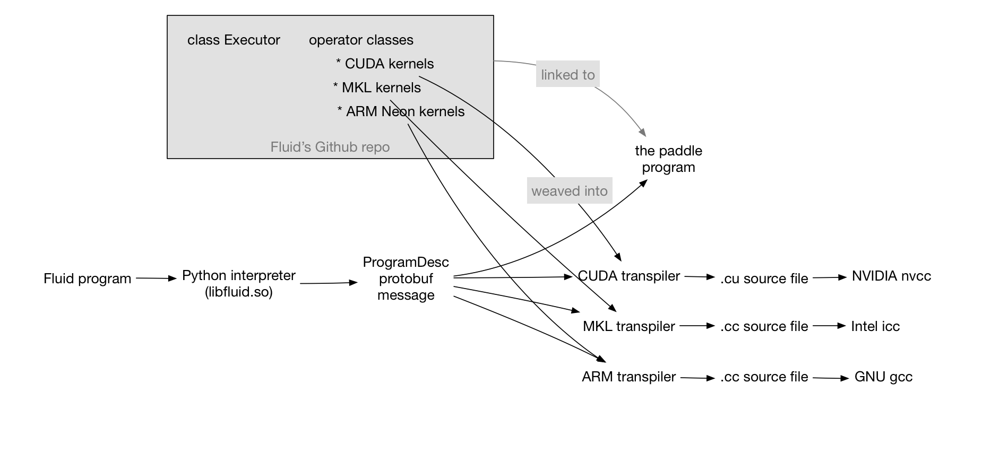

# PaddlePaddle Fluid: Towards a Compiled Programming Language

As described in [fluid.md](https://github.com/PaddlePaddle/docs/blob/develop/docs/design/motivation/fluid.md), when a Fluid application program
runs, it generates a `ProgramDesc` protobuf message as an intermediate
representation of itself.  The C++ class `Executor` can run this
protobuf message as an interpreter.  This article describes the Fluid
compiler.



## ProgramDesc

Before we go deeper into the idea of compiled language, let us take a
look at a simple example Fluid application.

```python
import "fluid"

func paddlepaddle() {
  X = fluid.read(...)
  W = fluid.Tensor(...)
  Y = fluid.mult(X, W)
}
```

This program consists of a [block](https://github.com/PaddlePaddle/docs/blob/develop/docs/design/concepts/block.md) of three operators --
`read`, `assign`, and `mult`.  Its `ProgramDesc` message looks like
the following

```protobuf
message ProgramDesc {
  block[0] = Block {
    vars = [X, W, Y],
    ops = [
      read(output = X)
      assign(input = ..., output = W)
      mult(input = {X, W}, output = Y)
    ],
  }
}
```

## Transpilers

We can write a transpiler program that takes a `ProgramDesc`, e.g.,
the above one, and outputs another `ProgramDesc`.  Let us take some
examples:

1. *Memory optimization transpiler*: We can write a transpiler that
   inserts some `FreeMemoryOp`s in the above example `ProgramDesc` so
   to free memory early, before the end of an iteration, so to keep a
   small memory footprint.

1. *Distributed training transpiler*: We can write a transpiler that
   converts a`ProgramDesc` into its distributed version of two
   `ProgramDesc`s -- one for running by the trainer processes and the
   other for the parameter server.

In the rest of this article, we talk about a special kind of
transpiler, *Native code generator*, which takes a `ProgramDesc` and
generates a `.cu` (or `.cc`) file, which could be built by C++
compilers (gcc, nvcc, icc) into binaries.

## Native Code Generator

For the above example, the native code generator transpiler, say, the
CUDA code generator, should generate a `main` function:

```c++
void main() {
  auto X = fluid_cuda_read(...);
  auto W = fluid_cuda_create_tensor(...);
  auto Y = fluid_cuda_mult(X, W);
}
```

and the definitions of functions `fluid_cuda_read`,
`fluid_cuda_create_tensor`, and `fluid_cuda_mult`.  Please be aware
that each function could just define a C++ instance of an operator and
run it.  For example

```c++
paddle::Tensor fluid_cuda_read(...) {
  paddle::Tensor t;
  paddle::operator::Read r(&t, ...);
  r.Run();
  return t;
}
```

For computational operators that have multiple *kernels*, each for a
specific hardware platform, for example, the `mult` operator, the
generated code should call its CUDA kernel:

```c++
paddle::Tensor fluid_cuda_mult(const paddle::Tensor& a,
                               const paddle::Tensor& b) {
  paddle::Tensor t;
  paddle::operator::Mult m(a, b, ...);
  Mult.Run(cuda_context);
}
```

where `cuda_context` could be a global variable of type
`paddle::CUDADeviceContext`.

## Multi-Block Code Generation

Most Fluid application programs may have more than one blocks.  To
execute them, we need to trace [scopes](https://github.com/PaddlePaddle/docs/blob/develop/docs/design/concepts/scope.md).
