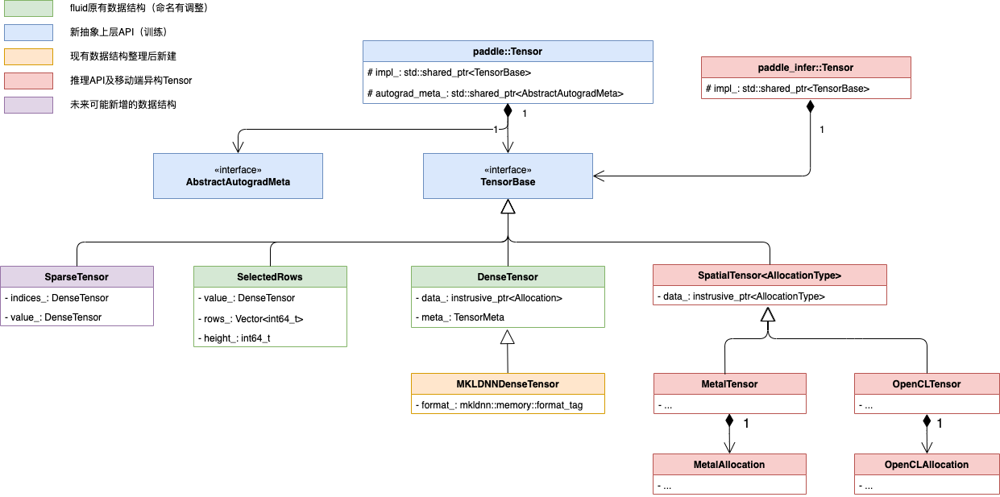

# 飞桨高可复用算子库 PHI 设计文档

飞桨高可复用算子库 PHI (Paddle HIgh reusability operator library)，或者我们也称之为函数式算子库，支持基于已有的算子内核以及 Kernel Primitives API 组合实现新的算子，支持插件式接入新硬件或者新加速库。

针对飞桨框架原算子库存在的算子接口不清晰、算子复用成本较高、调用性能差等问题，我们重构了飞桨框架的算子库，设计了灵活、高效的函数式算子库 PHI，可以通过对函数式算子接口组合调用的方式实现新算子。新算子库提供了 200 余个跟 Python 开发接口保持一致的 C++ 运算类 API，以及近 500 个可供组合调用的前、反向函数式算子内核，可大幅降低框架原生算子和自定义算子的开发成本。

## 一、背景与目标

> 介绍设计并建设 PHI 算子库要解决的问题


最初启动 PHI 算子库项目仅是为了支撑飞桨动态图架构重构以降低调度开销、并提升 OpKernel 开发的复用能力而提出来的，但后续决定借此机会，建立能够同时在训练和推理场景（包括服务器端和移动端场景）中使用的“训推一体”算子库，长远上降低 paddle 生态中各基础设施开发及算子维护的成本，逐渐扩充了项目的目标范围，目前 PHI 已经承载了多维度的意义。

> 关于算子库的命名，开发过程中有过迭代：初期算子库目录名为 PTEN ，意为 paddle Tensor 运算库 (Paddle Tensor Operation Library)，因此一些历史 PR 以 PTen 为前缀，后期经内部协商统一更名为 PHI

### 1.1 背景问题

具体地，PHI 算子库项目，承载着解决 Paddle 以下问题的期望。

#### 1.1.1 Op&OpKernel 之间可复用性差，冗余代码较多

2.3 版本之前，Paddle 中的 Operator（后续简称 Op）之间的可复用性比较差，仅在少数的反向 Op 中，通过在 GradOpMaker 实现中调用 SetType 复用了一些简单的 Op，大部分本身可以复用已有 Op 实现的情况，代码都是 copy 重写的。

可复用性差的根本原因还是原先 Op 体系设计不够灵活导致的：

1. 当一个 Op 去复用另一个 Op 的`Opkernel::Compute`方法时，都需要先构造一个`ExecutionContext`，复用方式是比较繁琐的

    > 如果能直接调用一个函数形式的 Kernel，就会方便很多

2. 由于额外的数据结构构造及独立 Op 调度引入了开销，从计算性能的角度考虑，复用 Op 不如直接把计算代码 copy 过来，导致我们逐渐抛弃了早期反向 Op 复用前向 Op 的原则，开始为每个反向 Op 单独实现 Kernel，以至于目前 Paddle 内部维护了大量的反向 Kernel 实现代码

    > 只有 Op 之前复用的开销足够小，复用已有 Op 实现新 Op 才有可能被大范围推广

#### 1.1.2 执行调度的简洁性与细粒度化

##### 1.1.2.1 动态图

Paddle 2.0 发布之后，多次收到内外部用户反馈动态图在小模型 CPU 执行场景下与竞品在性能上有数倍的差距。

这个问题的主要原因是：Padddle 动态图 C++端的执行路径比较冗长，调度开销比较重，这和动态图早期设计兼容静态图，继承了静态图 Op 的许多对象构造过程有关

- 问题 issue：https://github.com/PaddlePaddle/Paddle/issues/28774

因此，动态图需要升级为基于函数的调度架构，抛开原先复杂的 Op 体系，才能解决这个问题，这依赖于 OpKernel 改为函数式的写法。

##### 1.1.2.2 静态图 + IR

我们目前的静态图还不够“静态”，目前静态图仍然有许多运行时动态选择的逻辑，例如，运行时选择 OpKernel，运行时判断是否要进行跨设备数据拷贝等等，但这些其实可以在静态图模型组网编译期间就确定下来，将执行过程确定为一系列 OpKernel 的执行，不再做动态的判断选择，从而进一步提升执行效率。

而这些依赖于 OpKernel 本身的细粒度化，将现有复杂的大 OpKernel 解耦成具体场景、具体设备的小 Kernel，才能支持这样的调度。

#### 1.1.3 自定义算子的易用性提升需求

2021 年初上线的新自定义 C++ 外部算子体系，在接口与函数编写的层面上，用法已经比较直观了，但是因为我们缺少基本运算的 C++ API 体系，事实上，在实现具体的自定义 Op 运算逻辑时，一些基础的加减乘除及矩阵运算都仍然需要重新实现一遍，不能复用 Paddle 已有的、经过优化的基础运算，因此一些复杂运算的外部开发成本仍然是比较高的。而要想复用 Paddle 内部的基础运算，依赖于的 Op 体系升级为函数式，并整理形成相应的 C++ API 体系才能解决。

#### 1.1.4 共建训推一体算子库，降低推理算子维护成本

长久以来，由于 paddle 主框架和 paddle-lite 的算子是分开维护的，paddle 新增的算子，lite 需要的话，就要手动在 lite 中重新实现一遍，而且当主框架算子升级，lite 又没有及时感知到，会直接导致推理模型在 lite 执行时出现 bug，这引入了较高的维护成本。只有统一算子库，仅维护一份代码，才能长久地解决这个问题。

因此，本次函数式算子库会由训练和推理共同建设，并作为独立的编译组件和底层基础设施（目前还没有独立拆分出来），能够同时服务于训练、预测以及 Lite 等执行体系。

#### 1.1.5 推理新 Runtime 设计 infrt 的适配

推理设计了新的 runtime infrt，预计要统一 paddle-inference 和 paddle-lite 的执行体系，需要直接调用本次共建的 PHI 算子库中的算子，因此在设计时需要考虑对 infrt 的适配（目前 infrt 项目暂时处于停滞状态）。

#### 1.1.6 Op 及 Kernel 参数规范化

2020 年的 Python 2.0 API 项目规范了 Paddle Python 端 API 的参数列表，使其变得简洁、易用、标准，但是当时出于成本考虑，Op 层面的参数列表并没有规范化，因此会有不少早期开发的算子和 Python API 参数相差较多，例如 conv op 这种，Python API 仅有 8 个参数，但相应的 C++ Conv Op 却有 30+ 个参数的分裂情况。 API 和 Op 本质上是同一层的概念，都是对一个运算的描述，参数应该是一致的。推理为了解决此问题，发起算子定义增强项目，为部分不需要的参数添加了 AsExtra 以及 AsQuant 的声明，但并未从根本上解决问题，这也是 PHI 算子库构建希望重点去解决的。

我们希望能做到，Python API -> Op(C++ API) -> Kernel API 三层参数一致，使整体架构清晰，每一层复用关系也足够清晰，维护一套 Python API 官方文档，基本能够满足三层 API 的共同参考需求，不再着重维护额外的文档体系，降低维护成本。

### 1.2 目标及范围

- 总体目标：飞桨核心框架复用同一函数式算子库，基础数据结构 Tensor 具备良好的可扩展性，从根本上做到训练推理协同一致、基础组件稳定可靠、增量开发体验良好。

- 目标范围：

  - PHI 算子库初期构建更关注 Kernel“迁移”，出于时间和人力成本的考虑，原 OpKernel 逻辑迁移时暂不强制升级为“组合式”写法，前反向 Kernel 均如此
  - PHI 算子库提供的"组合式 Kernel 二次开发"能力初期先服务于后续增量的新算子，已有算子仍然保持其原先的编码实现，降低迁移成本
  - PHI 算子库提供的“新硬件扩展能力”初期仅在新硬件自身范围内提供，比如 XPU 已经实现了 50 个 Kernel，后续其可以基于 50 个 Kernel 去组合新的 Kernel，但这仅限于 XPU 范围内，其实现不和 CPU、CUDA 等实现通用
  - PHI 算子库项目重点关注“Kernel 函数化 & Op 规范化”的工作，Kernel 改为函数式，C++API 与 Op 命名及参数列表在尽可能确保兼容性的前提下与逐渐规范化为与 Python API 一致


## 二、设计概览

### 2.1 命名及位置

飞桨高可复用算子库 (Paddle HIgh reusability operator library)，简称 PHI(phi)，PHI 代码目录在 paddle 目录下，和 fluid 平级，而不是放在 fluid 目录下，这样放置的原因是：phi 是一个由 fluid，lite，infrt 等多种上层 runtime 共同调用的基础组件，后续会作为单独编译的动态库存在，因此不适合作为 fluid 的子模块。

### 2.2 目录结构

#### 2.2.1 目录结构设计需满足的需求

训练和推理对算子库目录的清晰度也有诸多诉求：

- 在目录设计上支持算子库的各种拆分编译需求，包括

    - 按运算设备拆分编译
        - 例如：仅编译 cpu 的，或者仅编译 gpu 的
    - 按训练和推理场景拆分编译
        - 例如：推理不编译反向相关 kernel，也不编译带有 Intermediate 输出的前向 kernel
    - 按移动端设备实际使用算子精准裁剪编译（目前尚未支持）
        - 例如：一个模型只用了 add 和 mul，极致情况下应该能裁到仅剩 2 个 kernel

- 长线上支持良好的 kernel 复用实现需求
    - 解释：kernel 复用实现时，能否通过简单的 include 引入对应函数，不会因为目录过于复杂而找不到复用的 kernel

- 长线上支持跨设备 kernel 的写法统一需求，并且直观易用，不引入不必要的模板参数
    - 解释：算子库下层还有 Kernel Primitive API 模块，其长线愿景是每个运算，只用一个 kernel，就能够适应多种设备，真正区分设备的代码，仅在 Kernel Primitive API 实现中；未来复用 kernel 传入较复杂的模板参数时，需要限制参数尽可能地简洁

- 易用性上，开发者能精准理解自己新增的 Kernel 应该放到什么位置，无歧义
    - 解释：开发者新增一个 API，不会困惑自己应该将对应 kernel 放在那个目录，也不会出现不同的人对于同一个 kernel 应该放在什么位置出现二义性的理解

- 不引入大量的重复目录设计
    - 解释：概念拆分是需要的，但也要有边界，避免在多个目录下有命名相同的子目录，容易混乱，比如不能 cpu 下面有 eigen, funcs, math 等，gpu 下面也有。新算子库的目录设计，主要根据设备做拆分，其他层次的目录拆分尽可能弱化，比如尽量不根据功能拆分，尽量不根据领域拆分等

- 不造成迁移时的文件数目膨胀
    - 解释：不能因为 kernel 设备拆分，导致 kernel 实现文件大规模增多

- 不引入层级过深的目录设计
    - 解释：目录层级不应过深，理解和维护成本都较高

- 不引入过高的迁移成本
    - 解释：迁移 kernel 时，不能要求对 kernel 本身做太多改动和拆分，否则迁移成本太高

#### 2.2.2 具体目录设计

##### 2.2.2.1 一级目录

```
paddle/phi
./api (对外暴露的高层 API 及其实现)
    ./include（对外暴露的高层 API 头文件）
    ./lib（对外暴露 API 的实现）
./capi (对外暴露的 C API 及其实现)
    ./include
    ./lib
./common (内外部均会使用到的基础数据结构)
./core (基础组件，比如基础 Tensor 相关接口，kernel 注册接口，管理单元等)
./backends (各设备及后端的基础组件，下设 cpu，gpu 等后端目录)
./infermeta (shape、dtype、layout 等 meta 信息的推导函数)
./kernels (各设备及后端的 kernel 实现)
./ops (各 Op 的定义，后续采取自动生成的方式完成大部分工作，目前仅有兼容用的代码)
./tests (单元测试)
```

部分目录结构说明：

- `api`：API 模块，面向外部用户
    - 直接使用类 Python 的 C++ Tensor 计算 API，和 Python 端形式高度一致
    - 该部分可能反向依赖框架的 DeviceContextPool 等实现，所以单独管理
    - 在该类 API 上，训练和预测也可能是不同的
- `capi`: C API 模块，目前主要服务于插件式硬件接入功能
- `common`：PHI core 及 PHI api 目录均要使用的数据结构，这些数据结构既不属于 PHI core，也不属于 api 目录
- `core`：PHI 内部会有一些自己需要的，公用的模块实现，比如基础 DenseTensor、kernel 注册及管理模块
- `backends`：backends 中组织后续需要为各个后端的新增的数据结构，比如 CPUContext、GPUContext 等
    - core 中放置对于算子库来讲通用的基础数据结构，而特定后端的专用数据结构不放在 core 中，且依赖关系严格保证 backends 依赖 core，但 core 不能依赖 backends
    - 例 1：Context 如果有基类，则在 core 中，而继承的 CPUContext 在 backends/cpu 中，GPUContext 在 backends/gpu 中
    - 例 2：TensorBase 在 core 中，DenseTensor 给多数设备使用，也在 core 中，如果有 ONEDNNTensor 的话，因为它只给 ONEDNN 用，应该在 backends/onednn 中
- `infermeta`: infermeta 函数的整理位置，infermeta 函数相当于 infershape + inferdtype + inferlayout 等
- `kernels`：各设备相关 kernels
    - `cpu, gpu, ...`
- `ops`: ops 中组织新形式的 Op 定义、以及兼容原有 Op 的一些组件


##### 2.2.2.2 Kernels 目录

```
paddle/phi/kernels
./ (放置设备无关的 kernel 声明和实现)
./cpu（仅放置 cpu 后端的 kernel 实现）
./gpu
./xpu
./onednn
./gpudnn
./impl (考虑到现状，放置原先 Kernel 在 CPU 和 GPU 或其他设备一致的实现，便于复用)
./funcs（放置原 fluid operators 下一些支持多设备的 functor 和 funcs）
./primitive（放置 Kernel Primitive API 的基础实现）
...
```

目录结构说明如下：

- kernels 下主目录，放置设备无关的 kernel.h 和 kernel.cc，原则上每个 kernel 一个.h 和.cc
    - 例如一个 kernel 是使用 Primitive api 实现的，或者是复用其他基础 kernel 实现的，那么不论在什么设备上，应该都只有一种实现，所以它的声明和实现均直接放置到 kernels 目录下即可（这是将来的理想状态）
    - 目前我们大部分 kernel 都不具备跨设备实现统一的特征，但是 kernel 的输入参数和返回值除了 DeviceContext 之外，应该是一致的，所以 kernel 参数声明头文件还放到主目录下（和原先的设计保持一致，DeviceContext 和 T 作为模板参数），各设备的函数实现在相应的设备文件夹中
        - 注意，这里跨设备实现统一，并不是指一个 kernel 的 CPU 和 GPU 实现就算统一了，而是在所有设备的实现都一样，目前至少包括 CPU，GPU，XPU，ONEDNN，GPUDNN 等
    - 反向 kernel 如果不需要支持裁剪，可以做适当归并（但如果要为支持端侧训练留可能性，反向 kernel 可能也是裁剪的潜在目标）
- kernels 下一级子目录，原则上按照 backend 分类按需新建，仅保留两个特殊的目录:
    - funcs：为了兼容原先 fluid/operators 目录中的 functor 和 function 设计保留的目录，放置支持多种后端的 function 和 functor，还按照原先的一个头文件，多个.cc(u)的方式组织（这部分代码在将来可能被移除，因为会逐渐被 Kernel Primitive API 及 Kernel 间复用替代，这里不做过度设计）
        - 例 1：一个公共函数 XXXFunction 在 reduce CPU 和 reduce CUDA 的 kernel 实现中都被调用，并且 reduce CPU 和 reduce GPU 的 kernel 实现是不一样的，那么这个 XXXFunction 应该在 funcs 目录中
    - primitive：Kernel Primitive API，多设备统一 kernel 实现的一些基础工具
    - impl：paddle 目前的 op kernel 实现，有很多仍然是 CPU 和 GPU 复用同一份代码的，在大量的 xx_op.h 中，这部分代码，不适合放在 cpu 或者 gpu 目录中，也不适合放在 funcs 目录中（放在 funcs 目录中会导致 funcs 目录中最终放置了相当一部分 kernel 实现，过于臃肿且混乱，funcs 目录的定位是放置原先 operators/math 目录下那样的工具 functor 和 function），也不适合放到 kernels 根目录下（并不是真正设备无关的实现，仅是 cpu 和 gpu 共用的实现），因此为了使这部分代码迁移时不需要做过多考虑，并且放置的位置也相对符合其实现性质，创建了 impl 这个目录
        - impl 目录下，仅放置跨部分设备实现一致的 kernel 函数，均为头文件，命名均以 xxx_kernel_impl.h 为后缀
        - 例如：scale，fill_constant，fill_any_like 这些 kernel 均属于此类情况
- kernel 迁移过来之后，首先创建对应 kernel 头文件直接放置到 kernels 的根目录中，各后端的 kernel 实现放在相应的设备文件夹中
    - 可参考原先 op 的归并程度，如 matmul 原先是单独的.h/.cc，那移过来之后保持，但 activation 相关的基本写在一个.h/.cc，移过来也仍然保持归并（后续有必要再进一步拆分）
    - 例 1：原先 cast op 的 Kernel 在 cast_op.h 中，迁移过来之后在根目录创建 cast_kernel.h，cast_kernel.cc/cu 根据使用的后端放到对应的目录，即 cast_kernel.cc 放置到 cpu 中，cast_kernel.cu 放置到 gpu 中
    - 例 2：原先 scale op 的 kernel 使用 eigen 实现，CPU 和 GPU 实现一致，迁移过来之后，公共实现应该在 impl 中的 scale_kernel_impl.h 中，公共头文件在 kernels 根目录下的 scale_kernel.h 中，scale_kernel.cc 在 cpu 中，scale_kernel.cu 在 gpu 中
- 迁移时，只有本 kernel 用到的辅助函数，一律和 kernel 实现放到同一个 backend 文件中，创建.h 管理代码，不再单独在别处整理代码，除非这些辅助的函数实现是有多处使用的
    - 即使有多处调用，如果仍然限于同一设备，直接建头文件放到同一个目录下
- 反向 kernel 与前向 kernel 实现放置在不同的文件中，文件后缀采用``*_grad_kernel.*``，便于 cmake 分离编译
    - 不再为反向 kernel 单独创建目录，否则反向 kernel 目录下还要创建 cpu/gpu 等目录
    - 二阶导、三阶导的实现统一也放到 grad kernel 实现文件中

- 为什么目录名叫`gpu`而不是`cuda`和`hip`?
    - cuda 和 hip 代码重复度非常高，统一实现维护成本较低


### 2.3 核心组件

#### 2.3.1 公共基础数据结构

##### 2.3.1.1 Backend

```
/**
 * [ Why need Backend? ]
 *
 * Backend not only means place. Backend is a superset of place.
 *
 * Place cannot indicate the difference in calculation methods on the device,
 * but in order to make the boundary of the kernel clearer and the function
 * more specific, we need to distinguish the calculation method.
 *
 * Such as the kernel for CPU device, it can be a native CPU kernel,
 * or a kernel implemented by MKLDNN library.
 *
 * Note(chenweihang): HIP is not needed now, we can added it if needed
 * in the future
 */
enum class Backend : uint8_t {
  UNDEFINED = 0,

  // basic kernel backend
  CPU,

  // various acceleration devices' backends
  GPU,
  XPU,  // XPU currently does not exist at the same time as CUDA
  NPU,  // NPU currently does not exist at the same time as CUDA
  MLU,  // MLU currently does not exist at the same time as CUDA
  IPU,

  // the third library backend
  ONEDNN,
  GPUDNN,  // cuDNN and hipDNN

  // paddle kernel primitives backend
  KPS,

  // end of backend types
  NUM_BACKENDS,

  /**
   * [ Why we need ALL in baisc kernel key member? ]
   *
   * For Tensor, ALL represents an illegal Backend, but for Kernel, some
   * kernels may be device-independent by nature, such as reshape;
   * and some kernels are also device-independent when implemented based on
   * primitive API.
   *
   * In this case, we need to provide a more concise registration method,
   * instead of registering the kernels for each device with almost
   * repetitive code, we need one registration covers all situations,
   * so if we provide the ALL field with Register the kernel in this statement.
   *
   * Of course, we have also considered solving this problem through different
   * named macros, for example, if we define
   *
   * PD_REGISTER_KERNEL_FOR_ALL_BACKEND
   *
   * Based on this design pattern, the dtype and layout also have the same
   * requirements, this cause we need to define a series of macros
   *
   * PD_REGISTER_KERNEL_FOR_ALL_DTYPE
   * PD_REGISTER_KERNEL_FOR_ALL_LAYOUT
   * PD_REGISTER_KERNEL_FOR_ALL_BACKEND_AND_LAYOUT
   * PD_REGISTER_KERNEL_FOR_ALL_BACKEND_AND_DTYPE
   * PD_REGISTER_KERNEL_FOR_ALL_LAYOUT_AND_DTYPE
   * PD_REGISTER_KERNEL_FOR_ALL_BACKEND_AND_LAYOUT_AND_DTYPE
   *
   * It makes the system of registering macros more complicated, we think
   * this is not a simple design, so we still adopt the design of providing
   * the ALL field.
   *
   * Note: ALL_BACKEND only used for Kernel registration and selection
   */
  ALL_BACKEND = UNDEFINED,
};
```

##### 2.3.1.2 DataLayout

```
// Note: The original design of paddle DataLayout is confusing.
// It contains two levels of "layout", one is the data layout
// at the Tensor level, including Dense, Sparse, etc., and the other
// is the format at the data level, including NHWC, NCHW, etc.,
// these should belong to the concept of "data format".
// The concepts of these two levels are mixed into an enumeration class,
// which leads to some strange execution scheduling logic.
// It needs to be refactored in the future.
// In order to maintain compatibility, we still use the design of the
// original framework here.

// Note: Here the DataLayout is public api for external users, the prefix `k`
// maybe confuse users, so we use all uppercase names

enum class DataLayout {
  UNDEFINED = 0,
  // TODO(chenweihang): keep ANY for compatibility, remove it later
  ANY = UNDEFINED,
  NHWC,
  NCHW,
  NCDHW,
  NDHWC,
  MKLDNN,
  SPARSE_COO,
  SPARSE_CSR,
  PSTRING_UNION,

  NUM_DATA_LAYOUTS,

  // See Note [ Why we need ALL in basic kernel key member? ]
  ALL_LAYOUT = UNDEFINED,

  // Note: Unify PHI DataLayout and fluid::framework::DataLayout,
  // for compatible with fluid DataLayout, here need prefix `k`

  // Note: The original `kAnyLayout (enum value 2)` is a strange design.
  // `kAnyLayout` originally cannot represent any kind of Layout,
  // at the same time, it can also represent any Layout.
  // Strictly, it means "default" or "undefined" layout,
  // and should not be mixed with other meaningful layouts

  kAnyLayout = ANY,
  kNHWC = NHWC,
  kNCHW = NCHW,
  kMKLDNN = MKLDNN,  // all layouts supported by MKLDNN internally
  kNDHWC = NDHWC,
  kNCDHW = NCDHW,
};
```

##### 2.3.1.3 DataType

```
enum class DataType {
  UNDEFINED = 0,

  BOOL,

  UINT8,  // BYte
  INT8,   // Char
  UINT16,
  INT16,
  UINT32,
  INT32,
  UINT64,
  INT64,

  FLOAT32,
  FLOAT64,

  COMPLEX64,
  COMPLEX128,

  // In Paddle 2.3, we add a new type of Tensor, StringTensor, which is designed
  // for string data management. We design the dtype of StringTensor, pstring.
  // In order to express a unique data dtype of StringTensor, we add
  // DataType::PSTRING.
  PSTRING,

  // IEEE754 half-precision floating-point format (16 bits wide).
  // This format has 1 sign bit, 5 exponent bits, and 10 mantissa bits.
  FLOAT16,

  // Non-IEEE floating-point format based on IEEE754 single-precision
  // floating-point number truncated to 16 bits.
  // This format has 1 sign bit, 8 exponent bits, and 7 mantissa bits.
  BFLOAT16,

  NUM_DATA_TYPES,
  // See Note [ Why we need ALL in baisc kernel key member? ]
  ALL_DTYPE = UNDEFINED,
};
```

- 这里什么不使用原先 fluid 的 VarType？
    - 理由 1：原先 fluid 的 DataType 和 VarType 是同级概念，设计是比较混乱的，我们不希望继承原先有明显缺陷的设计
    - 理由 2：和 fluid 解耦依赖，便于后续 PHI 可以独立编译

##### 2.3.1.4 Scalar

Scalar (标量) 用来统一表示具有不同基础数据类型(float, double, int, bool 等)的变量。（目前也支持表示元素数量为 1 的 Tensor 标量，但后续可能会放弃该功能的支持）

以`ScaleKernel`为例，其中的`scale`参数可以传入 int，float，double 等普通数据类型。如果不使用`Scalar`来表示的话，需要为每种数据类型单独创建一个函数接口，这样会大大增加开发 Kernel 的代码量，因此`Scalar`主要应用在具有不同数据类型的同一参数上，可以避免该场景下需要编写多个重载函数的问题。

```
template <typename T, typename Context>
void ScaleKernel(const Context& dev_ctx,
                 const DenseTensor& x,
                 const Scalar& scale,
                 float bias,
                 bool bias_after_scale,
                 DenseTensor* out);
```

##### 2.3.1.5 IntArray

IntArray 是一个整数类型数组，可以由`vector<int>`,`Tensor`以及`vector<Tensor>`进行构造，目前主要用来表示 shape，index 以及 axis 等维度索引变量。

以 FullKernel 为例，其中的 shape 参数用来表示返回 Tensor 的维度信息（如[2，8，8]），在调用 FullKernel 时该项参数传入`vector<int>`,`Tensor`和`vector<Tensor>`类型的变量兼可完成调用。使用 IntArray 避免了每种 shape 类型单独编写一个重载函数的问题。

```
template <typename T, typename Context>
void FullKernel(const Context& dev_ctx,
                const IntArray& shape,
                const Scalar& val,
                DenseTensor* out);
```

#### 2.3.2 Tensor 体系

整体设计类图如下




以下依次进行介绍。

##### 2.3.2.1 API Tensor 接口

- 最上层是 API 级别的 Tensor 接口封装，里面包含两个指针成员，TensorBase 和 AbstractAutogradMeta。
    - 两个成员均使用了 Interface 设计，不会依赖于真实的 Tensor 和 Autograd 实现
    - AutogradMeta 仅在动态图 API 级别的 Tensor 中有意义，在具体的 kernel 计算中，不会被使用到，所以将其放到最上层的 Tensor 接口中
    - 另外，这样设计也是为了方便数据共享，并且减少拷贝开销
        - 当一个 Tensor 赋值给另一个 Tensor，或者 Tensor 作为函数返回值时，实际上只会拷贝指针，不会产生真实的数据拷贝

- 最上层 C++ Tensor 与 Python 端 Tensor 扮演类似的角色，在接口设计上尽可能与 Python 端保持一致
    - 包含基础的 Tensor 属性访问及数据访问方法
        - shape, place, dtype, data
    - 包含动态图 Tensor 需要的 autograd 方法
        - gradient, backward
    - 包含 Tensor 间的转换方法
        - cpu, gpu, xpu 等
    - 包含 tensor 相关的计算方法（暂未添加）
        - `paddle.tensor` 模块下所有方法

- 编译解耦：

    - 这里带有的 autograd 信息，只是一个指针索引，默认为空
        - `std::unique_ptr<AbstractAutogradMeta> autograd_meta_ = nullptr;`
    - 而这里的 AbstractAutogradMeta 是一个抽象类接口，不会依赖 autograd 的任何模块，因此不会影响 PHI 的独立编译，同时又兼顾了动态图 Tensor 需要持有反向信息的需求

- 这里的 AutogradMeta 仅在动态图场景中才会设置，不需要的场景，比如静态图内就仅仅是个空指针而已

Tensor 设备的判断及转换

- Tensor 的设备及类型判断方法

```
bool is_cpu() const;
bool is_gpu() const;
bool is_xpu() const;
bool is_dense_tensor() const;
bool is_selected_rows() const;
bool is_opencl() const; // 待添加
bool is_metal() const;  // 待添加
```

- Tensor 间类型转换方法，通过与 Python 端一致的 API 实现（待添加）

```
Tensor cpu() const; // 转换为 cpu tensor
Tensor gpu() const; // 转换为 gpu tensor
Tensor xpu() const;
Tensor ondnn() const;
```

- 这个转换的过程可能是 cast，也可能是 copy
    - 如果不需要进行数据拷贝，就是 cast
    - 如果需要进行数据拷贝，就是 copy
    - 转换通过函数式 kernel 去实现

- 在 API 场景中的使用
    - 用户在完整训练场景中，使用 API 的时候，最初读入的数据一般是从磁盘读入，先放入 CPU，然后再转换到具体执行设备上，比如 DataLoader

##### 2.3.2.2 TensorBase

- Tensor 实现的接口类，接口中仅包含必要的纯虚 Tensor 方法，不包含有实际含义的成员，这里的方法在开发过程中也要严格控制

- 为什么要在这一层采用抽象类设计？
    - 一方面是为了隔离 Tensor API 与 Tensor 具体实现，不产生过多依赖，如果将来 Tensor API 需要重新设计，或者说需要放弃掉 autograd 信息，只需要重新设计一个 Tensor API 即可，对于底层 Tensor 的实现几乎没有影响
    - 另一方面是为了给异构化的 Tensor 保留充足的扩展空间，框架 API 层仅需要一个 Tensor 数据结构即可，不需要再暴露多种数据结构设计，这里其实做了一个大范围定义，框架内所有数据结构均是 Tensor
        - 对于内存布局基本一致，或者说 Tensor 描述基本一致的实现，可以基于一种 DenseTensor 的实现去继承
        - 如果是异构化程度高的 Tensor，可以直接从 Interface 继承去实现新的 Tensor 分支，比如只有一个 Object 的 Tensor，确保在 Tensor 扩展灵活性上不会出现瓶颈

##### 2.3.3.3 DenseTensor、SparseTensor

- DenseTensor 是 Tensor 的基础实现，DenseTensor 内的 DenseTensorMeta 包含描述 Tensor 信息的基础成员，DenseTensor 内的 Allocation 就是 fluid 原有的 Allocation
- SparseCsrTensor、SparseCooTensor 是新设计的稀疏 Tensor 类型，详见代码实现

> 为了兼容原先框架调度及算子，SelectedRows 我们也迁移过来作为一种基础 Tensor 类型，后续如果能够被新的稀疏 Tensor 替代，长期会移除

##### 2.3.3.4 其他异构 Tensor

- 如果现有 Allocation 的描述无法满足一些第三方库对于 Tensor 内存的描述需求，可以继承 TensorBase 之后，使用新的 Allocation 实现
- 而这种 Tensor 本质上没有脱离通用 Tensor 的范畴，只是访存方式有所区别，其他的 TensorMeta 信息，它仍然是需要的
- 可以自行定义特殊的 TensorAllocation 描述类，去构建自定义的 Tensor，例如 MetalTensor

```
template <typename AllocationType>
class SpatialTensor : public TensorBase {
 public:
  SpatialTensor(std::shared_ptr<AllocationType> allocation,
                std::unique_ptr<DenseTensorMeta> meta)
      : allocation_(std::move(allocation)),
        meta_(std::move(meta)) {}

 private:
  std::shared_ptr<AllocationType> allocation_;
  std::unique_ptr<TensorMeta> meta_;
};

template <typename AllocationType>
class MetalTensor : public SpatialTensor<AllocationType> {};

template <typename AllocationType>
class OpenCLTensor : public SpatialTensor<AllocationType> {};
```

- 通过这种方式，无论 Tensor 的需求如何特殊，均可以在对外 API 保持一致的前提下进行内部适配

其他高自由度 Tensor 继承：直接继承 TensorBase

- TensorBase 是抽象类，为具体 Tensor 的描述留了较大的空间，如果传统 Tensor 的描述无法满足需求，可以设计特异化的 Tensor 实现


#### 2.3.3 C++ API

##### 2.3.3.1 C++ API 形式

> 本节要点：
> 1. C++ API 与 Python 2.0 API 对应，函数名、参数名、参数顺序、返回值均一致

经过调研，我们发现只有极少框架产品在设计时考虑了 C++ API 易用性层面的问题的。出于长期考虑，我们若想要吸引更多的开发者共建飞桨生态，提供规范易用的 C++ API 体系也是十分重要的。同时，Python 2.0 API 项目为 C++ API 奠定了良好的参考基础，我们可以直接继承其成果。

因此，目前我们期望 Tensor 计算库的 C++ API 声明形式如下：

```
Tensor mean(const Tensor& x);

Tensor scale(const Tensor& x,
             const Scalar& scale,
             float bias,
             bool bias_after_scale);
```

说明如下：

- 尽可能与 Python API 属性保持一致，函数名，参数列表，返回值均保持一致，使用户在 Python 与 C++的切换中，基本没有新增的学习成本（如果必须不一致，可以增加新的 C++ API，Python 已有的运算类 API 与 C++ API 一一对应）

**这个新建的 C++ API 体系目前主要用于什么场景？**

1. 作为自定义算子开发时可调用的 C++ API，提升易用性
    - 例如现在用户在自定义算子中初始化一个 Tensor 需要循环遍历 Tensor 数据并赋值，有 API 之后可以直接调用`paddle::ones`，`paddle::full`这些 API
2. 作为新动态图的基础调用单元
    - 新动态图会以 API 作为调度计算单元，不会再调用 Op 体系，以提升调度性能
3. 作为反向 Op 复用前向 Op 进行开发的基础
    - 现在反向 op kernel 需要单独实现，在 API 体系成型后，希望可以通过复用前向 API 完成反向 Op 实现

##### 2.3.3.2 C++ API 自动生成

**为什么要自动生成 C++ API？**

 - C++ API 的实现代码在形式上相对固定，理论上可以采用自动生成的方式来实现
 - 使用代码自动生成可以有效降低 C++ API 的开发成本，且方便修改和维护

**如何自动生成 C++ API？**

 C++ API 的自动生成是通过解析 YAML 配置文件来进行生成的，YAML 配置文件分为：

 - 前向 API 配置文件(`paddle/phi/api/yaml/ops.yaml`，解析后生成代码文件为`paddle/phi/api/include/api.h`和`paddle/phi/api/lib/api.cc`)
 - 反向 API 配置文件(`paddle/phi/api/yaml/backward.yaml`，解析后生成的代码文件为`paddle/phi/api/backward/backward_api.h`和`paddle/phi/api/lib/backward_api.cc`)。

C++ API 生成的关键在于 YAML 文件的配置，以 matmul 为例，其前向和反向的配置文件如下：

```
## 前向 API 配置
- api : matmul
  args : (Tensor x, Tensor y, bool transpose_x=false, bool transpose_y=false)
  output : Tensor
  infer_meta :
    func : MatmulInferMeta
  kernel :
    func : matmul
  backward : matmul_grad

## 反向 API 配置
- backward_api : matmul_grad
  forward : matmul (Tensor x, Tensor y, bool transpose_x, bool transpose_y) -> Tensor(out)
  args : (Tensor x, Tensor y, Tensor out_grad, bool transpose_x=false, bool transpose_y=false)
  output : Tensor(x_grad), Tensor(y_grad)
  infer_meta :
    func : MatmulGradInferMeta
  kernel :
    func : matmul_grad
```

其中各项配置参数含义：

- api：函数名称，需与 PHI Kernel 注册的函数名相同
- args：函数参数，顺序和数据类型必须与 PHI Kernel 同名函数完全一致，Attributes 类型必须排在 Tensor 类型之后。
- output：输出类型，如果有多个输出间用逗号(“,”) 分隔开。可以在类型后用"()"选择性标记每个输入的名字(如`Tensor(out)`)，如果没有标记则默认处理为 out0, out1, …
- infer_meta：计算返回 Tensor 的维度与类型（详见 InferMeta 函数介绍）
 - func 为调用的 InferMeta 函数，默认输入为 args 项的所有参数和 output 参数，其中的 Tensor 类型变量会自动替换为 MetaTensor。
- kernel：API 调用的具体 Kernel 函数
 - func：kernel 函数的注册名（REGISTER 使用的 name，非函数名），默认输入为 args 项的所有参数和 output 参数
- backward：（可选）对应的反向函数名称，没有则生成纯前向 API。

YAML 解析脚本将根据上述配置项自动生成对应的 C++ API，生成的代码中会完成包括 Kernel 自动选择、Tensor 转换、Data Transform、InferMeta 以及 Kernel 调用等相关处理逻辑，具体可参考生成的`api.cc`内代码。

由于 C++ API 数量较多，且有着各种各样的形式与功能，为此在 YAML 配置机制上也提供了一些更为灵活的配置项，如`invoke`等，后续预计也会视需求新增一些配置项。

#### 2.3.4 Kernel 形式、注册及管理

##### 2.3.4.1 Kernel 形式

> 本节要点：
> 1. Kernel 函数形式要点：
> （1）数据类型 T，与 DeviceContext（简写为 Context）作为模板参数；
> （2）Context 作为 Kernel 第一个参数；
> （3）返回值 Tensor 以指针形式作为输入参数，Kernel 本身返回值为 void

这一层是具体的 Kernel 层，这一层实现的函数，会作为 Kernel 注册到框架中，供框架统一查找和调度。

目前我们期望这一层的形式如下，以`scale`为例：

```
template <typename T, typename Context>
void Scale(const Context& dev_ctx,
           const DenseTensor& x,
           float scale,
           float bias,
           bool bias_after_scale,
           DenseTensor* out) {
  ...
}
```

说明如下：

- 不同设备的 kernel 要有不同的函数实现，函数名采用**驼峰式命名**，除了首字母大写之外，命名尽可能和 API 函数名保持一致，同一个计算的函数命名保持一致，通过不同文件或者目录管理不同设备的函数
- 一般有两个模板参数，T 和 Context（尽可能），用于运行时决定数据类型和设备类型
    - 按照我们目前的体系，绝大多数的 Kernel 都是按照**特化 DeviceContext 和数据类型**这种方式缩减代码的，这与原先 OpKernel 的形式一致性比较强
    - 形式要统一，将来如果 Kernel 层也作为细粒度 API 暴露的话，易用性有保障
- 函数输入参数规定：
    - 以具体的 DeviceContext 作为第一个输入参数，如 CPUContext，CUDAContext，用于满足运行时需要特定上下文信息的需求，如多 stream 需要传 stream 进来
        - 暂不支持一个 Kernel 传入多个 DeviceContext 参数，目前认为这样的需求不太合理
    - 参数列表和 API 保持一致，如果有其他的特殊信息需要传入 Kernel，通过 Context 传递
    - 随后是所有的输入 Tensor 与输入 Attribute，均以 const &方式传入，POD 类型直接以值传入
    - 输入的 Tensor 是具体的 Tensor 类型，如 DenseTensor 或 SelectedRows，不是对外接口 API 那个 Tensor
    - 最后是函数的返回值 Tensor，以指针形式传入
    - 为了满足灵活性，让 kernel 可以适配更多的场景，后续会允许声明灵活类型的输入、输出和参数，以适配非 Tensor 的输入输出，以及 Tensor 类的 Attribute，让机制更加灵活
- 函数内部实现按需决定：
    - 短期：
        - 将现有 OpKernel 内实现，迁移到具体的设备 Kernel 内
        - 将存在设备公用的 OpKernel 实现抽离为函数，由多个设备 Kernel 共同调用
    - 长期：
        - 复杂 Kernel 直接调用基础 Kernel 完成计算，鼓励 Kernel 复用，简化代码

> FAQ：

>- 为什么第一个参数需要是 DeviceContext？为什么不能不传？
    - PHI kernel 要求是纯函数形式，即函数内使用的变量均通过参数传入，或者在函数内部创建，不允许在函数内部使用全局单例，为了适配多样的 kernel 需求，像 DeviceContext 这种存储上下文信息的参数是必要的
>- 为什么需要两个模板参数？
    - 为了支持高效的设备无关 kernel 的复用，假如我们要实现一个傅里叶变换 fft kernel，假设这个 kernel 能够使用基础 kernel 组合得出，通过 `Xxx<T, Device>()` 这种形式避免再次动态分发设备

##### 2.3.4.3 Kernel 实现

> 本节要点：
> 1. Kernel 专注表达数学算法，不掺杂调度逻辑
> 2. Kernel 足够细粒度，边界清晰，没有可选参数，便于复用

现有 Kernel 因为 Op 参数过于复杂，引入了调度逻辑，例如

- 通过`use_cudnn`判断是否执行 cudnn 分支，在新的 Tensor 计算库中，使用 cudnn 计算是单独的 Kernel

为了降低成本，Phi Kernel 实现会尽可能继承原先的 OpKernel 实现，大部分 Kernel 的实现仅需要将原先 OpKernel 中取 Input，Output 的逻辑移除，并且修改一些关键方法即可，以 sign 为例：

原先 sign OpKernel：

```
template <typename DeviceContext, typename T>
class SignKernel : public framework::OpKernel<T> {
 public:
  virtual void Compute(const framework::ExecutionContext& context) const {
    auto* out = context.Output<framework::Tensor>("Out");
    auto* in = context.Input<framework::Tensor>("X");
    out->mutable_data<T>(in->place());

    auto eigen_out = framework::EigenVector<T>::Flatten(*out);
    auto eigen_in = framework::EigenVector<T>::Flatten(*in);
    auto& place =
        *context.template device_context<DeviceContext>().eigen_device();
    EigenSign<std::decay_t<decltype(place)>, T>::Eval(place, eigen_out,
                                                      eigen_in);
  }
};
```

迁移后的 PHI sign kernel：

```
template <typename T, typename Context>
void SignKernel(const Context& dev_ctx,
                const DenseTensor& x,
                DenseTensor* out) {
  dev_ctx.template Alloc<T>(out);
  auto eigen_out = EigenVector<T>::Flatten(*out);
  auto eigen_x = EigenVector<T>::Flatten(x);

  auto& dev = *dev_ctx.eigen_device();
  funcs::EigenSign<std::decay_t<decltype(dev)>, T>::Eval(
      dev, eigen_out, eigen_x);
}
```

除了 kernel 形式从结构体变为函数式之外，还有两处主要变化：

1. 由于参数都是具体的输入，所以不需要再到 context 里取输入输出，相关代码移除
2. PHI kernel 中要求输出 Tensor 的内存申请统一使用`ctx.Alloc`或者`ctx.HostAlloc`方法，不能再使用原先的`mutable_data`申请内存

> FAQ
> 1. 为什么 mutable_data 要替换成 ctx.Alloc？
> 答：因为原先的 mutable_data 方法中调用的全局方法 memory::AllocShared 内部使用了全局单例进行内存分配，这不符合前面说过的纯函数设计原则，从业务需求上来讲，kernel 里面如果使用单例确定显存分配的方式，在推理的多线程环境中，不同线程将不能灵活指定不同的存储分配方式。


##### 2.3.4.4 Kernel 注册

> 本节要点：
> 1. Kernel 需要将自身全部关键信息暴露给框架，记录其输入、输出和属性的信息，否则将导致框架调度与 Kernel 计算之间界限不清

现有 fluid Kernel 注册时仅记录了 Kernel 的 place，layout，dtype，输入输出等统一由 ExecutionContext 管理，没有相应的信息记录，现在 kernel 要改成函数式，每一个函数的输入输出和属性都是明确的，我们希望在这里记录每一个输入输出的信息，也是为了兼容 paddle-lite 的调度。

同时，我们需要简化 Kernel 注册的写法，现有的写法都不够简洁：

1. fluid 的 Kernel 注册写法，有不少冗余信息，以 scale 为例，可以看到每个 kernel 除了最后的 data type，前面函数名和 DeviceContext 特化的信息都是冗余的

    ```
    REGISTER_OP_CPU_KERNEL(
        scale, ops::ScaleKernel<paddle::platform::CPUDeviceContext, float>,
        ops::ScaleKernel<paddle::platform::CPUDeviceContext, double>,
        ops::ScaleKernel<paddle::platform::CPUDeviceContext,
                         paddle::platform::bfloat16>,
        ops::ScaleKernel<paddle::platform::CPUDeviceContext, uint8_t>,
        ops::ScaleKernel<paddle::platform::CPUDeviceContext, int8_t>,
        ops::ScaleKernel<paddle::platform::CPUDeviceContext, int16_t>,
        ops::ScaleKernel<paddle::platform::CPUDeviceContext, int>,
        ops::ScaleKernel<paddle::platform::CPUDeviceContext, int64_t>);
    ```

2. Paddle-Lite 的 kernel 注册写法，为每一个 Kernel 都声明了输入输出信息，但由于每个数据类型的 kernel 都是不同的，也会造成写法上的冗余，如下代码可以看到，除了 data type，其他的信息也基本是冗余的

    ```
    #ifdef LITE_BUILD_EXTRA
    using scale_int32_f =
        paddle::lite::kernels::arm::ScaleCompute<int, PRECISION(kFloat)>;
    REGISTER_LITE_KERNEL(scale, kARM, kFloat, kNCHW, scale_int32_f, int32)
        .BindInput("X", {LiteType::GetTensorTy(TARGET(kARM), PRECISION(kInt32))})
        .BindOutput("Out", {LiteType::GetTensorTy(TARGET(kARM), PRECISION(kInt32))})
        .Finalize();

    using scale_int64_f =
        paddle::lite::kernels::arm::ScaleCompute<int64_t, PRECISION(kFloat)>;
    REGISTER_LITE_KERNEL(scale, kARM, kFloat, kNCHW, scale_int64_f, int64)
        .BindInput("X", {LiteType::GetTensorTy(TARGET(kARM), PRECISION(kInt64))})
        .BindOutput("Out", {LiteType::GetTensorTy(TARGET(kARM), PRECISION(kInt64))})
        .Finalize();
    #endif  // LITE_BUILD_EXTRA

    #ifdef ENABLE_ARM_FP16
    using scale_float16 =
        paddle::lite::kernels::arm::ScaleCompute<float16_t, PRECISION(kFP16)>;
    REGISTER_LITE_KERNEL(scale, kARM, kFP16, kNCHW, scale_float16, def)
        .BindInput("X", {LiteType::GetTensorTy(TARGET(kARM), PRECISION(kFP16))})
        .BindOutput("Out", {LiteType::GetTensorTy(TARGET(kARM), PRECISION(kFP16))})
        .Finalize();

    #endif  // ENABLE_ARM_FP16

    using scale_float =
        paddle::lite::kernels::arm::ScaleCompute<float, PRECISION(kFloat)>;
    REGISTER_LITE_KERNEL(scale, kARM, kFloat, kNCHW, scale_float, def)
        .BindInput("X", {LiteType::GetTensorTy(TARGET(kARM), PRECISION(kFloat))})
        .BindOutput("Out", {LiteType::GetTensorTy(TARGET(kARM), PRECISION(kFloat))})
        .Finalize();

    using scale_int32 =
        paddle::lite::kernels::arm::ScaleCompute<int, PRECISION(kInt32)>;
    REGISTER_LITE_KERNEL(scale, kARM, kInt32, kNCHW, scale_int32, def)
        .BindInput("X", {LiteType::GetTensorTy(TARGET(kARM), PRECISION(kInt32))})
        .BindOutput("Out", {LiteType::GetTensorTy(TARGET(kARM), PRECISION(kInt32))})
        .Finalize();

    using scale_int64 =
        paddle::lite::kernels::arm::ScaleCompute<int64_t, PRECISION(kInt64)>;
    REGISTER_LITE_KERNEL(scale, kARM, kInt64, kNCHW, scale_int64, def)
        .BindInput("X", {LiteType::GetTensorTy(TARGET(kARM), PRECISION(kInt64))})
        .BindOutput("Out", {LiteType::GetTensorTy(TARGET(kARM), PRECISION(kInt64))})
        .Finalize();
    ```

因此，本次设计，不希望继续保持目前这种冗余的写法，希望 kernel 注册写法足够简洁，同时还能够灵活地满足 Kernel 输入输出信息配置的需求。

对于这个问题，关键点在于 kernel 需要指定自己的 device，layout 和 dtype 作为它自己的 key 信息，而大部分 kernel 输入输出 Tensor 的 device，layout 和 dtype 和 kernel 自身是一致的，对于这类 kernel，我们可以按照 kernel 的信息自动生成填充每个输入输出的信息，不需要通过 BindInput，BindOutput 声明；我们只需要针对与 kernel 信息不一致的输入输出去配置特殊信息即可。

新实现的 kernel 注册形式如下：

```
PT_REGISTER_KERNEL("sign", CPU, NCHW, pt::Sign, float, double) {}

PT_REGISTER_KERNEL("mean", CPU, NCHW, pt::Mean, float, double) {}

PT_REGISTER_KERNEL("scale", CPU, NCHW, pt::Scale, float, double, bfloat16,
                   uint8_t, int8_t, int16_t, int, int64_t) {}

PT_REGISTER_KERNEL("scale_host", CPU, NCHW, pt::ScaleHost, float, double, bfloat16,
                   uint8_t, int8_t, int16_t, int, int64_t) {
   kernel->InputAt(1).SetBackend(pt::Backend::kCPU);
}
```

说明如下：

- 去除了之前注册方法中大量的冗余信息，可以一行代码完成 8 个数据类型的 scale kernel 注册，同时根据 kernel 信息默认记录每个输入输出的信息
- 对于有`ScaleTensor`这种动态 attr 输入的 kernel，可以在函数体重配置具体参数的 Backend，Layout 和 Dtype 信息；没有此类需求的，函数体为空即可

此外，在`PT_REGISTER_KERNEL`宏内，通过模板推导，对 Kernel 函数的函数形式了归一化处理。

输入参数列表各异的 kernel 统一被归一化为如下形式，从而能够以统一的函数指针存储到下文中的 Kernel 数据结构中：

```
using KernelFn = void (*)(KernelContext* ctx);
```

通过在 Kernel 函数外包裹`PT_KERNEL`进行自动推导

```
##define PT_KERNEL(...) \
  ::pt::KernelImpl<decltype(&__VA_ARGS__), &__VA_ARGS__>::Compute
```

此外，目前仅实现了基本的模板适配，后续我们会根据需求添加，以让在整体机制更加灵活，适用范围更广。

##### 2.3.4.4 Kernel 管理

> 本节要点：
> 1. 介绍目前 Kernel 管理组件的设计

对于新形式 Kernel 的管理，目前设计类图如下：


说明如下：

- `KernelFactory`作为管理 Kernel 的全局单例数据结构，和 fluid 的 OpKernelMap 类似，两级 map，第一层根据 name 找到 Kernel 集合，第二层根据 KernelKey 找到具体的 Kernel
- `KernelKey`和原先的 OpKernelType 类似，但将 place 和 library_type 字段合二为一称之为 Backend，因为原先的 LibraryType 是一个有局限的枚举类，原本就和 place 是强相关的，拆分反而增加了理解成本
- `Kernel`相比原先的 OpKernel 持有了更多信息，除了执行时的 Function，还持有了具体参数的信息，即`KernelArgsDef`，对于 Tensor 类输入输出，保存了 Tensor 类型信息、Device，数据类型、数据布局，对于 Attribute 类输入输出，保存了类型信息


#### 2.3.5 Kernel 编译与依赖

> 本节要点：
> 1. 介绍 kernel 的编译设计
> 2. 介绍 kernel 的依赖关系建立

##### 2.3.5.1 Kernel 编译

原 OpKernel 迁移至 PHI 之后，phi 在编译时自动扫描所有相关的 cc(cu) 文件，按设备编译成的整体的 target，不需要逐个声明 Kernel 的编译对象，例如：

```
file(
  GLOB
  kernel_cu
  "gpu/*.cu"
  "gpu/*.cu.cc"
  "gpudnn/*.cu"
  "kps/*.cu"
  "selected_rows/gpu/*.cu"
  "sparse/gpu/*.cu"
  "strings/*.cu"
  "strings/gpu/*.cu")

add_library(phi_cpu ${kernel_cc})
kernel_declare("${kernel_cc}")
target_link_libraries(phi_cpu ${COMMON_KERNEL_DEPS})
```

此处，通过调用 `kernel_declare` 方法，抽取 kernel 源文件中的注册单元，自动生成统一的符号声明，以避免手动维护 kernel 声明，生成的声明在 build 目录下 `paddle/phi/kernels/declarations.h` 文件中，生成的声明代码示例如下：

```
PD_DECLARE_KERNEL(argsort, CPU, ALL_LAYOUT);
PD_DECLARE_KERNEL(as_complex, CPU, ALL_LAYOUT);
PD_DECLARE_KERNEL(as_real, CPU, ALL_LAYOUT);
...
```

具体 `kernel_declare` 的实现可以参考`camke/phi.cmake`中的函数实现，此处不展开介绍了。

##### 2.3.5.2 Kernel 依赖

phi kernel 整体改为了函数式，本意就是让 kernel 之间可以更加方便地复用，但是复用 kernel 会引入 kernel 之间的编译依赖关系。这里我们采用将所有 kernel 编译为一个整体单元的方式，可以避免去维护单个 kernel 之间的依赖关系，因此，开发时如果需要进行 Kernel 复用，正确 include 相应头文件即可。

#### 2.3.6 InferMeta(Shape)抽象整合

原先 fluid Op 的 InferShape 和 OpKernel 一样，存在重复开发的问题，因为不同 Op 的 InferShape 函数无法复用，因此即使不同 Op 的 InferShape 逻辑一样或者类似，也都是重写一遍，本次 PHI 的重构也需要解决此问题。

我们将 InferShape 同样改写为函数式，支持不同的 Op 可以调用同一个 InferShape 函数，提升易用性，降低维护成本。

> FAQ：
> 1. 为什么要叫 InferMeta，而不是继续叫 InferShape？
> 答：InferMeta 的 Meta 来源于 DenseTensor 中的 meta 成员，在 PHI 中，一个 op 有两大组件，InferMeta 和 Kernel。这里 InferMeta 覆盖了 InferShape 的功能，但又不限于 InferShape，除了对 dims 和 lod 的推断，InferMeta 中也会承担 dtype 和 layout 的推断，这一点和原先是不一样的。

##### 2.3.6.1 InferMeta 相关设计

首先 InferMeta 也为函数式，几个示例如下：

```
void UnchangedInferMeta(const MetaTensor& x, MetaTensor* out) {
  out->share_meta(x);
}

void CastInferMeta(const MetaTensor& x, DataType out_dtype, MetaTensor* out) {
  out->set_dims(x.dims());
  out->set_dtype(out_dtype);
  out->set_layout(x.layout());
}

void CreateLikeInferMeta(const MetaTensor& x,
                         DataType dtype,
                         DataLayout layout,
                         MetaTensor* out) {
  out->set_dims(x.dims());
  out->set_dtype(dtype == DataType::UNDEFINED ? x.dtype() : dtype);
  out->set_layout(layout == DataLayout::UNDEFINED ? x.layout() : layout);
}

void ConcatInferMeta(const std::vector<MetaTensor>& x,
                     const Scalar& axis_scalar,
                     MetaTensor* out,
                     MetaConfig config = MetaConfig());
```

特征介绍如下：

1. 函数命名为`[FunctionDesc|OpName]InferMeta`
2. 函数形式与 Kernel 类似，函数参数依次为 MetaTensor 输入，Attribute，MetaTensor 输出，返回值为空，原则上 InferMeta 函数与其对应 Kernel 函数的参数列表是一一对应的，差别仅为 Tensor 参数类型，InferMeta 函数的 Tensor 参数为 MetaTensor，Kernel 函数的 Tensor 参数为 DenseTensor，SparseTensor 等
3. 对于一些需要区分编译期与执行期的 InferMeta 函数，在末尾添加 MetaConfig 参数，config 中有 is_runtime 的 bool 成员，之所以用结构体，是为了便于后续扩展其他 flag 成员。

这里使用 MetaTensor 是为了屏蔽多种 Tensor 类型，以及兼容原先 fluid 的 VarDesc 及 Variable，一个 op 对应一个 InferMeta 函数即可，如果不对类型进行屏蔽，本身 InferMeta 函数就会因为输入类型不同而重复开发多份。

其中 MetaTensor 的基础设计如下：

```
class MetaTensor {
 public:
  explicit MetaTensor(TensorBase* tensor) : tensor_(tensor) {}

  MetaTensor() = default;
  MetaTensor(const MetaTensor&) = default;
  MetaTensor(MetaTensor&&) = default;
  MetaTensor& operator=(const MetaTensor&) = delete;
  MetaTensor& operator=(MetaTensor&&) = delete;

  virtual ~MetaTensor() = default;

  virtual int64_t numel() const;
  virtual DDim dims() const;
  virtual DataType dtype() const;
  virtual DataLayout layout() const;
  virtual void set_dims(const DDim& dims);
  virtual void set_dtype(DataType dtype);
  virtual void set_layout(DataLayout layout);
  virtual void share_lod(const MetaTensor& meta_tensor);

 private:
  const LoD& lod() const;
  TensorBase* tensor_;
};
```

基类的 MetaTensor 中有一个 TensorBase 的指针成员，因此在 PHI 中可以兼容 DenseTensor，SelectedRows，SparseCsrTensor 等多种类型。

##### 2.3.6.2 InferMeta 注册管理

为了支持 InferMeta 函数的统一调用，InferMeta 函数也进行了统一的注册管理。

首先也需要类似前述 Kernel 形式归一化的`PT_KERTNEL`工具宏，命名为`PT_INFER_META`，并实现类似 KernelContext 的 InferMetaContext（实现不展开了，仅放置部分片段，详见`phi/core/infermeta_utils.h`）

```
class InferMetaContext {
 public:
  InferMetaContext() = default;
 ...
};

##define PT_INFER_META(...) \
  ::phi::InferMetaFnImpl<decltype(&__VA_ARGS__), &__VA_ARGS__>::Call

template <typename Fn, Fn fn>
struct InferMetaFnImpl;

template <typename Return, typename... Args, Return (*infer_meta_fn)(Args...)>
struct InferMetaFnImpl<Return (*)(Args...), infer_meta_fn> {
  static void Call(InferMetaContext* ctx) {
    InferMetaFnCallHelper<Args..., InferMetaTypeTag<int>>::template Call<0, 0, 0>(ctx);
  }

 private:
  template <typename... RemainingArgs>
  struct InferMetaFnCallHelper;

  ...
};
```

然后设计对应的单例类用来存储 MetaFn

```
class MetaFnFactory {
 public:
  static MetaFnFactory& Instance();

  bool Contains(const std::string& kernel_name_prefix) const {
    return meta_fn_map_.count(kernel_name_prefix) > 0;
  }

  void Insert(std::string kernel_name_prefix, InferMetaFn infer_meta_fn) {
    PADDLE_ENFORCE_NE(
        Contains(kernel_name_prefix),
        true,
        phi::errors::AlreadyExists(
            "`%s`'s Series Kernel's InferMetaFn has been registered.",
            kernel_name_prefix));
    meta_fn_map_.insert(
        {std::move(kernel_name_prefix), std::move(infer_meta_fn)});
  }

  const InferMetaFn& Get(const std::string& kernel_name_prefix) const {
    auto it = meta_fn_map_.find(kernel_name_prefix);
    PADDLE_ENFORCE_NE(
        it,
        meta_fn_map_.end(),
        phi::errors::NotFound(
            "`%s`'s Series Kernel's InferMetaFn is not registered.",
            kernel_name_prefix));
    return it->second;
  }

 private:
  MetaFnFactory() = default;

  /**
   * [ Why use kernel name prefix? ]
   *
   * one op -> a matrix of kernels
   *
   * such as, scale op, it may correspond to the following kernels:
   *
   * - scale, scale_sr, scale_onednn
   * - scale_raw, scale_raw_sr, scale_raw_onednn
   *
   * All the kernels in each row correspond to the same infershape function,
   * the number of kernel arguments in the same row is the same, and only
   * the tensor types in the arguments are different.
   */
  paddle::flat_hash_map<std::string, InferMetaFn> meta_fn_map_;

  DISABLE_COPY_AND_ASSIGN(MetaFnFactory);
};
```

封装对应的注册宏，用于 InferMeta 的注册，注册写法示例如下：

```
PT_REGISTER_INFER_META_FN(sign, phi::UnchangedInferMeta);
```

对于 InferMeta 的注册，一般不需要开发者手写，我们通过 yaml 中 api name 和 InferMeta 的映射关系，自动生成对应的注册条目。

##### 2.3.6.3 InferMeta 兼容 fluid InferShape

在 fluid 中，继承 MetaTensor 实现 CompatMetaTensor，重写对应的成员方法，以使 InferMeta 函数兼容 VarDesc 和 Variable 的输入，以 dims 为例，CompatMetaTensor 的 dims 实现为：

```
class CompatMetaTensor : public phi::MetaTensor {
 public:
  CompatMetaTensor(InferShapeVarPtr var, bool is_runtime)
      : var_(std::move(var)), is_runtime_(is_runtime) {}

  CompatMetaTensor() = default;
  CompatMetaTensor(const CompatMetaTensor&) = default;
  CompatMetaTensor(CompatMetaTensor&&) = default;
  CompatMetaTensor& operator=(const CompatMetaTensor&) = delete;
  CompatMetaTensor& operator=(CompatMetaTensor&&) = delete;

  ...

  DDim dims() const override {
    if (is_runtime_) {
      auto* var = BOOST_GET_CONST(Variable*, var_);
      if (var->IsType<phi::DenseTensor>()) {
        return var->Get<phi::DenseTensor>().dims();
      } else if (var->IsType<phi::SelectedRows>()) {
        return var->Get<phi::SelectedRows>().dims();
      } else {
        PADDLE_THROW(platform::errors::Unimplemented(
            "Currently, only can get dims from DenseTensor or SelectedRows."));
      }
    } else {
      auto* var = BOOST_GET_CONST(VarDesc*, var_);
      return make_ddim(var->GetShape());
    }
  }
  ...
};
```

然后，为了将函数式的 InferMeta 嫁接回 fluid 的 Op 体系上，需要将函数式的 InferMeta 归一化为 functor 形式。

通过前面介绍的 PT_INFER_META 宏归一化函数形式，然后将`PT_INFER_META(***InferMeta)`包装到一个 functor 中，functor 中先将 InferShapeContext 转换为 InferMetaContext，再调用相应 InferMeta 函数，通过一个宏统一管理代码

```
##define DELCARE_INFER_SHAPE_FUNCTOR(op_type, functor_name, fn)      \
  struct functor_name : public paddle::framework::InferShapeBase {  \
    void operator()(                                                \
        paddle::framework::InferShapeContext* ctx) const override { \
      auto infer_meta_context =                                     \
          paddle::framework::BuildInferMetaContext(ctx, #op_type);  \
      fn(&infer_meta_context);                                      \
    }                                                               \
  }
```

这其中的关键函数是`BuildInferMetaContext`，这个函数会从 InferShapeContext 中，将 InferMeta 函数需要的参数取出，统一放到 InferMetaContext 中并返回，InferMeta 需要的参数列表通过 ArgumentMapping 函数获取（详细在 2.4 动静态图执行兼容适配中介绍）。

然后将该 functor 在 Op 注册时维护到相应 OpInfo 中即可，同时删除原先 Op 的 InferShape 实现，示例如下

```
// 原先实现
class SignOp : public framework::OperatorWithKernel {
 public:
  using framework::OperatorWithKernel::OperatorWithKernel;

  void InferShape(framework::InferShapeContext *ctx) const override {
    OP_INOUT_CHECK(ctx->HasInput("X"), "Input", "X", "sign");
    OP_INOUT_CHECK(ctx->HasOutput("Out"), "Output", "Out", "sign");

    ctx->SetOutputDim("Out", ctx->GetInputDim("X"));
    ctx->ShareLoD("X", /*->*/ "Out");
  }
};

namespace ops = paddle::operators;

REGISTER_OPERATOR(sign, ops::SignOp, ops::SignOpMaker<float>,
                  ops::SignGradMaker<paddle::framework::OpDesc>,
                  ops::SignGradMaker<paddle::imperative::OpBase>);

// 升级后实现
class SignOp : public framework::OperatorWithKernel {
 public:
  using framework::OperatorWithKernel::OperatorWithKernel;
};

DELCARE_INFER_SHAPE_FUNCTOR(
    sign, SignInferShapeFunctor, PT_INFER_META(phi::UnchangedInferMetaNew));
REGISTER_OPERATOR(sign, ops::SignOp, ops::SignOpMaker<float>,
                  ops::SignGradMaker<paddle::framework::OpDesc>,
                  ops::SignGradMaker<paddle::imperative::OpBase>,
                  SignInferShapeFunctor);

```

至此，实现原 Op 的 InferShape 函数迁移至 PHI InferMeta 之后，可以重新注册回 fluid 中被调用，从而实现 InferShape 的函数化复用与全局统一。

### 2.4 动静态图执行兼容适配

> 本节要点：
> 1. 支持新形式 Kernel 在现有静态图和动态图体系中调用，难点在于解决多参数 Op 到少参数 Kernel 的匹配问题

#### 2.4.1 ArgumentMapping 体系设计

由于新形式 Kernel 参数列表与 Python API 对齐，和原先的 OpMaker 中注册的参数列表存在差异，导致新形式 Kernel 在原先 fluid 体系中调用时会很难匹配。

例如 conv2d op，它的 OpMaker 中注册了 4 个 Input，1 个 Output，26 个 Attribute，而 conv2d 的 Python API 一共只有 8 个参数（不算 name，3 个 Tensor 输入，5 个 Attribute 输入）

运行时，调用新 Kernel 之前，需要将 Kernel 需要的参数从 OpMaker 注册的参数中选出来，再传给新 Kernel 使用。

对于一些原先就相对规范的算子，它的 OpMaker 参数和 Python api 参数本就是对应的，这种标准的情况，不存在需要选参数的需求，对于这部分算子，根据 OpProto 中输入输出属性的注册顺序，跳过标记为 Extra 和 Quant 的成员，可以解决一部分 Op 和 Kernel 的参数匹配问题；然而对于一些不太规范，或者说是 fluid 时代遗留的算子，比如像 conv，就需要这样的映射函数，且这个映射函数根据 op 不同，可能存在非常复杂的判断逻辑，因此现阶段没有办法可以自动化处理。

为此，目前设计了 ArgumentMapping 函数映射的体系，在 phi/ops/compat 目录下，实现相应的映射函数并注册，然后在 PHI kernel 执行适配时，会调用对应的 ArgumentMapping 函数，得到 PHI kernel 需要的参数，例如 scale op 的映射函数如下：

```
/**
 * Note [ Why does the ArgumentMapping function need to be so complicated? ]
 *
 * In order to meet the requirements of infrt, the function used to match Op
 * and Kernel parameters, need to be placed in PHI as a compatible component,
 * and does not depend on fluid.
 *
 * Because infrt not only needs to dynamically call this argument mapping
 * function at runtime, but also needs to statically declare all possible
 * results of the function before running without any information.
 *
 * The infrt declare like:
 *
 * def PDKEL_Reshape_to_CPU : Pat<
 *     (PD_ReshapeOp $x, $shape_tensor， $shape_attr), // OpMaker arguements
 *     (PDKEL_ReshapeKernelAttr $x, fn($shape_attr)>;  // Kernel arguments
 * def PDKEL_Reshape_to_CPU : Pat<
 *     (PD_ReshapeOp $x, $shape_tensor， $shape_attr),
 *     (PDKEL_ReshapeKernelAttr $x, fn($shape_tensor)>;
 *
 * Therefore, we need to write out each result of the argument mapping function,
 * like `KernelSignature("full", {}, {"ShapeTensor", "value"}, {"Out"})`, it
 * cannot contains variable, only can contains const char* string.
 *
 * Infrt will parse all results before running for the generation of the above
 * static declare, which leads to some functions being written in a long way,
 * and the complicated ones may have hundreds of lines, which has certain side
 * effects on the programming experience.
 */
KernelSignature ScaleOpArgumentMapping(const ArgumentMappingContext& ctx) {
  if (ctx.IsDenseTensorInput("X")) {
    if (ctx.HasInput("ScaleTensor")) {
      return KernelSignature(
          "scale", {"X"}, {"ScaleTensor", "bias", "bias_after_scale"}, {"Out"});
    } else {
      return KernelSignature(
          "scale", {"X"}, {"scale", "bias", "bias_after_scale"}, {"Out"});
    }
  } else if (ctx.IsSelectedRowsInput("X")) {
    if (ctx.HasInput("ScaleTensor")) {
      return KernelSignature("scale_sr",
                             {"X"},
                             {"ScaleTensor", "bias", "bias_after_scale"},
                             {"Out"});
    } else {
      return KernelSignature(
          "scale_sr", {"X"}, {"scale", "bias", "bias_after_scale"}, {"Out"});
    }
  } else {
    return KernelSignature("unregistered", {}, {}, {});
  }
}
```

其中的 ArgumentMappingContext 基本接口设计如下：

```
// TODO(chenweihang): Add more methods if needed in future
class ArgumentMappingContext {
 public:
  virtual ~ArgumentMappingContext() = default;

  virtual bool HasInput(const std::string& name) const = 0;
  virtual bool HasOutput(const std::string& name) const = 0;
  virtual bool HasAttr(const std::string& name) const = 0;

  // now we can't use Attribute here, it will cause PHI relay on
  // boost::variant and BlockDesc
  virtual paddle::any Attr(const std::string& name) const = 0;

  virtual size_t InputSize(const std::string& name) const = 0;
  virtual size_t OutputSize(const std::string& name) const = 0;

  virtual bool IsDenseTensorInput(const std::string& name) const = 0;
  virtual bool IsSelectedRowsInput(const std::string& name) const = 0;

  virtual bool IsDenseTensorOutput(const std::string& name) const = 0;
  virtual bool IsSelectedRowsOutput(const std::string& name) const = 0;
};
```

无论 ScaleOpArgumentMapping 是在 fluid 中使用，还是在 infrt 中使用，只要能够构造出特定框架的 ArgumentMappingContext，即可获得对应的参数映射关系。

**1）对 fluid 的适配**

在 fluid 中，该函数需要同时在静态图和动态图中使用，比较直接的思路是，直接通过 ExecutionContext 构造 ArgumentMappingContext，然后在 op 执行时调用，例如

```
// TODO(chenweihang): split impl based OpProto or Dygraph if needed
class ExecutionArgumentMappingContext : public phi::ArgumentMappingContext {
 public:
  ExecutionArgumentMappingContext(const ExecutionContext& ctx) : ctx_(ctx) {}

  bool HasInput(const std::string& name) const override {
    return ctx_.HasInput(name);
  }

  bool HasOutput(const std::string& name) const override {
    return ctx_.HasOutput(name);
  }

  bool HasAttr(const std::string& name) const override {
    return ctx_.HasAttr(name);
  }

  size_t InputSize(const std::string& name) const override {
    return ctx_.InputSize(name);
  }

  size_t OutputSize(const std::string& name) const override {
    return ctx_.OutputSize(name);
  }

  bool IsDenseTensorInput(const std::string& name) const override {
    return ctx_.InputVar(name)->IsType<framework::Tensor>() ||
      ctx_.InputVar(name)->IsType<framework::DenseTensor>();
  }

  bool IsSelectedRowsInput(const std::string& name) const override {
    return ctx_.InputVar(name)->IsType<framework::SelectedRows>();
  }

 private:
  const ExecutionContext& ctx_;
};
```

**2）对 infrt 的适配**

若在 infrt 中，infrt 只需要训练结束后存储的推理 program，也就是只有 Proto 这一层的信息，那么可以通过 Proto 信息去构造对应的 Context 使用，**proto 中的信息目前在支持参数匹配上是完备的**，例如

```
class ProtoArgumentMappingContext : public phi::ArgumentMappingContext {
 public:
  ProtoArgumentMappingContext(proto::OpProto* op, proto::BlockDesc* block) : op_(op), block_(block) {}

  bool HasInput(const std::string& name) const override {
    // simple search
    for (int i = 0; i < proto_->input_size(); ++i) {
      auto& in = proto_->inputs()[i];
      if (in.name() == name) {
        return true;
      }
    }
    return false;
  }

  bool HasOutput(const std::string& name) const override {
    // simple search
    for (int i = 0; i < proto_->output_size(); ++i) {
      auto& out = proto_->outputs()[i];
      if (out.name() == name) {
        return true;
      }
    }
    return false;
  }

  bool HasAttr(const std::string& name) const override {
    // simple search
    for (int i = 0; i < proto_->attrs_size(); ++i) {
      auto& attr = proto_->attrs()[i];
      if (attr.name() == name) {
        return true;
      }
    }
    return false;
  }

  size_t InputSize(const std::string& name) const override {
    return proto_->input_size();
  }

  size_t OutputSize(const std::string& name) const override {
    return proto_->output_size();
  }

  bool IsDenseTensorInput(const std::string& name) const override {
    for (int i = 0; i < block_.vars_size(); ++i) {
      auto& var = block_.vars()[i];
      if (var.name() == name) {
        if (var.type() == proto::VarType::DENSE_TENSOR) {
          return true;
        }
      }
    }
    // TODO(chenweihang): throw error when cannot found
    return false;
  }

  bool IsSelectedRowsInput(const std::string& name) const override {
    for (int i = 0; i < block_.vars_size(); ++i) {
      auto& var = block_.vars()[i];
      if (var.name() == name) {
        if (var.type() == proto::VarType::SELECTED_ROWS) {
          return true;
        }
      }
    }
    // TODO(chenweihang): throw error when cannot found
    return false;
  }

 private:
  proto::OpProto op_*;
  proto::BlockDesc block_*;
};
```

#### 2.4.2 PHI Kernel 兼容调度执行

目前 PHI kernel 可以兼容地在老 Executor，ParallelExecutor，动态图的 Tracer，Engine，推理的 Predictor，以及新执行器 InterpreterCore 等在执行体系中被调度执行。

具体地，在动静态图调用 OpKernel 之前，判断对于当前计算，比如`scale`是否有新形式的 Kernel 已经被注册，如果已经注册了，则调用新形式的 Kernel 去执行，如果没找到合适的 Kernel，仍然执行之前已有的 OpKernel。

```
  if (phi::KernelFactory::Instance().HasCompatiblePhiKernel(type_)) {
    if (pt_kernel_signature_ == nullptr || pt_kernel_ == nullptr) {
      pt_kernel_signature_.reset(new KernelSignature(
          std::move(GetExpectedPhiKernelArgs(exe_ctx))));
      VLOG(6) << *pt_kernel_signature_.get();

      kernel_type_.reset(
          new OpKernelType(std::move(InnerGetExpectedKernelType(exe_ctx))));
      dev_ctx = pool.Get(kernel_type_->place_);

      pt_kernel_name = pt_kernel_signature_->name;
      pt_kernel_key = TransOpKernelTypeToPhiKernelKey(*kernel_type_.get());
      pt_kernel_.reset(
          new phi::Kernel(phi::KernelFactory::Instance().SelectKernel(
              pt_kernel_name, pt_kernel_key)));

      if (pt_kernel_->IsValid()) {
        VLOG(6) << "Static graph mode ChoosePhiKernel - kernel name: "
                << pt_kernel_name << " | kernel key: " << pt_kernel_key
                << " | kernel: " << *pt_kernel_;
      } else {
        VLOG(6) << "Static graph mode ChoosePhiKernel - kernel `" << pt_kernel_name
                << "` not found.";
      }
    }
    if (pt_kernel_->IsValid()) {
      run_phi_kernel_ = true;
    } else {
      auto& all_op_kernels = AllOpKernels();
      auto kernels_iter = all_op_kernels.find(type_);
      if (kernels_iter == all_op_kernels.end() ||
          kernels_iter->second.find(*kernel_type_.get()) ==
              kernels_iter->second.end()
##ifdef PADDLE_WITH_XPU
          ||
          paddle::platform::is_xpu_place(kernel_type_->place_) &&  // NOLINT
              !paddle::platform::is_xpu_support_op(
                  type_, *kernel_type_.get())  // NOLINT
          || paddle::platform::is_in_xpu_black_list(type_)
##endif
              ) {
        auto pt_cpu_kernel_key =
            FallBackToCpu(*kernel_type_.get(), pt_kernel_key, *this);
        pt_kernel_.reset(
            new phi::Kernel(phi::KernelFactory::Instance().SelectKernel(
                pt_kernel_name, pt_cpu_kernel_key)));

        dev_ctx = pool.Get(platform::CPUPlace());
        if (pt_kernel_->IsValid()) {
          VLOG(6) << "Static graph mode PrepareImpl - kernel name: " << pt_kernel_name
                  << " | kernel key: " << pt_cpu_kernel_key
                  << " | kernel: " << *pt_kernel_;
          run_phi_kernel_ = true;
        }
      }
    }
  }
  if (!run_phi_kernel_) {
    if (kernel_type_.get() == nullptr || kernel_func_.get() == nullptr) {
      ChooseKernel(exe_ctx);
      dev_ctx = pool.Get(kernel_type_->place_);
    }
  }

...

    if (run_phi_kernel_) {
      phi::KernelContext pt_kernel_context;
      // Do data transform before building KernelContext
      // TODO(zhiqiu): support TransferInplaceVarsBack
      PreparePhiData(exec_scope, *pt_kernel_, *pt_kernel_signature_,
                      runtime_ctx);
      BuildPhiKernelContext(*runtime_ctx, dev_ctx, &pt_kernel_context);
      (*pt_kernel_)(&pt_kernel_context);
    } else {
      (*kernel_func_)(
          ExecutionContext(*this, exec_scope, *dev_ctx, *runtime_ctx));
    }
```

对于 PHI kernel 的执行，有两个关键函数

**GetExpectedPhiKernelArgs**

- 在调用 PHI kernel 时，要完成多属性到少属性的匹配，这里就需要调用前述的 ArgumentMapping 函数，从而得到 PHI kernel 的参数列表，GetExpectedPhiKernelArgs 实现如下：

```
KernelSignature OperatorWithKernel::GetExpectedPhiKernelArgs(
    const ExecutionContext& ctx) const {
  ExecutionArgumentMappingContext arg_mapping_ctx(ctx);
  return phi::OpUtilsMap::Instance().GetArgumentMappingFn(Type())(
      arg_mapping_ctx);
}
```

**BuildPhiKernelContext**

- 要调用 PHI kernel，需要准备 PHI kernel 需要的 Context，PhiKernelContext 和原先的 RuntimeContext 及 ExecutionContext 不同之处在于，PhiKernelContext 中是以 SmallVector 存储输入输出及属性，访问效率上要比原先的 map 高一些
- PhiKernelContext 中不存储输入输出及属性的 name，要求这几项顺次存储，和 kernel 的参数列表顺序一致

PHI KernelContext 的基本设计如下：

```
/**
 * Note: KernelContext doesn't manage the life of DeviceContext and Tensor
 *
 * Note: KernelContext does not couple the concept of framework,
 *       its constructor can only take the members it needs as parameters,
 *       not Scope, RuntimeContext, etc. as parameters
 */
class KernelContext {
 public:
  KernelContext() = default;
  explicit KernelContext(DeviceContext* dev_ctx) : dev_ctx_(dev_ctx) {}

  void SetDeviceContext(DeviceContext* dev_ctx) { dev_ctx_ = dev_ctx; }

  template <typename CtxType>
  const CtxType& GetDeviceContext() const {
    return static_cast<const CtxType&>(*dev_ctx_);
  }

  void EmplaceBackInput(const TensorBase* input);

  void EmplaceBackInputWithoutSetRange(const TensorBase* input);

  void EmplaceBackInputs(paddle::small_vector<const TensorBase*> inputs);

  void EmplaceBackOutput(TensorBase* output);

  void EmplaceBackOutputWithoutSetRange(TensorBase* output);

  void EmplaceBackOutputs(paddle::small_vector<TensorBase*> outputs);

  void EmplaceBackAttr(paddle::any attr);

  const std::pair<int, int>& InputRangeAt(size_t idx) const;

  const std::pair<int, int>& OutputRangeAt(size_t idx) const;

  void AssignInputRange(std::pair<int, int>&& range, size_t idx);

  void AssignOutputRange(std::pair<int, int>&& range, size_t idx);

  template <typename TensorType>
  const TensorType& InputAt(size_t idx) const {
    return static_cast<const TensorType&>(*(inputs_.at(idx)));
  }

  template <typename TensorType>
  paddle::optional<const TensorType&> OptionalInputAt(size_t idx) const {
    const auto& input = inputs_.at(idx);
    return input ? paddle::optional<const TensorType&>{static_cast<
                       const TensorType&>(*input)}
                 : paddle::optional<const TensorType&>{paddle::none};
  }

  template <typename TensorType>
  std::vector<TensorType> MoveInputsBetween(size_t start, size_t end) {
    std::vector<TensorType> v;
    for (size_t i = start; i < end; ++i) {
      auto t = static_cast<const TensorType*>(inputs_.at(i));
      v.emplace_back(*t);
      inputs_[i] = nullptr;
    }
    return v;
  }

  template <typename TensorType>
  TensorType* MutableOutputAt(size_t idx) {
    return static_cast<TensorType*>(outputs_.at(idx));
  }

  template <typename TensorType>
  std::vector<TensorType*> MutableOutputBetween(size_t start, size_t end) {
    std::vector<TensorType*> v;
    for (size_t i = start; i < end; ++i) {
      v.emplace_back(static_cast<TensorType*>(outputs_.at(i)));
    }
    return v;
  }

  template <typename AttrType>
  AttrType AttrAt(size_t idx) const {
    try {
      return paddle::any_cast<AttrType>(attrs_.at(idx));
    } catch (paddle::bad_any_cast&) {
      PADDLE_THROW(phi::errors::InvalidArgument(
          "Attribute cast error in Op Kernel Context."));
    }
  }

  size_t InputsSize() const { return inputs_.size(); }
  size_t OutputsSize() const { return outputs_.size(); }
  size_t AttrsSize() const { return attrs_.size(); }

 private:
  DeviceContext* dev_ctx_;

  paddle::small_vector<const TensorBase*> inputs_;
  paddle::small_vector<TensorBase*> outputs_;
  paddle::small_vector<paddle::any> attrs_;

  paddle::small_vector<std::pair<int, int>> input_range_;
  paddle::small_vector<std::pair<int, int>> output_range_;
};
```

### 2.5 产品目标及后续规划

目前，phi 算子库仍然处在 Kernel 体系的建设阶段，Kernel 尚未完全迁移，且仍然存在诸多完善点，但将来 PHI 算子库会更好地将“算子”的概念纳入进来，这还需要比较长的时间和比较大的人力投入。

#### 2.5.1 新算子开发范式：完形填空 + 拼积木

PHI 期望的 Op 开发方式：**“完形填空”式算子描述实现 + “堆积木”式算子执行实现** ，目前还在建设中。

**Op 实现：**

需要写的内容如下：

```
## 配置文件 ops.yaml
- api : add
  args : (const Tensor& x, const Tensor& y)
  output : Tensor
  infer_meta :
    func : ElementwiseInferMeta
    param : [x, y, -1]
  kernel :
    func : add
    param : [x, y, -1]
```

以填空为主要方式，名字，输入、输出、输出的增强推断，用什么 Kernel。

原先需要写得大段重复代码，全部通过”代码自动生成“的手段去实现，开发者不用再关注。

主要思想：仅让开发者关注最小的差异化信息集合，填空指定信息。

这里 Op 配置时，要求和 Python 端参数命名等完全一致，做到上下层描述一致，不给开发者留空间在 op 层自由发挥，导致想加什么加什么的随意行为。如果需要给 op 加参数，API 也要一起更新，这首先需要通过不兼容升级评审。

**Kernel 实现：**

```
template <typename T, typename Context>
Fc(const Context& dev_ctx, const Tensor& x, const Tensor& w, const Tensor& b, Tensor* out) {
    phi::add<T, Context>(phi::mul<T，Context>(x, w), b, out);
}

PT_REGISTE_KERNEL("fc", Fc, ...)
```

mul 和 add 操作的拼接，代码量很少，再加一个注册声明。

整个 Op+Kernel 的开发代码量不多，在去除所有冗余信息，仅保留差异化信息上，这种方式已经是没有什么精简空间了。

#### 2.5.2 后续工作规划

1. 完备性相关工作

- 剩余 fluid 算子中的必要的算子需要逐渐迁移至 phi（去除不合规的、历史废弃的算子等）
- 所有必要算子的异构设备 Kernel 实现迁移至 phi，包括 mkldnn，xpu 等
- 扩展机制向上支持更灵活的功能性算子开发，例如通信算子、调度算子，可能不迁入 PHI 但需要能够在框架中开发

2. 独立性相关工作

- PHI 源码及依赖组件与 fluid 彻底解耦，目前仍有大量底层组件需迁移改写
- PHI 独立编译成库，优化 fluid 与 PHI 的各处编译依赖关系

3. 降本增效相关工作：

- PHI 中间层 API 扩充，提升 kernel 间复用便利性
- 探索高层组合算子开发模式，支持 C++ API/autograd API 复用开发，支持高阶自动微分，避免反向 Kernel 均单独开发

4. 融合度相关工作：

- 新静态图执行器配合 PHI kernel 特性，优化兼容态调度开销，提升性能

5. 规范度相关工作：

- api 参数及内部实现的命名空间规范化，和 python api 不一致的 yaml 及生成 api 均属于不合规的
- python api->c++ api->kernel api 一站式 CI 检查，不合规的升级需要评审

6. 旧体系退场相关工作：

- Op 定义体系升级（十分困难），动态 Attr 支持，ops/compat/sig.cc 兼容实现移除
- Op 定义改动引入的兼容性升级方案（十分困难）
- 统一移除历史 Op 定义，统一采用 yaml 生成的 Op 定义

7. 对外开放相关工作：

- yaml 及一系列生成机制封装可供外部插件式使用，支持 yaml + PHI kernel 在外部增量开发，统一内外部算子开发范式
