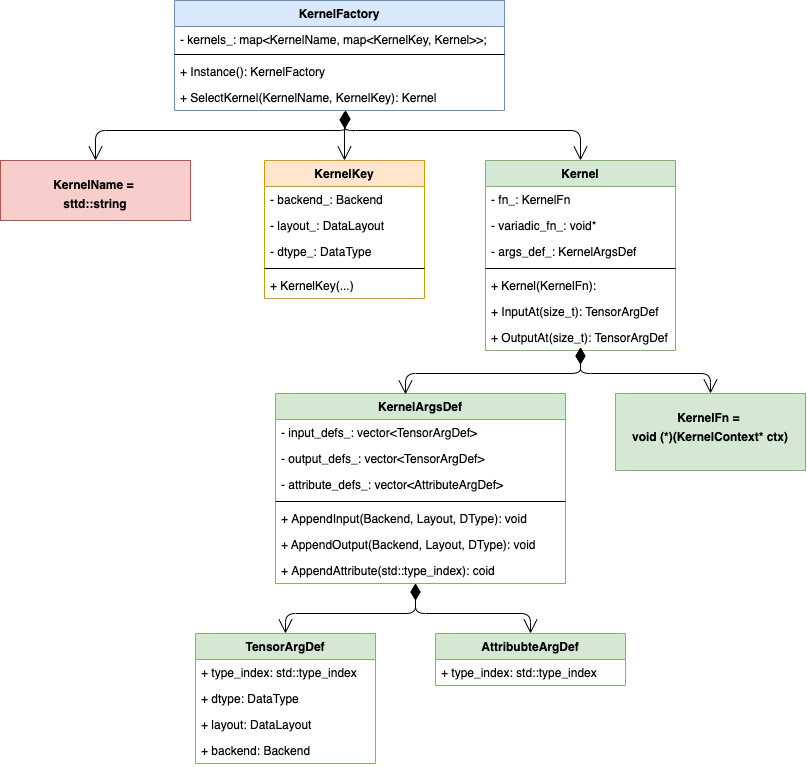

# Paddle HIgh reusability operator library (PHI) Design Document

Paddle HIgh reusability operator library (PHI), or we also call it 'functional operator library', supports to implement new operator kernels based on existing operator kernel functions and 'Kernel Primitives API (KPS)', and supports plug-in access to new hardware or new acceleration library.

In order to solve the problems of unclear operator interface in the original operator library of the Paddle Fluid Framework, high cost of operator reuse, and poor scheduling performance, we refactored the operator library of the Paddle Framework, designed flexible and efficient functional paradigm.

The operator library PHI can implement new operators by combining calls to functional operator interfaces. The new operator library provides more than 200 C++ operation APIs that are consistent with the Python development interface, and nearly 500 forward and backward functional operator kernels that can be combined and called, which can greatly reduce the development cost of native operator and custom operator.

## 1. Background and Objectives

> Introduce the problems to be solved in designing and building the PHI operator library


The PHI operator library project was initially launched to support the refactoring of the paddle dynamic graph architecture to reduce scheduling overhead and improve the reuse capability of OpKernel development. However, the subsequent decision to take this opportunity to establish an operator library that can be used in both training and inference scenarios (including server-side and mobile-side scenarios), reduce the cost of infrastructure development and operator maintenance in the paddle ecosystem in the long run, so we expanded the target scope of the project. At present, PHI has carried a number of goals.

### 1.1 Background issues

Specifically, the PHI operator library project carries the expectation to solve the following problems of Paddle.

#### 1.1.1 Poor reusability between Op&OpKernel

Before version 2.3, the reusability between Operators (Op) in Paddle was relatively poor. Only in a few backward Ops, some simple Ops were reused by calling `SetType` in the `GradOpMaker` implementation. In most cases where the existing Op implementation can be reused, the code is rewritten by copy.

The root cause of poor reusability is the inflexibility of the original Op architecture design:

1. When an Op reuses the `Opkernel::Compute` method of another Op, an `ExecutionContext` needs to be constructed first, and the reuse method is relatively cumbersome

    > It will be much more convenient if you can directly call the Kernel in the form of a function

2. Due to the overhead introduced by additional data structure construction and independent Op scheduling, from the perspective of computing performance, it is better to copy the calculation code directly when reusing Op, which leads us to gradually abandon the earlier principle of backward Op reusing forward Op, and began to implement Kernel separately for each backward Op, so that Paddle maintains a large number of backward OpKernel implementation codes internally.

    > Only when the overhead of reusing Ops is small enough, reusing existing Ops to implement new Ops can be widely promoted

#### 1.1.2 Conciseness and fine-grained execution scheduling

##### 1.1.2.1 Dynamic graph

After the release of Paddle 2.0, it has received many feedbacks from internal and external users that the performance of the dynamic graph is several times lower than that of competing products in the execution scenario of small model on CPU.

The main reason for this problem is: the execution path of the C++ side of the Padddle dynamic graph is relatively long and the scheduling overhead is relatively heavy, which is related to the early design of the dynamic graph which is compatible with the static graph and inherits many object construction processes of the static graph Op.

- Issue: https://github.com/PaddlePaddle/Paddle/issues/28774

Therefore, the dynamic graph needs to be upgraded to a function-based scheduling architecture, and this problem can be solved by abandoning the original complex Op architecture, which depends on the OpKernel being changed to a functional writing method.

##### 1.1.2.2 Static image + IR

Our current static graph mode are not "static" enough. At present, static graph mode still have a lot of logic for dynamic selection at runtime, for example, selecting OpKernel at runtime, judging whether to copy data across devices at runtime, etc.. However, these can actually be determined during the compilation of the static graph mode network, and the execution process is determined as a series of OpKernel executions, and no dynamic judgment selection is made, thereby further improving the execution efficiency.

And these rely on the fine-grained OpKernel itself, decoupling the existing complex large OpKernel into small Kernels for specific scenarios and specific devices.

#### 1.1.3 Ease of use improvement requirements for custom operators

The new custom C++ external operator paradigm released in early 2021 has a relatively intuitive usage at the level of interface and function writing, but because we lack the C++ APIs for basic operations, in fact, when implementing specific custom Op operation logic, such as basic addition, subtraction, multiplication and division and matrix operations, still need to be reimplemented again, and Paddle's existing and optimized basic operations cannot be reused, development costs are still relatively high. In order to reuse the basic operations inside Paddle, the Op paradigm must be upgraded to functional paradigm, and build the corresponding C++ API system.

#### 1.1.4 Build an integrated training and inference operator library to reduce the maintenance cost of inference operators

For a long time, because the Paddle and Paddle-Lite operators are maintained separately, the new paddle operator, if Paddle-Lite needs it, must be manually reimplemented in Paddle-Lite, and when the Paddle operator is upgraded, Paddle-Lite does not perceive it in time, which will directly lead to bugs in the inference model when lite is executed, which introduces high maintenance costs. Only a unified operator library can solve this problem for a long time.

Therefore, this functional operator library will be jointly constructed by training and inference team, and will serve as an independent compilation component and underlying infrastructure (not yet independently split), which can serve training, prediction, and Lite execution systems at the same time.

#### 1.1.5 The adaptation of the new inference Runtime design 'infrt'

Inference team designed a new runtime `infrt`. It is expected to unify the execution system of Paddle-Inference and Paddle-Lite. It is necessary to directly call the operators in the PHI operator library jointly built this time. Therefore, the adaptation to `infrt` needs to be considered in the design. (Currently the `infrt` project is temporarily on hold).

#### 1.1.6 Op and Kernel parameter normalization

The Python 2.0 API project in 2020 standardized the argument list of the Paddle Python-side API, making it concise, easy to use, and standard. However, due to cost considerations, the argument list at the Op level was not standardized, so there will be many early developed operators that differ greatly in arguments from the Python API. For example, `conv` op, the Python API has only 8 arguments, but the corresponding C++ `Conv` Op has 30+ arguments. API and Op are essentially the same layer of concepts, both are descriptions of an operation, and the arguments should be consistent. In order to solve this problem, 'the operator definition enhancement project' was launched, and the declarations of 'AsExtra' and 'AsQuant' were added to some unnecessary arguments, but the problem was not fundamentally solved, which is what the construction of the PHI operator library hopes to solve.

We hope to be able to achieve the same three-layer arguments of Python API -> Op(C++ API) -> Kernel API, so that the overall structure is clear, and the reuse relationship of each layer is clear enough. Maintaining a set of official Python API documents can basically satisfy the common reference requirements of the three-tier API, no longer focus on maintaining additional document systems and reduce maintenance costs.

### 1.2 Objectives and Scope

- Overall goal: The core framework of Paddle reuses the same functional operator library; the basic data structure Tensor has good scalability, and fundamentally achieves consistent training and inference; the basic components are stable and reliable, and the incremental development experience is good.

- Target range:

  - The initial construction of the PHI operator library paid more attention to Kernel "migration". Due to the consideration of time and labor costs, the original OpKernel logic migration is not forced to be upgraded to "combined" writing for the time being, and the same is true for the forward and backward Kernels
  - The "combined Kernel extension development" capability provided by the PHI operator library initially serves the new operators of subsequent increments, and the existing operators still maintain their original coding implementation, reducing the cost of migration
  - The "new hardware expansion capability" provided by the PHI operator library is initially only provided within the scope of the new hardware itself. For example, the XPU has implemented 50 Kernels, and then it can combine new Kernels based on 50 Kernels, but this is only limited to the XPU Within the scope, its implementation is not common with CPU, CUDA, etc.
  - The PHI operator library project focuses on the work of "Kernel functionalization & Op normalization", Kernel is changed to functional format, C++ API and Op naming and arguemnts list are gradually normalized to Python API under the premise of ensuring compatibility as much as possible


## 2. Design Overview

### 2.1 Naming and Location

The PHI code directory is inside the paddle directory, which is at the same level as fluid, rather than inside the fluid directory. Phi is a basic component that is called by various upper-layer runtimes such as fluid, lite, and infrt, and it will be used later as a separately compiled dynamic library, therefore PHI is not suitable as the submodule of fluid.

### 2.2 Directory Structure

#### 2.2.1 Requirements of directory structure design

Training and inference require a clear operator library directory structure:

- The directory design should support various split compilation requirements of the operator library, which including:

    - Split and compile according to the computing device.
        - For example, compile for cpu only, or compile for gpu only.
    - Split and compile according to the training and inference scenarios.
        - For example, the inference scenario does not compile backward-relevant kernels, nor forward kernels with `Intermediate` outputs
    - Precisely crop and compile according to the operators actually used by the mobile device (not supported yet)
        - For example, a model uses `add` and `mul` only, ideally it could be cropped to only 2 kernels.

- In the long run, support the requirement of easily reusing kernel implementation.
    - Explanation: When reusing the kernel, the corresponding function implementation should be introduced through `include` easily, rather than cannot find the kernel because of the complex directory structure.

- In the long run, support the requirement of the unified writing method among cross-device kernels, and the writing method is intuitive and easy to use, without introducing unnecessary template parameters.
    - Explanation: Kernel Primitive API module is at the lower layer of the operator library. Its long-term vision is that each operation uses only one kernel to adapt to various devices, the code that truly distinguishes the device is only in the implementation of the Kernel Primitive API. In the future, the template parameters should be limited to as concise as possible when passing complex parameters into the reused kernel.

- In terms of ease of use, developers can accurately understand where the newly added kernel should be placed, without ambiguity.
    - Explanation: When developers add an API, they will not be confused about which directory they should put the corresponding kernel in. Moreover, different people should have no ambiguous understanding of where the same kernel should be placed.

- Do not introduce a lot of duplicate directory design.
    - Explanation: Concept splitting is needed, but also with boundaries. Avoid subdirectories with the same name occurring in multiple directories. For example, if `eigen`, `funcs`, `math` directories are placed under the cpu directory, then they shouldn't be placed under the gpu directory. The directory design of the new operator library is mainly divided according to the device, and the directory splitting at other levels should be weakened as much as possible. For example, try not to split based on functions, try not to split based on fields, etc.

- No file bloat during migration.
    - Explanation: Splitting kernels according to devices shouldn't cause a large-scale increase of kernel implementation files.

- Do not introduce too deep directory design.
    - Explanation: The directory level should not be too deep, otherwise it will lead to higher understanding and maintenance costs.

- Do not introduce excessive migration costs.
    - Explanation: When migrating the kernel, do not make too many changes to the kernel itself, otherwise the migration cost will be too high.

#### 2.2.2 Directory design details

##### 2.2.2.1 First level directory

```
paddle/phi
./api (High-level API exposed to the outside and corresponding implementation)
    ./include（High-level API header file exposed to the outside）
    ./lib（API implementation exposed to the outside）
./capi (C API exposed to the outside and corresponding implementation)
    ./include
    ./lib
./common (Basic data structures used both internally and externally)
./core (Basic components, such as basic Tensor-related interfaces, kernel registration interfaces, management units, etc.)
./backends (Basic components of each device and backend, including backend directories such as cpu, gpu, etc.)
./infermeta (Derivation functions for meta information such as shape, dtype, layout, etc.)
./kernels (Kernel implementation of each device and backend)
./ops (The definition of each Op, most of the work is done automatically by code generation in the future, and currently there are only compatible codes)
./tests (Unit test)
```

Some directory structure description:

- `api`: API module for external users.
    - Directly use the Python-like C++ Tensor computing API, which is highly consistent with the Python side.
    - This part may reversely depend on the framework's `DeviceContextPool` and other implementations, so it is managed separately.
    - On such APIs, training and prediction may also be different.
- `capi`: C API module, currently mainly serving the plug-in hardware access function.
- `common`: Data structures to be used both inside PHI `core` and PHI `api` directory. These data structures neither belong to the `core` nor the `api` directory.
- `core`: PHI has some public module implementations that it needs, such as `DenseTensor`, kernel registration and management modules.
- `backends`: The backends include data structures that need to be added for each backend, such as `CPUContext`, `GPUContext`, etc.
    - The basic data structures are placed in the `core`, while the dedicated data structures of specific backends are not placed in the `core`, and the dependencies strictly ensure that the `backends` depend on the `core`, but the `core` cannot depend on the `backends`.
    - Example 1: If Context is a base class, then put it in `core`, inherited `CPUContext` is in `backends/cpu` and `GPUContext` is in `backends/gpu`.
    - Example 2: TensorBase is in `core`, `DenseTensor` is used by most devices so that it is also in the `core`. If there is `ONEDNNTensor`, which is only used for `ONEDNN`, then it should be placed in `backends/onednn`.
- `infermeta`: The location of the infermeta function, the infermeta function is equivalent to `infershape + inferdtype + inferlayout`, etc.
- `kernels`: Kernels related to each device.
    - `cpu, gpu, ...`
- `ops`: Ops includes new forms of Op definitions, as well as some components compatible with original Ops.


##### 2.2.2.2 Kernels directory

```
paddle/phi/kernels
./ (Device-independent kernel declarations and implementations.)
./cpu (Include the kernel implementation of the cpu backend only.)
./gpu
./xpu
./onednn
./gpudnn
./impl (Considering the current situation, for easy reuse, this directory includes the consistent implementation of the original Kernel on CPU, GPU and other devices.)
./funcs (Including some functor and funcs that support multiple devices under the original fluid operators.)
./primitive (Includes basic implementation of the Kernel Primitive API)
...
```

The directory structure is described as follows:

- The root directory under kernels includes device-independent `kernel.h` and `kernel.cc`. In principle, each kernel has one .h and .cc
    - For example, if a kernel is implemented using Primitive api, or is implemented by reusing other basic kernels, there should be only one implementation for all devices, so its declaration and implementation can be placed directly in the kernels directory. (This is the ideal state in the future.)
    - At present, most of our kernels do not have the feature of unity implementation across devices, but the input parameters and return values of the kernel should be consistent except for `DeviceContext`, so the kernel parameter declaration header file is also placed in the current directory (consistent with the original design, `DeviceContext` and `T` are used as template parameters), The functions implementation of each device are placed in the corresponding device folder.
        - Note that the unity implementation across devices here does not mean that the CPU and GPU implementations of a kernel are unified, but the implementations of all devices are the same. Currently, it includes at least `CPU`, `GPU`, `XPU`, `ONEDNN`, `GPUDNN`, etc.
    - If the backward kernel does not need to support cropping, it can be merged appropriately (but if you want to leave the possibility of supporting end-to-side training, the backward kernel may also be a potential target for cropping)
- The next-level subdirectory of kernels, in principle, is created according to the backend classification, and only two special directories are reserved:
    - `funcs`: In order to be compatible with the directories of functor and function in the original fluid/operators directory, when placing functions and functors that support multiple backends, we organize them according to the original design that one header file corresponding to multiple .cc(u) (This part of the code may be removed in the future, because it will be gradually replaced by Kernel Primitive API and reuse between Kernels, so no over-design here.)
        - Example 1: A common function `XXXFunction` is called in both reduce CPU and reduce CUDA kernel implementations, and the reduce CPU and reduce GPU kernel implementations are different, then `XXXFunction` should be in the `funcs` directory.
    - `primitive`: Kernel Primitive API, some basic tools for multi-device unified kernel implementation.
    - `impl`: Paddle's current op kernel implementation, many of them reuse the same code for CPU and GPU, and they are in a large number of `xx_op.h`. This part of the code is not suitable to be placed in the `cpu` or `gpu` directory, nor in the `funcs` directory (putting it in the `funcs` directory will cause a considerable part of the kernel implementation to be placed in the `funcs` directory, which is too bloated and confusing. The `funcs` directory is created to place the `functor` and `function` tools as in the original operators/math directory) This part of the code is also not suitable to be placed in the root directory of `kernels` (it is not a device-independent implementation, only an implementation shared by cpu and gpu). Therefore, in order not to overthink this part of the code when migrating, and the location of the placement is relatively consistent with its implementation nature, the `impl` directory was created.
        - In the `impl` directory, only the kernel functions that are consistent across some devices are placed. They are all header files, and the names are all suffixed with `xxx_kernel_impl.h`
        - For example: `scale`, `fill_constant`, `fill_any_like` kernels are all such cases.
- After the kernel is migrated, first create the corresponding kernel header file and put it directly in the root directory of kernels, and put the kernel implementation of each backend in the corresponding device folder.
    - You can refer to the degree of merging of the original op. For example, `matmul` originally had both .h and .cc, then it will be maintained after it is migrated. The activation-related ops are basically written in single file . h or .cc, then it will still remain single file when it is migrated (Split it up in the future if necessary)
    - Example 1: The original `cast` op Kernel is in `cast_op.h`. After migration, `cast_kernel.h` is created in the root directory, and `cast_kernel.cc/cu` is placed in the corresponding directory according to the backend used, that is, `cast_kernel.cc` is placed in the cpu, `cast_kernel.cu` is placed in the gpu.
    - Example 2: The original `scale` op's kernel is implemented using eigen, and the CPU and GPU implementations are the same. After migration, the public implementation should be in `scale_kernel_impl.h` in impl, and the public header file `scale_kernel.h` is in the root directory of kernels, `scale_kernel.cc` is in cpu, `scale_kernel.cu` is in gpu.
- When migrating the auxiliary functions that are only used by the current kernel, they are always placed in the same backend folder as the kernel implementation, and the .h file is used to manage the code. Auxiliary function codes are no longer placed elsewhere, unless their implementations are used in multiple places.
    - Even if there are multiple calls, if it is still limited to the same device, directly build the header file and put it in the same directory.
- The implementation of the backward kernel and the forward kernel are placed in different files, and the file suffix is `*_grad_kernel.*`, which is convenient for cmake to separate and compile.
    - No more directories are created for the backward kernel, otherwise directories such as cpu/gpu will also be created under the backward kernel directory.
    - The implementation of the second-order derivative and the third-order derivative is also placed in the grad kernel implementation file.

- Why is the directory named `gpu` instead of `cuda` and `hip`?
    - The code of `cuda` and `hip` is very repetitive, and the unified implementation is easier to maintain.


### 2.3 Core Components

#### 2.3.1 Common basic data structure

##### 2.3.1.1 Backend

```
/**
 * [ Why need Backend? ]
 *
 * Backend not only means place. Backend is a superset of place.
 *
 * Place cannot indicate the difference in calculation methods on the device,
 * but in order to make the boundary of the kernel clearer and the function
 * more specific, we need to distinguish the calculation method.
 *
 * Such as the kernel for CPU device, it can be a native CPU kernel,
 * or a kernel implemented by MKLDNN library.
 *
 * Note(chenweihang): HIP is not needed now, we can added it if needed
 * in the future
 */
enum class Backend : uint8_t {
  UNDEFINED = 0,

  // basic kernel backend
  CPU,

  // various acceleration devices' backends
  GPU,
  XPU,  // XPU currently does not exist at the same time as CUDA
  NPU,  // NPU currently does not exist at the same time as CUDA
  MLU,  // MLU currently does not exist at the same time as CUDA
  IPU,

  // the third library backend
  ONEDNN,
  GPUDNN,  // cuDNN and hipDNN

  // paddle kernel primitives backend
  KPS,

  // end of backend types
  NUM_BACKENDS,

  /**
   * [ Why we need ALL in baisc kernel key member? ]
   *
   * For Tensor, ALL represents an illegal Backend, but for Kernel, some
   * kernels may be device-independent by nature, such as reshape;
   * and some kernels are also device-independent when implemented based on
   * primitive API.
   *
   * In this case, we need to provide a more concise registration method,
   * instead of registering the kernels for each device with almost
   * repetitive code, we need one registration covers all situations,
   * so if we provide the ALL field with Register the kernel in this statement.
   *
   * Of course, we have also considered solving this problem through different
   * named macros, for example, if we define
   *
   * PD_REGISTER_KERNEL_FOR_ALL_BACKEND
   *
   * Based on this design pattern, the dtype and layout also have the same
   * requirements, this cause we need to define a series of macros
   *
   * PD_REGISTER_KERNEL_FOR_ALL_DTYPE
   * PD_REGISTER_KERNEL_FOR_ALL_LAYOUT
   * PD_REGISTER_KERNEL_FOR_ALL_BACKEND_AND_LAYOUT
   * PD_REGISTER_KERNEL_FOR_ALL_BACKEND_AND_DTYPE
   * PD_REGISTER_KERNEL_FOR_ALL_LAYOUT_AND_DTYPE
   * PD_REGISTER_KERNEL_FOR_ALL_BACKEND_AND_LAYOUT_AND_DTYPE
   *
   * It makes the system of registering macros more complicated, we think
   * this is not a simple design, so we still adopt the design of providing
   * the ALL field.
   *
   * Note: ALL_BACKEND only used for Kernel registration and selection
   */
  ALL_BACKEND = UNDEFINED,
};
```

##### 2.3.1.2 DataLayout

```
// Note: The original design of paddle DataLayout is confusing.
// It contains two levels of "layout", one is the data layout
// at the Tensor level, including Dense, Sparse, etc., and the other
// is the format at the data level, including NHWC, NCHW, etc.,
// these should belong to the concept of "data format".
// The concepts of these two levels are mixed into an enumeration class,
// which leads to some strange execution scheduling logic.
// It needs to be refactored in the future.
// In order to maintain compatibility, we still use the design of the
// original framework here.

// Note: Here the DataLayout is public api for external users, the prefix `k`
// maybe confuse users, so we use all uppercase names

enum class DataLayout {
  UNDEFINED = 0,
  // TODO(chenweihang): keep ANY for compatibility, remove it later
  ANY = UNDEFINED,
  NHWC,
  NCHW,
  NCDHW,
  NDHWC,
  MKLDNN,
  SPARSE_COO,
  SPARSE_CSR,
  PSTRING_UNION,

  NUM_DATA_LAYOUTS,

  // See Note [ Why we need ALL in basic kernel key member? ]
  ALL_LAYOUT = UNDEFINED,

  // Note: Unify PHI DataLayout and fluid::framework::DataLayout,
  // for compatible with fluid DataLayout, here need prefix `k`

  // Note: The original `kAnyLayout (enum value 2)` is a strange design.
  // `kAnyLayout` originally cannot represent any kind of Layout,
  // at the same time, it can also represent any Layout.
  // Strictly, it means "default" or "undefined" layout,
  // and should not be mixed with other meaningful layouts

  kAnyLayout = ANY,
  kNHWC = NHWC,
  kNCHW = NCHW,
  kMKLDNN = MKLDNN,  // all layouts supported by MKLDNN internally
  kNDHWC = NDHWC,
  kNCDHW = NCDHW,
};
```

##### 2.3.1.3 DataType

```
enum class DataType {
  UNDEFINED = 0,

  BOOL,

  UINT8,  // BYte
  INT8,   // Char
  UINT16,
  INT16,
  UINT32,
  INT32,
  UINT64,
  INT64,

  FLOAT32,
  FLOAT64,

  COMPLEX64,
  COMPLEX128,

  // In Paddle 2.3, we add a new type of Tensor, StringTensor, which is designed
  // for string data management. We design the dtype of StringTensor, pstring.
  // In order to express a unique data dtype of StringTensor, we add
  // DataType::PSTRING.
  PSTRING,

  // IEEE754 half-precision floating-point format (16 bits wide).
  // This format has 1 sign bit, 5 exponent bits, and 10 mantissa bits.
  FLOAT16,

  // Non-IEEE floating-point format based on IEEE754 single-precision
  // floating-point number truncated to 16 bits.
  // This format has 1 sign bit, 8 exponent bits, and 7 mantissa bits.
  BFLOAT16,

  NUM_DATA_TYPES,
  // See Note [ Why we need ALL in baisc kernel key member? ]
  ALL_DTYPE = UNDEFINED,
};
```

- Why doesn't use the `VarType` of the original fluid here?
    - Reason 1: The original `DataType` and `VarType` of fluid are the same level concepts, and the design is relatively confusing. For example, `DenseTensor` and `FLOAT32` are the same level concepts, but these two are obviously not. We do not want to inherit the original design with obvious defects.
    - Reason 2: Decouple dependencies from fluid, so that PHI can be compiled independently in the future.

##### 2.3.1.4 Scalar

Scalar is used to uniformly represent variables with different basic data types (float, double, int, bool, etc.). (Currently, Tensor scalars representing 1 element are also supported, but support for this feature may be dropped in the future)

Take `ScaleKernel` as an example, the `scale` parameter can be passed in int, float, double and other basic data types. If you do not use `Scalar` to represent, you need to create a separate functional interface for each data type, which will greatly increase the amount of code when developing Kernel, so `Scalar` is mainly applied to the parameter with different data types, which avoids implementing multiple overloaded functions.

```
template <typename T, typename Context>
void ScaleKernel(const Context& dev_ctx,
                 const DenseTensor& x,
                 const Scalar& scale,
                 float bias,
                 bool bias_after_scale,
                 DenseTensor* out);
```

##### 2.3.1.5 IntArray

IntArray is an integer type array that can be constructed from `vector<int>`, `Tensor` and `vector<Tensor>`. Currently, it is mainly used to represent dimension index variables such as `shape`, `index` and `axis`.

Taking `FullKernel` as an example, the shape parameter is used to indicate the dimension information of the returned Tensor (e.g. [2, 8, 8]). When calling `FullKernel`, the parameters of `vector<int>`, `Tensor` and `vector<Tensor>` type variables can be used to complete the call. Using `IntArray` avoids the problem of writing a separate overloaded function for each shape type.

```
template <typename T, typename Context>
void FullKernel(const Context& dev_ctx,
                const IntArray& shape,
                const Scalar& val,
                DenseTensor* out);
```

#### 2.3.2 Tensor Design

The overall design is as follows


The following will introduce them in turn.

##### 2.3.2.1 API Tensor interface

- The top-layer is the API-level Tensor interface, which contains two pointer members, `TensorBase` and `AbstractAutogradMeta`.
    - Both members are designed as Interface and do not depend on real Tensor and `Autograd` implementations.
    - `AutogradMeta` is only meaningful in the dynamic graph API-level Tensor, it will not be used in the specific kernel calculation, so put it in the top-layer Tensor interface.
    - In addition, such a design facilitates data sharing and reduces copy overhead.
        - When a Tensor is assigned to another Tensor, or Tensor is used as a function return value, only the pointer is actually copied, and no real data copy is performed.

- The top-layer C++ Tensor plays a similar role as the Python-side Tensor, and the interface design is as consistent as possible with the Python-side.
    - Contain basic property access and data access methods of Tensor.
        - `shape`, `place`, `dtype`, `data`.
    - Contain the `autograd` methods required by the dynamic graph Tensor.
        - `gradient`, `backward`.
    - Contain conversion methods between Tensors.
        - cpu, gpu, xpu etc.
    - Contain calculation methods related to Tensor (not added yet).
        - All methods of the `paddle.tensor` module.

- Compilation decoupling:

    - The `autograd` information here is just a pointer index, which is empty by default.
        - `std::unique_ptr<AbstractAutogradMeta> autograd_meta_ = nullptr;`
    - `AbstractAutogradMeta` is an abstract class interface that does not depend on any module of `autograd`, so it will not affect the independent compilation of PHI, and at the same time takes into account the need for dynamic graph Tensor to hold backward information.

- `AutogradMeta` is only set in the dynamic graph scenario. For unneeded scenarios, such as in static graphs, `AutogradMeta` is just a null pointer.

Devices judgment and conversion of Tensor.

- The judgement method of Tensor device and type.

```
bool is_cpu() const;
bool is_gpu() const;
bool is_xpu() const;
bool is_dense_tensor() const;
bool is_selected_rows() const;
bool is_opencl() const; // To be added
bool is_metal() const;  // To be added
```

- The type conversion method between Tensors, which is implemented through the API consistent with the Python side (to be added).

```
Tensor cpu() const; // Convert to cpu tensor
Tensor gpu() const; // Convert to gpu tensor
Tensor xpu() const;
Tensor ondnn() const;
```

- This conversion process may be `cast` or `copy`:
    - `cast` if no data copy required.
    - `copy` if data copy required.
    - Transformations are implemented by functional kernels.

- Usage in API Scenarios
    - In a complete training scenario, when a user uses an API, such as `DataLoader`, the data is generally read from the disk, put it into the CPU, and then converted to the specific execution device.

##### 2.3.2.2 TensorBase

- The interface implemented by Tensor only contains the necessary pure virtual Tensor methods, and does not contain members with real meaning. The methods here should also be strictly monitored during the development process.

- Why use abstract class design at this level?
    - On the one hand, it is to isolate the Tensor API from the specific implementation of Tensor without generating too many dependencies. If the Tensor API needs to be redesigned in the future, or the `autograd` information needs to be abandoned, only the Tensor API needs to be redesigned, which has little effect on the implementation of the underlying Tensor.
    - On the other hand, in order to reserve sufficient expansion space for heterogeneous Tensors, the framework-level API only needs one Tensor data structure, and there is no need to expose multiple data structures. In fact, a large-scale definition is made here: all data structures in the framework are Tensors.
        - For a basically consistent memory layout, or a basically consistent implementation of Tensor descriptions, it can be inherited based on an implementation of `DenseTensor`.
        - For Tensors with a high degree of heterogeneity, new Tensor classes (such as Tensors with only one Object) can be directly inherited from Interface. This ensures that Tensor has no bottlenecks in scaling flexibility.

##### 2.3.3.3 DenseTensor、SparseTensor

- `DenseTensor` is the basic implementation of Tensor, which corresponds to the `DenseTensor` class in the original fluid. `DenseTensorMeta` in `DenseTensor` contains basic members that describe Tensor information, and `Allocation` in `DenseTensor` is the original `Allocation` of fluid.
- `SparseCsrTensor` and `SparseCooTensor` are newly designed sparse Tensor types, see code implementation for details.

> In order to be compatible with the original framework scheduling and operators, we have also migrated `SelectedRows` as a basic Tensor type. If it can be replaced by a new sparse Tensor in the future, it will be removed.

##### 2.3.3.4 Other Heterogeneous Tensors

- If the existing `Allocation` cannot meet the Tensor memory requirements of some third-party libraries, you can use the new `Allocation` implementation after inheriting `TensorBase`.
- This kind of Tensor is not essentially out of the scope of general Tensor, but the memory access method is different, it still needs other `TensorMeta` information.
- To build a custom Tensor, you can define a special `TensorAllocation` description class, such as `MetalTensor`.

```
template <typename AllocationType>
class SpatialTensor : public TensorBase {
 public:
  SpatialTensor(std::shared_ptr<AllocationType> allocation,
                std::unique_ptr<DenseTensorMeta> meta)
      : allocation_(std::move(allocation)),
        meta_(std::move(meta)) {}

 private:
  std::shared_ptr<AllocationType> allocation_;
  std::unique_ptr<TensorMeta> meta_;
};

template <typename AllocationType>
class MetalTensor : public SpatialTensor<AllocationType> {};

template <typename AllocationType>
class OpenCLTensor : public SpatialTensor<AllocationType> {};
```

- In this way, no matter how special the needs of Tensor are, it can be internally adapted on the premise of keeping the external API consistent.

Inherit other Tensors with high degrees of freedom: directly inherit `TensorBase`.

- `TensorBase` is an abstract class, which leaves a lot of room for the description of specific Tensor. If the description of traditional Tensor cannot meet the requirements, a specialized Tensor implementation can be designed.


#### 2.3.3 C++ API

##### 2.3.3.1 C++ API form

> Highlights of this section:
> 1. The C++ API corresponds to the Python 2.0 API: the function name, parameter name, parameter order, and return value are the same.

After investigation, we found that very few framework products are designed with the ease of use of the C++ API in mind. For the long-term consideration, if we want to attract more developers to build the paddle ecology, it is also very important to provide a standardized and easy-to-use C++ API architecture. At the same time, the Python 2.0 API project has laid a good reference foundation for the C++ API, and we can directly inherit its achievements.

Therefore, currently we expect the C++ API declaration form of the Tensor computing library to be as follows:

```
Tensor mean(const Tensor& x);

Tensor scale(const Tensor& x,
             const Scalar& scale,
             float bias,
             bool bias_after_scale);
```

Described as follows:

- It should be as consistent as possible with the attributes of the Python API, and the function name, parameter list, and return value should be consistent, so that users will not have any additional learning costs in the switch between Python and C++ (if they must be inconsistent, new C++ APIs can be added. There is a one-to-one correspondence between Python's existing APIs and C++ APIs).

**What scenarios is this new C++ API architecture mainly used for?**

1. C++ API that can be called when developing custom operators, it improves ease of use.
    - For example, the user needs to initialize a Tensor in a custom operator, loop through the Tensor data and assign values, then you can directly call `paddle::ones`, `paddle::full` APIs.
2. The architecture serves as the basic calling unit of the new dynamic graph.
    - The new dynamic graph will use the API as the scheduling calculation unit, and will no longer call the Op architecture, thus improving the scheduling performance.
3. As a basis for the development of backward Op reuse forward Op.
    - Now the backward op kernel needs to be implemented separately. After the API architecture is completed, it is hoped that the backward op implementation can be completed by reusing the forward API.

##### 2.3.3.2 C++ API auto-generate

**Why auto-generate C++ API?**

- The implementation code of the C++ API is relatively fixed in form, and can theoretically be implemented in an auto-generate way.
- Using automatic code generation can effectively reduce the development cost of C++ API, and it is easy to modify and maintain.

**How to automatically generate C++ API?**

The automatic generation of the C++ API is generated by parsing the YAML configuration file. The YAML configuration file is divided into:

- Forward API configuration file(`paddle/phi/api/yaml/ops.yaml`. After parsing, the generated code file is `paddle/phi/api/include/api.h` and `paddle/phi/api/lib/api.cc`)
- Backward API configuration file(`paddle/phi/api/yaml/backward.yaml`. After parsing, the generated code file is `paddle/phi/api/backward/backward_api.h` and `paddle/phi/api/lib/backward_api.cc`)

The key to C++ API generation lies in the configuration of the YAML file. Taking `matmul` as an example, the forward and backward configuration are as follows:

```
## Forward API configuration
- api : matmul
  args : (Tensor x, Tensor y, bool transpose_x=false, bool transpose_y=false)
  output : Tensor
  infer_meta :
    func : MatmulInferMeta
  kernel :
    func : matmul
  backward : matmul_grad

## Backward API configuration
- backward_api : matmul_grad
  forward : matmul (Tensor x, Tensor y, bool transpose_x, bool transpose_y) -> Tensor(out)
  args : (Tensor x, Tensor y, Tensor out_grad, bool transpose_x=false, bool transpose_y=false)
  output : Tensor(x_grad), Tensor(y_grad)
  infer_meta :
    func : MatmulGradInferMeta
  kernel :
    func : matmul_grad
```

The meaning of each configuration parameter:

- api: function name, which must be the same as the function name registered by PHI Kernel.
- args: the function parameters. Their order and data type must be exactly the same as the PHI Kernel function of the same name, and the `Attributes` type must be ranked after the `Tensor` type.
- output: the output type. If there are multiple outputs, then separate them by commas (","). You can optionally mark the name of each input with "()" after the type (e.g. `Tensor(out)`). If there is no mark, the default markers is `out0`, `out1`, ...
- infer_meta: calculate the dimension and type of the returned Tensor (see the introduction of the `InferMeta` function for details).
    - func: the called `InferMeta` function. It's default input is all the parameters of the args item and the output parameter of api, the Tensor type variable in it will be automatically replaced with `MetaTensor`.
- kernel: the specific Kernel function called by the API.
    - func: the registered name of the kernel function (the name used by `REGISTER`, not the function name). It's default input is all the parameters of the args item and the output parameter of api.
- backward: (optional). The corresponding backward function name, if not set only the forward API will be generated.

The YAML parsing script will automatically generate the corresponding C++ API according to the above configuration items. The generated code includes the relevant processing logic such as Kernel automatic selection, Tensor transformation, Data Transform, `InferMeta` and Kernel calling. For details, please refer to the generated code in `api.cc` .

Due to the large number of C++ APIs and their various forms and functions, some more flexible configuration items are also provided in the YAML configuration mechanism, such as `invoke`, etc. In the future, it is expected that some new configuration items will be added as needed.

#### 2.3.4 Kernel Form, Registration and Management

##### 2.3.4.1 Kernel form

> Highlights of this section:
> 1. Notes on Kernel function form:
> (1) Data type `T` and `DeviceContext` (abbreviated as `Context`) as template parameters;
> (2) `Context` is the first parameter of Kernel;
> (3) The return value Tensor takes the form of a pointer as an input parameter, and the return value of Kernel itself is void.

This part includes the specific Kernel. The functions implemented in this part will be registered in the framework as Kernel for unified search and scheduling by the framework.

Currently we expect this part to be of the following form, using `scale` as an example:

```
template <typename T, typename Context>
void Scale(const Context& dev_ctx,
           const DenseTensor& x,
           float scale,
           float bias,
           bool bias_after_scale,
           DenseTensor* out) {
  ...
}
```

Described as follows:

- The kernels of different devices must have different function implementations. The function names are named in **camel case**. Except for the capitalization of the first letter, the naming should be as consistent as possible with the API function name. The function names of the same calculation are kept the same, and the functions of different devices are managed through different files or directories.
- There are generally two template parameters, `T` and `Context`, which are used to determine the data type and device type at runtime.
    - According to our current architecture, the vast majority of Kernels reduce the code in the way of **specialized DeviceContext and data type**, which is consistent with the original `OpKernel` form.
    - The form should be unified. If the Kernel level is also exposed as a fine-grained API in the future, the ease of use is guaranteed.
- Specification of function input parameters:
    - Take a specific `DeviceContext` (such as `CPUContext`, `CUDAContext`) as the first input parameter to meet the needs of specific context information required at runtime. Pass the stream in if there are multiple streams.
        - Currently, it is not supported to pass multiple `DeviceContext` parameters to one Kernel. At present, such a requirement is considered unreasonable.
    - The parameter list is consistent with the API. If there is other special information that needs to be passed into the Kernel, pass it through the `Context`.
    - Then all input Tensors and input Attributes are passed in with const &, and POD types are passed in directly by value.
    - The input Tensor is a specific Tensor type, such as `DenseTensor` or `SelectedRows`, not the Tensor of the external interface API.
    - Finally, the Tensor return value of the function, passed in as a pointer.
    - In order to make the mechanism more flexible and allow the kernel to adapt to more scenarios, the declaration of flexible types of input, output and parameters will be allowed subsequently to adapt to non-Tensor input, output and Tensor Attribute.
- The internal implementation of the function is determined on demand:
    - Short term:
        - Migrate the implementation of the existing `OpKernel` to the specific device Kernel.
        - Abstract the implementation of `OpKernel` with common devices into functions, which are called by multiple device Kernels.
    - Long term:
        - The complex kernel directly calls the basic kernel to complete the calculation, encourages kernel reuse, thus simplifies the code.

> FAQ:

>- Why does the first parameter need to be `DeviceContext`? Why must this parameter be passed in?
    - The PHI kernel requires a pure function format. The variables used in the function are passed in through parameters or created inside the function, global singletons are not allowed inside the function. In order to adapt to various kernel requirements, the `DeviceContext` parameter that stores context information is necessary.
>- Why are two template parameters needed?
    - In order to efficiently support the reusing of device-independent kernels. If we want to implement a Fourier transform `fft` kernel, assuming that the kernel can be derived by combining the basic kernels, the form of `Xxx<T, Device>()` can avoid dynamically redistributing devices.

##### 2.3.4.3 Kernel implementation

> Highlights of this section:
> 1. Kernel focuses on computing logic without mixing scheduling logic.
> 2. Kernel is fine-grained enough, with clear boundaries, no optional parameters, easy to reuse.

The existing Kernel introduces scheduling logic because the Op parameter is too complex, for example:

- Use `use_cudnn` to determine whether to execute the cudnn branch. In the new Tensor calculation library, the use of `cudnn` calculation is a separate Kernel.

In order to reduce costs, the PHI Kernel implementation will inherit the original `OpKernel` implementation as much as possible. Most Kernel implementations only need to remove the `Input` and `Output` logic from the original `OpKernel` and modify some key points. Take `sign` as an example:

Original `sign` OpKernel:

```
template <typename DeviceContext, typename T>
class SignKernel : public framework::OpKernel<T> {
 public:
  virtual void Compute(const framework::ExecutionContext& context) const {
    auto* out = context.Output<framework::Tensor>("Out");
    auto* in = context.Input<framework::Tensor>("X");
    out->mutable_data<T>(in->place());

    auto eigen_out = framework::EigenVector<T>::Flatten(*out);
    auto eigen_in = framework::EigenVector<T>::Flatten(*in);
    auto& place =
        *context.template device_context<DeviceContext>().eigen_device();
    EigenSign<std::decay_t<decltype(place)>, T>::Eval(place, eigen_out,
                                                      eigen_in);
  }
};
```

Migrated PHI sign kernel:

```
template <typename T, typename Context>
void SignKernel(const Context& dev_ctx,
                const DenseTensor& x,
                DenseTensor* out) {
  dev_ctx.template Alloc<T>(out);
  auto eigen_out = EigenVector<T>::Flatten(*out);
  auto eigen_x = EigenVector<T>::Flatten(x);

  auto& dev = *dev_ctx.eigen_device();
  funcs::EigenSign<std::decay_t<decltype(dev)>, T>::Eval(
      dev, eigen_out, eigen_x);
}
```

In addition to the change of kernel form from structure format to functional format, there are two major changes:

1. Since the parameters are all specific inputs, there is no need to take the input and output from the context, the relevant code is removed.
2. In the PHI kernel, the memory application of the output Tensor is required to use the `ctx.Alloc` or `ctx.HostAlloc` method, and no longer use the original `mutable_data` to apply for memory.

> FAQ
> 1. Why is `mutable_data` replaced by `ctx.Alloc`?
> Answer: Because the global method `memory::AllocShared` called in the original `mutable_data` method uses a global singleton for memory allocation, which does not conform to the pure function design principle mentioned above. In terms of business requirements, if a single instance is used in the kernel to determine the way of memory allocation, in the multi-threaded environment of inference, different threads will not be able to flexibly specify different memory allocation ways.


##### 2.3.4.4 Kernel registration

> Highlights of this section:
> 1. Kernel needs to expose all its key information to the framework and record its input, output and attribute information, otherwise it will lead to unclear boundaries between framework scheduling and Kernel calculation.

When fluid Kernel is registered, only the `place`, `layout`, `dtype`, `input` and `output` of the Kernel are recorded and managed by `ExecutionContext`, and there is no corresponding information record. Now the kernel needs to be changed to a functional type. The input, output and attributes of each function are clear. We hope to record the information of each input and output here, which is also compatible with paddle-lite scheduling.

Meanwhile, we need to simplify the writing method of Kernel registration. The existing writing methods are not concise enough:

1. There is a lot of redundant information in the Kernel registration method of fluid. Taking `scale` as an example, you can see that in addition to the last data type of each kernel, the preceding function names and `DeviceContext` specialization information are redundant.

    ```
    REGISTER_OP_CPU_KERNEL(
        scale, ops::ScaleKernel<paddle::platform::CPUDeviceContext, float>,
        ops::ScaleKernel<paddle::platform::CPUDeviceContext, double>,
        ops::ScaleKernel<paddle::platform::CPUDeviceContext,
                         paddle::platform::bfloat16>,
        ops::ScaleKernel<paddle::platform::CPUDeviceContext, uint8_t>,
        ops::ScaleKernel<paddle::platform::CPUDeviceContext, int8_t>,
        ops::ScaleKernel<paddle::platform::CPUDeviceContext, int16_t>,
        ops::ScaleKernel<paddle::platform::CPUDeviceContext, int>,
        ops::ScaleKernel<paddle::platform::CPUDeviceContext, int64_t>);
    ```

2. Paddle-Lite's kernel registration method declares input and output information for each Kernel, but since the kernel of each data type is different, it will also cause redundancy in the writing method. As you can see in the following code, except for the data type, other information is basically redundant.

    ```
    #ifdef LITE_BUILD_EXTRA
    using scale_int32_f =
        paddle::lite::kernels::arm::ScaleCompute<int, PRECISION(kFloat)>;
    REGISTER_LITE_KERNEL(scale, kARM, kFloat, kNCHW, scale_int32_f, int32)
        .BindInput("X", {LiteType::GetTensorTy(TARGET(kARM), PRECISION(kInt32))})
        .BindOutput("Out", {LiteType::GetTensorTy(TARGET(kARM), PRECISION(kInt32))})
        .Finalize();

    using scale_int64_f =
        paddle::lite::kernels::arm::ScaleCompute<int64_t, PRECISION(kFloat)>;
    REGISTER_LITE_KERNEL(scale, kARM, kFloat, kNCHW, scale_int64_f, int64)
        .BindInput("X", {LiteType::GetTensorTy(TARGET(kARM), PRECISION(kInt64))})
        .BindOutput("Out", {LiteType::GetTensorTy(TARGET(kARM), PRECISION(kInt64))})
        .Finalize();
    #endif  // LITE_BUILD_EXTRA

    #ifdef ENABLE_ARM_FP16
    using scale_float16 =
        paddle::lite::kernels::arm::ScaleCompute<float16_t, PRECISION(kFP16)>;
    REGISTER_LITE_KERNEL(scale, kARM, kFP16, kNCHW, scale_float16, def)
        .BindInput("X", {LiteType::GetTensorTy(TARGET(kARM), PRECISION(kFP16))})
        .BindOutput("Out", {LiteType::GetTensorTy(TARGET(kARM), PRECISION(kFP16))})
        .Finalize();

    #endif  // ENABLE_ARM_FP16

    using scale_float =
        paddle::lite::kernels::arm::ScaleCompute<float, PRECISION(kFloat)>;
    REGISTER_LITE_KERNEL(scale, kARM, kFloat, kNCHW, scale_float, def)
        .BindInput("X", {LiteType::GetTensorTy(TARGET(kARM), PRECISION(kFloat))})
        .BindOutput("Out", {LiteType::GetTensorTy(TARGET(kARM), PRECISION(kFloat))})
        .Finalize();

    using scale_int32 =
        paddle::lite::kernels::arm::ScaleCompute<int, PRECISION(kInt32)>;
    REGISTER_LITE_KERNEL(scale, kARM, kInt32, kNCHW, scale_int32, def)
        .BindInput("X", {LiteType::GetTensorTy(TARGET(kARM), PRECISION(kInt32))})
        .BindOutput("Out", {LiteType::GetTensorTy(TARGET(kARM), PRECISION(kInt32))})
        .Finalize();

    using scale_int64 =
        paddle::lite::kernels::arm::ScaleCompute<int64_t, PRECISION(kInt64)>;
    REGISTER_LITE_KERNEL(scale, kARM, kInt64, kNCHW, scale_int64, def)
        .BindInput("X", {LiteType::GetTensorTy(TARGET(kARM), PRECISION(kInt64))})
        .BindOutput("Out", {LiteType::GetTensorTy(TARGET(kARM), PRECISION(kInt64))})
        .Finalize();
    ```

Therefore, in this design, we do not want to continue to maintain this redundant writing method. We hope that the writing method of kernel registration is concise enough, and at the same time, it can flexibly meet the requirements of Kernel input and output information configuration.

The key point of this problem is that the kernel needs to specify its own `device`, `layout` and `dtype` as its own key information, and most of the kernel input and output Tensor's `device`, `layout` and `dtype` are consistent with the kernel itself. For this kind of kernel, there is no need to declare through `BindInput` and `BindOutput`, we can automatically generate information to fill each input and output according to the information of the kernel. We only need to configure special information for the input and output that is inconsistent with the kernel information.

The new kernel registration form is as follows:

```
PT_REGISTER_KERNEL("sign", CPU, NCHW, pt::Sign, float, double) {}

PT_REGISTER_KERNEL("mean", CPU, NCHW, pt::Mean, float, double) {}

PT_REGISTER_KERNEL("scale", CPU, NCHW, pt::Scale, float, double, bfloat16,
                   uint8_t, int8_t, int16_t, int, int64_t) {}

PT_REGISTER_KERNEL("scale_host", CPU, NCHW, pt::ScaleHost, float, double, bfloat16,
                   uint8_t, int8_t, int16_t, int, int64_t) {
   kernel->InputAt(1).SetBackend(pt::Backend::kCPU);
}
```

Described as follows:

- A large amount of redundant information in the previous registration method is removed, and the scale kernel registration of 8 data types can be completed with one line of code, and the information of each input and output is recorded by default according to the kernel information.
- For a kernel with dynamic attribute input such as `ScaleTensor`, you can configure the `Backend`, `Layout` and `Dtype` information of specific parameters in the function body; if there is no such requirement, the function body can be empty.

In addition, in the `PT_REGISTER_KERNEL` macro, the function form of the Kernel function is normalized through template deduction.

The kernels with different input parameter lists are unified into the following form, so that they can be stored in the Kernel data structure below as a unified function pointer:

```
using KernelFn = void (*)(KernelContext* ctx);
```

Auto-derivation by wrapping `PT_KERNEL` around the Kernel function

```
##define PT_KERNEL(...) \
  ::pt::KernelImpl<decltype(&__VA_ARGS__), &__VA_ARGS__>::Compute
```

In addition, only basic template adaptation has been implemented at present, and we will add them as needed in the future to make the overall mechanism more flexible and applicable to a wider range.

##### 2.3.4.4 Kernel management

> Highlights of this section:
> 1. Introduce the design of the current Kernel management components

For the management of the new form of Kernel, the current design is as follows:



Described as follows:

- `KernelFactory` is a global singleton data structure for managing Kernel. Similar to `OpKernelMap` of fluid, it is a two-level map. The first-level mapping finds the Kernel set according to the name, and the second-level mapping finds the specific Kernel according to the KernelKey.
- `KernelKey` is similar to the original `OpKernelType`, but the `palce` and `library_type` fields are combined into one and called `Backend`, because the original `LibraryType` is a limited enumeration class, which is strongly related to place, the splitting increases the cost of understanding instead.
- `Kernel` holds more information than the original `OpKernel`. In addition to the Function during execution, it also holds information about specific parameters, namely `KernelArgsDef`. For Tensor type input and output, it saves Tensor type information, Device, data Type, data layout. For Attribute type input and output, it saves type information.


#### 2.3.5 Kernel Compilation and Dependencies

> Highlights of this section:
> 1. Introduce the compilation design of the kernel.
> 2. Introduce the establishment of kernel dependencies.

##### 2.3.5.1 Kernel compilation

After the original OpKernel is migrated to PHI, phi automatically scans all relevant cc(cu) files during compilation, and compiles the overall target according to the device, without declaring the Kernel compilation objects one by one, for example:

```
file(
  GLOB
  kernel_cu
  "gpu/*.cu"
  "gpu/*.cu.cc"
  "gpudnn/*.cu"
  "kps/*.cu"
  "selected_rows/gpu/*.cu"
  "sparse/gpu/*.cu"
  "strings/*.cu"
  "strings/gpu/*.cu")

add_library(phi_cpu ${kernel_cc})
kernel_declare("${kernel_cc}")
target_link_libraries(phi_cpu ${COMMON_KERNEL_DEPS})
```

By calling the `kernel_declare` method, the registration unit in the kernel source file is extracted, and a unified symbol declaration is automatically generated to avoid manual maintenance of the kernel declaration. The generated declaration is in the `paddle/phi/kernels/declarations.h` file in the `build` directory, the generated declaration code example is as follows:

```
PD_DECLARE_KERNEL(argsort, CPU, ALL_LAYOUT);
PD_DECLARE_KERNEL(as_complex, CPU, ALL_LAYOUT);
PD_DECLARE_KERNEL(as_real, CPU, ALL_LAYOUT);
...
```

For the specific implementation of `kernel_declare`, please refer to the function implementation in `camke/phi.cmake`, which will not be introduced here.

##### 2.3.5.2 Kernel dependencies

The phi kernel has been changed to a functional format, and the original intention is to make it easier to reuse between kernels, but reusing kernels will introduce compilation dependencies between kernels. We compile all kernels as a whole unit, which can avoid maintaining dependencies between individual kernels. Therefore, if you need to reuse the Kernel during development, you only need to include the corresponding header file correctly.

#### 2.3.6 InferMeta(Shape) Abstract Integration

The original `InferShape` of fluid Op is the same as `OpKernel`, has the problem of repeated development: because the `InferShape` functions of different Ops cannot be reused, even if the `InferShape` logic of different Ops is the same or similar, they needs to be rewritten again. The refactor of PHI needs to address this issue.

We also rewrite `InferShape` into a functional form, which supports different Ops to call the same `InferShape` function, which improves ease of use and reduces maintenance costs.

> FAQ:
> 1. Why call it `InferMeta` instead of continuing to call it `InferShape`?
> Answer: The `Meta` of `InferMeta` comes from the `meta` member in `DenseTensor`. In PHI, an op has two components, `InferMeta` and `Kernel`. `InferMeta` covers the functions of `InferShape`, but it is not limited to `InferShape`. In addition to the inference of dims and lod, `InferMeta` also infers dtype and layout, which is different from the original.

##### 2.3.6.1 InferMeta related design

`InferMeta` is also functional form, a few examples are as follows:

```
void UnchangedInferMeta(const MetaTensor& x, MetaTensor* out) {
  out->share_meta(x);
}

void CastInferMeta(const MetaTensor& x, DataType out_dtype, MetaTensor* out) {
  out->set_dims(x.dims());
  out->set_dtype(out_dtype);
  out->set_layout(x.layout());
}

void CreateLikeInferMeta(const MetaTensor& x,
                         DataType dtype,
                         DataLayout layout,
                         MetaTensor* out) {
  out->set_dims(x.dims());
  out->set_dtype(dtype == DataType::UNDEFINED ? x.dtype() : dtype);
  out->set_layout(layout == DataLayout::UNDEFINED ? x.layout() : layout);
}

void ConcatInferMeta(const std::vector<MetaTensor>& x,
                     const Scalar& axis_scalar,
                     MetaTensor* out,
                     MetaConfig config = MetaConfig());
```

The features are introduced as follows:

1. The function is named `[FunctionDesc|OpName]InferMeta`
2. The function form is similar to Kernel, the function parameters are MetaTensor input, Attribute, MetaTensor output in turn, and the return value is empty. In principle, there is a one-to-one correspondence between the parameter list of the `InferMeta` function and its corresponding `Kernel` function. The difference is only the Tensor parameter type. The Tensor parameter of the `InferMeta` function is `MetaTensor`, and the Tensor parameter of the `Kernel` function is `DenseTensor`, `SparseTensor`, etc.
3. For some `InferMeta` functions that need to distinguish between compile time and execution time, add the `MetaConfig` parameter at the end. There is a bool member `is_runtime` in config, and the structure is used to facilitate the subsequent expansion of other flag members.

The purpose of using `MetaTensor` is to mask multiple Tensor types, and to be compatible with the original fluid's `VarDesc` and `Variable`. One op corresponds to one `InferMeta` function. If the type is not masked, the `InferMeta` function will be overloaded multiple times for different input types.

The basic design of `MetaTensor` is as follows:

```
class MetaTensor {
 public:
  explicit MetaTensor(TensorBase* tensor) : tensor_(tensor) {}

  MetaTensor() = default;
  MetaTensor(const MetaTensor&) = default;
  MetaTensor(MetaTensor&&) = default;
  MetaTensor& operator=(const MetaTensor&) = delete;
  MetaTensor& operator=(MetaTensor&&) = delete;

  virtual ~MetaTensor() = default;

  virtual int64_t numel() const;
  virtual DDim dims() const;
  virtual DataType dtype() const;
  virtual DataLayout layout() const;
  virtual void set_dims(const DDim& dims);
  virtual void set_dtype(DataType dtype);
  virtual void set_layout(DataLayout layout);
  virtual void share_lod(const MetaTensor& meta_tensor);

 private:
  const LoD& lod() const;
  TensorBase* tensor_;
};
```

There is a pointer member `TensorBase` in the base class `MetaTensor`, so it can be compatible with `DenseTensor`, `SelectedRows`, `SparseCsrTensor` and other types in PHI.

##### 2.3.6.2 InferMeta registration management

In order to support the unified calling of the `InferMeta` function, the `InferMeta` function also performs unified registration management.

First of all, we define `PT_INFER_META`, similar to the `PT_KERTNEL` macro that normalizes the Kernel, we also implement `InferMetaContext` like `KernelContext`. (The implementation is not expanded, only some fragments are placed, see `phi/core/infermeta_utils.h` for details)

```
class InferMetaContext {
 public:
  InferMetaContext() = default;
 ...
};

##define PT_INFER_META(...) \
  ::phi::InferMetaFnImpl<decltype(&__VA_ARGS__), &__VA_ARGS__>::Call

template <typename Fn, Fn fn>
struct InferMetaFnImpl;

template <typename Return, typename... Args, Return (*infer_meta_fn)(Args...)>
struct InferMetaFnImpl<Return (*)(Args...), infer_meta_fn> {
  static void Call(InferMetaContext* ctx) {
    InferMetaFnCallHelper<Args..., InferMetaTypeTag<int>>::template Call<0, 0, 0>(ctx);
  }

 private:
  template <typename... RemainingArgs>
  struct InferMetaFnCallHelper;

  ...
};
```

Then design the corresponding singleton class to store MetaFn.

```
class MetaFnFactory {
 public:
  static MetaFnFactory& Instance();

  bool Contains(const std::string& kernel_name_prefix) const {
    return meta_fn_map_.count(kernel_name_prefix) > 0;
  }

  void Insert(std::string kernel_name_prefix, InferMetaFn infer_meta_fn) {
    PADDLE_ENFORCE_NE(
        Contains(kernel_name_prefix),
        true,
        phi::errors::AlreadyExists(
            "`%s`'s Series Kernel's InferMetaFn has been registered.",
            kernel_name_prefix));
    meta_fn_map_.insert(
        {std::move(kernel_name_prefix), std::move(infer_meta_fn)});
  }

  const InferMetaFn& Get(const std::string& kernel_name_prefix) const {
    auto it = meta_fn_map_.find(kernel_name_prefix);
    PADDLE_ENFORCE_NE(
        it,
        meta_fn_map_.end(),
        phi::errors::NotFound(
            "`%s`'s Series Kernel's InferMetaFn is not registered.",
            kernel_name_prefix));
    return it->second;
  }

 private:
  MetaFnFactory() = default;

  /**
   * [ Why use kernel name prefix? ]
   *
   * one op -> a matrix of kernels
   *
   * such as, scale op, it may correspond to the following kernels:
   *
   * - scale, scale_sr, scale_onednn
   * - scale_raw, scale_raw_sr, scale_raw_onednn
   *
   * All the kernels in each row correspond to the same infershape function,
   * the number of kernel arguments in the same row is the same, and only
   * the tensor types in the arguments are different.
   */
  paddle::flat_hash_map<std::string, InferMetaFn> meta_fn_map_;

  DISABLE_COPY_AND_ASSIGN(MetaFnFactory);
};
```

Encapsulate the corresponding registration macro for `InferMeta` registration. The registration writing example is as follows:

```
PT_REGISTER_INFER_META_FN(sign, phi::UnchangedInferMeta);
```

For the registration of `InferMeta`, developers generally do not need to write by hand. We automatically generate the corresponding registration entries through the mapping relationship between api name and `InferMeta` in yaml.

##### 2.3.6.3 InferMeta compatible with fluid InferShape

In fluid, inherit `MetaTensor` to implement `CompatMetaTensor`, and rewrite the corresponding member methods to make the `InferMeta` function compatible with the input of `VarDesc` and `Variable`. Taking dims as an example, the dims implementation of `CompatMetaTensor` is:

```
class CompatMetaTensor : public phi::MetaTensor {
 public:
  CompatMetaTensor(InferShapeVarPtr var, bool is_runtime)
      : var_(std::move(var)), is_runtime_(is_runtime) {}

  CompatMetaTensor() = default;
  CompatMetaTensor(const CompatMetaTensor&) = default;
  CompatMetaTensor(CompatMetaTensor&&) = default;
  CompatMetaTensor& operator=(const CompatMetaTensor&) = delete;
  CompatMetaTensor& operator=(CompatMetaTensor&&) = delete;

  ...

  DDim dims() const override {
    if (is_runtime_) {
      auto* var = BOOST_GET_CONST(Variable*, var_);
      if (var->IsType<phi::DenseTensor>()) {
        return var->Get<phi::DenseTensor>().dims();
      } else if (var->IsType<phi::SelectedRows>()) {
        return var->Get<phi::SelectedRows>().dims();
      } else {
        PADDLE_THROW(platform::errors::Unimplemented(
            "Currently, only can get dims from DenseTensor or SelectedRows."));
      }
    } else {
      auto* var = BOOST_GET_CONST(VarDesc*, var_);
      return make_ddim(var->GetShape());
    }
  }
  ...
};
```

Then, in order to transplant the functional `InferMeta` back to the Op architecture of fluid, it is necessary to normalize the functional `InferMeta` to the functor form.

Normalize the function form through the `PT_INFER_META` macro, and then wrap `PT_INFER_META(***InferMeta)` into a functor. The functor first converts the `InferShapeContext` to `InferMetaContext`, then calls the corresponding `InferMeta` function, and manages the code uniformly through a macro.

```
##define DELCARE_INFER_SHAPE_FUNCTOR(op_type, functor_name, fn)      \
  struct functor_name : public paddle::framework::InferShapeBase {  \
    void operator()(                                                \
        paddle::framework::InferShapeContext* ctx) const override { \
      auto infer_meta_context =                                     \
          paddle::framework::BuildInferMetaContext(ctx, #op_type);  \
      fn(&infer_meta_context);                                      \
    }                                                               \
  }
```

The key function is `BuildInferMetaContext`, which will take out the parameters required by the `InferMeta` function from the `InferShapeContext`, put them into the `InferMetaContext`. The parameters required by `InferMeta` is obtained through the `ArgumentMapping` function (details are introduced in Section `2.4 Compatible Adaptation of Dynamic and Static Graphs`).

Then the functor can be maintained in the corresponding `OpInfo` when the Op is registered, and the `InferShape` implementation of the original Op can be deleted. The example is as follows:

```
// Original implementation
class SignOp : public framework::OperatorWithKernel {
 public:
  using framework::OperatorWithKernel::OperatorWithKernel;

  void InferShape(framework::InferShapeContext *ctx) const override {
    OP_INOUT_CHECK(ctx->HasInput("X"), "Input", "X", "sign");
    OP_INOUT_CHECK(ctx->HasOutput("Out"), "Output", "Out", "sign");

    ctx->SetOutputDim("Out", ctx->GetInputDim("X"));
    ctx->ShareLoD("X", /*->*/ "Out");
  }
};

namespace ops = paddle::operators;

REGISTER_OPERATOR(sign, ops::SignOp, ops::SignOpMaker<float>,
                  ops::SignGradMaker<paddle::framework::OpDesc>,
                  ops::SignGradMaker<paddle::imperative::OpBase>);

// Implementation after upgrade
class SignOp : public framework::OperatorWithKernel {
 public:
  using framework::OperatorWithKernel::OperatorWithKernel;
};

DELCARE_INFER_SHAPE_FUNCTOR(
    sign, SignInferShapeFunctor, PT_INFER_META(phi::UnchangedInferMetaNew));
REGISTER_OPERATOR(sign, ops::SignOp, ops::SignOpMaker<float>,
                  ops::SignGradMaker<paddle::framework::OpDesc>,
                  ops::SignGradMaker<paddle::imperative::OpBase>,
                  SignInferShapeFunctor);

```

So far, after the original Op's `InferShape` function has been migrated to PHI `InferMeta`, it can be re-registered back to fluid to be called, thereby realizing the functional reuse and global unification of InferShape.

### 2.4 Compatible Adaptation of Dynamic and Static Graphs

> Highlights of this section:
> 1. Support the new form of Kernel to be called in the existing static graph and dynamic graph architecture, the difficulty lies in solving the matching problem of multi-parameter Op to few-parameter Kernel.

#### 2.4.1 ArgumentMapping Architecture Design

The parameter list of the new form of Kernel is aligned with the Python API, which is different from the parameter list registered in the original `OpMaker`, this makes it difficult to match when the new form of Kernel is called in the original fluid architecture.

For example, `conv2d` op has 4 Inputs, 1 Output, and 26 Attributes registered in its `OpMaker`, while the Python API of `conv2d` has only 8 parameters in total (not counting name, 3 Tensor inputs, 5 Attribute inputs).

At runtime, before calling the new Kernel, select the Kernel parameters from the parameters registered by `OpMaker`, and then pass them to the new Kernel.

For some relatively standardized operators, their `OpMaker` parameters and Python api parameters are consistent. In such standard situation, there is no need to select parameters. For these operators, according to the registration order of input and output attributes in `OpProto`, skip the members marked as `Extra` and `Quant`, can solve some parameter matching problems of Op and Kernel. However, for some operators that are not standardized or left over from fluid, such as `conv`, such a mapping function is required, and this mapping function may have very complex judgment logic depending on the op. Therefore, there is no way to automate it at this stage.

At present, the `ArgumentMapping` function mapping is designed. In the `phi/ops/compat` directory, the corresponding mapping functions are implemented and registered. Then when the PHI kernel performs adaptation, the corresponding `ArgumentMapping` function will be called to obtain the parameters required by the PHI kernel. For example, the mapping function of `scale` op is as follows:

```
/**
 * Note [ Why does the ArgumentMapping function need to be so complicated? ]
 *
 * In order to meet the requirements of infrt, the function used to match Op
 * and Kernel parameters, need to be placed in PHI as a compatible component,
 * and does not depend on fluid.
 *
 * Because infrt not only needs to dynamically call this argument mapping
 * function at runtime, but also needs to statically declare all possible
 * results of the function before running without any information.
 *
 * The infrt declare like:
 *
 * def PDKEL_Reshape_to_CPU : Pat<
 *     (PD_ReshapeOp $x, $shape_tensor， $shape_attr), // OpMaker arguements
 *     (PDKEL_ReshapeKernelAttr $x, fn($shape_attr)>;  // Kernel arguments
 * def PDKEL_Reshape_to_CPU : Pat<
 *     (PD_ReshapeOp $x, $shape_tensor， $shape_attr),
 *     (PDKEL_ReshapeKernelAttr $x, fn($shape_tensor)>;
 *
 * Therefore, we need to write out each result of the argument mapping function,
 * like `KernelSignature("full", {}, {"ShapeTensor", "value"}, {"Out"})`, it
 * cannot contains variable, only can contains const char* string.
 *
 * Infrt will parse all results before running for the generation of the above
 * static declare, which leads to some functions being written in a long way,
 * and the complicated ones may have hundreds of lines, which has certain side
 * effects on the programming experience.
 */
KernelSignature ScaleOpArgumentMapping(const ArgumentMappingContext& ctx) {
  if (ctx.IsDenseTensorInput("X")) {
    if (ctx.HasInput("ScaleTensor")) {
      return KernelSignature(
          "scale", {"X"}, {"ScaleTensor", "bias", "bias_after_scale"}, {"Out"});
    } else {
      return KernelSignature(
          "scale", {"X"}, {"scale", "bias", "bias_after_scale"}, {"Out"});
    }
  } else if (ctx.IsSelectedRowsInput("X")) {
    if (ctx.HasInput("ScaleTensor")) {
      return KernelSignature("scale_sr",
                             {"X"},
                             {"ScaleTensor", "bias", "bias_after_scale"},
                             {"Out"});
    } else {
      return KernelSignature(
          "scale_sr", {"X"}, {"scale", "bias", "bias_after_scale"}, {"Out"});
    }
  } else {
    return KernelSignature("unregistered", {}, {}, {});
  }
}
```

The basic interface design of `ArgumentMappingContext` is as follows:

```
// TODO(chenweihang): Add more methods if needed in future
class ArgumentMappingContext {
 public:
  virtual ~ArgumentMappingContext() = default;

  virtual bool HasInput(const std::string& name) const = 0;
  virtual bool HasOutput(const std::string& name) const = 0;
  virtual bool HasAttr(const std::string& name) const = 0;

  // now we can't use Attribute here, it will cause PHI relay on
  // boost::variant and BlockDesc
  virtual paddle::any Attr(const std::string& name) const = 0;

  virtual size_t InputSize(const std::string& name) const = 0;
  virtual size_t OutputSize(const std::string& name) const = 0;

  virtual bool IsDenseTensorInput(const std::string& name) const = 0;
  virtual bool IsSelectedRowsInput(const std::string& name) const = 0;

  virtual bool IsDenseTensorOutput(const std::string& name) const = 0;
  virtual bool IsSelectedRowsOutput(const std::string& name) const = 0;
};
```

No matter whether `ScaleOpArgumentMapping` is used in fluid or infrt, as long as the `ArgumentMappingContext` of a specific frame can be constructed, the corresponding parameter mapping relationship can be obtained.

**1) Adaptation to fluid**

In fluid, functions need to be used in both static graphs and dynamic graphs. A straightforward idea is to construct `ArgumentMappingContext` directly through `ExecutionContext`, and then call it when op is executed, for example:

```
// TODO(chenweihang): split impl based OpProto or Dygraph if needed
class ExecutionArgumentMappingContext : public phi::ArgumentMappingContext {
 public:
  ExecutionArgumentMappingContext(const ExecutionContext& ctx) : ctx_(ctx) {}

  bool HasInput(const std::string& name) const override {
    return ctx_.HasInput(name);
  }

  bool HasOutput(const std::string& name) const override {
    return ctx_.HasOutput(name);
  }

  bool HasAttr(const std::string& name) const override {
    return ctx_.HasAttr(name);
  }

  size_t InputSize(const std::string& name) const override {
    return ctx_.InputSize(name);
  }

  size_t OutputSize(const std::string& name) const override {
    return ctx_.OutputSize(name);
  }

  bool IsDenseTensorInput(const std::string& name) const override {
    return ctx_.InputVar(name)->IsType<framework::Tensor>() ||
      ctx_.InputVar(name)->IsType<framework::DenseTensor>();
  }

  bool IsSelectedRowsInput(const std::string& name) const override {
    return ctx_.InputVar(name)->IsType<framework::SelectedRows>();
  }

 private:
  const ExecutionContext& ctx_;
};
```

**2) Adaptation to infrt**

If infrt only needs the inference program stored after training, that is, only the information of the `Proto` layer, then the corresponding `Context` can be constructed through the `Proto` information. **The information in proto is currently complete to support parameter matching**, for example:

```
class ProtoArgumentMappingContext : public phi::ArgumentMappingContext {
 public:
  ProtoArgumentMappingContext(proto::OpProto* op, proto::BlockDesc* block) : op_(op), block_(block) {}

  bool HasInput(const std::string& name) const override {
    // simple search
    for (int i = 0; i < proto_->input_size(); ++i) {
      auto& in = proto_->inputs()[i];
      if (in.name() == name) {
        return true;
      }
    }
    return false;
  }

  bool HasOutput(const std::string& name) const override {
    // simple search
    for (int i = 0; i < proto_->output_size(); ++i) {
      auto& out = proto_->outputs()[i];
      if (out.name() == name) {
        return true;
      }
    }
    return false;
  }

  bool HasAttr(const std::string& name) const override {
    // simple search
    for (int i = 0; i < proto_->attrs_size(); ++i) {
      auto& attr = proto_->attrs()[i];
      if (attr.name() == name) {
        return true;
      }
    }
    return false;
  }

  size_t InputSize(const std::string& name) const override {
    return proto_->input_size();
  }

  size_t OutputSize(const std::string& name) const override {
    return proto_->output_size();
  }

  bool IsDenseTensorInput(const std::string& name) const override {
    for (int i = 0; i < block_.vars_size(); ++i) {
      auto& var = block_.vars()[i];
      if (var.name() == name) {
        if (var.type() == proto::VarType::DENSE_TENSOR) {
          return true;
        }
      }
    }
    // TODO(chenweihang): throw error when cannot found
    return false;
  }

  bool IsSelectedRowsInput(const std::string& name) const override {
    for (int i = 0; i < block_.vars_size(); ++i) {
      auto& var = block_.vars()[i];
      if (var.name() == name) {
        if (var.type() == proto::VarType::SELECTED_ROWS) {
          return true;
        }
      }
    }
    // TODO(chenweihang): throw error when cannot found
    return false;
  }

 private:
  proto::OpProto op_*;
  proto::BlockDesc block_*;
};
```

#### 2.4.2 PHI Kernel Compatible with Scheduled Execution

At present, the PHI kernel can be compatibly scheduled and executed in the following execution systems: old `Executor`, `ParallelExecutor`, the `Tracer` and the `Engine` of dynamic graph, the `Predictor` of inference, and new executor `InterpreterCore`, etc.

Specifically, before calling `OpKernel` for dynamic and static graphs, judge the current calculation, such as whether `scale` has a new form of Kernel registered: if it has been registered, call the new form of Kernel to execute, otherwise if no suitable Kernel is found, the previously existing OpKernel is executed.

```
  if (phi::KernelFactory::Instance().HasCompatiblePhiKernel(type_)) {
    if (pt_kernel_signature_ == nullptr || pt_kernel_ == nullptr) {
      pt_kernel_signature_.reset(new KernelSignature(
          std::move(GetExpectedPhiKernelArgs(exe_ctx))));
      VLOG(6) << *pt_kernel_signature_.get();

      kernel_type_.reset(
          new OpKernelType(std::move(InnerGetExpectedKernelType(exe_ctx))));
      dev_ctx = pool.Get(kernel_type_->place_);

      pt_kernel_name = pt_kernel_signature_->name;
      pt_kernel_key = TransOpKernelTypeToPhiKernelKey(*kernel_type_.get());
      pt_kernel_.reset(
          new phi::Kernel(phi::KernelFactory::Instance().SelectKernel(
              pt_kernel_name, pt_kernel_key)));

      if (pt_kernel_->IsValid()) {
        VLOG(6) << "Static graph mode ChoosePhiKernel - kernel name: "
                << pt_kernel_name << " | kernel key: " << pt_kernel_key
                << " | kernel: " << *pt_kernel_;
      } else {
        VLOG(6) << "Static graph mode ChoosePhiKernel - kernel `" << pt_kernel_name
                << "` not found.";
      }
    }
    if (pt_kernel_->IsValid()) {
      run_phi_kernel_ = true;
    } else {
      auto& all_op_kernels = AllOpKernels();
      auto kernels_iter = all_op_kernels.find(type_);
      if (kernels_iter == all_op_kernels.end() ||
          kernels_iter->second.find(*kernel_type_.get()) ==
              kernels_iter->second.end()
##ifdef PADDLE_WITH_XPU
          ||
          paddle::platform::is_xpu_place(kernel_type_->place_) &&  // NOLINT
              !paddle::platform::is_xpu_support_op(
                  type_, *kernel_type_.get())  // NOLINT
          || paddle::platform::is_in_xpu_black_list(type_)
##endif
              ) {
        auto pt_cpu_kernel_key =
            FallBackToCpu(*kernel_type_.get(), pt_kernel_key, *this);
        pt_kernel_.reset(
            new phi::Kernel(phi::KernelFactory::Instance().SelectKernel(
                pt_kernel_name, pt_cpu_kernel_key)));

        dev_ctx = pool.Get(platform::CPUPlace());
        if (pt_kernel_->IsValid()) {
          VLOG(6) << "Static graph mode PrepareImpl - kernel name: " << pt_kernel_name
                  << " | kernel key: " << pt_cpu_kernel_key
                  << " | kernel: " << *pt_kernel_;
          run_phi_kernel_ = true;
        }
      }
    }
  }
  if (!run_phi_kernel_) {
    if (kernel_type_.get() == nullptr || kernel_func_.get() == nullptr) {
      ChooseKernel(exe_ctx);
      dev_ctx = pool.Get(kernel_type_->place_);
    }
  }

...

    if (run_phi_kernel_) {
      phi::KernelContext pt_kernel_context;
      // Do data transform before building KernelContext
      // TODO(zhiqiu): support TransferInplaceVarsBack
      PreparePhiData(exec_scope, *pt_kernel_, *pt_kernel_signature_,
                      runtime_ctx);
      BuildPhiKernelContext(*runtime_ctx, dev_ctx, &pt_kernel_context);
      (*pt_kernel_)(&pt_kernel_context);
    } else {
      (*kernel_func_)(
          ExecutionContext(*this, exec_scope, *dev_ctx, *runtime_ctx));
    }
```

The execution of the PHI kernel has two key functions.

**GetExpectedPhiKernelArgs**

When calling the PHI kernel, to complete the matching of multiple attributes to less attributes, it is necessary to call the aforementioned `ArgumentMapping` function to obtain the parameter list of the PHI kernel. The implementation of `GetExpectedPhiKernelArgs` is as follows:

```
KernelSignature OperatorWithKernel::GetExpectedPhiKernelArgs(
    const ExecutionContext& ctx) const {
  ExecutionArgumentMappingContext arg_mapping_ctx(ctx);
  return phi::OpUtilsMap::Instance().GetArgumentMappingFn(Type())(
      arg_mapping_ctx);
}
```

**BuildPhiKernelContext**

- To call the PHI kernel, you need to prepare the `Context` required by the PHI kernel. The difference between `PhiKernelContext` and the original `RuntimeContext` and `ExecutionContext` is that `PhiKernelContext` uses `SmallVector` to store input, output and attributes, and the access efficiency is higher than the original map.
- `PhiKernelContext` does not store the names of input, output and attributes. These items are required to be stored in sequence, which is consistent with the parameter list of the kernel.

The basic design of PHI `KernelContext` is as follows:

```
/**
 * Note: KernelContext doesn't manage the life of DeviceContext and Tensor
 *
 * Note: KernelContext does not couple the concept of framework,
 *       its constructor can only take the members it needs as parameters,
 *       not Scope, RuntimeContext, etc. as parameters
 */
class KernelContext {
 public:
  KernelContext() = default;
  explicit KernelContext(DeviceContext* dev_ctx) : dev_ctx_(dev_ctx) {}

  void SetDeviceContext(DeviceContext* dev_ctx) { dev_ctx_ = dev_ctx; }

  template <typename CtxType>
  const CtxType& GetDeviceContext() const {
    return static_cast<const CtxType&>(*dev_ctx_);
  }

  void EmplaceBackInput(const TensorBase* input);

  void EmplaceBackInputWithoutSetRange(const TensorBase* input);

  void EmplaceBackInputs(paddle::small_vector<const TensorBase*> inputs);

  void EmplaceBackOutput(TensorBase* output);

  void EmplaceBackOutputWithoutSetRange(TensorBase* output);

  void EmplaceBackOutputs(paddle::small_vector<TensorBase*> outputs);

  void EmplaceBackAttr(paddle::any attr);

  const std::pair<int, int>& InputRangeAt(size_t idx) const;

  const std::pair<int, int>& OutputRangeAt(size_t idx) const;

  void AssignInputRange(std::pair<int, int>&& range, size_t idx);

  void AssignOutputRange(std::pair<int, int>&& range, size_t idx);

  template <typename TensorType>
  const TensorType& InputAt(size_t idx) const {
    return static_cast<const TensorType&>(*(inputs_.at(idx)));
  }

  template <typename TensorType>
  paddle::optional<const TensorType&> OptionalInputAt(size_t idx) const {
    const auto& input = inputs_.at(idx);
    return input ? paddle::optional<const TensorType&>{static_cast<
                       const TensorType&>(*input)}
                 : paddle::optional<const TensorType&>{paddle::none};
  }

  template <typename TensorType>
  std::vector<TensorType> MoveInputsBetween(size_t start, size_t end) {
    std::vector<TensorType> v;
    for (size_t i = start; i < end; ++i) {
      auto t = static_cast<const TensorType*>(inputs_.at(i));
      v.emplace_back(*t);
      inputs_[i] = nullptr;
    }
    return v;
  }

  template <typename TensorType>
  TensorType* MutableOutputAt(size_t idx) {
    return static_cast<TensorType*>(outputs_.at(idx));
  }

  template <typename TensorType>
  std::vector<TensorType*> MutableOutputBetween(size_t start, size_t end) {
    std::vector<TensorType*> v;
    for (size_t i = start; i < end; ++i) {
      v.emplace_back(static_cast<TensorType*>(outputs_.at(i)));
    }
    return v;
  }

  template <typename AttrType>
  AttrType AttrAt(size_t idx) const {
    try {
      return paddle::any_cast<AttrType>(attrs_.at(idx));
    } catch (paddle::bad_any_cast&) {
      PADDLE_THROW(phi::errors::InvalidArgument(
          "Attribute cast error in Op Kernel Context."));
    }
  }

  size_t InputsSize() const { return inputs_.size(); }
  size_t OutputsSize() const { return outputs_.size(); }
  size_t AttrsSize() const { return attrs_.size(); }

 private:
  DeviceContext* dev_ctx_;

  paddle::small_vector<const TensorBase*> inputs_;
  paddle::small_vector<TensorBase*> outputs_;
  paddle::small_vector<paddle::any> attrs_;

  paddle::small_vector<std::pair<int, int>> input_range_;
  paddle::small_vector<std::pair<int, int>> output_range_;
};
```
