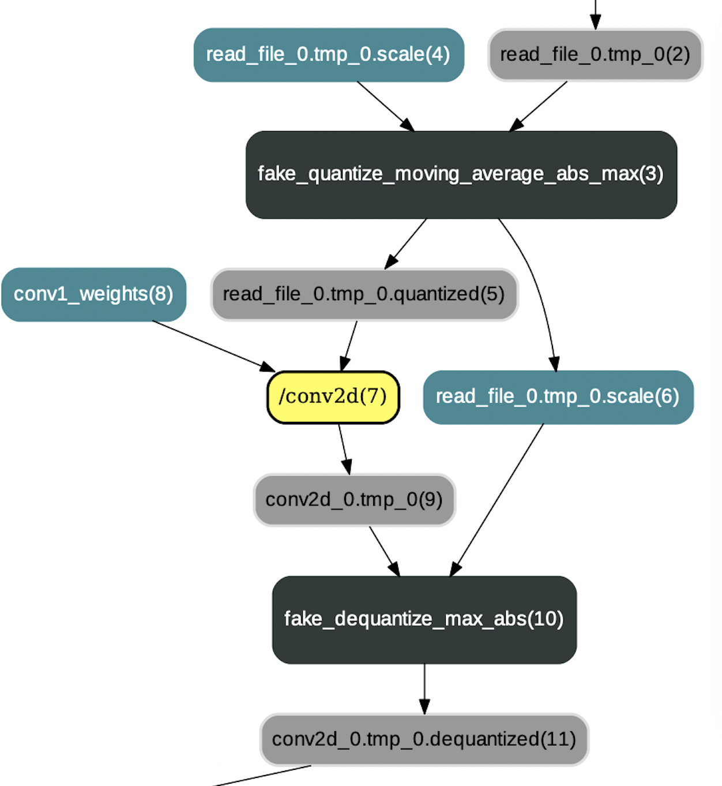

# 量化训练模型格式说明

PaddlePaddle 框架主要支持动态量化和静态量化两种量化训练模式。其中，动态量化会在每次推断过程中动态计算量化比例系数的值，而静态量化则对不同的输入采用相同的量化比例系数值。 对于权重而言，在训练过程中采用动态量化模式。换句话说，在每次迭代过程中量化比例系数均会被重新计算得到直至训练过程结束。 对于激活而言，可以选择动态量化模式也可以选择静态量化模式。若选择使用静态量化模式，则量化比例系数会在训练过程中被评估求得，且在推断过程中被使用(不同的输入均保持不变)。除此之外，卷积权重的动态量化亦包括两种形式：1）Tensor-wise 量化，即直接求取整个权重 Tensor 的量化 scale 值（单一值）；2）Channel-wise 量化，即对权重 Tensor 按照 channel 维度进行分片，然后求取每个通道 Tensor 的 scale 值。

## 1. Tensor-wise 量化
### 1.1 动态量化

动态量化主要通过`fake_quantize_abs_max`op 实现，该 op 对输入 tensor 进行量化并输出值域在-127～+127 范围内的量化 tensor。`fake_quantize_abs_max`op 在对输入 tensor 进行量化时使用的量化 scale 是动态计算出来的，即取输入 tensor 元素的绝对值最大值。动态计算出的量化 scale 会作为反量化 op 的一个输入，用于求取反量化 tensor。下面是对`fake_quantize_abs_max`op 的整体描述：

```
fake_quantize_abs_max {
    inputs {
    X(Tensor): 激活 tensor 或权重 tensor
    }

    outputs {
    Out(Tensor): 已量化 tensor
    OutScale(Tensor): 动态计算得到的量化 scale，其元素个数为 1(tensor-wise 量化)
    }

    attrs {
    bit_length(int): 量化 bit 数，如 8-bit
    }
}
```

### 1.2 静态量化

与动态量化不同，静态量化的量化 scale 是在量化训练时通过**窗口滑动平均**或者**窗口绝对值最大值**等方法计算求得的。静态量化主要通过`fake_quantize_moving_average_abs_max`op 或者`fake_quantize_range_abs_max`op 实现，它们利用输入的量化 scale 将输入 tensor 量化到-127～127 值域范围内。`fake_quantize_moving_average_abs_max`op 和`fake_quantize_range_abs_max`op 的输入和输出格式都是一样的，不同点在于 op 内部计算量化 scale 时使用的策略不同。`fake_quantize_moving_average_abs_max`op 使用一个窗口内绝对值最大值的滑动平均值作为量化 sacle，而`fake_quantize_range_abs_max`op 使用一个窗口内绝对值最大值的最大值作为量化 sacle。下面以`fake_quantize_moving_average_abs_max`op 为例，对其进行整体描述：

```
fake_quantize_moving_average_abs_max {
    inputs {
    X(Tensor): 一般为激活 tensor
    InScale(Tensor): 量化训练中计算求得的 scale
    }

    outputs {
    Out(Tensor): 已量化 tensor
    OutScale(Tensor): 量化训练中计算求得的 scale，用于继续传递到反量化 op
    }

    attrs {
    is_test(bool): 指明是量化训练过程还是预测推断过程
    bit_length(int): 量化 bit 数，如 8-bit
    moving_rate(float): 滑动平均衰减系数
    }
}
```

### 1.3 反量化

无论是静态量化还是动态量化，在量化计算完成后都需要进行反量化操作，该操作即是通过`fake_dequantize_abs_max`op 实现的。具体来说，`fake_quantize_abs_max`op 负责将 fp32 数值映射到 int8 值域（-127～127），而`fake_dequantize_abs_max` op 是将 int8 数值映射到 fp32 值域。

<p align="center">
 <br />
</p>

根据[量化训练的原理](https://github.com/PaddlePaddle/models/blob/develop/PaddleSlim/docs/tutorial.md#1-quantization-aware-training%E9%87%8F%E5%8C%96%E4%BB%8B%E7%BB%8D)可知，`fake_dequantize_abs_max` op 主要通过公式 1-3-1 进行反量化操作。在实现中，`fake_dequantize_abs_max` op 将激活 scale 作为 Variable（Tensor）进行输入（$X_{scale}$），将公式 1-3-1 中关于 scale 的剩余部分作为 max\_range 属性(即公式 1-3-2)。`fake_dequantize_abs_max` op 的整体描述如下：

```
fake_dequantize_abs_max {
    inputs {
    X(Tensor): 输入 tensor
    Scale(Tensor): 激活 scale
    }

    outputs {
    Out(Tensor): 已反量化 tensor
    }

    attrs {
    max_range(float): 根据公式 1-3-2 和公式 1-3-3 计算所得
    }
}
```

## 2. 卷积权重 Channel-wise 量化
### 2.1 分 channel 量化

分 channel 量化与动态量化类似，也是将输入 tensor 量化到-127～+127 值域范围内，不同之处在于分 channel 量化会对 tensor 按照 channel 维度进行分片，然后求取每个通道 tensor 的 scale 值。在 PaddlePaddle 框架中，`fake_channel_wise_quantize_abs_max`op 实现了分 channel 量化的逻辑。注意，目前仅对权重进行分 channel 量化，对激活是不进行分 channel 量化的，并且分 channel 量化只作用在卷积操作上(包括`conv2d`和`depthwise_conv2d`）。下面是对`fake_channel_wise_quantize_abs_max`op 的整体描述：

```
fake_channel_wise_quantize_abs_max {
    inputs {
    X(Tensor): 权重 tensor
    }

    outputs {
    Out(Tensor): 已量化 tensor
    OutScale(Tensor): 分 channel 计算得到的 scale，其元素个数与输入 tensor 的通道数相同
    }

    attrs {
    bit_length(int): 量化 bit 数，如 8-bit
    }
}
```

### 2.2 分 channel 反量化
若对卷积权重进行了分 channel 量化，则反量化操作时必须采用分 channel 反量化。`fake_channel_wise_dequantize_max_abs`op 实现了分 channel 反量化的逻辑，它的输入 Scales 包括两个 scale tensor，即激活 scale 和权重 scale。根据 2.1 节的描述可知，权重采用的是 channel-wise 量化而激活采用的是 tensor-wise 量化，所以激活 scale 对应的 tensor 仅包含一个值而权重 scale 对应的 tensor 包括输出通道数个值。下面是对`fake_channel_wise_dequantize_max_abs`op 的整体描述：

```
fake_channel_wise_dequantize_max_abs {
    inputs {
    X(Tensor): 输入 tensor
    Scales(Tensor List): 一般包括两个 tensor，且第一个为权重 scale，第二个为激活 scale
    }

    outputs {
    Out(Tensor): 已反量化 tensor
    }

    attrs {
    quant_bits(int list): 一般包括两个整数值，分别为求取 Scales 中不同 scale 值时对应的量化 bit 数。
    }
}
```

## 3. 注意点

1） 8-bit 量化训练中采用有符号的 int8 进行量化，且所有的 scale 都是没有除以 127。

2）以上描述中仅`fake_dequantize_abs_max`op 将 scale 的一部分作为属性值，其他 op 的 scale 均作为输入 Variable（Tensor）。

3）若之后为量化训练添加新的量化 op 或反量化 op，**建议使用 Variable（Tensor）作为 scale 的数据传递方式**。因为量化训练的主要目的就是为了求取合适的量化/反量化 scale，而将这些 scale 信息作为 tensor 的方式存储下来会方便后续 scale 数据向其他格式的转换。

## 4. 附录图解

<p align="center">
 <br />
<strong>图 1: 动态量化，其中卷积权重已预先进行量化</strong>
</p>

<p align="center">
 <br />
<strong>图 2: 静态量化，其中卷积权重已预先进行量化</strong>
</p>

<p align="center">
 <br />
<strong>图 3: 分 channel 量化，其中卷积权重已预先进行分 channel 量化</strong>
</p>
