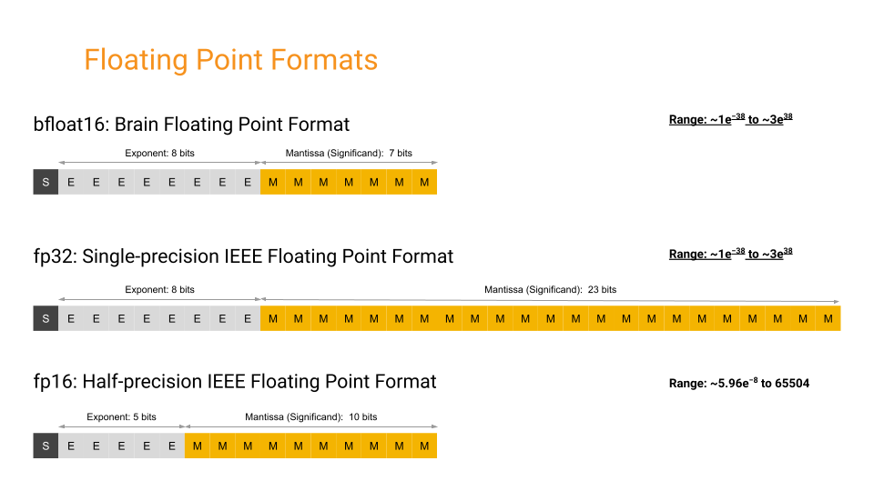
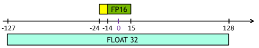
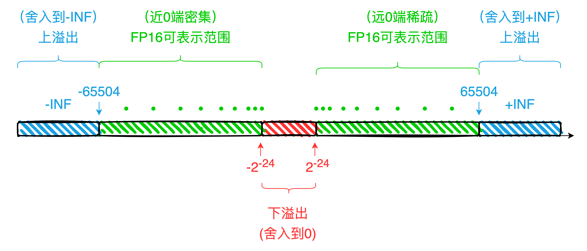

# 低精度算子支持开发规范

## 一、FP16 简介及精度问题

### 1.1 FP16 简介

FP16 指得是半精度浮点数表示,通常意义上其表示的为 Nvidia 提供的半精度浮点数表示方案， 也被 IEEE 754-2008 方案所采纳。此方案有别于 Intel 提供的半精度表示方案 BF16, BF16 的采用直接截断尾数的方式。FP16 较 BF16 拥有更长的尾数，但阶码较短。因此 FP16 可以提供较 BF16 更好的有效位长度，而 BF16 可以提供较 FP16 更广的动态范围。

**表 1-1 FP16 和 BF16 在近 1 端的精度表现**

| Format | Epsilon(ε) |
| ------ | ----------- |
| FP32   | 0.00000012  |
| FP16   | 0.00097656  |
| BF16   | 0.00781250  |

注：Epsilon 是各浮点表示形式下使得 1+ε >1 成立的最小浮点数值

**表 1-2 FP16、FP32 与 BF16 的动态范围**

| Format | Range             |
| ------ | ----------------- |
| FP32   | 1.4E-45～3.40E38  |
| FP16   | 5.96E−8 ~ 655    |
| BF16   | 9.2E−41～3.39E38 |

### 1.2 FP16 格式

FP16 格式采用 16 位对浮点数进行表示，其中尾数位为 10 位，阶码为 5 位，符号位 1 位。

BF16 格式采用 16 位对浮点数进行表示，其中尾数位为 7 位，阶码为 8 位，符号位 1 位。

FP16 格式与 BF16、FP32 格式的比较见表 1-3。

注意阶码部分采用移码表示，偏移值为 15。即 01111(2) = 0(10)。如此方便进行 FP16 数值大小比较。

**表 1-3 FP16 与 BF16、FP32 格式的对比**

| Format | Bits | Exponent | Fraction |
| ------ | ---- | -------- | -------- |
| FP32   | 32   | 8        | 23       |
| FP16   | 16   | 5        | 10       |
| BF16   | 16   | 8        | 7        |

注： 表中数字均表示相应项的位数长度





### 1.3 FP16/BF16 的数值范围及精度

浮点数的表示方案不在本节表述之内，请自行查阅，可参考[IEEE 754 相关介绍](https://en.wikipedia.org/wiki/IEEE_754)，在此不做赘述。FP16 可表示数据的最大正值为 65504，超过此数值会造成上溢出问题，舍入为+INF；最小正值约为 0.0000000596（非规格表示下），低于此数值会造成下溢出问题，舍入为+0。符号为负时以绝对值为参考，分别在满足各自情况下舍入为-INF 与-0。关于各个值的表示可见表 1-4 。

**表 1-4 FP16 的各特殊值表现**

| 二进制格式（符号 阶码 尾数） | 数值（十进制）    | 备注     |
| ---------------------------- | ----------------- | -------- |
| X 00000 0000000000           | ±0               |          |
| X 11111  0000000000          | ±INF             |          |
| X 11111  XXXXXXXXXX(非全 0)   | Nan               |          |
| 0 00000  0000000001          | 0.000000059604645 | 最小正值 |
| 0 11110 0000000000           | 65504             | 最大正值 |

注：X 指 0 或 1

**表 1-5 BF16 的各特殊值表现**

| 二进制格式                  | 数值（十进制）        | 备注     |
| --------------------------- | --------------------- | -------- |
| X 00000000 0000000          | ±0                   |          |
| X 11111111 0000000          | ±INF                 |          |
| X 11111111 XXXXXXX（非全 0） | NAN                   |          |
| 0 11111110 1111111          | $3.38953139×10^{38}$ | 最大正值 |
| 0 00000000 0000001          | 9.2 × 10−41         | 最小正值 |

注：X 指 0 或 1

通常意义上，FP16 可表示十进制下的三位有效数字格式($\log_{10}^{2^{11}}\sim3.311$) ，BF16 可表示十进制下的 2 位有效数字格式($\log_{10}^{2^{8}}\sim2.408$)，但按照浮点数的格式，其表示的绝对精度（精确到哪一数位）在各个区间（本质为各个阶码下并不相同)。

### 1.4 FP16/BF16 在计算中的精度问题

#### 1.4.1 溢出问题

1. FP16 的可表示范围较 FP32 等更小，容易触发上、下溢出问题。

关于 FP16 的上下溢出可以参考图 1-3。对于绝对值大于 65504 的数，触发上溢出会舍入到±INF；对于绝对值小于的数，触发下溢出舍入到 0，具体示例可参考表 1-6。

**表 1-6 FP16 格式下数据表示示例**



1. BF16 则因为阶码同 FP32 等长，因此并不容易出现上下溢出问题。

#### 1.4.2 舍入问题

1. FP16 格式的浮点数最多只能表示 3 位有效数字，所以各浮点区间的固定间隔都是 $Interval=Min*2^{-10}$。

   1. 因此当 $(\frac{累加值}{加数})>2^{11}$ 时，计算结果超过了 3 位有效数字；这会造成累加值最终无法被有效表示，累加结果会被舍入到累加值本身。

      1. 数值: $1+0.0001=1.0001$
      2. FP16: $1+0.0001=1.0001(无法表示->舍入->1)$
   2. FP32 格式拥有 7 位有效数字的表达效果，因此当 FP32 格式向 FP16 格式转化时，也会出现精度的舍入问题。

      1. FP32：0.1234567
      2. FP16：0.1235
2. BF16 格式的浮点数，在各个区间内的固定间隔是 $Interval=Min*2^{-7}$ ，故 BF16 相较于 FP16 的精度更低，也更容易出现 FP16 中所阐述的计算舍入和转换精度丢失的问题。

## 二、FP16/BF16 算子开发规范及示例代码

对于添加算子的流程具体可参考[算子添加流程](https://www.paddlepaddle.org.cn/documentation/docs/zh/dev_guides/api_contributing_guides/new_cpp_op_cn.html#python-api)，当我们向 Kernel 中添加 FP16 或 BF16 数据类型支持时，需要关注流程中如下 4 个部分。

### **2.1 查找对应的实现文件**

1. 检索对应 Kernel 的**头文件**

   1. 通常可以在 paddle/phi/kernels/ 目录下检索到与具体硬件无关的 Kernel 源代码文件及头文件。
   2. 检索方式。

      1. paddle/phi/kernels/ 目录下的文件名通常形式为 Kernel 名字 + '\_kernel' 。因此寻找某个具体 Kernel 的相关文件时，可以通过文件名快速查找到。如 Abs 的相关文件为 abs_kernel.h
      2. 可以利用 grep，或者 IDE 中带有的查找功能等对 Kernel 名本身进行搜索，定位具体的实现文件。
2. 检索对应 Kernel 的 **源文件** 。

   1. 按照需要提供支持的硬件，在相应的目录下查找对应 Kernel 的源文件。Kernel 的 GPU 版本实现代码存放在 paddle/phi/kernels/gpu/ 目录下，CPU 版本实现代码存放在 paddle/phi/kernels/cpu/ 目录下。

      1. FP16 数据类型一般在 GPU、XPU 上支持，可在 gpu、xpu 目录下的相关文件中添加 FP16 数据支持。
      2. BF16 数据类型一般在 CPU、GPU 上均有支持，可在 cpu、gpu 目录下的相关文件中添加 FP16 数据支持。
   2. 检索方式。

      1. 同 1.b.i 相同，采用文件名进行查找。如 Abs 相关文件为 abs_kernel.cu

### **2.2 引入所需的头文件**

为了使用 FP16/BF16 数据类型，需要在 GPU 源文件中引入下列头文件之一。其中 3 中定义了 FP16/BF16 数据类型，1 包含 2 包含 3。引入这些文件后，可以使用 phi::dtype::float16 来表示 FP16 数据类型，可以使用 phi::dtype::bfloat16 来表示 BF16 数据类型。

1. paddle/phi/core/device_context.h
2. paddle/phi/common/data_type.h
   1. FP16 数据类型：paddle/phi/common/float16.h
   2. BF16 数据类型：paddle/phi/common/bfloat16.h


### **2.3 在 Kernel 注册处添加 FP16/BF16 数据类型支持**

每一个 GPU 源文件的末尾，都有用来进行 Kernels 注册的宏 PD_REGISTER_KERNEL。如 Abs 的注册宏代码 2-1。

```cpp
PD_REGISTER_KERNEL(abs,
                   GPU,
                   ALL_LAYOUT,
                   phi::AbsKernel,
                   float,
                   double,
                   int,
                   int64_t,
                   phi::dtype::float16,
                   phi::dtype::complex<float>,
                   phi::dtype::complex<double>) {}
```

其中 phi::AbsKernel 是 abs 对应的具体 GPU 实现函数，在这之后的 float, double, int, ... 等为 abs 所支持的数据类型。因此要扩充 FP16 数据类型支持，需要在该处添加 phi::dtype::float16 数据类型。如果需要扩充 BF16 数据类型的支持，可添加 phi::dtype::bfloat16。

### **2.4 函数中添加 FP16/BF16 数据实现的特化支持**

在注册时添加 FP16/BF16 的数据类型支持后，在对应的实现中也应添加对应的支持。

在 Paddle 中，各个 Kernel 的实现采用模版函数实现，函数所支持的数据类型也以模版参数的形式进行传入。因此可以自行编译出支持 FP16/BF16 实现的代码。但为了提升 FP16/BF16 计算的精度，在涉及数学计算函数和归约计算时，需要我们对 FP16/BF16 算子进行特化。

#### 2.4.1 数学计算函数

数学计算函数是对于输入按照数学运算规则进行求解。Paddle 中的实现的大部分基本数学算子最终均归结于对 Math 库中的数学函数的调用。关于数学计算函数在 FP32 和 FP16 下的计算结果误差对比可参考附录。

##### 2.4.1.1 存在问题

1. 部分函数在 FP16/BF16 下相比 FP32 误差较高。典型的数学函数有 reciprocal、exp、expm1、tan、cosh、sinh、square、tanh_shrink。
2. 部分函数会产生较高的数值输出，FP16 容易造成上溢出。典型的数学函数有 exp、expm1、square、tan、atanh、cosh、sinh。

##### 2.4.1.2 特化实现代码

数学计算函数通常实现时， **需要将 FP16/BF16 格式转换为 FP32 格式，然后利用 FP32 作为输入计算数值结果，后再将结果转换为 FP16/BF16 格式作为输出** 。以 Cos 函数的实现为例。

```cpp
template <typename T, typename Context, typename Functor>
void ActivationGPUImpl(const Context& dev_ctx,
                       const DenseTensor& x,
                       DenseTensor* out,
                       const Functor& functor) {
  PADDLE_ENFORCE_NOT_NULL(out,
                          errors::NotFound("Output Out should not be nullptr"));
  dev_ctx.template Alloc<T>(out);
  std::vector<const DenseTensor*> ins = {&x};
  std::vector<DenseTensor*> outs = {out};
  funcs::ElementwiseKernel<T>(dev_ctx, ins, &outs, functor);
}

template <typename T>
struct CudaCosFunctor {
  using MPType = typename phi::dtype::MPTypeTrait<T>::Type;

  __device__ __forceinline__ T operator()(const T arg_x) const {
    MPType x = static_cast<MPType>(arg_x);
    return static_cast<T>(cos(x));
  }
};

template <typename T, typename Context>
void CosKernel(const Context& dev_ctx, const DenseTensor& x, DenseTensor* out) {
    funcs::CudaCosFunctor<T> functor;
    ActivationGPUImpl<T, Context, funcs::CudaCosFunctor<T>>(
        dev_ctx, x, out, functor);
}
```

* 关于 MPTypeTrait 的定义可参考附录

#### 2.4.2 归约计算

归约计算往往会设计大量元素参与运算，在这种情况下，很容易出现误差的累积，对于低精度计算并不友好。

##### 2.4.2.1 存在问题

具有较多输入参数的大规模归约场景对浮点数的精度影响较大，主要有两个方面。

1. 受限于 FP16/BF16 的低精度，大规模浮点归约的后期，容易形成“截断上界”，导致频繁的浮点数舍入行为。
2. 大规模浮点规约因为浮点计算次数较多，容易累积误差，使得误差越来越大。

##### 2.4.2.2 特化函数实现

最好 **使用 FP32 格式进行归约。** 以 add_n 为例，增添转换为 FP32 数据类型进行归约的一个建议的实现框架可以参考代码 2-3。

```cpp
template <class T>
__global__ void SumArrayCUDAKernel(
    T **in, T *out, int64_t N, size_t in_size, bool read_dst) {
  using MPType = typename phi::dtype::MPTypeTrait<T>::Type;

  int id = blockIdx.x * blockDim.x + threadIdx.x;
  while (id < N) {
    MPType total(read_dst ? static_cast<MPType>(out[id]) : static_cast<MPType>(0));
    for (int i = 0; i < in_size; ++i) {
      const T *tmp = in[i];
      if (tmp) {
        total += static_cast<MPType>(tmp[id]);
      }
    }
    out[id] = static_cast<T>(total);
    id += blockDim.x * gridDim.x;
  }
}

template <typename T, typename Context>
void AddNKernel(const Context &dev_ctx,
                const std::vector<const TensorBase *> &x,
                DenseTensor *out) {
  ...... //pre-dealing

    SumArrayCUDAKernel<T><<<grids, blocks, 0, stream>>>(in_array_data,
                                                        out->data<T>(),
                                                        lod_length,
                                                        in_data.size(),
                                                        dst_write | in_place);

    ...... //post-dealing
}
```

* 关于 MPTypeTrait 的定义可参考附录

## 三、附录

### 3.1 关于 MPTypeTrait 实现

MPtypeTrait 可以按照代码 3-1 进行实现，在传入 FP16/BF16 类型时，在类内部定义 FP32 类型。

源代码链接：[https://github.com/PaddlePaddle/Paddle/blob/develop/paddle/phi/common/amp_type_traits.h](https://github.com/PaddlePaddle/Paddle/blob/develop/paddle/phi/common/amp_type_traits.h)

```cpp
template <typename T>
class MPTypeTrait {
  public:
    using Type = T;
};

template <>
class MPTypeTrait<phi::dtype::float16> {
public:
  using Type = float;
};

template <>
class MPTypeTrait<phi::dtype::bfloat16> {
public:
  using Type = float;
};
```

### 3.2 关于__hisinf 和__hisnan

#### 3.2.1 __hisinf

```cpp
__device__ int __hisinf(const __half a)
```

定义：检查输入的 half 类型的参数是否为 INF

参数：half 类型，只读属性

返回：int 类型，其中 0 表示非 INF，1 表示+INF，-1 表示-INF

#### 3.2.2 __hisnan

```cpp
__device__ bool __hisnan ( const __half a )
```

定义：检查输入的 half 类型的参数是否为 NAN

参数：half 类型，只读属性

返回：bool 类型，true 表示是 NAN，false 表示非 NAN

### 3.3 基本数学函数在 FP32 和 FP16 的误差对比

**基本数学计算函数在 FP16 格式下与 FP32 格式下计算结果的误差**

| 算子                                                  | 最大绝对误差       | 最大相对误差      | 平均绝对误差      | 平均相对误差      |
| ----------------------------------------------------- | ------------------ | ----------------- | ----------------- | ----------------- |
| sin/cos/atan/acosh/asinh/tanh/acos/asin/atanh         | 0.000244~0.003905  | 0.000486~0.000517 | 5.85E-05~0.001138 | 0.000115~0.000179 |
| log2/log10/log1p                                      | 0.001953~0.0033905 | 0.000482~0.000487 | 0.0004~0.001258   | 0.000171~0.000175 |
| floor/round/relu/ceil                                 | 0                  | 0                 | 0                 | 0                 |
| sqrt/rsqrt                                            | 0.031227~0.062485  | 0.000488          | 0.002071~0.004158 | 0.000172~0.000179 |
| exp/expm1/tan/cosh/sinh/reciprocal/square/tanh_shrink | 1~16               | 0.000486~1        | 0.000786~0.378427 | 9.18E-05~0.082869 |
| logsigmoid/sigmoid/silu/softsign                      | 0.000701~0.002665  | 0.000486~0.000945 | 6.55E-05~9.96E-05 | 0.000104~0.000203 |

注：

* 其中我们将数学函数归类为三角函数，对数函数，舍入函数，指数函数进行了测试，其中误差相对较大的 exp/expm1（红色标注）函数等我们将其提取出来放在了一组，另外其他一些未归类的 sigmoid 等误差相对较低也同一成了一组
* 以上测试均基于 Paddle 的 Python 模块进行

### 3.4 基本数学函数在 FP32 和 FP16 的误差对比

1. FP32 转 FP16 的统计误差：

   1. 包含非规规格情况下($2^{-24}\sim65504$)：

   | 最大绝对误差 | 最大相对误差 | 平均绝对误差 | 平均相对误差 |
   | ------------ | ------------ | ------------ | ------------ |
   | 16           | 0.33289      | 0.38871      | 0.008834     |

   2. 仅规格化数情况下($2^{-14}\sim65504$)：

   | 最大绝对误差 | 最大相对误差 | 平均绝对误差 | 平均相对误差 |
   | ------------ | ------------ | ------------ | ------------ |
   | 16           | 0.00048      | 0.51876      | 0.000175     |

注：

* 绝对误差采用 FP32 和转换后的 FP16 的距离
* 相对误差采用 FP32 和转换后的 FP16 的距离相对于 FP32 的比重

1. FP32 转 FP16 理论上的最大相对误差可参考实数转 FP16 的情况
2. 实数转 FP16 在理论上单次的最大相对舍入误差（规格化下）: $2^{-11}$
3. 实数转 FP32 在理论上单次的最大相对舍入误差（规格化下）: $2^{-24}$
4. 实数转 FP16 在理论上单次的最大相对舍入误差（非规格化下）：0.5
5. 实数转 FP32 在理论上单次的最大相对舍入误差（非规格化下）：0.5

延伸：FP16 和 FP32 精度对比时，应当采用相对误差为度量尺度，小于最大相对误差，相对误差可以保证在一定的范围内，但是绝对误差的范围本身的差距太大了，并不适合做度量尺度。

## 四、参考文章

1、[半精度浮点格式](https://en.wikipedia.org/wiki/Half-precision_floating-point_format)

2、[IEEE 754 相关介绍](https://en.wikipedia.org/wiki/IEEE_754)

3、[BF16、FP16、FP32 比较](https://www.johndcook.com/blog/2018/11/15/bfloat16/)

4、[Nivdia 混合精度训练手册](https://docs.nvidia.com/deeplearning/performance/mixed-precision-training/index.html#framework)

5、[随机舍入介绍](https://nhigham.com/2020/07/07/what-is-stochastic-rounding/)

6、[Nvidia 半精度接口手册](https://docs.nvidia.com/cuda/cuda-math-api/group__CUDA__MATH____HALF__COMPARISON.html)
