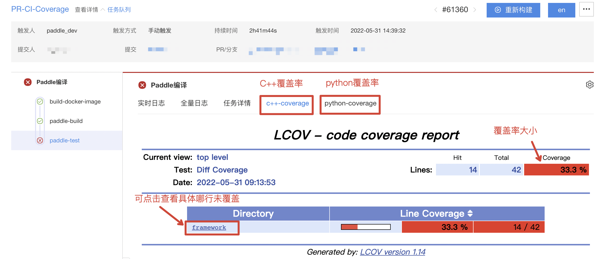
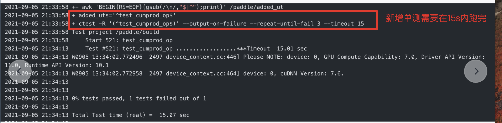

# API 单测开发及验收规范

## API 单测开发规范

API 单测的测试点需覆盖以下场景：

- **编程范式场景**：常规覆盖动态图和静态图的测试场景，如果仅支持其中一种，需要在设计文档 RFC 和 API 文档中体现。
- **硬件场景**：常规需覆盖 CPU、GPU 两种测试场景，如果仅支持其中一种，需要在设计文档 RFC 和 API 文档中体现。部分需覆盖 XPU、ARM 等硬件场景。
- **Tensor 精度场景**：常规需要支持 FP32、FP64，部分需支持 FP16、INT8、INT16、INT32、INT64 等。
- **参数组合场景**：常规覆盖 API 的全部入参，需要对全部入参进行参数有效性和边界值测试，同时可选参数也需有相应的测试覆盖。
- **计算精度**：需要保证前向计算、反向计算的精度正确性。
   - 前向计算：需要有通过 numpy 或其他数学方法实现的函数的对比结果。
   - 反向计算：需要复用现有单测框架反向计算验证方式保障反向正确性。注意：1）使用 Python 组合方式新增的 API，由于反向计算已经在各组合 API 单测中分别验证了，因此，该 API 的反向计算不要求验证。2）如现有单测框架无法满足要求，需要通过 numpy 推导或函数直接实现反向等方式验证反向计算结果正确性。
- **维度测试**：Paddle API 支持的最低维度为 0 维，单测中应编写相应的 0 维尺寸测试 case（若该 API 不支持 0 维，则无需编写该 case，但需在设计文档中说明理由）。可参考 [paddle.add 的 0 维尺寸测试 case](https://github.com/PaddlePaddle/Paddle/blob/develop/test/legacy_test/test_elementwise_add_op.py#L113-L133)
- **异常测试**：需对于参数异常值输入，应该有友好的报错信息及异常反馈。
- 除了以上，还需注意：
  - [OP 单测必须使用大尺寸输入](https://github.com/PaddlePaddle/Paddle/wiki/OP-test-input-shape-requirements)
  - [反向 Op 必须调用 check_grad](https://github.com/PaddlePaddle/Paddle/wiki/Gradient-Check-Is-Required-for-Op-Test)
  - [单测精度中 atol, rtol, eps, max_relative_error, 不允许自行放大阈值](https://github.com/PaddlePaddle/Paddle/wiki/OP-test-accuracy-requirements)
  - [OP 单测精度必须覆盖 float64](https://github.com/PaddlePaddle/Paddle/wiki/Upgrade-OP-Precision-to-Float64)
  - [Op 单测必须通过“编译时/运行时一致性检查”](https://github.com/PaddlePaddle/Paddle/wiki/Compile_vs_Runtime-Check-Specification)
  - [Sequence 相关 Op 单测中必须包含 batch size 为 1 的 LoDTensor 输入](https://github.com/PaddlePaddle/Paddle/wiki/It-is-required-to-include-LoDTensor-input-with-batch_size=1-in-sequence-OP-test)
  - [Sequence 相关 Op 单测中必须包含 instance size 为 0 的 LoDTensor 输入](https://github.com/PaddlePaddle/Paddle/wiki/It-is-required-to-include-LoDTensor-input-with-instance_size=0-in-sequence-OP-test)

## API 单测验收规范

API 单测的验收包含两方面，一方面是要验收是否符合上述的开发规范，另一方面要验收是否符合以下的通用规范：

- **命名规范**：
   - 单测中需要有充分的断言检查，单测 case 禁止使用 test1/test2 等无实际含义的命名方式。
   - API 单测命名、参数命名、暴露方式、代码目录层级需要与设计文档保持一致，可参考[API 通用设计文档](https://www.paddlepaddle.org.cn/documentation/docs/zh/develop/dev_guides/api_contributing_guides/api_design_guidelines_standard_cn.html)要求。
- **提交规范**：
   - 单元测试内容需要和开发代码放在同一个 PR 提交，后续修改也需要基于此 PR。
   - 对于 API 单测增强任务，需在 PR 描述中（可参考 [PR41191](https://github.com/PaddlePaddle/Paddle/pull/41191)）写明每个算子缺失的单测、问题定位及修复思路的简单描述
- **覆盖率规范**：PR 需要通过所有的 CI 验证，且`PR-CI-Coverage`需要满足新增代码行覆盖率达到 90%以上，覆盖率信息可通过 CI 详情页面查看，如下：

- **耗时规范**：
   - 新增单测的执行不允许超过 15s，`PR-CI-Coverage`有相应的检查，检查逻辑可见 `tools/check_added_ut.sh`。如果你新增的单测无法在 15s 内执行完成，可以尝试减少数据维度（可见[链接](https://github.com/PaddlePaddle/Paddle/pull/42267/commits/17344408d69f10e9fe5cf3200be1e381bc454694#diff-02f1ef59dfd03557054d7b20c9128ac9828735fc1f8be9e44d0587a96a06f685L236)）或通过在[CMakeLists.txt](https://github.com/PaddlePaddle/Paddle/blob/19a8f0aa263a8d0595f7e328077cc2f48eca547f/test/legacy_test/CMakeLists.txt#L564-L565)指定该单测的 Timeout 时间。如果你通过修改 Timeout 时间，你需要在 PR 描述中说明原因，同时会有相关同学 review 后进行 approve 后才能合入。原则上 Timeout 设定时间不能超过 120s。
   
   - 现有单测的修改原则上不允许超过 120s，`PR-CI-Coverage`有相应的检查，若有特殊情况可修改[CMakeLists.txt](https://github.com/PaddlePaddle/Paddle/blob/19a8f0aa263a8d0595f7e328077cc2f48eca547f/test/legacy_test/CMakeLists.txt#L564-L565)文件中该单测的 Timeout 时间，处理逻辑同上诉新增单测超过 15s 一致。
- **单测 retry 机制**：为提高单测执行效率，所有的单测均以一定的并发度执行，而这样的策略可能会引起单测随机挂。因此对失败的单测设定了 retry 机制，一共 retry 四次，如果成功率未达到 50%，就认为该单测可能存在问题，CI 失败。

## 交流与改进

PR 内容会有 Paddle 同学及 Paddle QA 同学进行 review，确保完整覆盖了待测功能点后，会给予 approved。

若 review 过程中发现测试缺失和遗漏的测试点，会通过 github 代码行 comment 的和 request changes 的方式交流改进，待 PR 修改完毕后给予 approved。

## 后续维护

代码成功 merge 后，如果发现对框架造成了严重影响，例如阻塞了某些方向的功能开发，或者和部分功能存在严重冲突导致 Bug，会对代码进行 Revert 并通知贡献者。待对 PR 修复后重新合入。
