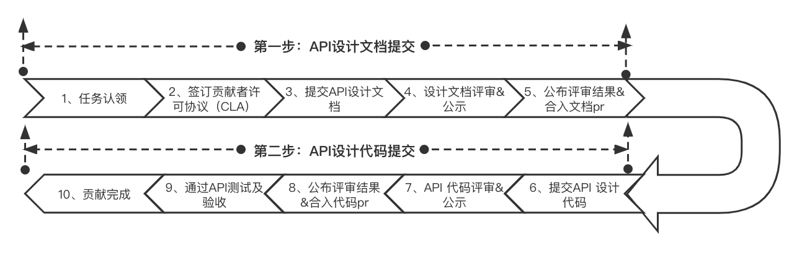

#####################
新增 API 开发&提交流程
#####################

飞桨作为一个开源项目，我们鼓励生态开发者为 paddlepaddle 贡献 API，当你想要为飞桨开发新 API 功能时，请遵守此 API 贡献流程在 Github 上完成文档设计和代码设计并提交至相应的 github 仓库。

API 贡献流程如下
::::::::::::::::::::::

流程介绍
::::::::::::::::::::::

**1、任务认领**

如果你想参与飞桨 API 开源贡献，可以在 Github paddle 项目上的 issue 区域进行任务认领，飞桨官网会发布一些新增 API 的任务，用户可以认领飞桨发布的任务，也可以产出自己的新增 API 想法，并按照此贡献流程提交设计文档。

**2、签订贡献者许可协议（CLA）**

对于你贡献的源代码，你将拥有合法的知识产权，为了保护你的权益，你需要先签署一份 `贡献者许可协议 <https://cla-assistant.io/PaddlePaddle/Paddle?pullRequest=39047>`_ 。

注意：当你签署完 CLA 后，我们才会继续对您提交的设计方案和实现代码进行评审及合入

**3、提交 API 设计文档**

API 设计文档的目的是为了社区开发者更容易的参与开源项目共建，开发者通过与飞桨专家和社区其他用户进行广泛的交流，完善设计方案和 pr 请求，在后续提交实现代码之前确保 API 设计方案与飞桨设计理念一致，也让后续代码评审及代码合入变得更加容易。

当你想要发起一个新增 API 的贡献时，你需要先对 API 进行开发设计，并提交一份 API 设计文档。设计时请遵守飞桨 API 设计及命名规范。同时，飞桨为大家提供了 API 设计文档撰写模版和 API 设计文档示例。完成后，你需要将设计文档提交至 Github 开发者社区仓库，并根据本地开发指南提交 PR。

此过程请参考相应的开发规范，并提交以下内容：

.. csv-table::
    :header: "提交内容", "参考文档", "提交位置"
    :widths: 10, 30,30

    "1、API 设计文档", "- `API 设计及命名规范 <./api_design_guidelines_standard_cn.html>`_
    - `API 设计文档模版 <https://github.com/PaddlePaddle/community/tree/master/rfcs/APIs/api_design_template.md>`_
    - `API 设计文档示例 <https://github.com/PaddlePaddle/community/blob/master/rfcs/APIs/20200301_api_design_for_quantile.md>`_ ", "`Github 开发者社区仓库 <https://github.com/PaddlePaddle/community/tree/master/rfcs/APIs>`_"

同时，飞桨为大家提供了 `API 设计文档模版 <https://github.com/PaddlePaddle/community/tree/master/rfcs/APIs/api_design_template.md>`_ 和 `API 设计文档 demo <https://github.com/PaddlePaddle/community/blob/master/rfcs/APIs/20200301_api_design_for_quantile.md>`_ ，你可以使用这份模版撰写 API 设计文档。完成后，你需要将设计文档提交至 `Github 开发者社区仓库 <https://github.com/PaddlePaddle/community/tree/master/rfcs/APIs>`_ ，并根据 `本地开发指南 <https://www.paddlepaddle.org.cn/documentation/docs/zh/develop/dev_guides/git_guides/local_dev_guide_cn.html>`_ 提交 PR。

**4、设计文档评审&公示**

飞桨专家对你提交的 API 设计文档进行审核，同时此文档也将接受来自开发者社区的评估，大家可以在 pr 评论区进行广泛的交流。开发者根据飞桨专家和其他开发者的反馈意见进行讨论并做出修改，最终评审通过后会在开源社区中同步。

如果你的 API 功能比较复杂，我们可能会在社区中针对 API 设计文档发起评审会议，会提前在 pr 评论区公布会议时间、会议地址、参会人、议题等内容，请及时关注 pr 中最新动态，你也可以在评论区自行申请评审会。会议结束后，我们会在 pr 中发出会议结论。

**5、公布评审结果&合入文档**

当设计文档评审&公示通过后，你的 API 设计文档将会合入至 `飞桨开发者社区仓库 <https://github.com/PaddlePaddle/community>`_ ，并在开源社区中同步。

**6、提交 API 实现代码**

当 API 设计文档合入后，开发者根据评审通过的 API 设计内容进行代码开发。此过程请参考相应的开发规范，并提交以下内容：

.. csv-table::
    :header: "提交内容", "参考文档", "提交位置"
    :widths: 10, 30,30

    "1、API 实现代码", "- `API 设计及命名规范 <./api_design_guidelines_standard_cn.html>`_
    - Python API 开发指南（请期待）
    - `C++ API 开发指南 <./new_cpp_op_cn.html>`_
    ", "`Github 飞桨训练框架仓库 <https://github.com/PaddlePaddle/Paddle>`_"
    "2、API 英文文档", "- `API 文档书写规范 <https://github.com/PaddlePaddle/docs/wiki/%E9%A3%9E%E6%A1%A8API%E6%96%87%E6%A1%A3%E4%B9%A6%E5%86%99%E8%A7%84%E8%8C%83>`_", "`Github 飞桨训练框架仓库 <https://github.com/PaddlePaddle/Paddle>`_"
    "3、API 中文文档", "- `API 文档书写规范 <https://github.com/PaddlePaddle/docs/wiki/%E9%A3%9E%E6%A1%A8API%E6%96%87%E6%A1%A3%E4%B9%A6%E5%86%99%E8%A7%84%E8%8C%83>`_", "`Github 飞桨文档仓库 <https://github.com/PaddlePaddle/docs>`_"
    "4、API 单测代码", "- `API 验收标准 <./api_accpetance_criteria_cn.html>`_", "`Github 飞桨训练框架仓库 <https://github.com/PaddlePaddle/Paddle>`_"

当开发者完成以上代码设计后，需要将代码提交至 `Github 飞桨训练框架仓库 <https://github.com/PaddlePaddle/Paddle>`_ ，并根据 `本地开发指南 <https://www.paddlepaddle.org.cn/documentation/docs/zh/develop/dev_guides/git_guides/local_dev_guide_cn.html>`_ 提交 PR、准备接受社区的评审。

**7、实现代码评审&公示**

飞桨官方会及时安排专家进行 API 代码审核，代码也将接受来自开发者社区的评审，开发者可以在 pr 评论区进行广泛的交流，开发者对飞桨专家和其他开发者的反馈意见进行讨论并做出修改，最终评审通过后会在开源社区中同步。

如果你的 API 功能比较复杂，官方可能会在社区中针对 API 实现代码发起评审会议，会提前在 pr 评论区公布会议时间、会议地址、参会人、议题等内容，请及时关注 pr 中最新动态，你也可以在评论区自行申请评审会。会议结束后，我们会在 pr 中发出会议结论。

**8、公布评审结果&合入代码**

当设计文档评审&公示通过后，官方会在开源社区中同步，你的 API 实现代码将会合入至 `Github 飞桨训练框架仓库 <https://github.com/PaddlePaddle/Paddle>`_ 。

**9、通过 API 测试及验收**

当你的代码合入 `Github 飞桨训练框架仓库 <https://github.com/PaddlePaddle/Paddle>`_ 后，官方会对你的代码进行集成测试，并通知你测试结果。如果测试通过，恭喜你贡献流程已经全部完成；如果测试不通过，我们会联系你进行代码修复，请及时关注 github 上的最新动态；

注意：代码合入 develop 分之后的第二天你可以从官网下载 develop 编译的安装包体验此功能。飞桨后续也会将此功能纳入正式版的发版计划～

**10、贡献完成**

感谢您的贡献！

..  toctree::
    :hidden:

    read_before_contributing_cn.md
    new_python_api_cn.md
    new_cpp_op_cn.md
    api_design_guidelines_standard_cn.md
    api_docs_guidelines_cn.md
    api_accpetance_criteria_cn.md
