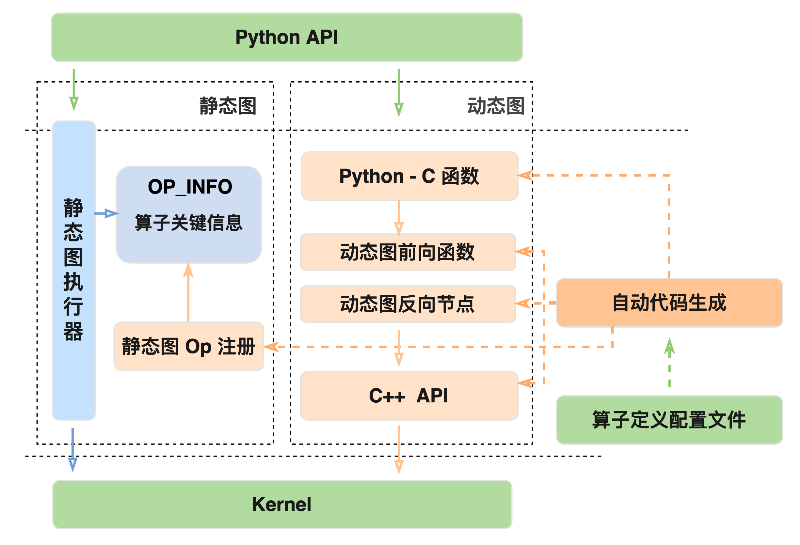

# C++ 算子开发指南

> 注：飞桨算子的开发范式正处在重构升级后的上线初期，如果在开发过程中遇到问题欢迎通过[Issue](https://github.com/PaddlePaddle/Paddle/issues)向我们反馈。

## 1. 概念简介

本教程对新增算子的方法进行介绍，首先新增一个算子大概需要以下几个步骤：

1. 新增算子描述及定义：描述前反向算子的输入、输出、属性，实现InferMeta函数
2. 新增算子Kernel：实现算子在各种设备上的计算逻辑
3. 封装Python API：封装Python端调用算子的接口
4. 添加单元测试：验证新增算子的正确性

以上4个步骤添加的文件，在Paddle中的位置如下（假设算子名为`xxx`）：

<table>
<thead>
<tr>
<th>内容</th>
<th>新增文件位置</th>
</tr>
</thead>
<tbody>
<tr>
<td>算子描述及定义</td>
<td>paddle/phi/api/yaml/api.yaml & paddle/phi/api/yaml/backward.yaml</td>
</tr>
<tr>
<td>算子InferMeta</td>
<td>paddle/phi/infermeta目录下的相应文件中</td>
</tr>
<tr>
<td>算子kernel</td>
<td>paddle/phi/kernels/xxx_kernel.h & xxx_kernel.cc & xxx_grad_kernel.h & xxx_grad_kernel.cc（一般情况）</td>
</tr>
<tr>
<td>Python API</td>
<td>python/paddle目录下的相应子目录中</td>
</tr>
<tr>
<td>单元测试</td>
<td>python/paddle/fluid/tests/unittests/test_xxx_op.py</td>
</tr>
</tbody>
</table>

接下来，我们以Trace操作，计算输入 Tensor 在指定平面上的对角线元素之和，并输出相应的计算结果，即 [trace](../../api/paddle/trace_cn.html#trace) 为例来介绍如何新增算子。

## 2. 新增算子描述及定义

算子描述及定义是定义运算的基本属性，主要包括算子的输入、输出以及各项非计算逻辑的配置，这些都是设备无关的。

### 2.1 算子 YAML 文件配置
我们在 [`paddle/phi/api/yaml/api.yaml`](https://github.com/PaddlePaddle/Paddle/blob/develop/paddle/phi/api/yaml/api.yaml) 和 [`paddle/phi/api/yaml/backward.yaml`](https://github.com/PaddlePaddle/Paddle/blob/develop/paddle/phi/api/yaml/backward.yaml) 文件中对算子进行描述及定义，在框架编译时会根据 YAML 文件中的配置自动生成 C++ 端的相关代码接口以及内部实现（详见 [Paddle 基于 YAML 配置的算子代码自动生成](new_cpp_op_cn.html#paddleyaml)），下面主要以 Trace 为例介绍算子的 YAML 配置规则：

[`paddle/phi/api/yaml/api.yaml`](https://github.com/PaddlePaddle/Paddle/blob/develop/paddle/phi/api/yaml/api.yaml)：
```yaml
- api : trace
  args : (Tensor x, int offset = 0, int axis1 = 0, int axis2 = 1)
  output : Tensor(out)
  infer_meta :
    func : TraceInferMeta
  kernel :
    func : trace
  backward : trace_grad
```
[`paddle/phi/api/yaml/backward.yaml`](https://github.com/PaddlePaddle/Paddle/blob/develop/paddle/phi/api/yaml/backward.yaml)：
```yaml
- backward_api : trace_grad
  forward : trace (Tensor x, int offset, int axis1, int axis2) -> Tensor(out)
  args : (Tensor x, Tensor out_grad, int offset, int axis1, int axis2)
  output : Tensor(x_grad)
  infer_meta :
    func : UnchangedInferMeta
    param : [x]
  kernel :
    func : trace_grad
    data_type : x
  no_need_buffer : x
```

`api.yaml`和`backward.yaml`分别对算子的前向和反向进行配置，首先`api.yaml`中前向算子的配置规则如下：
<table>
<thead>
<tr>
<th>配置项</th>
<th>配置内容及规则</th>
</tr>
</thead>
<tbody>
<tr>
<td>api</td>
<td>算子名称，与该算子Python API函数名相同（命名方式为：全小写+下划线），示例中为trace</td>
</tr>
<tr>
<td>args</td>
<td>算子输入参数，与该算子Python API函数的输入参数对应（当前支持的输入数据类型包括：Tensor, Tensor[], float, double, bool, int, int64_t, int[], int64_t[], str, Place, DataType, DataLayout, IntArray, Scalar）。我们一般称这里Tensor类型的参数为Input(输入)，非Tensor类型的参数为Attribute(属性)<br>
注：Tensor[]表示Tensor数组；IntArray为int类型数组，主要用于表示shape,index和axes等类型数据，可以直接使用Tensor或者普通整型数组构造，目前仍在测试阶段，如非必要暂不建议使用；Scalar表示标量，可以支持不同的普通数据类型
</td>
</tr>
<tr>
<td>output</td>
<td>算子输出类型（目前支持Tensor和Tensor[]类型），多个输出间用逗号“,”分隔开。可以使用”()”选择性标记输入的名字，如未标记默认为'out'<br>
注：当返回类型为Tensor[]时，由于数组的size要在kernel执行前推导完成，所以需要在Tensor[]后的'{}'内通过表达式指定返回数组的size，如：Tensor[](out){input.size()}
</td>
</tr>
<tr>
<td>infer_meta</td>
<td>InferMeta函数负责根据输入变量推断返回Tensor的维度与类型，这里是对算子使用的InferMeta函数进行配置</td>
</tr>
<tr>
<td>infer_meta:func</td>
<td>调用的InferMeta函数，这里trace调用的是TraceInferMeta函数</td>
</tr>
<tr>
<td>infer_meta:param</td>
<td>InferMeta函数的输入参数，可以对args中的参数进行选择传入，未配置则默认传入args中的所有参数。示例中未配置本项，所以传入的参数为[x, offset, axis1, axis2]。output项中的参数作为输出无需配置会自动传入InferMeta函数中</td>
</tr>
<tr>
<td>kernel</td>
<td>算子的计算Kernel配置</td>
</tr>
<tr>
<td>kernel:func</td>
<td>算子对应kernel函数的注册名</td>
</tr>
<tr>
<td>kernel:param</td>
<td>kernel函数的输入参数，配置规则与InferMeta函数的param配置项相同</td>
</tr>
<tr>
<td>kernel:data_type</td>
<td>根据指定参数推导调用kernel的data_type(对应kernel函数的模板参数'T')，默认不进行配置，会根据输入Tensor自动进行推导。如果kernel的data_type类型由某个输入参数（Tensor或者DataType参数），需要将该参数的变量名填入该项。示例中未配置则kernel的data_type由输入变量'x'决定</td>
</tr>
<td>kernel:backend</td>
<td>根据指定参数来选择调用kernel的Backend(Kernel执行的具体设备，如CPU、GPU等)，默认不进行配置，会根据输入Tensor自动进行推导。如果kernel执行的backend类型由某个输入参数（Tensor或者Backend参数）决定，需要将该参数的变量名填入该项。示例中未配置则kernel执行的Backend与输入变量'x'的Backend相同</td>
</tr>
<tr>
<td>backward</td>
<td>算子对应的反向算子名称，如果没有反向则不需要配置，示例中trace算子的反向为trace_grad</td>
</tr>
<tr>
<td colspan="2" style="text-align: center;"><b>特殊配置项</b>（目前特殊配置项还处于不稳定阶段，后续可能会有调整更新）</td>
</tr>
<tr>
<td>optional</td>
<td>指定输入Tensor为可选输入，用法可参考dropout中seed_tensor(python/paddle/utils/code_gen/legacy_api.yaml中)</td>
</tr>
<tr>
<td>inplace</td>
<td>算子对指定的输入做原位处理并作为输出结果返回，使用格式：(x -> out)，具体用法可参考relu算子<br>
特殊规则：如果api中算子名称有'_'后缀则只生成支持inplace功能的接口，如果算子名称没有'_'后缀，则会同时生成支持inplace操作的接口(自动添加'_'后缀)和不支持inplace的普通接口共两套接口
</td>
</tr>
<tr>
<td>view</td>
<td>与inplace机制类似，区别在于view模式返回的结果只是与输入共享内存，并不是输入Tensor变量本身，使用格式：(x -> out)，具体用法可参考reshape算子</td>
</tr>
<tr>
<td>intermediate</td>
<td>标记前向计算中输出的用于反向计算的中间变量，不会出现在Python API的返回结果中，相关设计正在完善中，新增算子时不建议使用</td>
</tr>
<tr>
<td>invoke</td>
<td>复用已有的算子接口或实现自定义的C++ API，配置时以函数调用的形式配置即可，使用invoke时则不需要配置infer_meta和kernel。<br>
a. 如果是复用已有算子，需要被复用的算子为前向算子且两者的返回值类型相同，可参考zeros_like算子<br>
b. 如果是实现自定义的C++ API，需要在'paddle/phi/api/lib/api_custom_impl.h'声明自定义实现函数并在'paddle/phi/api/lib/api_custom_impl.cc'中进行实现，具体可参考embedding算子</td>
</tr>
</tbody>
</table>


`backward.yaml`中反向算子的配置规则如下：
<table>
<thead>
<tr>
<th>配置项</th>
<th>配置内容及规则</th>
</tr>
</thead>
<tbody>
<tr>
<td>backward_api</td>
<td>反向算子名称，一般命名方式为：前向算子名称+'_grad'，二阶算子则为前向算子名称+'_double_grad'</td>
</tr>
<tr>
<td>forward</td>
<td>对应前向算子的名称、参数、返回值，需要与api.yaml中前向算子配置一致</td>
</tr>
<tr>
<td>args</td>
<td>反向算子输入参数, 示例中'x'表示将前向的'x'变量输入到反向，'out_grad'表示前向输出'out'对应的反向梯度<br>
约束条件1：所有参数需要在forward配置项的参数中（输入、输出以及输出对应的反向梯度）找到对应（根据变量名匹配）<br>
约束条件2：反向输入参数需要以：a.前向输入Tensor b.前向输出Tensor c.前向输出Tensor的反向梯度 d.前向非Tensor类型属性变量(Attribute) 的顺序排列，反向计算中不需要使用的前向变量无须添加<br>
</td>
</tr>
<tr>
<td>output</td>
<td>反向算子输出，顺序需要与前向输入Tensor一致，比如前向输入(Tensor x, Tensor y)，则反向输出必须为Tensor(x_grad), Tensor(y_grad)</td>
</tr>
<tr>
<td>infer_meta</td>
<td>与前向配置规则相同</td>
</tr>
<tr>
<td>kernel</td>
<td>与前向配置规则相同</td>
</tr>
<tr>
<td>backward</td>
<td>反向算子对应的更高阶反向算子名称，如一阶反向算子的反向为二阶反向算子</td>
</tr>
<tr>
<td colspan="2" style="text-align: center;"><b>特殊配置项（目前特殊配置项还处于不稳定阶段，后续可能会有调整更新）</b></td>
</tr>
<tr>
<td>no_need_buffer</td>
<td>可选配置，标记的Tensor变量在前向运行完成后，持有的内存或显存会被释放，以减少训练过程中的内存使用。trace_grad由于反向算子只需要前向变量'x'的维度信息，不需要内存数据，所以可以标记为no_need_buffer提前释放内存<br>
注意：由于Tensor内存被释放后会影响dtype接口的使用，所以需要在kernel的data_type配置项中指定其他的Tensor来推导kernel的data_type</td>
</tr>
<tr>
<td>optional</td>
<td>与前向配置规则相同</td>
</tr>
<tr>
<td>inplace</td>
<td>与前向配置规则相同</td>
</tr>
</tbody>
</table>

### 2.2 实现InferMeta函数

`InferMeta`函数是根据输入参数，推断算子输出Tensor基本信息的函数，推断的信息包括输出Tensor的`shape`、`data type`及`data layout`，同时它也承担了检查输入数据维度、类型等是否合法的功能。

[TraceOp的InferMeta函数](https://github.com/PaddlePaddle/Paddle/blob/befa78ea3fa9d0dae096a7de91f626b0c31daee8/paddle/phi/infermeta/unary.cc#L721) 实现如下：

```cpp
void TraceInferMeta(
    const MetaTensor& x, int offset, int axis1, int axis2, MetaTensor* out) {
  int dim1 = axis1;
  int dim2 = axis2;

  auto x_dims = x.dims();

  int dim1_ = dim1 < 0 ? x_dims.size() + dim1 : dim1;
  int dim2_ = dim2 < 0 ? x_dims.size() + dim2 : dim2;

  PADDLE_ENFORCE_GE(
      x_dims.size(),
      2,
      phi::errors::OutOfRange(
          "Input's dim is out of range (expected at least 2, but got %ld).",
          x_dims.size()));
  PADDLE_ENFORCE_LT(
      dim1_,
      x_dims.size(),
      phi::errors::OutOfRange(
          "Attr(dim1) is out of range (expected to be in range of [%ld, "
          "%ld], but got %ld).",
          -(x_dims.size()),
          (x_dims.size() - 1),
          dim1));
  PADDLE_ENFORCE_LT(
      dim2_,
      x_dims.size(),
      phi::errors::OutOfRange(
          "Attr(dim2) is out of range (expected to be in range of [%ld, "
          "%ld], but got %ld).",
          -(x_dims.size()),
          (x_dims.size() - 1),
          dim2));
  PADDLE_ENFORCE_NE(
      dim1_,
      dim2_,
      phi::errors::InvalidArgument("The dimensions should not be identical "
                                   "%ld vs %ld.",
                                   dim1,
                                   dim2));

  auto sizes = vectorize(x_dims);
  if (x_dims.size() == 2) {
    sizes.clear();
    sizes.push_back(1);
  } else {
    sizes.erase(sizes.begin() + std::max(dim1_, dim2_));
    sizes.erase(sizes.begin() + std::min(dim1_, dim2_));
  }
  out->set_dims(phi::make_ddim(sizes));
  out->set_dtype(x.dtype());
}
```

其中，`MetaTensor`是对底层异构Tensor的抽象封装，仅支持对底层Tensor的维度、数据类型、布局等属性进行读取和设置，具体方法请参考 [meta_tensor.h](https://github.com/PaddlePaddle/Paddle/blob/develop/paddle/phi/core/meta_tensor.h)。

**InferMeta的实现位置**

InferMeta的文件放置规则（以Tensor输入个数为判定标准）：

- `nullary.h`：没有输入Tensor参数的函数
- `unary.h`：仅有一个输入Tensor参数的函数
- `binary.h`：有两个输入Tensor参数的函数
- `ternary.h`：有三个输入Tensor参数的函数
- `multiary.h`：有三个以上输入Tensor或者输入为`vector<Tensor>`的函数
- `backward.h`：反向op的InferMeta函数一律在此文件中，不受前序规则限制

**InferMeta的编译时与运行时**

在我们的静态图网络中，`InferMeta`操作在[编译时(compile time)和运行时(run time)](https://github.com/PaddlePaddle/FluidDoc/blob/release/1.2/doc/fluid/getstarted/Developer's_Guide_to_Paddle_Fluid.md#%E8%AE%A9%E6%88%91%E4%BB%AC%E5%9C%A8fluid%E7%A8%8B%E5%BA%8F%E5%AE%9E%E4%BE%8B%E4%B8%AD%E5%8C%BA%E5%88%86%E7%BC%96%E8%AF%91%E6%97%B6%E5%92%8C%E8%BF%90%E8%A1%8C%E6%97%B6)都会被调用，在compile time时，由于真实的维度未知，框架内部用-1来表示，在run time时，用实际的维度表示，因此维度的值在compile time和 run time时可能不一致，如果存在维度的判断和运算操作，InferMeta就需要区分compile time 和 run time。

对于此类InferMeta函数，需要在函数声明的参数列表末尾增加 `MetaConfig` 参数，例如：

```
void ConcatInferMeta(const std::vector<MetaTensor*>& x,
                     const Scalar& axis_scalar,
                     MetaTensor* out,
                     MetaConfig config = MetaConfig());
```

然后在函数体中，使用 `config.is_runtime` 判断出于编译时还是运行时。

具体地，以下两种情况需要区分compile time和 run time。

1. 检查

    如以下代码：

    ```cpp
    int i = xxx;
    PADDLE_ENFORCE_GT(x.dims()[i] , 10)
    ```

    在compile time的时候，x.dims()[i]可能等于-1，导致这个PADDLE_ENFORCE_GT报错退出。

    如果用了以下paddle中定义的宏进行判断：

    ```cpp
    PADDLE_ENFORCE_EQ (x.dims()[i] , 10)
    PADDLE_ENFORCE_NE (x.dims()[i] , 10)
    PADDLE_ENFORCE_GT (x.dims()[i] , 10)
    PADDLE_ENFORCE_GE (x.dims()[i] , 10)
    PADDLE_ENFORCE_LT (x.dims()[i] , 10)
    PADDLE_ENFORCE_LE (x.dims()[i] , 10)
    ```

    都需要注意区分compile time和run time

2. 运算

    如以下代码:
    ```cpp
    auto x_dim = x.dims();
    int i = xxx;
    y_dim[0] = x_dim[i] + 10
    ```

    在compile time的时候，x_dim[i]可能等于-1，得到的 y_dim[0] 等于 9，是不符合逻辑的

    如果用到了类似以下的运算操作

    ```cpp
    y_dim[i] = x_dim[i] + 10
    y_dim[i] = x_dim[i] - 10
    y_dim[i] = x_dim[i] * 10
    y_dim[i] = x_dim[i] / 10
    y_dim[i] = x_dim[i] + z_dim[i]
    ```

    都需要区分compile time和run time

3. 处理的标准

    - 检查： compile time的时候不判断维度等于-1的情况，但在runtime的时候检查
    - 运算： -1和其他数做任何运算都要等于-1

4. 参考代码

    （1） 判断的实现方法可以参考 [SigmoidCrossEntropyWithLogitsInferMeta](https://github.com/PaddlePaddle/Paddle/blob/cd28cddbfb5f5643947291e9a640ecd414dc8dae/paddle/phi/infermeta/binary.cc#L650)，SigmoidCrossEntropyWithLogits 要求X和labels的两个输入，除了最后一维以外，其他的维度完全一致

    ```cpp
      bool check = true;
      if ((!config.is_runtime) &&
          (phi::product(x_dims) <= 0 || phi::product(labels_dims) <= 0)) {
        check = false;
      }

      if (check) {
        PADDLE_ENFORCE_EQ(
            phi::slice_ddim(x_dims, 0, rank),
            phi::slice_ddim(labels_dims, 0, rank),
            phi::errors::InvalidArgument(
                "Input(X) and Input(Label) shall have the same shape "
                "except the last dimension. But received: the shape of "
                "Input(X) is [%s], the shape of Input(Label) is [%s].",
                x_dims,
                labels_dims));
      }
    ```

    （2） 运算的实现可以参考 [ConcatInferMeta](https://github.com/PaddlePaddle/Paddle/blob/0604df9e70dfe7be8a21df6a80d9fa6d4939bd9d/paddle/phi/infermeta/multiary.cc#L323)，concat在InferShape判断时，调用`ComputeAndCheckShape`，除了进行concat轴之外，其他的维度完全一致；在生成output的维度时，把concat轴的维度求和，其他的维度和输入保持一致。

    ```cpp
      const size_t n = inputs_dims.size();
      auto out_dims = inputs_dims[0];
      size_t in_zero_dims_size = out_dims.size();
      for (size_t i = 1; i < n; i++) {
        PADDLE_ENFORCE_EQ(
            inputs_dims[i].size(),
            out_dims.size(),
            phi::errors::InvalidArgument("The shape of input[0] and input[%d] "
                                        "is expected to be equal."
                                        "But received input[0]'s shape = "
                                        "[%s], input[%d]'s shape = [%s].",
                                        i,
                                        inputs_dims[0],
                                        i,
                                        inputs_dims[i]));
        for (size_t j = 0; j < in_zero_dims_size; j++) {
          if (j == axis) {
            if (is_runtime) {
              out_dims[axis] += inputs_dims[i][j];
            } else {
              if (inputs_dims[i][j] == -1 || out_dims[j] == -1) {
                out_dims[axis] = -1;
              } else {
                out_dims[axis] += inputs_dims[i][j];
              }
            }
          } else {
            bool check_shape =
                is_runtime || (inputs_dims[0][j] > 0 && inputs_dims[i][j] > 0);
            if (check_shape) {
              // check all shape in run time
              PADDLE_ENFORCE_EQ(inputs_dims[0][j],
                                inputs_dims[i][j],
                                phi::errors::InvalidArgument(
                                    "The %d-th dimension of input[0] and input[%d] "
                                    "is expected to be equal."
                                    "But received input[0]'s shape = "
                                    "[%s], input[%d]'s shape = [%s].",
                                    j,
                                    i,
                                    inputs_dims[0],
                                    i,
                                    inputs_dims[i]));
            }
            if (!is_runtime && out_dims[j] == -1 && inputs_dims[i][j] > 0) {
              out_dims[j] = inputs_dims[i][j];
            }
          }
        }
      }
    ```

## 3. 新增算子Kernel

新增算子Kernel在 `paddle/phi/kernels` 目录中完成

### 3.1 kernels目录结构

`paddle/phi/kernels` 基本目录结构如下

```
paddle/phi/kernels
./ (根目录放置设备无关的kernel声明和实现)
./cpu（仅放置cpu后端的kernel实现）
./gpu（仅放置gpu后端的kernel实现）
./xpu（仅放置百度kunlun后端的kernel实现）
./gpudnn
./funcs（放置一些支持多设备的、在多个kernel中使用的公共functor和functions）
...
```

一般情况下，新增算子仅需要关注kernels根目录及kernel所支持设备的子目录即可：

- kernels 根目录，放置设备无关的kernel.h和kernel.cc
  - 例如，一个kernel除了一些简单的设备无关的C++逻辑，关键计算逻辑均是复用已有的phi kernel函数实现的，那么这个kernel实现是天然能够适配所有设备及后端的，所以它的声明和实现均直接放置到kernels目录下即可
- kernels下一级子目录，原则上按照backend分类按需新建，放置特定后端的kernel实现代码

下面给出两种典型kernel新增时文件放置位置的说明：

1. 新增与设备无关的Kernel

    该类Kernel 实现与所有硬件设备无关，只需要一份代码实现，可参考reshape kernel。其新增文件及目录包括：

    - `paddle/phi/kernels/xxx_kernel.h`
    - `paddle/phi/kernels/xxx_kernel.cc`

    如果是反向kernel，则使用 `grad_kernel` 后缀即可：

    - `paddle/phi/kernels/xxx_grad_kernel.h`
    - `paddle/phi/kernels/xxx_grad_kernel.cc`

2. 新增与设备相关、且CPU&GPU分别实现的Kernel

    还有部分Kernel的实现，CPU 和GPU 上逻辑不同，此时没有共同实现的代码，需要区分CPU和GPU 硬件。
    CPU 的实现位于`paddle/phi/kernels/cpu` 目录下； GPU的实现位于`paddle/phi/kernels/gpu` 下，可参考dot kernel，cast kernel等。其新增文件及目录包括：

    - `paddle/phi/kernels/xxx_kernel.h`
    - `paddle/phi/kernels/cpu/xxx_kernel.cc`
    - `paddle/phi/kernels/gpu/xxx_kernel.cu`

    相应地，反向kernel新增文件为：

    - `paddle/phi/kernels/xxx_grad_kernel.h`
    - `paddle/phi/kernels/cpu/xxx_grad_kernel.cc`
    - `paddle/phi/kernels/gpu/xxx_grad_kernel.cu`

### 3.2 Kernel 写法

#### 3.2.1 声明 Kernel 函数

- 以trace op为例，首先在`paddle/phi/kernels`目录下新建 [`trace_kernel.h`](https://github.com/PaddlePaddle/Paddle/blob/develop/paddle/phi/kernels/trace_kernel.h) 文件，用于放置前向Kernel函数声明。

> 注：Kernel函数声明的参数列表原则上与Python API参数列表一致

```
template <typename T, typename Context>
void TraceKernel(const Context& dev_ctx,
                 const DenseTensor& x,
                 int offset,
                 int axis1,
                 int axis2,
                 DenseTensor* out);
```

> 注：所有的kernel声明，统一放在namespace phi中，缩短函数的调用前缀使调用写法更加简洁

说明如下：

1. 模板为固定写法，第一个模板参数为数据类型`T`，第二个模板参数为设备上下文`Context`，`template <typename T, typename Context>`
2. 函数命名：Kernel 的命名统一加Kernel 后缀。即：Kernel名称+Kernel 后缀，驼峰式命名，例如：AddKernel
3. 参数顺序：Context， InputTensor …, Attribute …, OutTensor* 。即：第一位参数为Context， 后边为输入的Tensor， 接着是输入的属性参数， 最后是输出的Tensor的指针参数。如果Kernel没有输入Tensor 或者没有属性参数，略过即可
2. 第1个函数参数，类型为 `const Context&` 的dev_ctx
3. 第2个函数参数，输入Tensor，类型一般为 `const DenseTensor&`
4. 第3-5个函数参数，均为attribute（根据具体的含义，选择特定的int，float，vector<int>等类型），多个attribute 可以参考python端API定义的顺序，变量命名对齐python api
5. 第6个函数参数，输出Tensor，类型一般为`DenseTensor*`，多个output 可以参考python端API定义的顺序， 变量命名对齐python api

> **特殊情况说明：**
> 1. **特殊模板参数**：对于某些Kernel （如reshape ，copy），这些kernel不关注数据类型T， 可以省去第一个模板参数，即为：`template <typename Context>`
> 2. **特殊输入类型**：对于某些特殊Kernel （如concat 和split kernel）的部分输入或输出是数组类型的DenseTensor, 此时输入类型为：`const std::vector<const DenseTensor*>&`; 输出类型为：`std::vector<DenseTensor*>`

#### 3.2.2 实现 Kernel 函数

**复用已有Kernel实现设备无关Kernel函数**

由于目前的Kernel复用机制为新推出的功能，暂未对已有算子进行升级改造，所以这里我们以一个不在框架中的linear算子(out = x * w + b)为例来介绍复用已有Kernel实现设备无关Kernel函数。（linear kernel 的实现源码需要放置在`paddle/phi/kernels/linear_kernel.cc`）

`LinearKernel` 的实现代码如下：

```cpp
#include ...
#include "paddle/phi/kernels/elementwise_add_kernel.h"
#include "paddle/phi/kernels/elementwise_multiply_kernel.h"

template <typename T, typename Context>
void LinearKernel(const Context& dev_ctx,
                  const DenseTensor& x,
                  const DenseTensor& w,
                  const DenseTensor& b,
                  DenseTensor* out) {
  dev_ctx.template Alloc<T>(out);         // 为 out 分配内存
  MultiplyKernel<T>(dev_ctx, x, w, out);  // 复用 MultiplyKernel
  AddKernel<T>(dev_ctx, out, b, out);     // 复用 AddKernel
}
```
复用Kernel的流程包括：
1. 在源文件中 include 要复用 Kernel 的头文件
2. 直接调用相应的Kernel函数进行复用

注意：设备无关Kernel实现时计算逻辑部分只能复用现有Kernel或设备无关的Functor，不能使用设备相关的语法或者函数接口（如cuda、cudnn等）进行计算处理

**实现设备相关Kernel函数**

此处 trace 算子的kernel属于前述第2中情况，即与设备相关，CPU和GPU Kernel需要分别实现。

- cpu kernel实现位于：[paddle/phi/kernels/cpu/trace_kernel.cc](https://github.com/PaddlePaddle/Paddle/blob/develop/paddle/phi/kernels/cpu/trace_kernel.cc)
- gpu kernel实现位于：[paddle/phi/kernels/gpu/trace_kernel.cu](https://github.com/PaddlePaddle/Paddle/blob/develop/paddle/phi/kernels/gpu/trace_kernel.cu)

下面为 `TraceKernel` 的cpu实现：

```cpp
template <typename T, typename Context>
void TraceKernel(const Context& dev_ctx,
                 const DenseTensor& x,
                 int offset,
                 int axis1,
                 int axis2,
                 DenseTensor* out) {
  auto* out_data = dev_ctx.template Alloc<T>(out);

  const DenseTensor diag =
      funcs::Diagonal<T, Context>(dev_ctx, &x, offset, axis1, axis2);
  if (diag.numel() > 0) {
    auto x = phi::EigenMatrix<T>::Reshape(diag, diag.dims().size() - 1);
    auto output = phi::EigenVector<T>::Flatten(*out);
    auto reduce_dim = Eigen::array<int, 1>({1});
    output.device(*dev_ctx.eigen_device()) = x.sum(reduce_dim);
    out->Resize(out->dims());
  } else {
    std::fill(out_data, out_data + out->numel(), static_cast<T>(0));
  }
}
```

此处TraceKernel的实现并未复用其他Kernel，但如果有需要也是可以复用的，Kernel复用时，同样是直接 include 相应Kernel头文件，在函数中调用即可，例如 [triangular_solve_kernel](https://github.com/PaddlePaddle/Paddle/blob/develop/paddle/phi/kernels/cpu/triangular_solve_kernel.cc) 复用 empty和expand kernel。

首先在triangular_solve_kernel.cc头部include相应头文件：

```cpp
#include "paddle/phi/kernels/empty_kernel.h"
#include "paddle/phi/kernels/expand_kernel.h"
```

然后在Kernel实现中即可直接调用以上两个头文件中的Kernel，代码片段如下：

```cpp
  // Tensor broadcast to 'out' and temp 'x_bst'
  IntArray x_bst_dims(x_bst_dims_vec);
  DenseTensor x_bst = phi::Empty<T, Context>(dev_ctx, x_bst_dims);
  const T* x_bst_data = x_bst.data<T>();
  ExpandKernel<T, Context>(dev_ctx, x, x_bst_dims, &x_bst);
```

补充：对于Kernel内部临时使用的`DenseTensor`目前推荐使用`Empty`、`EmptyLike`、`Full`和`FullLike`接口进行创建。

反向Kernel的实现与前向是类似的，此处不再赘述，可以直接参考前述对应链接中的代码实现。

**公共函数管理：**

如果有一些函数会被多个Kernel调用，可以创建非 kernel 的文件管理代码，规则如下：

1. 仅有当前kernel使用的辅助函数（具体到设备，比如trace的cpu kernel），一律和kernel实现放到同一个设备文件夹中
    - 如果辅助函数相关代码较少，就直接和kernel实现放到同一个`.cc/cu`中
    - 如果辅助函数相关代码较多，就在kernel所在的设备目录创建`.h`管理代码
2. 有同设备多个kernel使用的辅助函数，在kernel所在的设备目录创建`.h`放置代码
3. 有跨设备多个kernel使用的辅助函数，在`kernels/funcs`目录下创建`.h/cc/cu`管理代码
4. 如果当前依赖的辅助函数可以直接归类到`kernels/funcs`目录下已有的文件中，则直接放过去，不用创建新的文件

#### 3.2.3 注册 Kernel 函数

注册kernel的方式比较简单，直接使用注册宏注册即可，示例如下：

```cpp
PD_REGISTER_KERNEL(trace,
                   CPU,
                   ALL_LAYOUT,
                   phi::TraceKernel,
                   float,
                   double,
                   int,
                   int64_t,
                   phi::dtype::float16,
                   phi::dtype::complex<float>,
                   phi::dtype::complex<double>) {}
```

字段说明：
1. `trace`: kernel名称，和Op的名称一致
2. `CPU`: backend名称， 一般主要就是CPU和GPU
3. `ALL_LAYOUT`: kernel支持的Tensor布局，一般为ALL_LAYOUT，及支持所有布局类型
4. `phi::TraceKernel`: kernel的函数名称，记得带上namespace phi
5. 剩余的均为Kernel支持的数据类型

> 注意：
> 1. 如果忘记添加注册相关的头文件，会曝出一个xx的错误，如果遇到，请检查include的头文件
> 2. phi下的注册宏后边是带函数体{ }，不是直接加分号，此处与旧的注册宏有小区别
> 3. 注册kernel的宏声明需要在global namespace

### 3.3 编译测试

实现完Op和Kernel之后，建议先编译测试一下，编译成功之后，再继续后面的步骤。

详细的编译环境准备和执行流程可参考[从源码编译](https://www.paddlepaddle.org.cn/documentation/docs/zh/develop/install/compile/fromsource.html)，下面简单介绍几个主要步骤。
在 `Paddle` 代码目录下创建并切换到build目录：

```
mkdir build && cd build
```

执行`cmake`命令，具体选项可参考[从源码编译](https://www.paddlepaddle.org.cn/documentation/docs/zh/develop/install/compile/fromsource.html)中的介绍，下面的命令为编译Python3.7，GPU版本，带测试，Release版本的Paddle。

```
cmake .. -DPY_VERSION=3.7 -DWITH_GPU=ON -DWITH_TESTING=ON -DCMAKE_BUILD_TYPE=Release
```

在`build`目录下，运行下面命令可以进行编译整个paddle：

```
make -j$(nproc)
```

**注意：**
新增op后请重新执行`cmake`命令，然后再执行`make`命令编译paddle。

## 4. 封装Python API

系统会对新增的Op即Kernel自动绑定Python，并链接到生成的lib库中，然后在Python端定义相应的API，在API内调用新增算子，并添加相应的中英文文档描述即可。

[`paddle.trace`](https://github.com/PaddlePaddle/Paddle/blob/bd4dc3be34584f9b273ecec07297fb05e1cf4c52/python/paddle/tensor/math.py#L2277) 的Python API实现位于 `python/paddle/tensor/math.py` 中，具体实现如下：

```python
def trace(x, offset=0, axis1=0, axis2=1, name=None):
    """
    **trace**

    This OP computes the sum along diagonals of the input tensor x.

    If ``x`` is 2D, returns the sum of diagonal.

    If ``x`` has larger dimensions, then returns an tensor of diagonals sum, diagonals be taken from
    the 2D planes specified by axis1 and axis2. By default, the 2D planes formed by the first and second axes
    of the input tensor x.

    The argument ``offset`` determines where diagonals are taken from input tensor x:

    - If offset = 0, it is the main diagonal.
    - If offset > 0, it is above the main diagonal.
    - If offset < 0, it is below the main diagonal.
    - Note that if offset is out of input's shape indicated by axis1 and axis2, 0 will be returned.

    Args:
        x(Tensor): The input tensor x. Must be at least 2-dimensional. The input data type should be float32, float64, int32, int64.
        offset(int, optional): Which diagonals in input tensor x will be taken. Default: 0 (main diagonals).
        axis1(int, optional): The first axis with respect to take diagonal. Default: 0.
        axis2(int, optional): The second axis with respect to take diagonal. Default: 1.
        name (str, optional): Normally there is no need for user to set this property. For more information, please refer to :ref:`api_guide_Name`. Default: None.

    Returns:
        Tensor: the output data type is the same as input data type.

    Examples:
        .. code-block:: python

            import paddle

            case1 = paddle.randn([2, 3])
            case2 = paddle.randn([3, 10, 10])
            case3 = paddle.randn([3, 10, 5, 10])
            data1 = paddle.trace(case1) # data1.shape = [1]
            data2 = paddle.trace(case2, offset=1, axis1=1, axis2=2) # data2.shape = [3]
            data3 = paddle.trace(case3, offset=-3, axis1=1, axis2=-1) # data2.shape = [3, 5]
    """
    def __check_input(input, offset, dim1, dim2):
        check_dtype(x.dtype, 'Input',
                    ['int32', 'int64', 'float16', 'float32', 'float64'],
                    'trace')

        input_shape = list(x.shape)
        assert len(input_shape) >= 2,                     \
                "The x must be at least 2-dimensional, "   \
                "But received Input x's dimensional: %s.\n" %  \
                len(input_shape)

        axis1_ = axis1 if axis1 >= 0 else len(input_shape) + axis1
        axis2_ = axis2 if axis2 >= 0 else len(input_shape) + axis2

        assert ((0 <= axis1_) and (axis1_ < len(input_shape))),     \
            "The argument axis1 is out of range (expected to be in range of [%d, %d], but got %d).\n"  \
            % (-(len(input_shape)), len(input_shape) - 1, axis1)

        assert ((0 <= axis2_) and (axis2_ < len(input_shape))),   \
            "The argument axis2 is out of range (expected to be in range of [%d, %d], but got %d).\n"   \
            % (-(len(input_shape)), len(input_shape) - 1, axis2)


        assert  axis1_ != axis2_,   \
               "axis1 and axis2 cannot be the same axis." \
                "But received axis1 = %d, axis2 = %d\n"%(axis1, axis2)

    __check_input(input, offset, axis1, axis2)

    if in_dygraph_mode():
        return _C_ops.final_state_trace( x, offset, axis1, axis2 )

    helper = LayerHelper('trace', **locals())
    out = helper.create_variable_for_type_inference(dtype=x.dtype)

    helper.append_op(
        type='trace',
        inputs={'Input': [x]},
        attrs={'offset': offset,
               'axis1': axis1,
               'axis2': axis2},
        outputs={'Out': [out]})
    return out
```

- Python API 实现要点（详见[飞桨API Python 端开发指南](./new_python_api_cn.html)）
    - 对输入参数进行合法性检查，即 `__check_input(input, offset, axis1, axis2)`
    - 添加动态图分支调用，即 `if in_dygraph_mode` 进入动态图调用分支
    - 添加静态图分支调用，即动态图分支后剩余的代码


## 5. 添加单元测试

单测包括对比前向算子不同设备(CPU、CUDA)的实现、对比反向算子不同设备(CPU、CUDA)的实现、反向算子的梯度测试。下面介绍介绍[`TraceOp`的单元测试](https://github.com/PaddlePaddle/Paddle/blob/develop/python/paddle/fluid/tests/unittests/test_trace_op.py)。

**注意：**

单测中的测试用例需要尽可能的覆盖Kernel中的所有分支。

### 5.1 前向算子单测

算子单元测试继承自`OpTest`。各项具体的单元测试在`TestTraceOp`里完成。测试算子，需要：

1. 在`setUp`函数定义输入、输出，以及相关的属性参数。
2. 生成随机的输入数据。
3. 在Python脚本中实现与前向算子相同的计算逻辑，得到输出值，与算子前向计算的输出进行对比。
4. 反向计算已经自动集成进测试框架，直接调用相应接口即可。


      ```python
      import paddle
      import unittest
      import numpy as np
      from op_test import OpTest


      class TestTraceOp(OpTest):
          def setUp(self):
              self.op_type = "trace"
              self.python_api = paddle.trace
              self.init_config()
              self.outputs = {'Out': self.target}

          def test_check_output(self):
              self.check_output(check_eager=True)

          def test_check_grad(self):
              self.check_grad(['Input'], 'Out', check_eager=True)

          def init_config(self):
              self.case = np.random.randn(20, 6).astype('float64')
              self.inputs = {'Input': self.case}
              self.attrs = {'offset': 0, 'axis1': 0, 'axis2': 1}
              self.target = np.trace(self.inputs['Input'])
      ```

    上面的代码首先导入依赖的包，下面是对`setUp`函数中操作的重要变量的详细解释：

    - `self.op_type = "trace" ` : 定义类型，与算子定义的名称相同。
    - `self.python_api = paddle.trace` : 定义python api，与python调用接口一致。
    - `self.inputs` : 定义输入，类型为`numpy.array`，并初始化。
    - `self.outputs` : 定义输出，并在Python脚本中完成与算子同样的计算逻辑，返回Python端的计算结果。

### 5.2 反向算子单测

而反向测试中：

- `test_check_grad`中调用`check_grad`使用数值法检测梯度正确性和稳定性。
  - 第一个参数`['Input']` : 指定对输入变量`Input`做梯度检测。
  - 第二个参数`'Out'` : 指定前向网络最终的输出目标变量`Out`。
  - 第三个参数`check_eager` : `check_eager=True`表示开启新动态图（eager模式）单测，`check_eager`默认为`False`。

- 对于存在多个输入的反向算子测试，需要指定只计算部分输入梯度的case
  - 例如，`test_elementwise_sub_op.py`中的`test_check_grad_ingore_x`和`test_check_grad_ingore_y`分支用来测试只需要计算一个输入梯度的情况
  - 此处第三个参数max_relative_error：指定检测梯度时能容忍的最大错误值。

    ```python
    def test_check_grad_ingore_x(self):
        self.check_grad(
            ['Y'], 'Out', max_relative_error=0.005, no_grad_set=set("X"))

    def test_check_grad_ingore_y(self):
        self.check_grad(
            ['X'], 'Out', max_relative_error=0.005, no_grad_set=set('Y'))
    ```

### 5.3 Python API 单元测试
Python API也需要编写相关的单测进行测试，详见[添加 Python API 单元测试](new_python_api_cn.html#id2)

其他有关单元测试添加的注意事项请参考 [《Op开发手册》](https://github.com/PaddlePaddle/Paddle/wiki/Operator-Development-Manual-Index) 及 [《Paddle单元测试规范》](https://github.com/PaddlePaddle/Paddle/wiki/PaddlePaddle-Unit-test-specification)。


### 5.3 编译和执行

`python/paddle/fluid/tests/unittests/` 目录下新增的 `test_*.py` 单元测试会被自动加入工程进行编译。

请注意，**运行单元测试测时需要编译整个工程**，并且编译时需要打开`WITH_TESTING`。

参考上述【3.3 编译测试】过程，编译成功后，在`build`目录下执行下面的命令来运行单元测试：

```bash
make test ARGS="-R test_trace_op -V"
```

或者执行:

```bash
ctest -R test_trace_op -V
```

## 6. 开发算子注意事项

### 6.1 报错检查

实现算子时检查数据的合法性需要使用PADDLE_ENFORCE以及PADDLE_ENFORCE_EQ等宏定义，基本格式如下：

```
PADDLE_ENFORCE(表达式, 错误提示信息)
PADDLE_ENFORCE_EQ(比较对象A, 比较对象B, 错误提示信息)
```

如果表达式为真，或者比较对象A=B，则检查通过，否则会终止程序运行，向用户反馈相应的错误提示信息。
为了确保提示友好易懂，开发者需要注意其使用方法。

**总体原则：**
任何使用了PADDLE_ENFORCE与PADDLE_ENFORCE_XX检查的地方，必须有详略得当的备注解释！<font color="#FF0000">**错误提示信息不能为空！**</font>

报错提示信息书写建议：

1. [required] 哪里错了？为什么错了？

    - 例如：`ValueError: Mismatched label shape`

2. [optional] 期望的输入是什么样的？实际的输入是怎样的？

    - 例如：`Expected labels dimension=1. Received 4.`

3. [optional] 能否给出修改意见？

    - 例如：`Suggested Fix:If your classifier expects one-hot encoding label,check your n_classes argument to the estimatorand/or the shape of your label.Otherwise, check the shape of your label.`

更详细的报错检查规范介绍请参考 [《Paddle报错信息文案书写规范》](https://github.com/PaddlePaddle/Paddle/wiki/Paddle-Error-Message-Writing-Specification)。

### 6.2 算子兼容性问题
对算子的修改需要考虑兼容性问题，要保证算子修改之后，之前的模型都能够正常加载及运行，即新版本的Paddle预测库能成功加载运行旧版本训练的模型。<font color="#FF0000">**所以，需要保证算子当前的所有输入输出参数不能被修改（文档除外）或删除，可以新增参数，但是新增的Tensor类型变量需要设置为optional，非Tensor变量需要设置默认值。更多详细内容请参考[OP修改规范：Input/Output/Attribute只能做兼容修改](https://github.com/PaddlePaddle/Paddle/wiki/OP-Input-Output-Attribute-Compatibility-Modification)**</font> 。

### 6.3 显存优化

#### 6.3.1 为可原位计算的算子注册inplace
有些算子的计算逻辑中，输出可以复用输入的显存空间，也可称为原位计算。例如[reshape](https://github.com/PaddlePaddle/Paddle/blob/develop/paddle/phi/kernels/reshape_kernel.cc)中，输出`out`可以复用输入`x`的显存空间，因为该算子的计算逻辑不会改变`x`的实际数据，只是修改它的shape，输出和输入复用同一块显存空间不影响结果。对于这类算子，可以注册`inlace`，从而让框架在运行时自动地进行显存优化。

注册方式为在算子的 YAML 配置中添加`inplace`配置项，格式如：`(x -> out)`，详见[YAML 配置规则](new_cpp_op_cn.html#yaml)。示例：

```yaml
- api : reshape
  args : (Tensor x, IntArray shape)
  output : Tensor(out)
  ...
  inplace : (x -> out)
```

#### 6.3.2 减少反向算子中的无关变量
通常反向算子会依赖于前向算子的某些输入、输出Tensor，以供反向算子计算使用。但有些情况下，反向算子不需要前向Op的所有输入和输出；有些情况下，反向算子只需要前向算子的部分输入和输出；有些情况下，反向算子只需要使用前向算子中输入和输出变量的Shape和LoD信息。若开发者在注册反向算子时，将不必要的前向算子输入和输出作为反向算子的输入，会导致这部分显存无法被框架现有的显存优化策略优化，从而导致模型显存占用过高。

所以在定义反向算子时需要注意以下几点：

- 如果反向不需要前向的某些输入或输出参数，则无需在args中设置。
- 如果有些反向算子需要依赖前向算子的输入或输出变量的的Shape或LoD，但不依赖于变量中Tensor的内存Buffer数据，且不能根据其他变量推断出该Shape和LoD，则可以通过`no_need_buffer`对该变量进行配置，详见[YAML 配置规则](new_cpp_op_cn.html#yaml)。示例：
```yaml
- backward_api : trace_grad
  forward : trace (Tensor x, int offset, int axis1, int axis2) -> Tensor(out)
  args : (Tensor x, Tensor out_grad, int offset, int axis1, int axis2)
  output : Tensor(x_grad)
  ...
  no_need_buffer : x
```

### 6.4 性能优化
#### 6.4.1 第三方库的选择
在写算子过程中优先使用高性能（如cudnn、mkldnn、mklml、eigen等）中提供的操作，但是一定要做benchmark，有些库中的操作在深度学习任务中可能会比较慢。因为高性能库（如eigen等）中提供的操作为了更为通用，在性能方面可能并不是很好，通常深度学习模型中数据量较小，所以有些情况下可能高性能库中提供的某些操作速度较慢。比如Elementwise系列的所有算子（前向和反向），Elementwise操作在模型中调用的次数比较多，尤其是Elementwise_add，在很多操作之后都需要添加偏置项。在之前的实现中Elementwise_op直接调用Eigen库，由于Elementwise操作在很多情况下需要对数据做Broadcast，而实验发现Eigen库做Broadcast的速度比较慢，慢的原因在这个PR[#6229](https://github.com/PaddlePaddle/Paddle/pull/6229)中有描述。

#### 6.4.2 算子性能优化
算子的计算速度与输入的数据量有关，对于某些算子可以根据输入数据的Shape和算子的属性参数来选择不同的计算方式。比如concat_op，当axis>=1时，在对多个tensor做拼接过程中需要对每个tensor做很多次拷贝，如果是在GPU上，需要调用cudaMemCopy。相对CPU而言，GPU属于外部设备，所以每次调用GPU的操作都会有一定的额外开销，并且当需要拷贝的次数较多时，这种开销就更为凸现。目前concat_op的实现会根据输入数据的Shape以及axis值来选择不同的调用方式，如果输入的tensor较多，且axis不等于0，则将多次拷贝操作转换成一个CUDA Kernel来完成；如果输入tensor较少，且axis等于0，使用直接进行拷贝。相关实验过程在该PR（[#8669](https://github.com/PaddlePaddle/Paddle/pull/8669)）中有介绍。

由于CUDA Kernel的调用有一定的额外开销，所以如果算子中出现多次调用CUDA Kernel，可能会影响算子的执行速度。比如之前的sequence_expand_op中包含很多CUDA Kernel，通常这些CUDA Kernel处理的数据量较小，所以频繁调用这样的Kernel会影响算子的计算速度，这种情况下最好将这些小的CUDA Kernel合并成一个。在优化sequence_expand_op过程（相关PR[#9289](https://github.com/PaddlePaddle/Paddle/pull/9289)）中就是采用这种思路，优化后的sequence_expand_op比之前的实现平均快出约1倍左右，相关实验细节在该PR（[#9289](https://github.com/PaddlePaddle/Paddle/pull/9289)）中有介绍。

减少CPU与GPU之间的拷贝和同步操作的次数。比如fetch操作，在每个迭代之后都会对模型参数进行更新并得到一个loss，并且数据从GPU端到没有页锁定的CPU端的拷贝是同步的，所以频繁的fetch多个参数会导致模型训练速度变慢。

更多算子性能优化方法，请参考 [算子性能优化 方法介绍](../op_optimization/op_optimization_method_introduction_cn.html)。

### 6.5 稀疏梯度参数更新方法
目前稀疏梯度在做更新的时候会先对梯度做merge，即对相同参数的梯度做累加，然后做参数以及附加参数（如velocity）的更新。

### 6.6 混合设备调用
由于GPU是异步执行的，当CPU调用返回之后，GPU端可能还没有真正的执行，所以如果在算子中创建了GPU运行时需要用到的临时变量，当GPU开始运行的时候，该临时变量可能在CPU端已经被释放，这样可能会导致GPU计算出错。

关于GPU中的一些同步和异步操作：
```
The following device operations are asynchronous with respect to the host:
    Kernel launches;
    Memory copies within a single device's memory;
    Memory copies from host to device of a memory block of 64 KB or less;
    Memory copies performed by functions that are suffixed with Async;
    Memory set function calls.
```

关于cudaMemCpy和cudaMemCpyAsync注意事项：

- 如果数据传输是从GPU端到非页锁定的CPU端，数据传输将是同步，即使调用的是异步拷贝操作。
- 如果数据传输是从CPU端到CPU端，数据传输将是同步的，即使调用的是异步拷贝操作。

更多内容可参考：[Asynchronous Concurrent Execution](https://docs.nvidia.com/cuda/cuda-c-programming-guide/#asynchronous-concurrent-execution)，[API synchronization behavior](https://docs.nvidia.com/cuda/cuda-runtime-api/api-sync-behavior.html#api-sync-behavior)

### 6.7 算子数值稳定性问题
有些算子存在数值稳定性问题，出现数值稳定性的主要原因程序在多次运行时，对浮点型数据施加操作的顺序可能不同，进而导致最终计算结果不同。而GPU是通过多线程并行计算的方式来加速计算的，所以很容易出现对浮点数施加操作的顺序不固定现象。

目前发现cudnn中的卷积操作、cudnn中的MaxPooling、CUDA中CudaAtomicXX、ParallelExecutor的Reduce模式下参数梯度的聚合等操作运行结果是非确定的。

为此Paddle中添加了一些FLAGS，比如使用FLAGS_cudnn_deterministic来强制cudnn使用确定性算法、FLAGS_cpu_deterministic强制CPU端的计算使用确定性方法。

### 6.8 算子的数学公式
如果算子有数学公式，一定要在代码中将数学公式写明，并在Python API的Doc中显示，因为用户在对比不同框架的计算结果时可能需要了解Paddle对算子是怎么实现的。

### 6.9 LoD 在算子内部的传导规范

[LoD](https://github.com/PaddlePaddle/FluidDoc/blob/develop/doc/fluid/design/concepts/lod_tensor.md) 是 Paddle 框架用来表示变长序列数据的属性，除了仅支持输入是 padding  data 的算子外，所有算子的实现都要考虑 LoD 的传导问题。

根据算子的计算过程中是否用到 LoD，我们可以将涉及到 LoD 传导问题的算子分为两类: LoD-Transparent 与 LoD-Based。

<table>
<thead>
<tr>
<th>类型</th>
<th>特点</th>
<th>示例</th>
</tr>
</thead>
<tbody>
<tr>
<td>LoD-Transparent </td>
<td>计算过程不依赖 LoD，输入是否有 LoD 不会影响计算的结果，通常是 position-wise 的计算 </td>
<td>conv2d_op、batch_norm_op、dropout_op 等 </td>
</tr>
<tr>
<td>LoD-Based </td>
<td>计算以序列为单位， 计算过程依赖 LoD </td>
<td> lstm_op、gru_op、sequence_ops 等 </td>
</tr>
</tbody>
</table>

这两类算子的 LoD 传导需要考虑前向和反向两个过程。

#### 前向传导

在前向传导过程，与输入的 LoD 相比较，算子输出的 LoD 可能出现不变、改变和消失这三种情况：

  - 不变：适用于所有的 LoD-Transparent 算子与部分的 LoD-Based算子。可以在`InferMeta` 中调用 `ShareLoD()` 直接将输入 Var 的 LoD 共享给输出 Var, 可参考 [lstm_op](https://github.com/PaddlePaddle/Paddle/blob/a88a1faa48a42a8c3737deb0f05da968d200a7d3/paddle/fluid/operators/lstm_op.cc#L92); 如果有多个输入且都可能存在 LoD 的情况，通常默认共享第一个输入, 例如 [elementwise_ops forward](https://github.com/PaddlePaddle/Paddle/blob/5d6a1fcf16bcb48d2e66306b27d9994d9b07433c/paddle/fluid/operators/elementwise/elementwise_op.h#L69)；

  - 改变：适用于部分 LoD-Based 算子。在实现 OpKernel 时需考虑输出 LoD 的正确计算，真实的 LoD 在前向计算结束后才能确定，此时仍需要在`InferMeta` 中调用 `ShareLoD()`，以确保CompileTime 时对 LoD Level 做了正确的传导，可参考 [sequence_expand_op](https://github.com/PaddlePaddle/Paddle/blob/565d30950138b9f831caa33904d9016cf53c6c2e/paddle/fluid/operators/sequence_ops/sequence_expand_op.cc)；

  - 消失：适用于输出不再是序列数据的 LoD-Based 算子。此时不用再考虑前向的 LoD 传导问题，可参考 [sequence_pool_op](https://github.com/PaddlePaddle/Paddle/blob/develop/paddle/fluid/operators/sequence_ops/sequence_pool_op.cc)；

其它重要的注意事项：

  - 实现 LoD-Based 算子时，需要处理好 LoD 传导的边界情况，例如对长度为零的输入的支持，并完善相应的单测，单测 case 覆盖空序列出现在 batch 开头、中间和末尾等位置的情况，可参考 [test_lstm_op.py](https://github.com/PaddlePaddle/Paddle/blob/4292bd8687ababc7737cffbddc0d38ead2138c00/python/paddle/fluid/tests/unittests/test_lstm_op.py#L203-L216)

  - 对 LoD Level 有明确要求的算子，推荐的做法是在 `InferMeta` 中即完成 LoD Level的检查，例如 [sequence_pad_op](https://github.com/PaddlePaddle/Paddle/blob/4292bd8687ababc7737cffbddc0d38ead2138c00/paddle/fluid/operators/sequence_ops/sequence_pad_op.cc#L79)。


#### 反向传导

通常来讲，算子的某个输入 Var 所对应的梯度 GradVar 的 LoD 应该与 Var 自身相同，所以应直接将 Var 的 LoD 共享给 GradVar，可以参考 [elementwise ops 的 backward](https://github.com/PaddlePaddle/Paddle/blob/a88a1faa48a42a8c3737deb0f05da968d200a7d3/paddle/fluid/operators/elementwise/elementwise_op.h#L189-L196)


## 7. 补充
### 7.1 Paddle 基于 YAML 配置的算子代码自动生成
Paddle 支持动态图和静态图两种模式，在 YAML 配置文件中完成算子基本属性的定义后，需要进行解析并分别生成动态图和静态图所对应的算子代码逻辑，从而将算子接入框架的执行体系。基于 YAML 配置的算子代码自动生成示意图：


- 其中 YAML 配置文件为前向：[`paddle/phi/api/yaml/api.yaml`](https://github.com/PaddlePaddle/Paddle/blob/develop/paddle/phi/api/yaml/api.yaml) 和反向：[`paddle/phi/api/yaml/backward.yaml`](https://github.com/PaddlePaddle/Paddle/blob/develop/paddle/phi/api/yaml/backward.yaml)。
- 动态图中自动生成的代码包括从Python API到计算Kernel间的各层调用接口实现，从底层往上分别为：
  - C++ API：一套与Python API参数对齐的C++接口（只做逻辑计算，不支持自动微分），内部封装了底层kernel的选择和调用等逻辑，供上层灵活使用。
    - 注：前向算子生成C++ API头文件和实现代码分别为`paddle/phi/api/include/api.h`和`paddle/phi/api/lib/api.cc`，反向算子生成的头文件和实现代码分别为`paddle/phi/api/backward/backward_api.h`,`paddle/phi/api/lib/backward_api.cc`。
  - 动态图前向函数与反向节点（Autograd API）：在C++ API的基础上进行了封装，组成一个提供自动微分功能的C++函数接口。
    - 注：生成的相关代码在`paddle/fluid/eager/api/generated/eager_generated`目录下
  - Python-C 接口：将支持自动微分功能的C++的函数接口（Autograd API）暴露到Python层供Python API调用。
    - 注：生成的Python-C 接口代码在`paddle/fluid/pybind/eager_final_state_op_function_impl.h`中
- 静态图的执行流程与动态图不同，所以生成的代码也与动态图有较大差异。静态图由于是先组网后计算，Python API主要负责组网，算子的调度和kernel计算由静态图执行器来完成，因此自动生成的代码是将配置文件中的算子信息注册到框架内供执行器调度，主要包括[OpMaker](https://github.com/PaddlePaddle/Paddle/blob/develop/paddle/fluid/framework/op_proto_maker.h)（静态图中定义算子的输入、输出以及属性等信息）和`REGISTER_OPERATOR`(将算子名称以及OpMaker等信息进行注册)等静态图算子注册组件，具体的代码逻辑可参考`paddle/fluid/operators/generated_op.cc`

**注意：由于代码自动生成在编译时进行，所以查看上述生成代码需要先完成[框架的编译](https://www.paddlepaddle.org.cn/documentation/docs/zh/develop/install/compile/fromsource.html)。**
