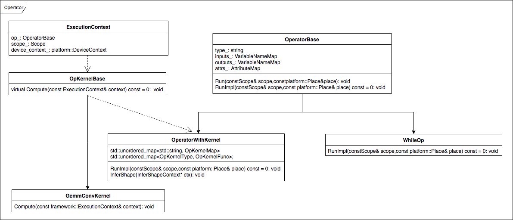

# Notes on operator development

## Building logic of Fluid's op
### 1.Building logic of Fluid's op
All Ops in Fluid are derived from `OperatorBase` , and all Ops are stateless. Each Op contains only four variable members: type, inputs, outputs, and attribute.

The core method of Op is Run. The Run method requires two resources: data resources and computing resources. These two resources are obtained respectively from `Scope` and `Place`. Inside the framework, there is a global `DeviceContextPool`, which is used to record the mapping relationship between `Place` and `DeviceContext`, which means each `Place` has only one `DeviceContext` corresponding to it, and `DeviceContext` stores the computing resources of the current device. For example, for GPU, these resources include `cudnn_handle`, `cublas_handle`, `stream`, and so on. All the internal calculations (data copy and CUDA Kernel, etc.) of Op must be done in `DeviceContext`.

The Fluid framework is designed to run on a variety of devices and third-party libraries, and some Op implementations may vary on different the devices or third-party libraries. Therefore, Fluid introduced the OpKernel's approach, which means an Op can have multiple OpKernels. Such Ops are derived from `OperatorWithKernel`, and the representative of such Ops is conv, the OpKernels of conv_op are: `GemmConvKernel`, `CUDNNConvOpKernel`, `ConvMKLDNNOpKernel`, and each OpKernel has two data types, double and float. Ops that do not need OpKernel inclue `WhileOp` and so on.

Operator inheritance diagram:


For further information, please refer to: [multi_devices](https://github.com/PaddlePaddle/docs/blob/develop/docs/design/multi_devices) , [scope](https://github.com/PaddlePaddle/docs/blob/develop/docs/design/concepts/scope.md) , [Developer's_Guide_to_Paddle_Fluid](https://github.com/PaddlePaddle/FluidDoc/blob/release/1.2/doc/fluid/getstarted/Developer's_Guide_to_Paddle_Fluid.md)

### 2.Op's registration logic
The registration entries for each Operator include:
    ```C++
    OpCreator creator_;
    GradOpMakerFN grad_op_maker_;
    proto::OpProto* proto_{nullptr};
    OpAttrChecker* checker_{nullptr};
    InferVarTypeFN infer_var_type_;
    InferShapeFN infer_shape_;
    ```

<table>
<thead>
<tr>
<th>Registration Entry</th>
<th>Type</th>
<th>Description</th>
<th>Usage</th>
</tr>
</thead>
<tbody>
<tr>
<td>proto::OpProto </td>
<td>Class </td>
<td>Store the input/output/properties/Op type of Op </td>
<td>Call at compile time </td>
</tr>
<tr>
<td>GradOpMakerFN </td>
<td>Functor </td>
<td> Return a set of OpDescs of the reverse Op corresponding to the current Op, because the reverse ones of the forward Op may consist of multiple Ops </td>
<td>Call at compile time </td>
</tr>
<tr>
<td>OpAttrChecker </td>
<td>Class </td>
<td>Check the Op's attr </td>
<td>Call at compile time </td>
</tr>
<tr>
<td>InferVarTypeFN </td>
<td>Functor </td>
<td> Used to infer the type of the output Var, such as LoDTensor, SelectedRows, or others </td>
<td>Call at compile time </td>
</tr>
<tr>
<td>InferShapeFN </td>
<td>Functor </td>
<td> Used to infer the Shape of the Output </td>
<td> The usage is different at compile time and runtime. At compile time, it is called in Python side; If the Op is derived from OperatorWithKernel, at the runtime it will be called at op.run </td>
</tr>
<tr>
<td>OpCreator </td>
<td>Functor </td>
<td>Create a new OperatorBase for each call </td>
<td>Call at runtime </td>
</tr>
</tbody>
</table>

Usually you need to call REGISTER_OPERATOR when you make comments on Op, which is:
    ```
    REGISTER_OPERATOR(op_type,
                      OperatorBase
                      Op_maker_and_checker_maker,
                      Op_grad_opmaker,
                      Op_infer_var_shape,
                      Op_infer_var_type)
    ```

**Note:**

1. For all Op, the first three parameters are required, op_type specifies the name of op, OperatorBase is the object instance of this Op, op_maker_and_checker_maker is the maker of op and the checker of attr in op.
2. If the Op has a reverse, it must have op_grad_opmaker, because in backward, the reverse Op's Maker will be obtained from the forward Op.
3. The framework provides a default op_grad_opmaker:`DefaultGradOpDescMaker`, which will use the input and output of the forward Op as the input of the reverse Op, and the gradients of the input to forward Op's as the output of the reverse Op, and copy the attributes of the forward Op to it. **Note:** DefaultGradOpDescMaker will take all the input and output of the forward Op as the reverse Op input. Even if this input is not necessary, the absence of this will prevent us from doing memory optimization for the unused variables.
4. The framework does not provide a default op_infer_var_shape method. If the Op has no OpKernel, you usually need to add the corresponding op_infer_var_shape method. If the Op has OpKernel, you need to implement the `InferShape` method of `OperatorWithKernel`. You don't need to provide the op_infer_var_shape method. For details, refer to [while_op.cc](https://github.com/PaddlePaddle/Paddle/blob/develop/paddle/fluid/operators/controlflow/while_op.cc), [conv_op.cc](https://github.com/PaddlePaddle/Paddle/blob/develop/paddle/fluid/operators/conv_op.cc).
5. The framework does not provide a default op_infer_var_type method, the user needs to add op_infer_var_type according to the actual situation. Strictly speaking, every Op should register an InferVarType, and op_infer_var_type infers the type and dtype of the output Var according to the type and dtype of the input Var. **Note:** In the Python-side LayerHelper, the create_variable_for_type_inference operation returns a Variable which is a LoDTensor. The C++-side InferVarType can modify the type and dtype of the `Variable`.


For more details, please refer to: [How to write a new Op](new_op_en.html)

## Notes on Writing an Op
### 1. input and output types supported by Op
The input and output of Fluid's Ops are `Variable`. In design, `Variable` can store any type. Op's input and output `Variable` may be of any type, and usually the `Variable` stores `LoDTensor` and `SelectedRows` .

**Note:**

- `context.Input<Tensor>("Input")` often appears in the code. It does not mean that the `Variable` of "Input" is `Tensor`, but indicates that the `Tensor` is obtained from `LoDTensor` in the `Variable` of the "Input". If the `Variable` of "Input" is `SelectedRows`, an error will be reported.
- If "Input" is `SelectedRows`, `context->GetInputDim("Input")` will return `var->Get<SelectedRows>().GetCompleteDims()` instead of Dim of `Tensor` in `SelectedRows` .

### 2. Do not modify the input data inside Op.
Never make any modification of the input data inside Op, as there may be other Ops that need to read this input.

### 3. The data type needs to be registered for OpKernel
Currently all OpKernel are required to register double and float data types.

### 4.Op compatibility issue
The modification of Op needs to consider the compatibility problem. Please ensure that the previous model can be loaded and run normally after the modification of Op which means that the model trained by the old version can be loaded and run with Paddle inference library of new version. <font color="#FF0000">**So developers should ensure that the Input, Output and Attribute of OPs cannot be modified (except for documents) or deleted. And developers can add Input, Output and Attribute, but the added Input and Output must be set to be dispensable, and the default value of added Attribute must be set. For more details, please refer to [OP Input/Output/Attribute Compatibility Modification](https://github.com/PaddlePaddle/Paddle/wiki/OP-Input-Output-Attribute-Compatibility-Modification(English-Version))**</font>.

### 5.Call ShareDataWith
The function of ShareDataWith is to make the two Tensors share the underlying buffer. When calling this operation, special attention should be paid. In the Op, the ShareDataWith cannot be applied to the output of Op. In other words, the Tensor of the Op output must be from Malloc.

### 6. Sparse gradient parameter's update method
At present, the sparse gradient will first merge the gradient when updating, which is to add up the gradients of the same parameter, and then update the parameters and additional parameters (such as velocity).

### 7. (Video) Memory optimization
If the reverse of Op does not require all of the input and output of the forward op as its input, please do not use `DefaultGradOpDescMaker`, which will prevent Memory/Video Memory optimization for unused variables.

### 8. Calls made on Hybrid device
Since the GPU is executed asynchronously, the GPU side may not be actually executed after the CPU call returns. Therefore, if you create a temporary variable in Op that you need to use at the GPU runtime, when the GPU starts running, the temporary variable may have been released on the CPU side, which may cause GPU calculation errors.

Some of the synchronous and asynchronous operations in the GPU:
```
The following device operations are asynchronous with respect to the host:
    Kernel launches;
    Memory copies within a single device's memory;
    Memory copies from host to device of a memory block of 64 KB or less;
    Memory copies performed by functions that are suffixed with Async;
    Memory set function calls.
```

Note on cudaMemCpy and cudaMemCpyAsync:

- If the data transfer is from the GPU side to the CPU side with non-pinned memory , the data transfer will be synchronous, even if an asynchronous copy operation is called.
- If the data is transferred from the CPU side to the CPU side, the data transfer will be synchronous, even if an asynchronous copy operation is called.

For more information, please refer to: [Asynchronous Concurrent Execution](https://docs.nvidia.com/cuda/cuda-c-programming-guide/#asynchronous-concurrent-execution) , [API synchronization behavior](https://Docs.nvidia.com/cuda/cuda-runtime-api/api-sync-behavior.html#api-sync-behavior)

## Op Performance Optimization
### 1. Selection of third-party libraries
In the process of writing Op, the operations provided by high-performance libraries (such as cudnn, mkldnn, mklml, eigen, etc.) are preferred, but the benchmark must be done. Some operations in the library may be slower in deep learning tasks. Because the operations provided in high-performance libraries (such as eigen, etc.) are more generalized and in terms of performance, they may not be sufficient. Usually the amount of data in the deep learning model is small, so in some cases some of the high-performance libraries may be compromised to a slower speed. For example, all Op (forward and reverse) of the Elementwise set. The Elementwise operation is called relatively frequently in the model. Especially Elementwise_add, which is used to add offset to many operations. In the previous implementation, Elementwise_op directly calls the Eigen library. Since the Elementwise operation needs to broadcast the data in many cases, and the experiment finds that the Eigen library is slower to broadcast, whose reason is in this PR[#6229](https://github.com/PaddlePaddle/Paddle/pull/6229).

### 2.Op performance optimization
The calculation speed of Op is related to the amount of data input. For some Op, different calculation methods can be selected according to the attribute parameters in Op and Shape of the input data. For example, concat_op, when axis>=1, in the process of concatenating multiple tensors, you need to make many copies for each tensor. If it is on GPU, you need to call cudaMemCopy. Relative to the CPU, the GPU is an external device. So each time the GPU is called, there will a certain overhead. And when more times of copying are required, the overhead is more prominent. At present, the implementation of concat_op will select different calling methods according to the Shape and axis values of the input data. If there are a relatively large number of input tensors, and the axis is not equal to 0, the multiple copy operations will be converted into a CUDA Kernel to complete the process; if input tensor are less, and the axis is equal to 0, direct copy will be used. The relevant experiment is described in this PR ([#8669](https://github.com/PaddlePaddle/Paddle/pull/8669)) .

Since the call of CUDA Kernel has a certain overhead, multiple calls of the CUDA Kernel in Op may affect the execution speed of Op. For example, the previous sequence_expand_op contains many CUDA Kernels. Usually, these CUDA Kernels process a small amount of data, so frequent calls to such Kernels will affect the calculation speed of Op. In this case, it is better to combine these small CUDA Kernels into one. This idea is used in the optimization of the sequence_expand_op procedure (related PR[#9289](https://github.com/PaddlePaddle/Paddle/pull/9289)). The optimized sequence_expand_op is about twice as fast as the previous implementation, the relevant experiments are introduced in the PR ([#9289](https://github.com/PaddlePaddle/Paddle/pull/9289)).

Reduce the number of copy and sync operations between the CPU and the GPU. For example, the fetch operation will update the model parameters and get a loss after each iteration, and the copy of the data from the GPU to the Non-Pinned-Memory CPU is synchronous, so frequent fetching for multiple parameters will reduce the model training speed.

## Op numerical stability
### 1. Some Ops have numerical stability problems
The main reason for numerical stability is that when the program is run multiple times, the order in which the floating-point data is processed may be different, resulting in different final calculation results. The GPU is accelerated by multi-threaded parallel computing, so it is commonplace that the order of operations on floating-point numbers is not fixed.

At present, it is found that the result of the convolution operation in cudnn, MaxPooling in cudnn, CudaAtomicXX in CUDA, and aggregation of parameter gradients in Reduce mode of ParallelExecutor are not certain.

For this purpose, some FLAGS is added to the Fluid. For example, FLAGS_cudnn_deterministic is used to force cudnn to use the deterministic algorithm, and FLAGS_cpu_deterministic to force the CPU-side calculation to use the deterministic method.

## Other
### 1. Error message
The Enforce prompt message cannot be empty and needs to be written, because the error message can analyze the cause of the error more quickly and conveniently.

### 2.Op's mathematical formula
If Op has a mathematical formula, be sure to write the mathematical formula in the code and display it in the Doc of the Python API, because the user may need to understand how Paddle implements Op when comparing the calculation results among different frameworks.

**Note:** The formula preview must be done before the merge to the develop branch. Example: [dynamic_lstmp](../../../api/layers/nn.html#dynamic-lstmp).

### 3. The order of parameters in the Python-side Op interface
The order of the parameters in the Python API is generally ranked by importance, taking fc as an example:
```
def fc(input,
       size,
       num_flatten_dims=1,
       param_attr=None,
       bias_attr=None,
       act=None,
       is_test=False,
       name=None)
```
