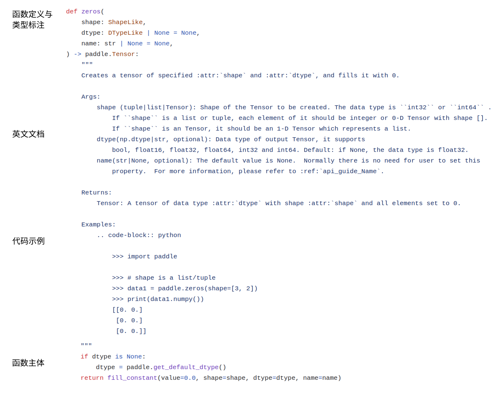

# 飞桨 API Python 端开发指南

本文将介绍为 Paddle 开发新的 API 时需要在 Python 端完成的内容以及注意事项。

## 开发 Python API 代码

这分为两种情况，Paddle 的 API 包含需要开发 C++ 算子的和不需要开发 C++ 算子而仅使用现有 Python API 组合得到的两种，但两种情况下均有 Python 端的开发工作。

1. 包含 C++ 算子的开发的情况，需要在 Python 端添加相应 API 以调用对应的算子;
2. 不需要开发 C++ 算子的情况，需要在 Python 端添加相应 API 以调用其他 API 组合实现功能;

### 文件位置与 API 名称

Python API 的文件位置遵循功能相似的放在一起的原则。大的功能分类可以参考 [API 目录结构规范](https://github.com/PaddlePaddle/docs/blob/develop/docs/dev_guides/api_contributing_guides/api_design_guidelines_standard_cn.md#api 目录结构规范)。

大部分常用的数组运算 API（在 numpy 中有功能相似的 `numpy.***` API ）放在 `paddle/tensor` 目录下。具体的功能细分如下：

| 文件            | 功能                                                         |
| --------------- | ------------------------------------------------------------ |
| array.py        | TensorArray 相关的操作                                       |
| attribute.py    | Tensor 元数据相关的操作，比如数据类型判断，`is_complex`, `is_integer`, 元数据获取，`shape`, `rank` 等 |
| creation.py     | Tensor 创建类，比如 `to_tensor`, `ones`, `full_like` 等      |
| einsum.py       | einsum 运算                                                  |
| linalg.py       | 线性代数类运算，比如 `matmul`, `norm`, `det`                 |
| logic.py        | 逻辑类运算，比如 `logical_and`, `allclose`, `greater_than`   |
| manipulation.py | 非算术运算类的数组元素操作，比如拼接 `concat`，堆叠`stack`，转置`transpose` 等 |
| math.py         | 逐元素算术运算，比如加减乘除，三角函数等；规约类算术运算，比如 `sum`；扫描类算术运算，比如 `cumsum` |
| random.py       | 随机数发生类函数，比如 `randn`, `uniform`，注意和 creation 中的区别 |
| search.py       | 搜索，排序，比如 `argsoft`, `argmin`                         |
| stat.py         | 统计类，比如 `mean`, `var`, `std`                            |
| to_string.py    | Tensor 的打印相关功能                                        |

与 `paddle/tensor` 功能类似，`paddle.nn.functional` 中也包含许多用于操作 tensor 的函数，但是这里主要是放一些更常用于神经网络中的函数，比如 `batch_norm`, `conv2d`，这些往往可能在 numpy 中没有直接对应的函数。

写新的 API 的时候可以参考该 API 的功能和哪一类更为相似，如果有不确定的情况，请 [新建 ISSUE](https://github.com/PaddlePaddle/Paddle/issues/new?assignees=&labels=type%2Ffeature-request%2Cstatus%2Fnew-issue&template=2_feature-request.yml) 说明。


### Python API 的代码开发示例
先看一个简单的 Python API 的代码样例，如图 1 所示，可以看到主要包括以下几部分：
- 函数定义：定义 Python 接口函数
- 英文文档：API 的英文文档与直接写在 .py 文件中，如下图所示；API 的中文文档则写到 [PaddlePaddle/docs](https://github.com/PaddlePaddle/docs) repo 中
- 代码示例：该 API 的使用示例代码
- 函数主体代码：包括输入参数的检查、调用算子的执行逻辑等内容


<center>图 1 Python API 代码样例</center>


下面介绍飞桨 Python API 开发的一些惯例，以及用到的主要函数类的接口。

这类的接口需要兼容动态图和静态图。在动态图下，函数会被多次执行；而在静态图下，函数仅在组网时被调用，真正被多次执行的是组网得到的结果。但 API 在动态图和静态图下的行为是保持一致的。

关于 API 的命名，参数命名等的一般规范，可以参考 [飞桨 API 的设计和命名规范](api_design_guidelines_standard_cn.html#id2)。

接下来介绍 Python API 的函数主体代码开发的一些惯例，以及用到的主要函数类的接口。
>注：因为飞桨框架同时支持动态图和静态图，因此通常情况下，飞桨原生算子 API 需要实现动态图分支和静态图分支，不同分支下的行为是保持一致的，并且对外统一成一个 API 接口。

#### 代码示例一（组合其他 Python API ）
如图 1 所示，zeros 函数是通过组合 fill_constant 实现的，并且 fill_constant 里已经处理了动态图和静态图的情况，所以直接调用即可。这就是组合其他 Python API 实现的例子。
```Python
def zeros(shape, dtype=None, name=None):
    # 为了突出重点，省略中间的文档和示例部分
    if dtype is None:
        dtype = 'float32'
    return fill_constant(value=0.0, shape=shape, dtype=dtype, name=name)
```
而如果 API 的实现中需要调用一个 C++ 算子时，则需要根据动态图和静态图使用不同的写法，具体见示例二。


#### 代码示例二（调用 C++ 算子接口）

接下来是一个实现动态图分支和静态图分支调用 C++ 算子的例子。

下面以 `paddle.trace` 的实现代码为例，分别介绍动态图分支和静态图分支的开发要点：
```Python
def trace(x, offset=0, axis1=0, axis2=1, name=None):
    # 为了突出重点，省略部分代码
    # 动态图分支，直接调用算子对应的 Python C 函数
    if in_dygraph_mode():
        return _C_ops.final_state_trace( x, offset, axis1, axis2 )

    # 静态图分支
    ## 输入参数检查
    __check_input(input, offset, axis1, axis2)

    ## 构造输出，添加 op，返回输出
    helper = LayerHelper('trace', **locals())
    out = helper.create_variable_for_type_inference(dtype=x.dtype)

    helper.append_op(
        type='trace',
        inputs={'Input': [x]},
        attrs={'offset': offset,
               'axis1': axis1,
               'axis2': axis2},
        outputs={'Out': [out]})
    return out
```

（1）动态图分支

截取上面示例中相关代码如下，动态图分支的写法一般是调用 API 对应的 Python C 函数。
```Python
    # 动态图分支，直接调用算子对应的 Python C 函数
    if in_dygraph_mode():
        return _C_ops.final_state_trace( x, offset, axis1, axis2 )
```
_C_ops 是 Python/paddle/_C_ops.py，其中从 paddle 编译得到的二进制文件中 import 了 C++ 算子对应的 Python C 函数。

在动态图模式下，Python C 的调用函数名为 final_state_ + 算子名，然后将参数按照 YAML 配置文件中定义的输入参数顺序传入即可。

> 注意：由于目前动态图正处在重构升级阶段，所以现有算子的代码会分别有新旧动态图两个代码分支，其中 `in_dygraph_mode()` 表示新动态图分支（默认），`_in_legacy_dygraph()`为旧动态图分支，**在新增算子时无需添加旧动态图分支代码**。

（2）静态图分支

对于静态图，一般分为输入参数检查、创建输出 Tensor、添加 OP 几个步骤。
```Python
    ## 输入参数检查
    __check_input(input, offset, axis1, axis2)

    ## 构造输出，添加 OP，返回输出
    # LayerHelper 是一个用于创建 OP 输出变量、向 program 中添加 OP 的辅助工具类
    helper = LayerHelper('trace', **locals())
    # 创建输出 Tensor
    out = helper.create_variable_for_type_inference(dtype=x.dtype)
    # 将输入 Tensor，输出 Tensor, 非 Tensor 的 attributes 以三个字典的形式
    # 作为参数添加 operator
    helper.append_op(
        type='trace',
        inputs={'Input': [x]},
        attrs={'offset': offset,
               'axis1': axis1,
               'axis2': axis2},
        outputs={'Out': [out]})
    return out
```

  - 在 `append_op` 添加的 `inputs` 和 `outputs` 项，其中的 key 值（静态图中变量名）一般与 Python 接口中定义的输入输出 Tensor 变量名的命名相同。（注意：这里 `trace` 中的 `Input` 没有与 Python 接口中 `x` 命名直接对应是由于为了兼容旧算子体系下 `trace` 算子的定义实现而做了额外的映射，新增算子时无需考虑这种情况）
  - 输入数据类型的检查一般仅在静态图分支中使用。主要原因是静态图下该函数仅被执行一次，发生在组网时，而动态图下该函数会被多次执行，Python 端过多的输入检查会影响执行效率。并且由于动态图即时执行的优势，如果发生错误也可以通过分析 C++ 端的报错信息定位问题。这里输入参数检查的代码逻辑比较复杂并且仅用于 `trace` 函数，因此在该函数内定义一个检查输入参数的函数 `__check_input`，代码如下所示：
  > 输入参数检查包括必要的类型检查、值检查、输入 Tensor 的形状、dtype 等检查，确保组网能正常运行等。其中检测 Tensor 的数据类型可以用 `check_variable_and_dtype` 和 `check_type` 函数进行检测。
```Python
def __check_input(input, offset, dim1, dim2):
        check_dtype(x.dtype, 'Input',
                    ['int32', 'int64', 'float16', 'float32', 'float64'],
                    'trace')

        input_shape = list(x.shape)
        assert len(input_shape) >= 2,                     \
                "The x must be at least 2-dimensional, "   \
                "But received Input x's dimensional: %s.\n" %  \
                len(input_shape)

        axis1_ = axis1 if axis1 >= 0 else len(input_shape) + axis1
        axis2_ = axis2 if axis2 >= 0 else len(input_shape) + axis2

        assert ((0 <= axis1_) and (axis1_ < len(input_shape))),     \
            "The argument axis1 is out of range (expected to be in range of [%d, %d], but got %d).\n"  \
            % (-(len(input_shape)), len(input_shape) - 1, axis1)

        assert ((0 <= axis2_) and (axis2_ < len(input_shape))),   \
            "The argument axis2 is out of range (expected to be in range of [%d, %d], but got %d).\n"   \
            % (-(len(input_shape)), len(input_shape) - 1, axis2)


        assert  axis1_ != axis2_,   \
               "axis1 and axis2 cannot be the same axis." \
                "But received axis1 = %d, axis2 = %d\n"%(axis1, axis2)
```
### 将 API 绑定为 Tensor 的方法

在 paddle 中的许多计算函数，既能够作为独立函数使用，也能作为 `Tensor` 的方法使用。作为 `Tensor` 方法使用则可以更方便地链式调用。例子如下：

```Python
x = paddle.randn([2, 3])

paddle.abs(x) # 与 x.abs() 等价
paddle.sin(paddle.abs(x)) # 与 x.abs().sin() 等价

paddle.sum(x, axis=0) # 与 x.sum(axis=0) 等价
```

这两种使用方式的对应规则是，当作为 `Tensor` 方法调用时，相当于自动把该 Tensor 作为独立函数的第一个参数传入，其余参数的传入则和独立函数的使用一致。目前 `paddle/tensor` 子目录下的许多 API 都支持这样的调用方式。

如需让新增的函数支持作为 `Tensor`  方法调用则需要将函数名添加到 `Python/paddle/tensor/__init__.py` 中的 `tensor_method_func` 列表中。具体的做法是在 `Python/paddle/tensor/__init__.py` 中 import 所需的函数，然后将其名字加入 `tensor_method_func` 列表。


### API 的正式名称与公开 API 列表

在 Python 中，如果模块 `a` 中导入了模块 `b` 提供的函数或者类 `f`，那么开发者想要使用函数 `f`，既可以从模块 `a` 中导入，也可以从模块 `b` 中导入。

```Python
# b.py
def f():
  pass

# a.py
from b import f

# client.py
from b import f # it's ok
from a import f # it's ok, too
```

但是 Paddle 对于 API 有一个推荐的名称，比如函数 `logsumexp` 定义在 `Python/paddle/tensor/math.py`，但是又在 `Python/paddle/tensor/__init__.py` 中被 import，并且也在 `Python/paddle/__init__.py` 中被 import.

```Python
# Python/paddle/tensor/math.py
def logsumexp(...):
        ...

# Python/paddle/tensor/__init__.py
from .math import logsumexp

# Python/paddle/__init__.py
from .tensor.math import logsumexp
```

实际上 `import paddle` 之后，可以通过 `paddle.logsumexp`, `paddle.tensor.logsumexp` 和 `paddle.tensor.math.logsumexp` 来调用这个函数，但是推荐使用 `paddle.logsumexp` 这个名称。这在 Paddle 中的做法是仅在 `Python/paddle/__init__.py` 文件的 `__all__` 列表中加入 `"logsumexp"`, 而不在 `Python/paddle/tensor/__init__.py` 和 `Python/paddle/tensor/math.py` 的 `__all__` 列表中加入 `"logsumexp"`.

遵循这样的规范，按照 API 的正式命名，到对应的文件中，总可以找到 `__all__` 列表，其中包含想要查找的函数。而且这样一个 API 只出现在一个 `__all__` 列表中。

这个列表也作为某个模块或包的公开 API 列表，不加入列表的不视为公开 API.

比如已知 API 正式名称 `paddle.logsumexp` ；

1. 如果 `Python/paddle.py` 存在（paddle 是一个模块），则可以在 `Python/paddle.py`  中查找 `__all__` 列表；
2. 如果 `Python/paddle` 是一个文件夹 (paddle 是一个包)，则可以在 `Python/paddle/__init__.py` 中查找 `__all__` 列表。

将 API 名字加入 `__all__` 列表的时候需要遵循上述的规则，仅将 API 名字加入正式名称对应的包或者模块的 `__all__` 列表中。

Tip: 当出现类似把一个元素放入一个集中管理的列表的操作时，可以考虑按照字母表顺序插入列表中的合适位置。因为如果有多人同时新增 API 时，这样的方式比直接加在末尾更不容易出现冲突。


## 开发单元测试代码

### 添加 Operator 单元测试

如果开发了 C++ operator, 那么需要添加 operator 的单元测试，需要继承 `OpTest` 写作测试用例。文件位置在 `Python/paddle/fluid/tests/unittests/`，一般以 `test_${op_name}_op.py` 的形式命名。

单元测试相关的开发规范可以参考

 [C++ 算子开发指南-添加单元测试](new_cpp_op_cn.html#tianjiadanyuanceshi) ，[Op 开发手册(Operator Development Manual)](https://github.com/PaddlePaddle/Paddle/wiki/Operator-Development-Manual-Index).

在此不作展开，主要讲述 Python API 的单元测试。

### 添加 Python API 单元测试

无论是否开发了 C++ operator，对于 Python API 都需要添加单元测试，文件路径在 `Python/paddle/fluid/tests/unittests/`，一般以 `test_${api_name}.py` 的形式命名。

如果为这个 API 也开发了对应的 C++ operator，那么也可以把对 API 的单元测试和 operator 的单元测试写在同一个文件中，文件位置在 `Python/paddle/fluid/tests/unittests/`，一般以 `test_${op_name}_op.py` 的形式命名。

对 Python API 的单元测试直接继承 `UnitTest.TestCase`，一般来说需要用 numpy/scipy 中的对应功能作为参考，如果 numpy/scipy 中没有现成的对应函数，可以用 numpy/scipy 实现一个作为参考，并以这个为基准对新增的 paddle Python API 进行测试，如 [test_softmax_op](https://github.com/PaddlePaddle/Paddle/blob/develop/python/paddle/fluid/tests/unittests/test_softmax_op.py#L29)。

如果新增的 API 没有使用新增的 C++ operator, 可以不必测试反向功能（因为 operator 的新增本身要求 operator 单元测试，这本身就会测试反向功能）。常见的流程是构建相同的输入，调用参考的实现和新增的 Python API，对比结果是否一致。一般用 `self.assertTrue(numpy.allclose(actual, desired))` 或者 `numpy.testing.assert_allclose(actual, desired)` 来进行数值对比。

其中，`numpy.testing.assert_allclose` 相对误差和绝对误差是 `rtol=1e-07, atol=0`；`numpy.allclose` 的相对误差和绝对误差是 `rtol=1e-05, atol=1e-08`，前者比后者更严格。一般进行单元测试的时候，都使用默认的误差阈值，如需设置自定义的阈值，需要说明原因。

注意：对于 Python API 的单元测试，必须添加动态图和静态图的测试 case, 以确保所添加的 API 以及它在不区分动态图静态图分支的情况下调用的其他 API 在两种情况下工作都正常，而且结果符合预期。

因为 unittest 各个 case 的运行次序是不确定的，为了保证不同的测试 case 运行在正确的运行模式（动态图/静态图）上，常见的做法有：

1. 在每个测试 case 的起始部分，显式切换 paddle 的运行模式，用`paddle.enable_static` 和 `paddle.disable_static` 分别激活和取消静态图模式。

   比如 `Python/paddle/fluid/tests/unittests/test_activation_op.py` 中的 `TestHardtanhAPI` 中 在 `test_static_api` 和 `test_dygraph_api` 的开头分别切换了状态。

   ```Python
   class TestHardtanhAPI(unittest.TestCase):
       # test paddle.nn.Hardtanh, paddle.nn.functional.hardtanh
       def setUp(self):
           np.random.seed(1024)
           self.x_np = np.random.uniform(-3, 3, [10, 12]).astype('float32')
           self.place=paddle.CUDAPlace(0) if paddle.is_compiled_with_cuda() \
               else paddle.CPUPlace()

       def test_static_api(self):
           paddle.enable_static()
           with paddle.static.program_guard(paddle.static.Program()):
               x = paddle.fluid.data('X', [10, 12])
               out1 = F.hardtanh(x)
               m = paddle.nn.Hardtanh()
               out2 = m(x)
               exe = paddle.static.Executor(self.place)
               res = exe.run(feed={'X': self.x_np}, fetch_list=[out1, out2])
           out_ref = ref_hardtanh(self.x_np)
           for r in res:
               self.assertEqual(np.allclose(out_ref, r), True)

       def test_dygraph_api(self):
           paddle.disable_static(self.place)
           x = paddle.to_tensor(self.x_np)
           out1 = F.hardtanh(x)
           m = paddle.nn.Hardtanh()
           out2 = m(x)
           out_ref = ref_hardtanh(self.x_np)
           for r in [out1, out2]:
               self.assertEqual(np.allclose(out_ref, r.numpy()), True)

           out1 = F.hardtanh(x, -2.0, 2.0)
           m = paddle.nn.Hardtanh(-2.0, 2.0)
           out2 = m(x)
           out_ref = ref_hardtanh(self.x_np, -2.0, 2.0)
           for r in [out1, out2]:
               self.assertEqual(np.allclose(out_ref, r.numpy()), True)
           paddle.enable_static()
   ```

2. 将静态图和动态图测试定义为不以 `test` 开头的函数（因此它们默认不算 test case), 然后定义一个 test 开头的函数，切换不同的状态去运行它。例如 `Python/paddle/fluid/tests/unittests/test_l1_loss.py:73`

        def test_cpu(self):
            paddle.disable_static(place=paddle.fluid.CPUPlace())
            self.run_imperative()
            paddle.enable_static()

            with fluid.program_guard(fluid.Program()):
                self.run_static()

3. 将动态图和静态图的测试 case 分在不同的 Python 文件中，`import paddle` 后在模块级别设置 paddle 的运行模式。

   比如 `Python/paddle/fluid/tests/unittests/rnn/test_rnn_cells.py` 和 `Python/paddle/fluid/tests/unittests/rnn/test_rnn_cells_static.py` 的做法。

4. 在测试模块级别设定 paddle 的运行模式为静态图（一般是在一个模块的开始，而不是写在 `if __name__=="__main__":` 里)。然后在需要使用动态图的 case 里，将动态图部分的代码至于 `dygraph.guard` 上下文管理器内。

   这是老式的写法，目前不再推荐这么写，但已有的代码库中也存在这样的模式。

注意单元测试要求新增代码单元测试行覆盖率达到 90%.

### 运行单元测试

代码开发完成后，需要从源码编译 Paddle，并调试开发的功能。

(1) 本地编译 Paddle

 编译方法请参见 [从源码编译](../../install/compile/fromsource.html) 章节，推荐使用 Docker 编译的方式。Docker 环境中已预装好编译 Paddle 需要的各种依赖，相较本机编译更便捷。

> 注意：编译必须打开 WITH_TESTING 选项（`-DWITH_TESTING=ON`），以确保新增的单元测试文件（python/paddle/fluid/tests/unittests/ 目录下 test_*.py 文件）自动加入工程进行编译。
运行单元测试需要在 `build` 目录下，以 `ctest ${test_name}` 的命令运行。其中 `test_name` 指的是所需运行测试 target 的名字，和上述添加的单元测试文件名字相同，但不带 `.py` 后缀。

(2) 执行单元测试

编译成功后，在 `build` 目录下执行 `ctest ${test_name}` 命令来运行单元测试，并确保单元测试通过。其中 `test_name` 指的是所需运行测试 `target` 的名字，和上述添加的单元测试文件名字相同，但不带 .py 后缀。

比如运行 `python/paddle/fluid/tests/unittests/test_logsumexp.py` 的命令如下：
```
ctest -R test_logsumexp
```
> 注意：执行单测一定要用 `ctest` 命令，不可直接 `python test_*.py`。

对于需要开发 C++ 算子的 API，可以把 C++ 算子的单元测试与 Python API 的单元测试写在一个文件中。

`ctest` 还可以批量运行名字匹配某个正则表达式的测试 `target`, 通过 `-R` 参数传入正则表达式。比如通过 `ctest -R test_logsumexp` 就可以运行所有以 `test_logsumexp` 开头的单测 target.

此外，需要单元测试输出更详细的信息以便 debug 时，可以在运行 `ctest` 时传入 `-V` 或者 `-VV` 选项以查看更详细的输出，如 `ctest -V -R test_logsumexp`。


## API 文档写作

文档写作可以参考 [文档贡献指南](https://www.paddlepaddle.org.cn/documentation/docs/zh/develop/dev_guides/docs_contributing_guides_cn.html). 里面有详细的关于文档格式要求，文件所放的位置，以及提交代码的方式的详细说明。

提前 PR 后，github 上的 Bot 会给出根据所提交的中文文档所生成的官网文档的链接，可以点进去查看新增的文档所渲染出的页面效果，看是否符合预期。尤其需要注意检查是否有错别字，数学公式，示例代码渲染是否正确等问题。例如

https://github.com/PaddlePaddle/docs/pull/4418


## 确保通过 CI 测试
提交 PR 后会触发 CI（Continuous Integration，持续集成）测试，并且之后每提交一次代码合入（`git push`）都会触发一次 CI 测试。CI 测试可尽可能保障代码质量，详细测试内容可参见 [Paddle CI 测试详解](../git_guides/paddle_ci_manual_cn.html)，包括 CI 失败的一些处理建议。
当添加新的 API 时需要通过 CI 中所有的 Required 的测试项才能合入代码。
> 注意：其中 `PR-CI-APPROVAL`  和 `PR-CI-Static-Check` 这两个 CI 测试项需要飞桨相关开发者 approve 才能通过，除了这两个之外的 CI 测试项通过后，可以联系飞桨开发者提醒他们评审代码。

## 其他注意事项
### 调试 Python 代码时减少重编译的方法

如果你的修改不涉及 C++ 代码，那么一般不需要重新编译就可以重新运行测试，以验证刚发生的修改是否解决了问题。

paddle 编译过程中，对于 Python 代码的处理方式是，先把它们 copy 到 build 目录，对于 Python API 和 Python 单元测试所在的文件也是如此处理。

比如 `Python/paddle/fluid/tests/unittests/test_bmm_op.py` copy 到 build 目录后位置是 `build/Python/paddle/fluid/tests/unittests/test_bmm_op.py`. 并且通过 ctest 运行单元测试时，会把 `build/Python` 这个目录加入 `PYTHONPATH`, 因此它所调用的单元测试文件 和 Python API 代码文件也是 build 目录里的那一份。

如果你的修改没有涉及任何 C++ 文件，那么你也可以直接在 build 目录下修改对应的文件，直到问题解决，然后把文件拷贝回去覆盖 `Paddle` 目录的对应文件。
> 特别提醒：不要忘记拷贝回去这一步，因为重新 build 的时候，会再次从 `Paddle` 目录拷贝 `Python` 文件，如果最后忘了拷贝回 `Paddle` 目录，那么你的修改会因为再次的编译而被覆盖。


## 参考资料

1. [Op 开发手册(Operator Development Manual)](https://github.com/PaddlePaddle/Paddle/wiki/Operator-Development-Manual-Index)
2. [飞桨 API 的设计和命名规范](https://github.com/PaddlePaddle/docs/blob/develop/docs/dev_guides/api_contributing_guides/api_design_guidelines_standard_cn.md#api 目录结构规范)
3. [新增 API 测试及验收规范](https://github.com/PaddlePaddle/docs/blob/develop/docs/dev_guides/api_contributing_guides/api_accpetance_criteria_cn.md)
4. [文档贡献指南](https://www.paddlepaddle.org.cn/documentation/docs/zh/develop/dev_guides/docs_contributing_guides_cn.html)
5. [飞桨 API 文档书写规范](https://github.com/PaddlePaddle/docs/blob/develop/docs/dev_guides/api_contributing_guides/api_docs_guidelines_cn.md)
