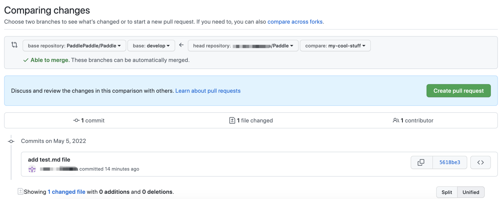

# 代码贡献流程

飞桨深度学习框架的代码贡献在 GitHub 上进行，所有社区开发者均采用相同的代码贡献流程。本文介绍向 [PaddlePaddle/Paddle](https://github.com/PaddlePaddle/Paddle) 仓库贡献代码的通用流程。

## 一、准备工作

### 1.1 确定贡献内容

飞桨社区欢迎你做任何形式的贡献，如修改 API 文档、新增 API、优化算子性能等等，你可以在 [飞桨社区活动总览](https://github.com/PaddlePaddle/Paddle/issues/42410) 以及 [PFCC-Roadmap 总览](https://github.com/PaddlePaddle/Paddle/issues/42571) 找到你感兴趣的内容并贡献代码。简单的修改你可以直接提交 PR，在 PR 中描述本 PR 的修改点；针对复杂的改动，你可以先提交 ISSUE/RFC，在完成对应的功能设计后再进行代码开发。

### 1.2 阅读贡献指南

请提前阅读贡献流程、代码规范、单元测试规范等信息，以确保您提交的代码符合飞桨的相关准则，尽可能高效地合入代码。

通常你需要提前阅读本章节，以及通用的 [规范和参考信息](style_guide_and_references/index_cn.html)，然后根据贡献内容阅读对应模块的指南，比如需要贡献一个新的 API，则需阅读 [新增 API 开发&提交流程](api_contributing_guides/api_contributing_guides_cn.html)，后续飞桨也将提供其他的如功能增强、性能优化等相关贡献指南，当然也欢迎开发者贡献这些指南。

> 说明：文档的贡献流程与代码有所不同，直接阅读 [文档贡献指南](docs_contributing_guides_cn.html) 即可。

### 1.3 签署 CLA

首次为 [PaddlePaddle/Paddle](https://github.com/PaddlePaddle/Paddle) 仓库贡献时，需要签署 [贡献者许可协议（Contributor License Agreement，CLA）](https://cla-assistant.io/PaddlePaddle/Paddle)，才可以合入代码。签署 CLA 即表明同意许可条款，并保留开发者投稿的所有权利、所有权和利益。

### 1.4 开发环境
为了飞桨开发者更便捷地开发，飞桨在 AI Studio 实训社区中提供了 CPU、GPU 计算资源和线上开发环境，飞桨框架开发者可发邮件申请资源：发邮件到 ext_paddle_oss@baidu.com，并附上 github username，aistudio uid，说明用途。
申请通过后，在 AI Studio 上创建项目即可选择框架开发环境。

## 二、贡献流程

你需要有一个 GitHub 帐号，再执行如下步骤。如果你已熟悉 GitHub 相关操作，也建议浏览一遍，以便了解飞桨项目贡献的一些差异点。

### 2.1 代码获取到本地

（1）Fork 仓库

打开 [PaddlePaddle/Paddle](https://github.com/PaddlePaddle/Paddle) GitHub 首页，单击 `Fork` 按钮，将在你的用户名下创建一个仓库副本，比如 https://github.com/USERNAME/Paddle。

（2）将远程仓库 Clone 到本地

```bash
# Clone Paddle 仓库到本地并进入 Paddle 文件夹
➜  git clone https://github.com/USERNAME/Paddle
➜  cd Paddle
```

（3）创建本地分支

你需要创建一个新的分支来开发代码，一般从 Paddle 的 `develop` 分支上创建新分支。

```bash
# 创建并切换到一个名为 my-cool-stuff 的分支
➜  git checkout -b my-cool-stuff
```

> 注意：在创建分支前，需要保持当前分支目录 clean，否则会把目录中不相关的文件（untracked files）也带到新分支上。这种情况通常会出现在做过本地编译 Paddle 后，会产生很多编译相关文件，可通过 `git status` 查看并清理不相关的文件后再创建新分支。

（4）安装 pre-commit

飞桨使用 [pre-commit](https://pre-commit.com/) 的 git 钩子（git hooks），用于格式化源代码（C/C++，Python），并在调用 `git commit` 命令时进行基础的代码预检测，如每个文件只有一个 EOL（End of Line），不允许添加大文件等。并且 pre-commit 测试也是 [CI 测试](#CItest) 的一部分，不满足钩子的 Pull Request 不能被提交到 Paddle。

Paddle 使用的 pre-commit 是 2.17.0 版本，首先安装并在本地仓库的目录下运行它：

```bash
➜  pip install pre-commit==2.17.0
➜  pre-commit install
```

> 注意：
>
> - Paddle 使用 clang-format 参数调整 C/C++ 源代码格式，请确保 clang-format 版本在 3.8 以上。
> - 通过 `pip install pre-commit` 和 `conda install -c conda-forge pre-commit` 安装的 yapf 稍有不同，请使用 `pip install pre-commit`。

### 2.2 设计和开发

（1）提交设计文档（可选）

针对比较复杂/重要的变更，如新增 API、算子性能优化等，建议你先向 [PaddlePaddle/community](https://github.com/PaddlePaddle/community) 中的 `rfcs`对应的目录，按 [模板](https://github.com/PaddlePaddle/community/blob/master/rfcs/APIs/api_design_template.md) 提交 RFC，待社区讨论通过后，再进行下一步的功能开发。

> 说明：如果仅有设计思路或不确定是否可以贡献，可以先向 Paddle 仓库提 issue，与飞桨开发者讨论。[飞桨社区活动总览](https://github.com/PaddlePaddle/Paddle/issues/42410) 以及 [PFCC-Roadmap 总览](https://github.com/PaddlePaddle/Paddle/issues/42571) 中的任务是已经经过确认的，可以直接提交设计文档。

（2）开发代码

可根据贡献内容，参考对应模块的贡献指南开发代码，如 [新增 API 开发&提交流程](api_contributing_guides/api_contributing_guides_cn.html)，包括：

- 功能实现代码
- 单元测试代码
- 对应文档

开发时需注意遵循飞桨相关开发规范。

下面通过一个简单示例介绍后续步骤，示例在本地仓库中删除了 README.md 中的一行，并创建了一个 test.md 文件 。
可通过 `git status` 查看当前目录的变化，也可以通过 `git diff` 查看文件具体被修改的内容。

```bash
➜  git status
On branch my-cool-stuff
Changes not staged for commit:
  (use "git add <file>..." to update what will be committed)
  (use "git checkout -- <file>..." to discard changes in working directory)

    modified:   README.md

Untracked files:
  (use "git add <file>..." to include in what will be committed)

    test.md

no changes added to commit (use "git add" and/or "git commit -a")
```

### 2.3 本地编译并执行单元测试

代码开发完成后，需要从源码编译 Paddle，并调试开发的功能。

（1）本地编译并安装 Paddle

编译方法请参见 [从源码编译](../../../install/compile/fromsource.html) 章节，推荐使用 Docker 编译的方式。Docker 环境中已预装好编译 Paddle 需要的各种依赖，相较本机编译更便捷。

> 注意：编译必须打开 `WITH_TESTING` 选项，以确保新增的单元测试文件（如 `test/` 目录下 `test_*.py` 文件）自动加入工程进行编译。

（2）执行单元测试

编译成功后，在`build`目录下执行如下命令来运行单元测试，并确保单元测试通过。

```bash
ctest -R test_mul_op -V
```

> 注意：执行单测一定要用 ctest 命令，不可直接`python test_*.py`。

### 2.4 提交代码

> 注意：为尽可能高效地合入代码，熟悉提交代码的操作后，请仔细阅读 [提交 PR 注意事项](#caution1)。

（1）提交本地更改（commit）

`git commit` 前先使用 `git add <file>` 添加变更或新增的文件。如果要撤销某个文件的变更，可使用 `git checkout -- <file>`。下面示例中取消了先前对 README.md 文件的变更，然后提交新添加的 test.md 文件。

```bash
➜  git checkout -- README.md
➜  git status
On branch my-cool-stuff
Untracked files:
  (use "git add <file>..." to include in what will be committed)

    test.md

nothing added to commit but untracked files present (use "git add" to track)
➜  git add test.md
```

每次 `git commit` 都需要写提交说明，方便其他人了解每次提交做了哪些改变，可以通过 `git commit -m "add a new file test.md"` 完成。

```bash
➜  git commit -m "add a new file test.md"
CRLF end-lines remover...............................(no files to check)Skipped
yapf.................................................(no files to check)Skipped
Check for added large files..............................................Passed
Check for merge conflicts................................................Passed
Check for broken symlinks................................................Passed
Detect Private Key...................................(no files to check)Skipped
Fix End of Files.....................................(no files to check)Skipped
clang-formater.......................................(no files to check)Skipped
[my-cool-stuff c703c041] add test.md file
 1 file changed, 0 insertions(+), 0 deletions(-)
 create mode 100644 233
```

> 注意：`git commit` 执行后会进行代码预检测，不能出现失败的情况，如果有 failed 的检测项需先处理，才能继续后续步骤。

（2）保持本地仓库最新

在向原仓库（https://github.com/PaddlePaddle/Paddle）发起 Pull Request 合入代码之前，需要同步原仓库最新的代码。

首先通过 `git remote` 查看当前远程仓库的名字。

```bash
➜  git remote -v
origin    https://github.com/USERNAME/Paddle (fetch)
origin    https://github.com/USERNAME/Paddle (push)
```

这里命名为 origin 的远程仓库是之前 Fork 到自己用户名下的 Paddle 仓库。

接下来需要创建一个原始 Paddle 仓库 （https://github.com/PaddlePaddle/Paddle） 的远程主机，命名为 upstream。

```bash
➜  git remote add upstream https://github.com/PaddlePaddle/Paddle
➜  git remote -v
origin    https://github.com/USERNAME/Paddle.git (fetch)
origin    https://github.com/USERNAME/Paddle.git (push)
upstream    https://github.com/PaddlePaddle/Paddle.git (fetch)
upstream    https://github.com/PaddlePaddle/Paddle.git (push)
```

获取原始 Paddle 仓库的最新代码并更新当前分支。

```bash
➜  git fetch upstream
➜  git pull upstream develop
```

（3）Push 到远程仓库

将本地的修改推送到 GitHub 上，也就是 （https://github.com/USERNAME/Paddle）。如果遇到冲突问题，可以参考 [GitHub 文档](https://docs.github.com/cn/pull-requests/collaborating-with-pull-requests/addressing-merge-conflicts/resolving-a-merge-conflict-using-the-command-line) 来解决。

```bash
➜  git push origin my-cool-stuff
```

（4）提交 Pull Request（PR）合入代码

打开（https://github.com/USERNAME/Paddle）页面，并切换到所建分支，然后单击 `Compare & pull request` 按钮。


选择目标分支:





添加必要的评论信息，然后单击 `Create pull request` 按钮。

（5）签署 CLA

如果之前未签署 CLA(Contributor License Agreement) 协议，在首次向 [PaddlePaddle/Paddle](https://github.com/PaddlePaddle/Paddle) 提交 Pull Request 时，会提示需要签署，以保证你的代码可以被合入。如果已经签署，则跳过此步骤。

具体签署方式如下：

- 请你查看 Pull Request 中的 Check 部分，找到 license/cla，并点击右侧 `Details`，进入 CLA 网站。


- 请阅读协议内容后单击 `Sign in with GitHub to agree`，页面将跳转回 Pull Request 页面。


<span id="CItest">（6）确保通过 CI 测试</span>

提交 Pull Request 后会触发 CI（Continuous Integration，持续集成）测试，并且之后每提交一次代码合入（`git push`）都会触发一次 CI 测试。CI 测试可尽可能保障代码质量，详细测试内容可参见 [Paddle CI 测试详解](../git_guides/paddle_ci_manual_cn.html)。

提交 Pull Request 后，请关注 CI 测试进程，一般会在几个小时内完成。

- 测试项后出现绿色的对勾，表示本条测试项通过。
- 测试项后出现红色的叉号，并且后面显示 `Required`，则表示本条测试项不通过（不显示 `Required` 的任务未通过，也不影响代码合入，可不处理）。在这种情况下，请点击 `detail` 查看报错详情，优先自行解决报错问题，无法解决的情况，以评论的方式添加到评论区中，飞桨开发者将和你一起查看。

> 注意：`PR-CI-APPROVAL` 和 `PR-CI-Static-Check` 这两个 CI 测试项可能需要飞桨相关开发者 approve 才能通过，除此之外请确保其他每一项都通过，如果没有通过，请通过报错信息自查代码。

CI 测试通过后，接下来请等待 Code Review，一般会在三个工作日内回复。但是若 CI 测试不通过，评审人一般不做评审。

### 2.5 回复 Code Review 意见并修改代码

收到 Code Review 意见后，请参考 [Code Review 注意事项](#CodeReview) 回复评审人的意见，并根据意见修改代码。


### 2.6 PR Merge 后本次贡献结束

当提交的 Pull Request（PR）Merge 到 Paddle 仓库后，飞桨开发者会对整个框架功能进行集成测试，集成测试用于模型、API、OP 等的功能和性能测试。

- 如果测试通过，恭喜你贡献流程已经全部完成；
- 如果测试不通过，我们会在 GitHub 发 Issue 联系你进行代码修复，请及时关注 GitHub 上的最新动态。

> 说明：代码合入 Paddle develop 分支后的第二天，即可从飞桨官网下载 develop 版本的编译安装包体验此功能。通过测试的代码会被纳入正式版的发版计划。

### 2.7 下一次贡献

通常建议下一次贡献时创建一个新的分支，执行步骤如下：

（1）切回 Paddle develop 分支

```bash
➜  cd Paddle
➜  git checkout develop
```

（2）保持本地仓库最新

```bash
➜  git fetch upstream
➜  git pull upstream develop
```

（3）创建新分支

```bash
➜  git checkout -b new_branch
```


## <span id="caution1">三、提交 PR 注意事项</span>

请每次提交代码时，遵循以下约定：

（1）请注意 commit 的数量不要过多。

  - 原因：如果仅仅修改一个文件但提交了十几个 commit，每个 commit 只做了少量的修改，这会给评审人带来很大困扰。评审人需要逐一查看每个 commit 才能知道做了哪些修改，且不排除 commit 之间的修改存在相互覆盖的情况。
  - 建议：每次提交时，保持尽量少的 commit。可以通过`git rebase -i HEAD~3`将最新的 3 个 commit 合并成一个（可以根据实际情况修改该数值），再 Push 到远程仓库，可以参考 [rebase 用法](https://docs.github.com/cn/get-started/using-git/about-git-rebase)。

（2）请注意每个 commit 的名称，应能反映当前 commit 的内容，不能太随意。

（3）评审人 Code Review 过后，请不要使用 `git push -f` 强行提交代码，这样评审人无法看到修改前后的变化（diff），使评审变得困难。

（4）如果解决了某个 Issue 的问题，请在该 Pull Request 的第一个评论框中加上：**fix #issue_number**，这样当该 Pull Request 被合并后，会自动关闭对应的 Issue。关键词包括：close，closes，closed，fix，fixes，fixed，resolve，resolves，resolved，请选择合适的词汇。详细可参考 [Closing issues via commit messages](https://help.github.com/articles/closing-issues-via-commit-messages/)。

> 注意：特别提醒，请不要频繁将本地的修改 Merge 到 develop 分支，在过 CI 时，会自动 Merge develop，这样会使 CI 重跑，更加延长 CI 通过时间。

## <span id="CodeReview">四、Code Review 注意事项</span>

请回复 Code Review 意见时，遵循以下约定：

（1）评审人的每个意见都必须回复（这是开源社区礼貌，别人帮了忙，应该说谢谢）：

  - 同意评审意见并完成修改，请给出确认答复，如 "Done"；
  - 不同意评审意见，请给出自己的理由，方便进一步交流探讨。

（2）如果评审意见比较多：

  - 请给出总体的修改情况说明。
  - 请采用 [start a review](https://help.github.com/articles/reviewing-proposed-changes-in-a-pull-request/) 的方式在对应意见条目下进行回复，而非直接在 PR 评论框中回复。后者每次回复都会发送一封邮件，造成邮件灾难。

> 说明：相对应地，如果作为评审人给其他 PR 反馈评审意见时，也请采用  [start a review](https://help.github.com/articles/reviewing-proposed-changes-in-a-pull-request/) 方式提交评审意见，减少不必要的邮件。

## 五、总结

贡献者需要关注的要点如下：

- 阅读并签署 CLA
- 阅读贡献指南
- 提交的代码遵循飞桨相关规范
- 代码执行了单元测试和 CI 测试
- 提交方式符合相关约定

掌握以上要点，可以更高效地帮助你完成代码贡献。

GitHub 相关资源参考：[GitHub Docs](https://docs.github.com/cn)。
