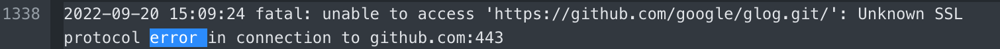

# Paddle CI 测试详解

## 一、概述

持续集成（Continuous Integration，简称 CI）测试是项目开发与发布流水线中的重要一环。[PaddlePaddle/Paddle](https://github.com/PaddlePaddle/Paddle) 是一个多人协作开发项目，为了尽可能保证合入主干的代码质量，提高代码合入效率，开发者在提交一个 PR（Pull Request）时，将自动触发必要的 CI 测试任务，主要检测：

- 是否签署 CLA 协议。
- PR 描述是否符合规范。
- 是否通过不同平台`（Linux/Mac/Windows/XPU/DCU 等）`的编译与单测（单元测试）。
- 是否通过静态代码扫描工具的检测。

CI 测试包含的具体测试任务和执行顺序如下图所示：


如上图所示，CI 测试任务将从左向右逐层执行，同一层任务并发执行。

> 说明：如果 PR 中仅修改了文档内容，可在 `git commit` 时在描述信息中添加 `'test=document_fix'`关键字，如 `git commit -m 'message, test=document_fix',`即可只触发 PR-CI-Static-Check，仅检查文档是否符合规范，不做其他代码检查。

提交 PR 后，请关注 PR 页面的 CI 测试进程，一般会在几个小时内完成。

- 测试项后出现绿色的对勾，表示本条测试项通过。
- 测试项后出现红色的叉号，并且后面显示 `Required`，则表示本条测试项不通过（不显示 `Required` 的任务未通过，也不影响代码合入，可不处理）。

> 注意：PR-CI-APPROVAL 和 PR-CI-Static-Check 这两个 CI 测试项可能需要飞桨相关开发者 approve 才能通过，除此之外请确保其他每一项都通过，如果没有通过，请通过报错信息自查代码。

为了便于理解和处理 CI 测试问题，本文将逐条介绍各个 CI 测试项，并提供 CI 测试不通过的参考解决方法。

## 二、CI 测试项介绍

下面分平台对每条 CI 测试项进行简单介绍。

### **license/cla**

- **【条目描述】** 首次为 [PaddlePaddle/Paddle](https://github.com/PaddlePaddle/Paddle) 仓库贡献时，需要签署 [贡献者许可协议（Contributor License Agreement，CLA）](https://cla-assistant.io/PaddlePaddle/Paddle)，才可以合入代码。
- **【触发条件】** 自动触发。

### CheckPRTemplate

- **【条目描述】** 检查 PR 描述信息是否按照模板填写，模板如下：

```md
### PR types
<!-- One of [ New features | Bug fixes | Function optimization | Performance optimization | Breaking changes | Others ] -->
(必填)从上述选项中，选择并填写 PR 类型
### PR changes
<!-- One of [ OPs | APIs | Docs | Others ] -->
(必填)从上述选项中，选择并填写 PR 所修改的内容
### Describe
<!-- Describe what this PR does -->
(必填)请填写 PR 的具体修改内容
```

- **【触发条件】** 自动触发。
- **【注意事项】** 通常 10 秒内检查完成，如遇长时间未更新状态，请编辑一下 PR 描述以重新触发。

### Linux 平台测试项

#### PR-CI-Clone

- **【条目描述】** 将当前 PR 的代码从 GitHub Clone 到 CI 测试执行的机器，方便后续的 CI 直接使用。
- **【触发条件】** 自动触发。

#### PR-CI-Build

- **【条目描述】** 生成当前 PR 的编译产物，并将编译产物上传到 BOS（百度智能云对象存储）中，方便后续的 CI 可以直接复用该编译产物。
- **【执行脚本】** `paddle/scripts/paddle_build.sh build_pr_dev`
- **【触发条件】**
  - `PR-CI-Clone`通过后自动触发。

#### PR-CE-Framework

- **【条目描述】** 检测框架 API 与预测 API 的核心测试用例是否通过。
- **【执行脚本】**
  - [框架 API 测试](https://github.com/PaddlePaddle/PaddleTest)：`PaddleTest/framework/api/run_paddle_ci.sh`
  - [预测 API 测试](https://github.com/PaddlePaddle/PaddleTest)：`PaddleTest/inference/python_api_test/parallel_run.sh `
- **【触发条件】** `PR-CI-Build`通过后自动触发，并且使用`PR-CI-Build`的编译产物，无需单独编译。

#### PR-CI-Model-benchmark

- **【条目描述】** 检测 PR 中的修改是否会导致模型性能下降或者运行报错。
- **【执行脚本】** `tools/ci_model_benchmark.sh run_all`
- **【触发条件】** `PR-CI-Build`通过后自动触发，并且使用`PR-CI-Build`的编译产物，无需单独编译。
- **【注意事项】** 本条 CI 测试不通过的处理方法可查阅 [PR-CI-Model-benchmark Manual](https://github.com/PaddlePaddle/Paddle/wiki/PR-CI-Model-benchmark-Manual)。

#### PR-CI-OP-benchmark

- **【条目描述】** 检测 PR 中的修改是否会造成 OP 性能下降或者精度错误。
- **【执行脚本】** `tools/ci_op_benchmark.sh run_op_benchmark`
- **【触发条件】** `PR-CI-Build`通过后自动触发，并且使用`PR-CI-Build`的编译产物，无需单独编译。
- **【注意事项】** 本条 CI 测试不通过的处理方法可查阅 [PR-CI-OP-benchmark Manual](https://github.com/PaddlePaddle/Paddle/wiki/PR-CI-OP-benchmark-Manual)。

#### PR-CI-CINN

- **【条目描述】** 编译含 CINN（Compiler Infrastructure for Neural Networks，飞桨自研深度学习编译器）的 Paddle，并运行 Paddle 训练框架与 CINN 对接的单测，保证训练框架进行 CINN 相关开发的正确性。
- **【执行脚本】** 测试脚本: `paddle/scripts/paddle_build.sh test`
- **【触发条件】** `PR-CI-Build`通过后自动触发，并且使用`PR-CI-Build`的编译产物，无需单独编译。

#### PR-CI-Api-Benchmark

- **【条目描述】** 检测当前 PR 是否会造成 cpu 下动态图 api 调度性能下降。
- **【执行脚本】**
  - 拉取 PaddleTest 测试代码: git clone https://github.com/PaddlePaddle/PaddleTest.git
  - 进入执行目录: cd ./PaddleTest/framework/e2e/api_benchmark_new
  - 安装 CI 依赖: python -m pip install -r requirement.txt
  - 执行: python runner_user.py --yaml ./../yaml/ci_api_benchmark_fp32_cuda118_py310.yml
- **【触发条件】**
  - `PR-CI-Build`通过后自动触发，并且使用`PR-CI-Build`的编译产物，无需单独编译
- **【补充说明】** CI 依赖./PaddleTest/framework/e2e/ci_api_benchmark_fp32_cuda118_py310.yml 中的配置文件运行。如果全部 case 运行耗时过长，需要单独调试某几个 api 的 case，可以把 ci_api_benchmark_fp32_cuda118_py310.yml 中，相关 api 的 yaml 配置信息，复制到你自己新建的.yml 配置文件中，使用 python runner_user.py --yaml your_yaml.yml 运行。性能测试需要对比你的 pr 合入前后，api 耗时增加的差异，也就是说需要运行两次进行对比调试。

#### PR-CI-Py3

- **【条目描述】** 检测当前 PR 在 CPU、Python3 版本的编译与单测是否通过。
- **【执行脚本】** `paddle/scripts/paddle_build.sh cicheck_py37`
- **【触发条件】** `PR-CI-Clone`通过后自动触发。

#### PR-CI-Coverage

- **【条目描述】** 检测当前 PR 在 GPU、Python3 版本的编译与单测是否通过，同时增量代码需满足行覆盖率大于 90% 的要求。可在 PR 页面点击该 CI 后的 details 查看覆盖率，如下图所示：


- **【执行脚本】**
  - 编译脚本：`paddle/scripts/paddle_build.sh cpu_cicheck_coverage`
  - 测试脚本：`paddle/scripts/paddle_build.sh gpu_cicheck_coverage`
- **【触发条件】**
  - `PR-CI-Clone`通过后自动触发。

#### PR-CI-Inference

- **【条目描述】** 检测当前 PR 对 C++ 预测库编译和单测是否通过。
- **【执行脚本】**
  - 编译脚本：`paddle/scripts/paddle_build.sh build_inference`
  - 测试脚本：`paddle/scripts/paddle_build.sh gpu_inference`
- **【触发条件】**
  - `PR-CI-Clone`通过后自动触发。

#### PR-CI-Static-Check

- **【条目描述】** 检测`develop`分支与当前`PR`分支的增量 API 英文文档是否符合规范，以及当变更 API 或 OP 时检测是否经过了 TPM 审批（Approval）。
- **【执行脚本】**
  - 编译脚本：`paddle/scripts/paddle_build.sh build_and_check_cpu`
  - 测试脚本：`paddle/scripts/paddle_build.sh build_and_check_gpu`
- **【触发条件】** `PR-CI-Build`通过后自动触发，并且使用`PR-CI-Build`的编译产物，无需单独编译。

#### PR-CI-GpuPS

- **【条目描述】** 检测 GPUBOX 相关代码合入后编译是否通过。
- **【执行脚本】** `paddle/scripts/paddle_build.sh build_gpubox`
- **【触发条件】**
  - `PR-CI-Clone`通过后自动触发。

#### PR-CI-Codestyle-Check

- **【条目描述】** 该 CI 主要的功能是检查提交代码是否符合规范，详细内容请参考[代码风格检查指南](https://www.paddlepaddle.org.cn/documentation/docs/zh/develop/dev_guides/git_guides/codestyle_check_guide_cn.html)。
- **【执行脚本】** `tools/codestyle/pre_commit.sh`
- **【触发条件】** `PR-CI-Clone`通过后自动触发。
- **【注意事项】** 此 CI 需要检查代码风格，建议在提交 PR 之前安装 [pre-commit](https://pre-commit.com/)，可以在提交之前进行代码规范检查。

#### PR-CI-APPROVAL

- **【条目描述】** 检测 PR 中的修改是否通过了审批（Approval）。
- **【执行脚本】** `paddle/scripts/paddle_build.sh assert_file_approvals`
- **【触发条件】** `PR-CI-Clone`通过后自动触发。
- **【注意事项】** 在其他 CI 项通过前，无需过多关注该 CI，其他 CI 通过后飞桨相关开发者会进行审批。

#### PR-CI-CINN-GPU

- **【条目描述】** 检测当前 PR 在 Linux GPU 环境下编译与单测是否通过，不同于 PR-CI-CINN，该 CI 只编译 CINN，并且只测试 CINN 模块的单测，不会测试 PaddleWithCINN 相关单测。
- **【执行脚本】** `bash tools/cinn/build.sh gpu_on ci`
- **【触发条件】**
  - `PR-CI-Clone`通过后自动触发。
  - 必须修改下面路径中的文件才会触发
    ```bash  CMakeLists.txt
        cmake
        paddle/cinn
        python/cinn
        python/CMakeLists.txt
        python/setup_cinn.py.in
        test/CMakeLists.txt
        test/cinn
        test/cpp/cinn
        tools/cinn
    ```

#### PR-CI-CINN-GPU-CUDNN-OFF

- **【条目描述】** 检测当前 PR 在 Linux GPU 环境下编译与单测是否通过，编译时不会依赖 CUDNN 库。不同于 PR-CI-CINN，该 CI 只编译 CINN，并且只测试 CINN 模块的单测，不会测试 PaddleWithCINN 相关单测。
- **【执行脚本】** `bash tools/cinn/build.sh gpu_on cudnn_off ci`
- **【触发条件】**
  - `PR-CI-Clone`通过后自动触发。
  - 必须修改下面路径中的文件才会触发
    ```bash  CMakeLists.txt
        cmake
        paddle/cinn
        python/cinn
        python/CMakeLists.txt
        python/setup_cinn.py.in
        test/CMakeLists.txt
        test/cinn
        test/cpp/cinn
        tools/cinn
    ```

#### PR-CI-CINN-X86

- **【条目描述】** 检测当前 PR 在 Linux X86 环境下编译与单测是否通过，不同于 PR-CI-CINN ，该 CI 只编译 CINN ，并且只测试 CINN 模块的单测，不会测试 PaddleWithCINN 相关单测。
- **【执行脚本】** `bash tools/cinn/build.sh ci`
- **【触发条件】**
  - `PR-CI-Clone`通过后自动触发。
  - 必须修改下面路径中的文件才会触发
    ```bash  CMakeLists.txt
        cmake
        paddle/cinn
        python/cinn
        python/CMakeLists.txt
        python/setup_cinn.py.in
        test/CMakeLists.txt
        test/cinn
        test/cpp/cinn
        tools/cinn
    ```


### MAC 平台测试项

#### PR-CI-Mac-Python3

- **【条目描述】** 检测当前 PR 在 MAC 系统下 Python 3.5 版本的编译与单测是否通过，并检测当前 PR 分支相比`develop`分支是否新增单测代码，如有不同，提示需要审批（Approval）。
- **【执行脚本】** `paddle/scripts/paddle_build.sh maccheck_py35`
- **【触发条件】** `PR-CI-Clone`通过后自动触发。

### Windows 平台测试项

#### PR-CI-Windows

- **【条目描述】** 检测当前 PR 在 Windows GPU 环境下编译与单测是否通过，并检测当前 PR 分支相比`develop`分支是否新增单测代码，如有不同，提示需要审批（Approval）。
- **【执行脚本】** `paddle/scripts/paddle_build.bat wincheck_mkl`
- **【触发条件】**
  - 自动触发。
  - 当 PR-CI-Windows-OPENBLAS 任务失败时，会取消当前任务（因 OPENBLAS 失败，当前任务成功也无法进行代码合并，需要先排查 OPENBLAS 失败原因）。

#### PR-CI-Windows-OPENBLAS

- **【条目描述】** 检测当前 PR 在 Windows CPU 系统下编译与单测是否通过。
- **【执行脚本】** `paddle/scripts/paddle_build.bat wincheck_openblas`
- **【触发条件】** 自动触发。

#### PR-CI-Windows-Inference

- **【条目描述】** 检测当前 PR 在 Windows 系统下预测模块的编译与单测是否通过。
- **【执行脚本】** `paddle/scripts/paddle_build.bat wincheck_inference`
- **【触发条件】**
  - 自动触发。
  - 当 PR-CI-Windows-OPENBLAS 任务失败时，会取消当前任务（因 OPENBLAS 失败，当前任务成功也无法进行代码合并，需要先排查 OPENBLAS 失败原因）。

### 昆仑芯 XPU 测试项

#### PR-CI-Kunlun-R200

- **【条目描述】** 检测 PR 中的修改能否在昆仑芯 XPU 上编译与单测通过。
- **【执行脚本】** `paddle/scripts/paddle_build.sh check_xpu_coverage`
- **【触发条件】** `PR-CI-Clone`通过后自动触发。

### 海光 DCU 测试项

#### PR-CI-ROCM-Compile

- **【条目描述】** 检测 PR 中的修改能否在海光 DCU 芯片上编译通过。
- **【执行脚本】** `paddle/scripts/musl_build/build_paddle.sh build_only`
- **【触发条件】** `PR-CI-Clone`通过后自动触发。

## 三、CI 失败如何处理

### 3.1 CLA 失败

- 如果 PR 中 license/cla 检测项一直是 pending 状态，那么需要等其他 CI 项都通过后，点击 `Close pull request`，再点击 `Reopen pull request`，并等待几分钟（前提是你已经签署 CLA 协议）。如果上述操作重复 2 次仍未生效，请重新提一个 PR 或在评论区留言。
- 如果 PR 中 license/cla 是失败状态，可能原因是提交 PR 的 GitHub 账号与签署 CLA 协议的账号不一致，如下图所示：


建议在提交 PR 前设置：

```plain
git config --local user.email 你的 GitHub 邮箱
git config --local user.name 你的 GitHub 名字
```

### 3.2 CheckPRTemplate 失败

如果 PR 中`CheckPRTemplate`状态一直未变化，这是由于通信原因，状态未返回到 GitHub。只需要重新编辑保存一下 PR 描述后，就可以重新触发该条 CI，步骤如下：


### 3.3 其他 CI 失败

当 PR 中 CI 失败时，`paddle-bot`会在 PR 页面发出一条评论，同时 GitHub 会发送到你的邮箱，让你第一时间感知到 PR 的状态变化。

> 注意：只有 PR 中第一条 CI 失败的时候会发邮件，之后失败的 CI 项只会更新在 PR 页面的评论中。

可通过点击`paddle-bot`评论中的 CI 名称，也可通过点击 CI 列表中的`Details`来查看 CI 的运行日志，如下图所示。


之后会跳转到日志查看页面，通常在运行日志的末尾会提示 CI 失败的原因，参考提示信息解决即可。可能的原因及处理办法如下：

#### (1) 网络原因

Paddle 编译、测试时需要下载一些第三方依赖，由于网络原因，可能会下载失败，导致编译、测试失败（如下图所示）。



因此由于网络代理、机器不稳定等原因，遇到 timeout 、访问 503 等情况 ，可以尝试 重新构建此 CI 即可（需要将你的 GitHub 授权于效率云 CI 平台），如下图所示。


#### (2) 合并代码失败

如果提交的代码较陈旧，可能会存在与其他 PR 修改同一文件同一行情况，存在冲突，导致 CI 无法进行 Merge develop ，进而导致 CI 任务失败（如下图所示）。遇到该情况请本地执行 `git merge upstream develop` 再重新提交代码。


#### (3) 取消任务

每条 CI 任务都设置有超时时间，如果任务失败并且页面显示灰色，应该是任务被取消。取消情况有三种:

    1.超时取消；

    2.当前 PR 有提交新的 commit ，在运行或排队中的，旧 commit 任务全部取消；

    3.关联流水线取消，比如 PR-CI-Py3 任务失败会取消 PR-CI-Coverage 等关联流水线。

解决办法：

第 1 种原因需要先排查是否是代码修改导致，确定不是代码原因导致的可以`重新构建`此 CI 。

第 2 种无需要关心旧的 commit，新提交 commit 会继续执行 CI 任务，只需关心最新 commit 即可。

第 3 种需要排查 PR-CI-Py3 任务失败原因，确定不是代码原因导致的可以`重新构建`所有失败 CI 。


