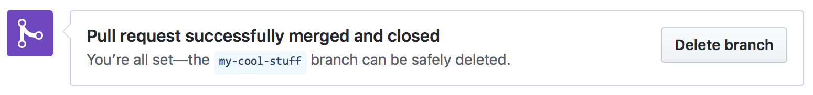

# 提交 PR 注意事项

## 提交 Pull Request

- 请注意 commit 的数量：

原因：如果仅仅修改一个文件但提交了十几个 commit，每个 commit 只做了少量的修改，这会给评审人带来很大困扰。评审人需要逐一查看每个 commit 才能知道做了哪些修改，且不排除 commit 之间的修改存在相互覆盖的情况。

建议：每次提交时，保持尽量少的 commit。可以通过`git rebase -i HEAD~3`将最新的 3 个 commit 合并成一个（你可以根据实际情况修改该数值），再 Push 到远程仓库，可以参考[rebase 用法](https://www.jianshu.com/p/4a8f4af4e803)。

- 请注意每个 commit 的名称：应能反映当前 commit 的内容，不能太随意。

- <font color="#FF0000">请不要频繁 Merge develop 分支（在过 CI 时，会自动 Merge develop）</font>，这样会使 CI 重跑，更加延长 CI 通过时间。

- 评审人 review 过后，不允许使用 git push -f 强行提交代码，这样评审人无法看到修改前后的 diff，使评审变得困难。

## 完成 Pull Request PR 创建

切换到所建分支，然后点击 `Compare & pull request`。


选择目标分支：


如果解决了某个 Issue 的问题，请在该 PUll Request 的第一个评论框中加上：fix #issue_number，这样当该 PUll Request 被合并后，会自动关闭对应的 Issue。关键词包括：close, closes, closed, fix, fixes, fixed, resolve, resolves, resolved，请选择合适的词汇。详细可参考[Closing issues via commit messages](https://help.github.com/articles/closing-issues-via-commit-messages/)

接下来等待 review，如果有需要修改的地方，参照上述步骤更新 origin 中的对应分支即可。

## 签署 CLA 协议和通过单元测试

### 签署 CLA

在首次向 PaddlePaddle 提交 Pull Request 时，你需要签署一次 CLA(Contributor License Agreement)协议，以保证你的代码可以被合入，具体签署方式如下：

- 请你查看 PR 中的 Check 部分，找到 license/cla，并点击右侧 detail，进入 CLA 网站

<div align="center">


 </div>

- 请你点击 CLA 网站中的“Sign in with GitHub to agree”,点击完成后将会跳转回你的 Pull Request 页面

<div align="center">


 </div>


### 通过单元测试

你在 Pull Request 中每提交一次新的 commit 后，会触发 CI 单元测试，请确认你的 commit message 中已加入必要的说明，请见[提交（commit）](./local_dev_guide_cn.html#commit)

请你关注你 Pull Request 中的 CI 单元测试进程，它将会在几个小时内完成

当所需的测试后都出现了绿色的对勾，表示你本次 commit 通过了各项单元测试，你只需要关注显示 Required 任务，不显示的可能是我们正在测试的任务

如果所需的测试后出现了红色叉号，代表你本次的 commit 未通过某项单元测试，在这种情况下，请你点击 detail 查看报错详情，优先自行解决报错问题，无法解决的情况，以评论的方式添加到评论区中，我们的工作人员将和你一起查看


## 删除远程分支

在 PR 被 merge 进主仓库后，我们可以在 PR 的页面删除远程仓库的分支。



也可以使用 `git push origin :分支名` 删除远程分支，如：

```bash
➜  git push origin :my-cool-stuff
```


## 删除本地分支

最后，删除本地分支。

```bash
# 切换到 develop 分支
➜  git checkout develop

# 删除 my-cool-stuff 分支
➜  git branch -D my-cool-stuff
```

至此，我们就完成了一次代码贡献的过程。
