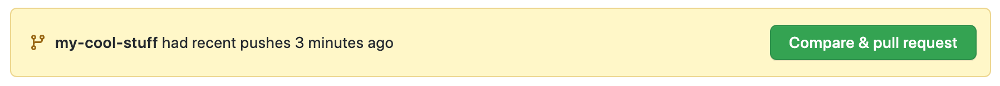
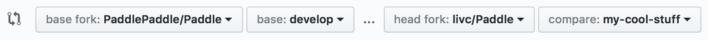

# 提交PR注意事项

## 提交 Pull Request

- 请注意commit的数量：

原因：如果仅仅修改一个文件但提交了十几个commit，每个commit只做了少量的修改，这会给评审人带来很大困扰。评审人需要逐一查看每个commit才能知道做了哪些修改，且不排除commit之间的修改存在相互覆盖的情况。

建议：每次提交时，保持尽量少的commit。可以通过`git rebase -i HEAD~3`把多个commit合并成一个，再Push到远程仓库，可以参考[rebase 用法](https://www.jianshu.com/p/4a8f4af4e803)。

- 请注意每个commit的名称：应能反映当前commit的内容，不能太随意。

- 请不要频繁Merge develop 分支（在过CI时，会自动Merge develop），这样会使CI重跑，更加延长CI通过时间。

- 评审人review过后，不允许使用git push -f 强行提交代码，这样评审人无法看到修改前后的diff，使评审变得困难。 

## 完成 Pull Request PR创建

切换到所建分支，然后点击 `Compare & pull request`。



选择目标分支：



如果解决了某个Issue的问题，请在该PUll Request的第一个评论框中加上：fix #issue_number，这样当该PUll Request被合并后，会自动关闭对应的Issue。关键词包括：close, closes, closed, fix, fixes, fixed, resolve, resolves, resolved，请选择合适的词汇。详细可参考[Closing issues via commit messages](https://help.github.com/articles/closing-issues-via-commit-messages/)

接下来等待 review，如果有需要修改的地方，参照上述步骤更新 origin 中的对应分支即可。

## 签署CLA协议和通过单元测试

### 签署CLA

在首次向PaddlePaddle提交Pull Request时，你需要签署一次CLA(Contributor License Agreement)协议，以保证你的代码可以被合入，具体签署方式如下：

- 请你查看PR中的Check部分，找到license/cla，并点击右侧detail，进入CLA网站

<div align="center">


 </div>

- 请你点击CLA网站中的“Sign in with GitHub to agree”,点击完成后将会跳转回你的Pull Request页面

<div align="center">


 </div>


### 通过单元测试

你在Pull Request中每提交一次新的commit后，会触发CI单元测试，请确认你的commit message中已加入必要的说明，请见[提交（commit）](./local_dev_guide_cn.html#commit)

请你关注你Pull Request中的CI单元测试进程，它将会在几个小时内完成

当所需的测试后都出现了绿色的对勾，表示你本次commit通过了各项单元测试，你只需要关注显示Required任务，不显示的可能是我们正在测试的任务

如果所需的测试后出现了红色叉号，代表你本次的commit未通过某项单元测试，在这种情况下，请你点击detail查看报错详情，优先自行解决报错问题，无法解决的情况，以评论的方式添加到评论区中，我们的工作人员将和你一起查看


## 删除远程分支

在 PR 被 merge 进主仓库后，我们可以在 PR 的页面删除远程仓库的分支。


也可以使用 `git push origin :分支名` 删除远程分支，如：

```bash
➜  git push origin :my-cool-stuff
```

## 删除本地分支

最后，删除本地分支。

```bash
# 切换到 develop 分支
➜  git checkout develop

# 删除 my-cool-stuff 分支
➜  git branch -D my-cool-stuff
```

至此，我们就完成了一次代码贡献的过程。
