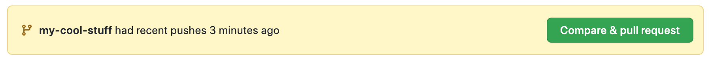
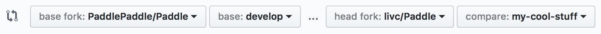

# Guide of submitting PR to GitHub

## Tthe submit of Pull Request

- Please note the number of commit:

Reason：It will bother reviewers a lot if a dozen of commits are submitted after modification of only one file and only a few modifications are updated in every commit.Reviewers have to check commit one by one to figure out the modification.And sometimes it needs to take the overlap among commits into consideration.

Suggestion: Keep as few commits as possible for each commit. You can merge the latest 3 commits into one through `git rebase -i HEAD~3` (you can modify the value according to the actual situation).you can refer to [rebase usage](https://www.jianshu.com/p/4a8f4af4e803).

- Pay attention to the name of every commit:It would be better to abstract the content of present commit and be not too arbitrary.

- <font color="#FF0000">Please do not merge the develop branch frequently (when passing CI, it will automatically merge develop)</font>, which will make the CI run again and prolong the CI passing time.

- After the reviewer has reviewed, it is not allowed to use git push -f to forcibly submit the code, so that the reviewer cannot see the diff before and after the modification, making the review difficult.

## Finish Pull Request create PR

Create an Issue to describe your problem and keep its number.

Switch to the branch you have created and click `Compare & pull request`。



Switch to targeted branch:



If the issue of an Issue is resolved, please add: fix #issue_number to the first comment box of the PUll Request, so that when the PUll Request is merged, the corresponding Issue will be automatically closed. Keywords include: close, closes, closed, fix, fixes, fixed, resolve, resolves, resolved, please choose the appropriate word. For details, please refer to

Then please wait for review.If there is any need to make a modification,you can update corresponding branch in origin following the steps above.


## Sign CLA and pass unit tests

### Sign CLA

For the first time to submit Pull Request,you need to sign CLA(Contributor License Agreement) to ensure merge of your code.Specific steps are listed as follows:

- Please check the Check in PR to find license/cla and click detail on the right to change into CLA website.

<div align="center">


 </div>

- Please click “Sign in with GitHub to agree” in CLA website.It will change into your Pull Request page after the click.

<div align="center">


 </div>


### Pass unit tests

Every new commit in your Pull Request will trigger CI unit tests,so please make sure that necessary comments have been included in your commit message.Please refer to [commit](./local_dev_guide_cn.html#commit)

Please note the procedure of CI unit tests in your Pull Request which will be finished in several hours.

Green ticks after all tests means that your commit has passed all unit tests,you only need to focus on showing the Required tasks, the ones not showing may be the tasks we are testing.

Red cross after the tests means your commit hasn't passed certain unit test.Please click detail to view bug details and make a screenshot of bug,then add it as a comment in your Pull Request.Our stuff will help you check it.


## Delete remote branch

We can delete branches of remote repository in PR page after your PR is successfully merged into master repository.


We can also delete the branch of remote repository with `git push origin :the_branch_name`,such as:

```bash
➜  git push origin :my-cool-stuff
```

## Delete local branch

Finally,we delete local branch

```bash
# Switch to develop branch
➜  git checkout develop
# delete my-cool-stuff branch
➜  git branch -D my-cool-stuff
```

And now we finish a full process of code contribution
