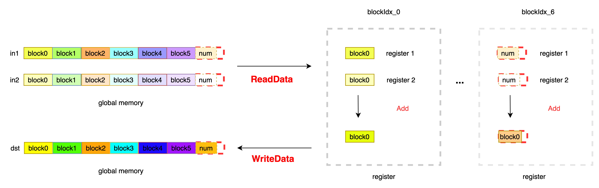

# ElementwiseAdd
## Description
+ To complete the addition of two numbers of the same shape, the input is InT type, and the output is OutT type, and the corresponding calculation is completed according to the OpFunc.

### OpFunc Definition

```
OpFunc : Used to define calculation rules. Addfunctor is defined as follows:

template <typename InT>
struct AddFunctor {
  HOSTDEVICE InT operator()(const InT &a, const InT &b) const { return (a + b); }
};

```
### Kernel Description
Each thread reads VecSize elements continuously, and divides the data processing into 2 parts according to the relationship between the remaining elements num and VecSize * blockDim.x. The first part, when VecSize * blockDim.x > num, indicates that the current data processing requires boundary processing, IsBoundary is set to true to avoid memory fetching out of bounds; the second part, no boundary processing is required, set IsBoundary = false. According to the data pointer of the current block, the data is read from the global memory to the register, and after the addition operation, the data is written into the global memory. Note that the Init function is used here to initialize the registers arg0 and arg1 to avoid the situation where arg0 or arg1 is used as the denominator to be 0. The summation of two numbers is completed according to OpFunc. When two numbers need to be multiplied, the Functor can be directly modified. Kernel code can be reused directly to improve development efficiency. </br>
The data processing process of ElementwiseAdd is as follows:</br>


### Code

```

#include "kernel_primitives/kernel_primitives.h"
template<int VecSize, typename InT, typename OutT, typename OpFunc, bool IsBoundary>
__device__ void ElementwiseAddImpl(InT *in0, InT * in1, OutT * out, OpFunc func, int num) {

  InT arg0[VecSize];
  InT arg1[VecSize];
  OutT result[VecSize];

  // init arg0 and arg1
  Init<InT, VecSize>(arg0, static_cast<OutT>(1.0f));
  Init<InT, VecSize>(arg1, static_cast<OutT>(1.0f));

  // read data from global memory
  ReadData<InT, InT, VecSize, 1, 1, IsBoundary>(arg0, in0, num);
  ReadData<InT, InT, VecSize, 1, 1, IsBoundary>(arg1, in1, num);

  // compute resut[i] = args[i] + arg1[i]
  ElementwiseBinary<InT, OutT, VecSize, 1, 1, OpFunc>(result, arg0, arg1, func);

  // write data
  WriteData<OutT, VecSize, 1, 1, IsBoundary>(out, result, num);
}

template<int VecSize, typename InT, typename OutT>
__global__ void ElementwiseAdd(InT *in0, InT *in1, OutT *out, int size) {

  // get the data offset of this Block
  int data_offset = VecSize * blockIdx.x * blockDim.x;

  // get the stride offset the block
  int stride = gridDim.x * blockDim.x * VecSize;

  for (int offset = data_offset; offset < size; offset += stride) {
    if (offset + blockDim.x * VecSize < size) {  // set IsBoundary = false

      ElementwiseAddImpl<VecSize, InT, OutT, AddFunctor<InT, OutT>, false>(in0 + offset, in1 + offset, out + offset, AddFunctor<InT, OutT>(), size - offset);

    } else {  // left num is smaller than blockDim.x * VecSize, IsBoundary must be true

      ElementwiseAddImpl<VecSize, InT, OutT, AddFunctor<InT, OutT>, true>(in0 + offset, in1 + offset, out + offset, AddFunctor<InT, OutT>(), size - offset);

    }
  }
}

```
