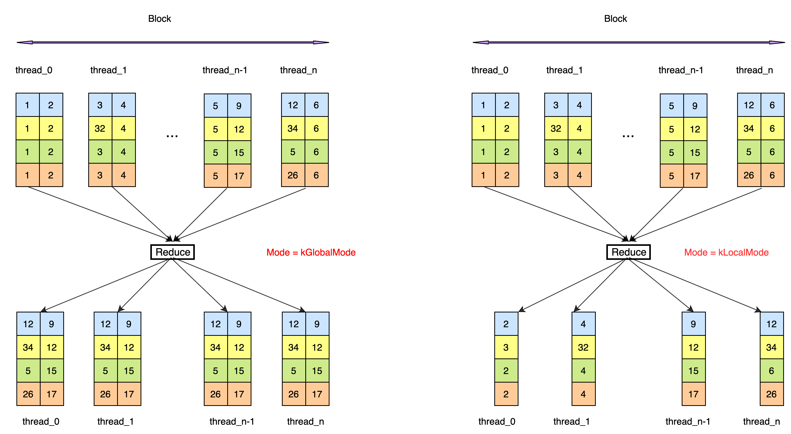

# API Description - Compute
## [ElementwiseUnary](https://github.com/PaddlePaddle/Paddle/blob/develop/paddle/phi/kernels/primitive/compute_primitives.h#L176)
### Function Definition

```
template <typename InT, typename OutT, int NX, int NY, int BlockSize, class OpFunc>
__device__ void ElementwiseUnary(OutT* out, const InT* in, OpFunc compute)
```

### Detailed Description

The input is calculated according to the calculation rules in OpFunc, and the calculation result is stored in the register out according to the OutT type.

### Template Parameters

> InT: The type of input. </br>
> OutT: The type stored in the out register. </br>
> NX: Each thread needs to calculate NX columns. </br>
> NY: Each thread needs to calculate NY rows. </br>
> BlockSize: Device attribute, which identifies the current device thread indexing method. For GPU, threadIdx.x is used as the thread index, this parameter is not currently supported. </br>
> OpFunc: calculation function, please refer to the OpFunc section for definitions.</br>

### Parameters

> out: Output register pointer, the size is NX * NY. </br>
> in: Input register pointer, the size is NX * NY. </br>
> compute: Calculation function, declared as OpFunc&lt;InT&gt;(). </br>

## [ElementwiseBinary](https://github.com/PaddlePaddle/Paddle/blob/develop/paddle/phi/kernels/primitive/compute_primitives.h#L215)
### Function Definition

```
template <typename InT, typename OutT, int NX, int NY, int BlockSize, class OpFunc>
__device__ void ElementwiseBinary(OutT* out, const InT* in1, const InT* in2, OpFunc compute)
```

### Detailed Description

Calculate in1 and in2 according to the calculation rules in OpFunc, and store the calculation result in the register out according to the OutT type.

### Template Parameters
> InT: The type of input data. </br>
> OutT: The type stored in the out register. </br>
> NX: Each thread needs to calculate NX columns. </br>
> NY: Each thread needs to calculate NY rows. </br>
> BlockSize: Device attribute, which identifies the current device thread indexing method. For GPU, threadIdx.x is used as the thread index, this parameter is not currently supported. </br>
> OpFunc: calculation function, please refer to the OpFunc section for definitions.</br>

### Parameters

> out: Output register pointer, the size is NX * NY. </br>
> in1: The pointer of the left operand register, the size is NX * NY. </br>
> in2: Right operand register pointer, the size is NX * NY. </br>
> compute: The calculation object declared as OpFunc&lt;InT&gt;(). </br>

## [CycleBinary](https://github.com/PaddlePaddle/Paddle/blob/develop/paddle/phi/kernels/primitive/compute_primitives.h#L343)

### Function Definition

```
template <typename InT, typename OutT, int NX, int NY, int BlockSize, class OpFunc>
__device__ void CycleBinary(OutT* out, const InT* in1, const InT* in2, OpFunc compute)
```

### Detailed Description

Calculate in1 and in2 according to the calculation rules in the OpFunc, and store the calculation results in the register out according to the OutT type. The shape of in1 is [1, NX], and the shape of in2 is [NY, NX], realizing in1, in2 Loop calculation, the shape of out is [NY, NX].

### Template Parameters

> InT: Type of input data. </br>
> OutT: The type stored in the out register. </br>
> NX: Each thread needs to calculate NX columns. </br>
> NY: Each thread needs to calculate NY rows. </br>
> BlockSize: Device attribute, which identifies the current device thread indexing method. For GPU, threadIdx.x is used as the thread index, this parameter is not currently supported. </br>
> OpFunc: calculation function, please refer to the OpFunc section for definitions.</br>

### Parameters

> out: Output register pointer, the size is NX * NY. </br>
> in1: The pointer of the left operand register, the size is NX. </br>
> in2: Right operand register pointer, the size is NX * NY. </br>
> compute: The calculation object declared as OpFunc&lt;InT&gt;(). </br>

## [ElementwiseTernary](https://github.com/PaddlePaddle/Paddle/blob/develop/paddle/phi/kernels/primitive/compute_primitives.h#L256)

### Function Definition

```
template <typename InT, typename OutT, int NX, int NY, int BlockSize, class OpFunc>
 __device__ void ElementwiseTernary(OutT* out, const InT* in1, const InT* in2, const InT* in3, OpFunc compute)

```

### Detailed Description

Calculate in1, in2, and in3 according to the calculation rules in OpFunc, and store the calculation result in the register out according to the OutT type.

### Template Parameters

> InT: Type of input data. </br>
> OutT: The type stored in the out register. </br>
> NX: Each thread needs to calculate NX columns. </br>
> NY: Each thread needs to calculate NY rows. </br>
> BlockSize: Device attribute, which identifies the current device thread indexing method. For GPU, threadIdx.x is used as the thread index, this parameter is not currently supported. </br>
> OpFunc: calculation function, please refer to the OpFunc section for definitions.</br>

### Parameters

> out: Output register pointer, the size is NX * NY. </br>
> in1: The register pointer of operand 1, the size is NX * NY. </br>
> in2: The register pointer of operand 2, the size is NX * NY. </br>
> in3: The register pointer of operand 3, the size is NX * NY. </br>
> compute: Declared as the calculation object of OpFunc&lt;InT&gt;(). </br>

## [ElementwiseAny](https://github.com/PaddlePaddle/Paddle/blob/develop/paddle/phi/kernels/primitive/compute_primitives.h#L297)

### Function Definition

```
template <typename InT, typename OutT, int NX, int NY, int BlockSize, int Arity, class OpFunc>
__device__ void ElementwiseAny(OutT* out, InT (*ins)[NX * NY], OpFunc compute)
```

### Detailed Description

Calculate the input in ins according to the calculation rules in OpFunc, and store the calculation result in the register out according to the OutT type. All inputs and output have the same shapes.

### Template Parameters

> InT: Type of input data. </br>
> OutT: The type stored in the out register. </br>
> NX: Each thread needs to calculate NX columns. </br>
> NY: Each thread needs to calculate NY rows. </br>
> BlockSize: Device attribute, which identifies the current device thread indexing method. For GPU, threadIdx.x is used as the thread index, this parameter is not currently supported. </br>
> Arity: The number of pointers in the pointer array ins. </br>
> OpFunc: calculation function, please refer to the OpFunc section for definitions.</br>

### Parameters

> out: Output register pointer, the size is NX * NY. </br>
> ins: A pointer array composed of multiple input pointers, the size is Arity. </br>
> compute: The calculation object declared as OpFunc&lt;InT&gt;(). </br>

## [Reduce](https://github.com/PaddlePaddle/Paddle/blob/develop/paddle/phi/kernels/primitive/compute_primitives.h#L389)

### Function Definition

```
template <typename T, int NX, int NY, int BlockSize, class ReduceFunctor, details::ReduceMode Mode>
__device__ void Reduce(T* out, const T* in, ReduceFunctor reducer, bool reduce_last_dim)
```

### Detailed Description

Reduce the input according to the reducer, the input shape is [NY, NX], when Mode = kLocalMode, reduce in along the NX direction to complete the intra-thread protocol, out is [NY, 1]; when Mode = kGlobalMode , Use shared memory to complete the protocol operation between threads in the block, the size of in and out are the same, both are [NY, NX].</br>
The data processing process of ReduceMax is as follows:</br>


### Template Parameters

> T: Type of input data. </br>
> NX: Each thread needs to calculate NX columns. </br>
> NY: Each thread needs to calculate NY rows. </br>
> BlockSize: Device attribute, which identifies the current device thread indexing method. For GPU, threadIdx.x is used as the thread index, this parameter is not currently supported. </br>
> ReduceFunctor: Reduce calculation function, please refer to the OpFunc section for definitions.</br>
> Mode : Reduce mode can be kGlobalMode or kLocalMode.

### Parameters

> out: Output register pointer, the size is NX * NY. </br>
> in: Input register pointer, the size is NX * NY. </br>
> reducer: Reduction method, which can be defined using ReduceFunctor&lt;T&gt;(). </br>
> reduce_last_dim: Indicates whether the last dimension of the original input is reduced. </br>
