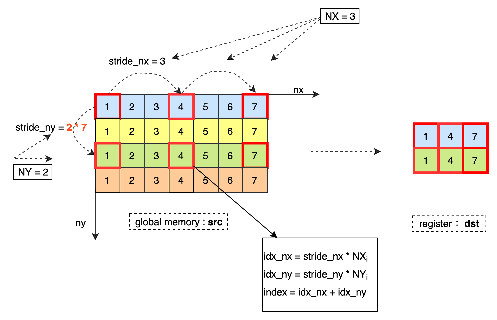
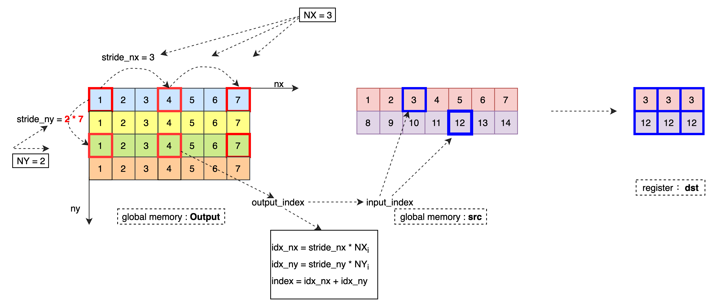
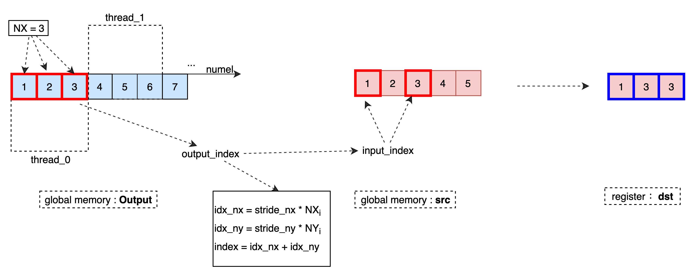
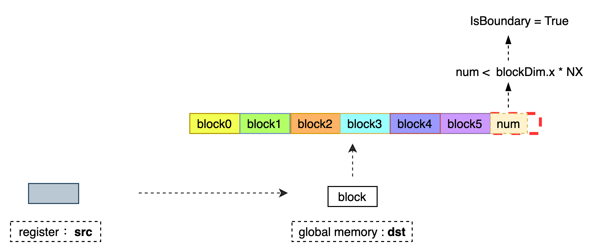
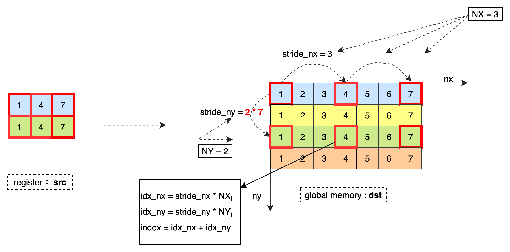

# API 介绍 - IO
介绍目前 Kernel Primitive API 提供的用于全局内存和寄存器进行数据交换的 API。当前实现的 IO 类 API 均是 Block 级别的多线程 API，函数内部以 blockDim.x 或 blockDim.y 进行线程索引。
## [ReadData](https://github.com/PaddlePaddle/Paddle/blob/develop/paddle/phi/kernels/primitive/datamover_primitives.h#L121)
### 函数定义

```
template <typename Tx, typename Ty, int NX, int NY, int BlockSize, bool IsBoundary = false>
__device__ void ReadData(Ty* dst, const Tx* src, int size_nx, int size_ny, int stride_nx, int stride_ny);
```

### 函数说明

将 Tx 类型的 2D 数据从全局内存中读取到寄存器，并按照 Ty 类型存储到寄存器 dst 中。最低维每读取 1 个元素需要偏移 stride_nx 个元素，最高维每读取 1 个元素需要偏移 stride_ny 个元素，直到加载 NX * NY 个数据到寄存器 dst 中。当 IsBoundary = true 需要保证当前最高维偏移个数不超过 size_ny，列偏移个数不超过 size_nx。</br>
数据处理过程如下：</br>



### 模板参数

> Tx ：数据存储在全局内存中的数据类型。</br>
> Ty ：数据存储到寄存器上的类型。</br>
> NX ：每个线程读取 NX 列数据。</br>
> NY ：每个线程读取 NY 行数据。</br>
> BlockSize ：设备属性，标识当前设备线程索引方式。对于 GPU，threadIdx.x 用作线程索引，当前该参数暂不支持。</br>
> IsBoundary ：标识是否进行访存边界判断。当 Block 处理的数据总数小于 NX * NY * blockDim.x 时，需要进行边界判断以避免访存越界。</br>

### 函数参数

> dst ：输出寄存器指针，数据类型为 Ty，大小为 NX * NY。</br>
> src ：当前 Block 的输入数据指针，数据类型为 Tx。</br>
> size_nx ：当前 Block 在最低维最多偏移 size_nx 个元素，参数仅在 IsBoundary = true 时参与计算。</br>
> size_ny ：当前 Block 在最低维最多偏移 size_ny 个元素，参数仅在 IsBoundary = true 时参与计算。</br>
> stride_nx ：最低维每读取 1 个元素需要跳转 stride_nx 个元素。</br>
> stride_ny ：最高维每读取 1 个元素需要跳转 stride_ny 个元素。</br>

## [ReadData](https://github.com/PaddlePaddle/Paddle/blob/develop/paddle/phi/kernels/primitive/datamover_primitives.h#L244)

### 函数定义

```
template <typename T, int NX, int NY, int BlockSize, bool IsBoundary = false>
__device__ void ReadData(T* dst, const T* src, int num);
```

### 函数说明

将 T 类型的 1D 数据从全局内存 src 中读取到寄存器 dst 中。每次连续读取 NX 个数据，当前仅支持 NY = 1，直到加载 NX 个数据到寄存器 dst 中。当 IsBoundary = true 需要保证 Block 读取的总数据个数不超过 num，以避免访存越界。当 (NX % 4 = 0 或 NX % 2 = 0) 且 IsBoundary = false 时，会有更高的访存效率。</br>
数据处理过程如下：</br>


### 模板参数

> T ：元素类型。</br>
> NX ：每个线程连续读取 NX 列数据。</br>
> NY ：每个线程读取 NY 行数据，当前仅支持为 NY = 1。</br>
> BlockSize ：设备属性，标识当前设备线程索引方式。对于 GPU，threadIdx.x 用作线程索引，当前该参数暂不支持。</br>
> IsBoundary ：标识是否进行访存边界判断。当 Block 处理的数据总数小于 NX * NY * blockDim.x 时，需要进行边界判断以避免访存越界。</br>

### 函数参数

> dst ；输出寄存器指针，大小为 NX * NY。</br>
> src ；当前 Block 的输入数据指针。</br>
> num ；当前 Block 最多读取 num 个元素，参数仅在 IsBoundary = true 时使用。</br>

## [ReadDataBc](https://github.com/PaddlePaddle/Paddle/blob/develop/paddle/phi/kernels/primitive/datamover_primitives.h#L339)

### 函数定义

```
template <typename T, int NX, int NY, int BlockSize, int Rank, bool IsBoundary = false>
__device__ void ReadDataBc(T* dst, const T* src,
                           uint32_t block_offset,
                           details::BroadcastConfig<Rank> config,
                           int total_num_output,
                           int stride_nx,
                           int stride_ny);
```

### 函数说明

将需要进行 brodcast 的 2D 数据按照 T 类型从全局内存 src 中读取到寄存器 dst 中，其中 src 为原始输入数据指针，根据 config 计算当前输出数据对应的输入数据坐标，并将坐标对应的数据读取到寄存器中。</br>
数据处理过程如下：</br>


### 模板参数

> T ：元素类型。</br>
> NX ：每个线程读取 NX 列数据。</br>
> NY ：每个线程读取 NY 行数据。</br>
> BlockSize ：设备属性，标识当前设备线程索引方式。对于 GPU，threadIdx.x 用作线程索引，当前该参数暂不支持。</br>
> Rank ：原始输出数据的维度。</br>
> IsBoundary ：标识是否进行访存边界判断。当 Block 处理的数据总数小于 NX * NY * blockDim.x 时，需要进行边界判断以避免访存越界。</br>

### 函数参数

> dst ：输出寄存器指针，大小为 NX * NY。</br>
> src ：原始输入数据指针。</br>
> block_offset ：当前 Block 的数据偏移。</br>
> config ：输入输出坐标映射函数，可通过 BroadcastConfig(const std::vector<int64_t>& out_dims, const std::vector<int64_t>& in_dims, int dim_size) 进行定义。</br>
> total_num_output ：原始输出的总数据个数,避免访存越界，参数仅在 IsBoundary = true 时参与计算。</br>
> stride_nx ：最低维每读取 1 个元素需要跳转 stride_nx 个元素。</br>
> stride_ny ：最高维每读取 1 个元素需要跳转 stride_ny 个元素。</br>

## [ReadDataBc](https://github.com/PaddlePaddle/Paddle/blob/develop/paddle/phi/kernels/primitive/datamover_primitives.h#L660)

### 函数定义

```
template <typename T, int NX, int NY, int BlockSize, int Rank, bool IsBoundary = false>
__device__ void ReadDataBc(T* dst, const T* src,
                           uint32_t block_offset,
                           details::BroadcastConfig<Rank> config,
                           int total_num_output);
```

### 函数说明

将需要进行 brodcast 的 1D 数据按照 T 类型从全局内存 src 中读取到寄存器 dst 中，其中 src 为原始输入数据指针，根据 config 计算当前输出数据对应的输入数据坐标，并将坐标对应的数据读取到寄存器中。</br>
数据处理过程如下：</br>


### 模板参数

> T ：元素类型。</br>
> NX ：每个线程连续读取 NX 列数据。</br>
> NY ：每个线程读取 NY 行数据。当前仅支持 NY = 1</br>
> BlockSize ：设备属性，标识当前设备线程索引方式。对于 GPU，threadIdx.x 用作线程索引，当前该参数暂不支持。</br>
> Rank ：原始输出数据的维度。</br>
> IsBoundary ：标识是否进行访存边界判断。当 Block 处理的数据总数小于 NX * NY * blockDim.x 时，需要进行边界判断以避免访存越界。</br>

### 函数参数

> dst ：输出寄存器指针，大小为 NX * NY。</br>
> src ：原始输入数据指针。</br>
> block_offset ：当前 Block 的数据偏移。</br>
> config ：输入输出坐标映射函数，可通过 BroadcastConfig(const std::vector<int64_t>& out_dims, const std::vector<int64_t>& in_dims, int dim_size) 进行定义。</br>
> total_num_output ：原始输出的总数据个数,避免访存越界，参数仅在 IsBoundary = true 时使用。</br>


## [ReadDataReduce](https://github.com/PaddlePaddle/Paddle/blob/develop/paddle/phi/kernels/primitive/datamover_primitives.h#L404)

### 函数定义

```
template <typename Tx, typename Ty, int NX, int NY, int BlockSize, int Rank, typename IndexCal, typename Functor, bool IsBoundary = false>
__device__ void ReadDataReduce(Tx* dst,
                               const Ty* src,
                               int block_offset,
                               const IndexCal& index_cal,
                               int size_nx,
                               int size_ny,
                               int stride_nx,
                               int stride_ny,
                               Functor func,
                               bool reduce_last_dim);
```

### 函数说明

根据 index_cal 计算当前输出数据对应的输入数据坐标，将坐标对应的数据从全局内存 src 中读取到寄存器 dst 中。根据是否需要进行规约操作将数据映射成 2D 数据，总是将最后一维所在的维度映射到线程变化最快的维度，保证数据访存效率最高。</br>
数据处理过程如下：</br>


### 模板参数

> Ty ：数据存储在全局内存中的数据类型。</br>
> Tx ：数据存储到寄存器上的类型。</br>
> NX ：每个线程读取 NX 列数据。</br>
> NY ：每个线程读取 NY 行数据。</br>
> BlockSize ：设备属性，标识当前设备线程索引方式。对于 GPU，threadIdx.x 用作线程索引，当前该参数暂不支持。</br>
> Rank ：原始输出数据的维度。</br>
> IndexCal ：输入输出坐标映射规则。定义方式如下：</br>
```
  struct IndexCal {
    __device__ inline int operator()(int index) const {
        return ...
    }
  };
```
> Functor ：输入元素在存储到寄存器前做的数据变换，如：dst[i] = SquareFunctor(src[i])。
> IsBoundary ；标识是否进行访存边界判断。当 Block 处理的数据总数小于 NX * NY * blockDim.x 时，需要进行边界判断以避免访存越界。</br>


### 函数参数

> dst ：输出寄存器指针，大小为 NX * NY。</br>
> src ：原始输入数据指针。</br>
> block_offset ；当前 Block 的数据偏移。</br>
> config ；输入输出坐标映射函数，可以定义为 IndexCal()。</br>
> size_nx ：当前 Block 最多读取 size_nx 个不需要进行规约的数据，参数仅在 IsBoundary = true 时参与计算。</br>
> size_ny ：当前 Block 最多读取 size_ny 个需要进行规约的数据，参数仅在 IsBoundary = true 时参与计算。</br>
> stride_nx ：最低维每读取 1 个元素需要跳转 stride_nx 列。</br>
> stride_ny ：最高维每读取 1 个元素需要跳转 stride_ny 行。</br>
> func : 输入数据存储到寄存器前做的数据变换，如：dst[i] = SquareFunctor<Tx>(src[i])。
> reduce_last_dim：原始输入数据的最低维是否进行 reduce，当 reduce_last_dim = true 按照 threadIdx.x 进行索引，否则使用 threadIdx.y。</br>

## [WriteData](https://github.com/PaddlePaddle/Paddle/blob/develop/paddle/phi/kernels/primitive/datamover_primitives.h#L495)

### 函数定义


```
template <typename T, int NX, int NY, int BlockSize, bool IsBoundary = false>
__device__ void WriteData(T* dst, T* src, int num);
```

### 函数说明

将 T 类型的 1D 数据从寄存器 src 写到全局内存 dst 中。每次连续读取 NX 个数据，当前仅支持 NY = 1，直到写 NX 个数据到全局内存 dst 中。当 IsBoundary = true 需要保证当前 Block 向全局内从中写的总数据个数不超过 num，以避免访存越界。当 (NX % 4 = 0 或 NX % 2 = 0) 且 IsBoundary = false 时，会有更高的访存效率。</br>
数据处理过程如下：</br>


### 模板参数

> T ：元素类型。</br>
> NX ：每个线程连续读取 NX 列数据。</br>
> NY ：每个线程读取 NY 行数据，当前仅支持为 NY = 1。</br>
> BlockSize ：设备属性，标识当前设备线程索引方式。对于 GPU，threadIdx.x 用作线程索引，当前该参数暂不支持。</br>
> IsBoundary ：标识是否进行访存边界判断。当 Block 处理的数据总数小于 NX * NY * blockDim.x 时，需要进行边界判断以避免访存越界。</br>

### 函数参数

> dst ；当前 Block 的输出数据指针。</br>
> src ；寄存器指针，大小为 NX * NY。</br>
> num ；当前 Block 最多读取 num 个元素，参数仅在 IsBoundary = true 时使用。</br>

## [WriteData](https://github.com/PaddlePaddle/Paddle/blob/develop/paddle/phi/kernels/primitive/datamover_primitives.h#L545)

### 函数定义


```
template <typename Tx, typename Ty, int NX, int NY, int BlockSize, bool IsBoundary = false>
__device__ void WriteData(Ty* dst, const Tx* src, int size_nx, int size_ny, int stride_nx, int stride_ny);
```

### 函数说明

将 Tx 类型的 2D 数据从寄存器中写入到全局内存，并按照 Ty 类型存储到全局内存 dst 中。最低维每写入 1 个元素需要偏移 stride_nx 个元素，最高维每写入 1 个元素需要偏移 stride_ny 个元素，直到将寄存器 NX * NY 个数据全部写入到全局内存 dst 中。当 IsBoundary = true 需要保证当前最高维偏移个数不超过 size_ny，列偏移个数不超过 size_nx。</br>
数据处理过程如下：</br>


### 模板参数

> Ty ：数据存储在全局内存中的数据类型。</br>
> Tx ：数据存储到寄存器上的类型。</br>
> NX ：每个线程读取 NX 列数据。</br>
> NY ：每个线程读取 NY 行数据。</br>
> BlockSize ：设备属性，标识当前设备线程索引方式。对于 GPU，threadIdx.x 用作线程索引，当前该参数暂不支持。</br>
> IsBoundary ：标识是否进行访存边界判断。当 Block 处理的数据总数小于 NX * NY * blockDim.x 时，需要进行边界判断以避免访存越界。</br>

### 函数参数

> dst ：当前 Block 的输出数据指针。</br>
> src ：寄存器指针，数据类型为 Tx。</br>
> size_nx ：Block 最多偏移 size_nx 个元素，参数仅在 IsBoundary = true 时参与计算。</br>
> size_ny ：Block 最多偏移 size_ny 个元素，参数仅在 IsBoundary = true 时参与计算。</br>
> stride_nx ：最低维每读取 1 个元素需要跳转 stride_nx 个元素。</br>
> stride_ny ：最高维每读取 1 个元素需要跳转 stride_ny 个元素。</br>

## [Init](https://github.com/PaddlePaddle/Paddle/blob/develop/paddle/phi/kernels/primitive/datamover_primitives.h#L214)

### 函数定义


```
template <typename T, int NX>
__device__ void Init(T* dst, T init_data);
```

### 函数说明

将寄存器 dst 中的所有元素初始化为 init_data。

### 模板参数

> T ：元素类型。</br>
> NX ：初始化 NX 个元素。</br>

### 函数参数

> dst ；寄存器指针。</br>
> init_data ；初始值。</br>

## [Init](https://github.com/PaddlePaddle/Paddle/blob/develop/paddle/phi/kernels/primitive/datamover_primitives.h#L637)

### 函数定义


```
template <typename T, int NX, int IsBoundary = false>
__device__ void Init(T* dst, T* src, int num);
```

### 函数说明

使用 src 寄存器中的元素对 dst 中的 NX 个元素进行初始化，当 IsBoundary = true 时，初始化个数不超过 num。

### 模板参数

> T ：元素类型。</br>
> NX ：初始化 NX 个元素。</br>
> IsBoundary ：是否为初始化边界， 当 NX > num 时， IsBoundary = true。</br>

### 函数参数

> dst ；输出寄存器指针。</br>
> src ；输入寄存器指针。</br>
> num ；初始化的个数。</br>
