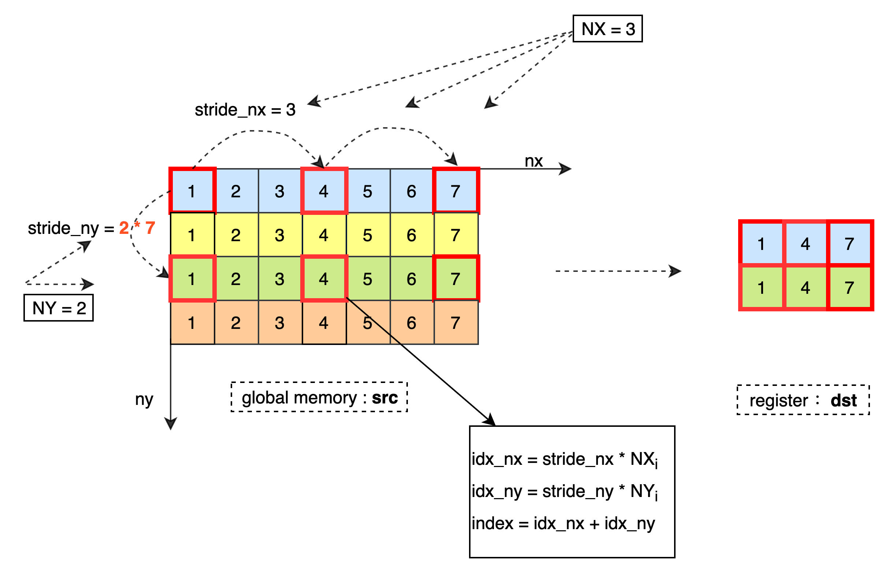
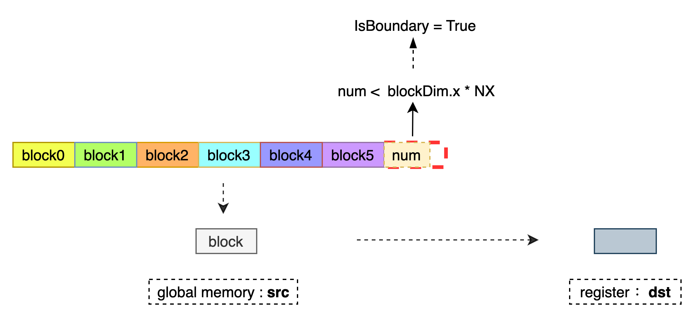
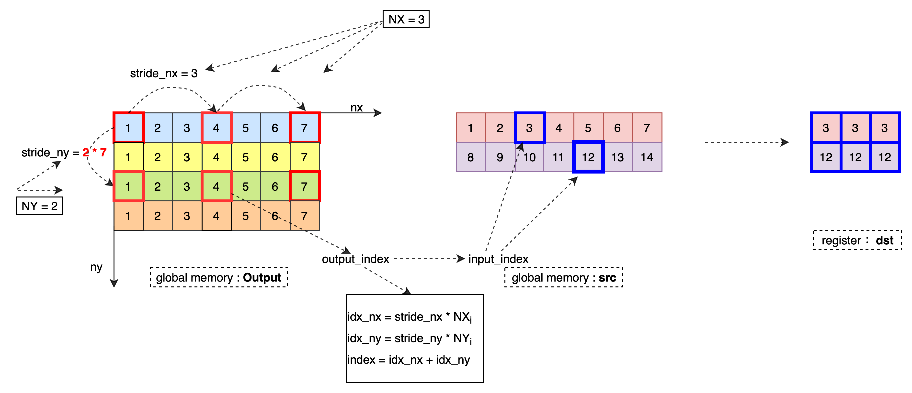
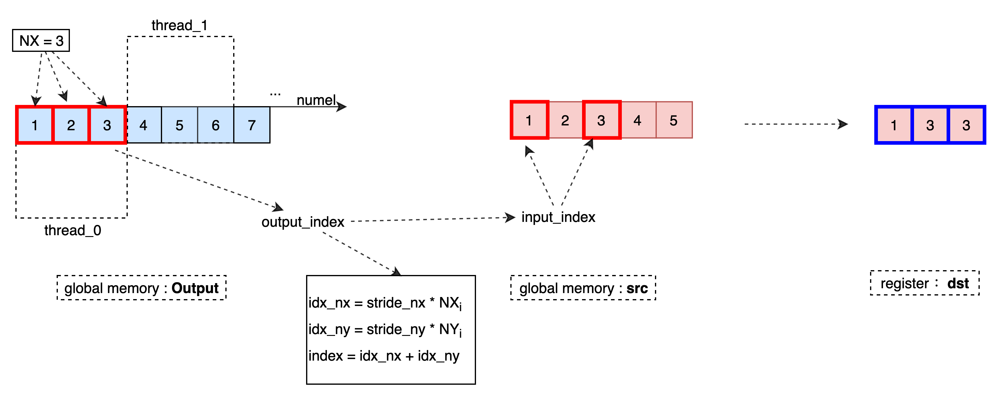
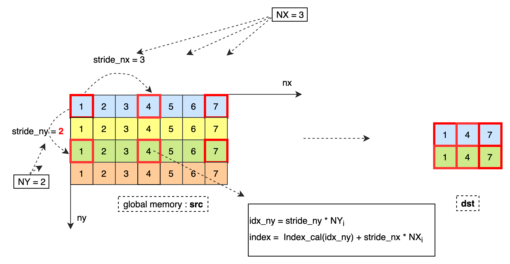
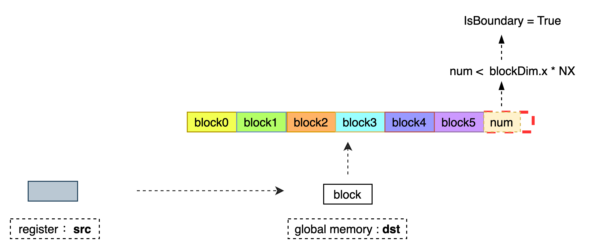
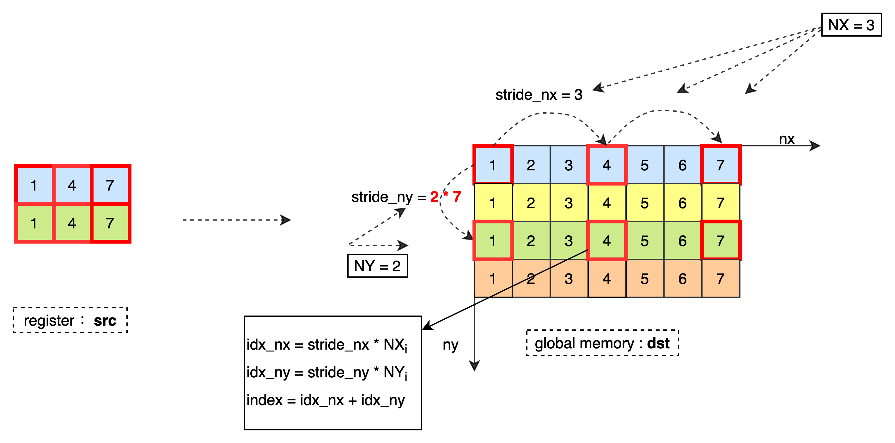

# API Description - IO
Introduce the APIs currently provided by the Kernel Primitive API for data exchange between global memory and registers. The currently implemented IO APIs are all multi-threaded APIs at the Block level, the function uses blockDim.x or blockDim.y for thread indexing.
## [ReadData](https://github.com/PaddlePaddle/Paddle/blob/develop/paddle/phi/kernels/primitive/datamover_primitives.h#L121)
### Function Definition

```
template <typename Tx, typename Ty, int NX, int NY, int BlockSize, bool IsBoundary = false>
__device__ void ReadData(Ty* dst, const Tx* src, int size_nx, int size_ny, int stride_nx, int stride_ny);
```

### Description

Read the Tx type 2D data from the global memory to the register, and store it in the register dst according to the Ty type. Each reading of 1 element in the lowest dimension requires an offset of stride_nx elements, and each reading of an element in the highest dimension requires an offset of stride_ny elements until NX * NY data is loaded into the register dst. When IsBoundary = true, it is necessary to ensure that the number of current highest dimension offsets does not exceed size_ny, and the number of column offsets does not exceed size_nx.
The data processing process is as follows:</br>


### Template Parameters

> Tx: The type of data stored in the global memory. </br>
> Ty: The type of data stored in the register. </br>
> NX: Each thread reads NX columns data. </br>
> NY: Each thread reads NY rows data. </br>
> BlockSize: Device attribute, which identifies the current device thread indexing method. For GPU, threadIdx.x is used as the thread index, this parameter is not currently supported. </br>
> IsBoundary: Identifies whether to fetch memory boundary judgment. When the total number of data processed by the Block is less than NX * NY * blockDim.x, boundary judgment is required to avoid memory access crossing the boundary. </br>

### Parameters

> dst: Output register pointer, data type is Ty, size is NX * NY. </br>
> src: The input data pointer of the current Block, the data type is Tx, and the pointer calculation method is usually input + blockIdx.x * blockDim.x * NX. </br>
> size_nx: The maximum offset of the current block is size_nx elements in the lowest dimension. The parameters are only calculated when isboundary = true. </br>
> size_ny: The maximum offset of the current block is size_nx elements in the lowest dimension. The parameters are only calculated when isboundary = true. </br>
> stride_nx: Stride stride_nx elements for every 1 element of the lowest dimension read. </br>
> stride_ny: Stride stride_ny elements per read 1 element of the highest dimension read. </br>

## [ReadData](https://github.com/PaddlePaddle/Paddle/blob/develop/paddle/phi/kernels/primitive/datamover_primitives.h#L244)

### Function Definition

```
template <typename T, int NX, int NY, int BlockSize, bool IsBoundary = false>
__device__ void ReadData(T* dst, const T* src, int num);
```

### Description

Read the 1D data of type T from the global memory src to the register dst. Continuously read NX data at a time. Currently, only NY = 1 is supported until NX data is loaded into the register dst. When IsBoundary = true, it is necessary to ensure that the total number of data read by the Block does not exceed num to avoid memory fetching out of bounds. When (NX% 4 = 0 or NX% 2 = 0) and IsBoundary = false, there will be higher memory access efficiency.</br>
The data processing process is as follows:</br>


### Template Parameters

> T: Element type. </br>
> NX: Each thread reads NX columns data continuously. </br>
> NY: Each thread reads NY rows data. Currently, only NY = 1 is supported. </br>
> BlockSize: Device attribute, which identifies the current device thread indexing method. For GPU, threadIdx.x is used as the thread index, this parameter is not currently supported. </br>
> IsBoundary: Identifies whether to fetch memory boundary judgment. When the total number of data processed by the Block is less than NX * NY * blockDim.x, boundary judgment is required to avoid memory access crossing the boundary. </br>

### Parameters

> dst: Output register pointer, the size is NX * NY. </br>
> src: The input data pointer of the current Block, usually input + blockIdx.x * blockDim.x * NX.</br>
> num: The current Block can read at most num elements. The parameter is only used when IsBoundary = true.</br>

## [ReadDataBc](https://github.com/PaddlePaddle/Paddle/blob/develop/paddle/phi/kernels/primitive/datamover_primitives.h#L339)

### Function Definition

```
template <typename T, int NX, int NY, int BlockSize, int Rank, bool IsBoundary = false>
__device__ void ReadDataBc(T* dst, const T* src,
                           uint32_t block_offset,
                           details::BroadcastConfig<Rank> config,
                           int total_num_output,
                           int stride_nx,
                           int stride_ny);
```

### Description

Read the 2D data that needs to be brodcast from the global memory src into the register dst according to the T type, where src is the original input data pointer, calculate the input data coordinates corresponding to the current output data according to config, and read the data corresponding to the coordinates to the register. </br>
The data processing process is as follows:</br>


### Template Parameters

> T: Element type. </br>
> NX: Each thread reads NX columns data. </br>
> NY: Each thread reads NY rows data. </br>
> BlockSize: Device attribute, which identifies the current device thread indexing method. For GPU, threadIdx.x is used as the thread index, this parameter is not currently supported. </br>
> Rank: The dimension of the original output data. </br>
> IsBoundary: Identifies whether to fetch memory boundary judgment. When the total number of data processed by the Block is less than NX * NY * blockDim.x, boundary judgment is required to avoid memory access crossing the boundary. </br>

### Parameters

> dst: Output register pointer, the size is NX * NY. </br>
> src: Pointer to raw input data. </br>
> block_offset: The data offset of the current Block, usually blockIdx.x * blockDim.x * NX. </br>
> config: Input and output coordinate mapping function, which can be defined by BroadcastConfig(const std::vector<int64_t>& out_dims, const std::vector<int64_t>& in_dims, int dim_size). </br>
> total_num_output: the total number of original output data, to avoid fetching out of bounds, the parameter is only used when IsBoundary = true. </br>
> stride_nx: Stride stride_nx elements for every 1 element of the lowest dimension read. </br>
> stride_ny: Stride stride_ny elements per read 1 element of the highest dimension read. </br>

## [ReadDataBc](https://github.com/PaddlePaddle/Paddle/blob/develop/paddle/phi/kernels/primitive/datamover_primitives.h#L660)

### Function Definition

```
template <typename T, int NX, int NY, int BlockSize, int Rank, bool IsBoundary = false>
__device__ void ReadDataBc(T* dst, const T* src,
                           uint32_t block_offset,
                           details::BroadcastConfig<Rank> config,
                           int total_num_output);
```

### Description

Read the 1D data that needs to be brodcast from the global memory src into the register dst according to the T type, where src is the original input data pointer, calculate the input data coordinates corresponding to the current output data according to config, and read the data corresponding to the coordinates to the register. </br>
The data processing process is as follows:</br>


### Template Parameters

> T: Element type. </br>
> NX: Each thread reads NX columns data continuously. </br>
> NY: Each thread reads NY rows data, Ony NY = 1 was supported. </br>
> BlockSize: Device attribute, which identifies the current device thread indexing method. For GPU, threadIdx.x is used as the thread index, this parameter is not currently supported. </br>
> Rank: The dimension of the original output data. </br>
> IsBoundary: Identifies whether to fetch memory boundary judgment. When the total number of data processed by the Block is less than NX * NY * blockDim.x, boundary judgment is required to avoid memory access crossing the boundary. </br>

### Parameters

> dst: Output register pointer, the size is NX * NY. </br>
> src: Pointer to raw input data. </br>
> block_offset: The data offset of the current Block, usually blockIdx.x * blockDim.x * NX. </br>
> config: Input and output coordinate mapping function, which can be defined by BroadcastConfig(const std::vector<int64_t>& out_dims, const std::vector<int64_t>& in_dims, int dim_size). </br>
> total_num_output: the total number of original output data, to avoid fetching out of bounds, the parameter is only used when IsBoundary = true. </br>

## [ReadDataReduce](https://github.com/PaddlePaddle/Paddle/blob/develop/paddle/phi/kernels/primitive/datamover_primitives.h#L404)

### Function Definition

```
template <typename Tx, typename Ty, int NX, int NY, int BlockSize, int Rank, typename IndexCal, typename Functor, bool IsBoundary = false>
__device__ void ReadDataReduce(Ty* dst,
                               const Tx* src,
                               int block_offset,
                               const IndexCal& index_cal,
                               int size_nx,
                               int size_ny,
                               int stride_nx,
                               int stride_ny,
                               Functor func,
                               bool reduce_last_dim);
```

### Description

Read the 2D data from the global memory src into the register dst in T type, where src is the original input data pointer according to the index_Cal calculates the input data coordinates corresponding to the current output data and reads the data corresponding to the coordinates into the register. Map the data into 2D data according to whether a protocol operation is required, and always map the dimension where the last dimension is located to the dimension with the fastest thread change to ensure the highest data access efficiency. </br>
The data processing process is as follows:</br>


### Template Parameters

> Ty: The type of data stored in the global memory. </br>
> Tx: The type of data stored in the register. </br>
> NX: Each thread reads NX columns data. </br>
> NY: Each thread reads NY rows data. </br>
> BlockSize: Device attribute, which identifies the current device thread indexing method. For GPU, threadIdx.x is used as the thread index, this parameter is not currently supported. </br>
> Rank: The dimension of the original output data. </br>
> IndexCal: Input and output coordinate mapping rules. The definition is as follows:</br>
```
  struct IndexCal {
    __device__ inline int operator()(int index) const {
        return ...
    }
  };
```
> Functor: The data transformation done before the input element is stored in the register, such as: dst[i] = SquareFunctor(src[i]).
> IsBoundary: Identifies whether to fetch memory boundary judgment. When the total number of data processed by the Block is less than NX * NY * blockDim.x, boundary judgment is required to avoid memory access crossing the boundary. </br>


### Parameters

> dst: Output register pointer, the size is NX * NY. </br>
> src: Pointer to raw input data. </br>
> block_offset: The data offset of the current Block, usually blockIdx.x * blockDim.x * NX. </br>
> config: Input and output coordinate mapping function, which can be defined as IndexCal(). </br>
> size_nx: The current Block can read at most size_nx data that does not require Reduce, and the parameter only participates in the calculation when IsBoundary = true.</br>
> size_ny: The current Block can read at most size_ny data that require Reduce, and the parameter only participates in the calculation when IsBoundary = true.</br>
> stride_nx: Stride stride_nx columns for every 1 element of the lowest dimension read. </br>
> stride_ny: Stride stride_ny rows for every 1 element of the highest dimension read. </br>
> func: The data transformation done before the input element is stored in the register, such as: dst[i] = SquareFunctor(src[i]).
> reduce_last_dim: Does the  operation involve the last dimension. When reduce_last_dim = true, it is indexed according to threadIdx.x, otherwise threadIdx.y is used. </br>

## [WriteData](https://github.com/PaddlePaddle/Paddle/blob/develop/paddle/phi/kernels/primitive/datamover_primitives.h#L495)

### Function Definition


```
template <typename T, int NX, int NY, int BlockSize, bool IsBoundary = false>
__device__ void WriteData(T* dst, T* src, int num);
```

### Description

Write 1D data from register src to global memory dst. Continuously read NX data at a time, currently only supports NY = 1 until NX data is written to the global memory dst. When IsBoundary = true, it is necessary to ensure that the total number of data written from the current Block to the world does not exceed num to avoid memory fetching out of bounds. When (NX% 4 = 0 or NX% 2 = 0) and IsBoundary = false, there will be higher memory access efficiency. </br>
The data processing process is as follows:</br>


### Template Parameters

> T: Element type. </br>
> NX: Each thread reads NX columns data continuously. </br>
> NY: Each thread reads NY rows data. Currently, only NY = 1 is supported. </br>
> BlockSize: Device attribute, which identifies the current device thread indexing method. For GPU, threadIdx.x is used as the thread index, this parameter is not currently supported. </br>
> IsBoundary: Identifies whether to fetch memory boundary judgment. When the total number of data processed by the Block is less than NX * NY * blockDim.x, boundary judgment is required to avoid memory access crossing the boundary. </br>

### Parameters

> dst: The output data pointer of the current Block, usually input + blockIdx.x * blockDim.x * NX. </br>
> src: Register pointer, the size is NX * NY. Usually input + blockIdx.x * blockDim.x * NX. </br>
> num: The current Block reads num elements in multiples. The parameter is only used when IsBoundary = true. </br>

## [WriteData](https://github.com/PaddlePaddle/Paddle/blob/develop/paddle/phi/kernels/primitive/datamover_primitives.h#L545)

### Function Definition


```
template <typename Tx, typename Ty, int NX, int NY, int BlockSize, bool IsBoundary = false>
__device__ void WriteData(Ty* dst, const Tx* src, int size_nx, int size_ny, int stride_nx, int stride_ny);
```

### Description

Write the Tx type 2D data from the register to the global memory and store it in the global memory dst according to the Ty type. Each element written in the lowest dimension needs to be offset by stride_nx elements, and each element written in the highest dimension needs to be offset by stride_ny elements until all the data in the register NX * NY are written into the global memory dst. When IsBoundary = true, it is necessary to ensure that the number of current highest dimension offsets does not exceed size_ny, and the number of column offsets does not exceed size_nx. </br>
The data processing process is as follows:</br>


### Template Parameters

> Ty: The type of data stored in the global memory. </br>
> Tx: The type of data stored in the register. </br>
> NX: Each thread reads NX columns data. </br>
> NY: Each thread reads NY rows data. </br>
> BlockSize: Device attribute, which identifies the current device thread indexing method. For GPU, threadIdx.x is used as the thread index, this parameter is not currently supported. </br>
> IsBoundary: Identifies whether to fetch memory boundary judgment. When the total number of data processed by the Block is less than NX * NY * blockDim.x, boundary judgment is required to avoid memory access crossing the boundary. </br>

### Parameters

> dst: The output data pointer of this Block. </br>
> src: The data pointer of register.</br>
> size_nx: The maximum offset of the current block is size_nx elements in the lowest dimension. The parameters are only calculated when isboundary = true. </br>
> size_ny: The maximum offset of the current block is size_nx elements in the lowest dimension. The parameters are only calculated when isboundary = true. </br>
> stride_nx: Stride stride_nx elements for every 1 element of the lowest dimension write. </br>
> stride_ny: Stride stride_ny elements per read 1 element of the highest dimension write. </br>

## [Init](https://github.com/PaddlePaddle/Paddle/blob/develop/paddle/phi/kernels/primitive/datamover_primitives.h#L214)

### Function Definition

```
template <typename T, int NX>
__device__ void Init(T* dst, T init_data);
```

### Description

Initialize all the elements in the register dst to init_data.

### Template Parameters

> T: Element type. </br>
> NX : Initialize NX elements. </br>

### Parameters

> dst : The register pointer that needs to be initialized. </br>
> init_data : Initial value. </br>

## [Init](https://github.com/PaddlePaddle/Paddle/blob/develop/paddle/phi/kernels/primitive/datamover_primitives.h#L637)

### Function Definition

```
template <typename T, int NX, int IsBoundary = false>
__device__ void Init(T* dst, T* src, int num);
```

### Description

Use the elements in the src register to initialize the NX elements in dst. When IsBoundary = true, the number of initializations does not exceed num.

### Template Parameters

> T: Element type. </br>
> NX : Initialize NX elements. </br>
> IsBoundary : Whether it is an assignment boundary. when NX > num, IsBoundary = true. </br>

### Parameter

> dst : The register pointer that needs to be initialized. </br>
> src : The register of input.</br>
> num : Number of initial data. </br>
