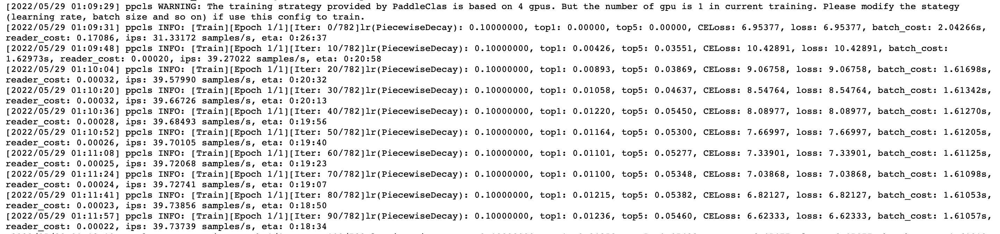

# 示例 - Model
## 模型运行说明
+ 在 GPU 平台上默认使用 Kernel Primitive API 编写的算子。
+ 在昆仑芯 2 代（XPU2）平台上使用 Kernel Primitive API 编写的算子需要开启 FLAGS\_run\_kp\_kernel 环境变量。

### XPU Kernel Primitive API Paddle 模型运行

以 resnet50 为例展示昆仑芯 2 代（XPU2）平台 KP 模型运行的基本流程。</br>
+ 1. 安装 PaddlePaddle XPU2 KP 安装包，当前仅支持 python3.7</br>
```
pip install https://paddle-wheel.bj.bcebos.com/2.3.0/xpu2/kp/paddlepaddle_xpu-2.3.0-cp37-cp37m-linux_x86_64.whl
```
+ 2. 下载模型库并安装</br>
```
git clone -b develop https://github.com/PaddlePaddle/PaddleClas.git
cd PaddleClas
python -m pip install -r requirements.txt
```
+ 3. 下载数据集<br>
```
cd dataset
rm -rf ILSVRC2012
wget -nc https://paddle-imagenet-models-name.bj.bcebos.com/data/whole_chain/whole_chain_CIFAR100.tar
tar xf whole_chain_CIFAR100.tar
ln -s whole_chain_CIFAR100 ILSVRC2012
cd ILSVRC2012
mv train.txt train_list.txt
mv test.txt val_list.txt
```
+ 4. 模型运行</br>
```
cd ../..
export FLAGS_selected_xpus=0
export FLAGS_run_kp_kernel=1
export XPUSIM_DEVICE_MODEL=KUNLUN2
nohup python tools/train.py \
-c ppcls/configs/ImageNet/ResNet/ResNet50.yaml \
-o Global.device=xpu > ResNet50_xpu2.log &
```
+ 5. 成功截图如下：</br>


### XPU2 Kernel Primitive API 模型列表

序号 | 模型名称 | 类别
-- | -- | --
1 | resnet50 | 图像分类
2 | deepfm | 推荐网络
3 | wide&deep | 推荐网络
4 | yolov3-darknet53 | 目标检测
5 | ssd-resnet34 | 目标检测
6 | orc-db | 文本检测
7 | bert-base | 自然语言
8 | transformer | 自然语言
9 | gpt-2 | 自然语言
10 | unet | 图像分割
