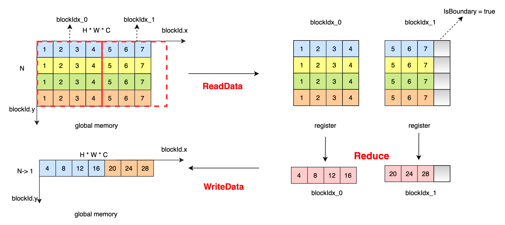

# 示例 - Reduce
## 功能说明
+ 根据 ReduceOp 中定义的计算规则对最高维度进行规约操作，例如输入为 x[N, H, W, C], axis 取值为 0, 规约后为 out[1, H, W, C]，此处以 ReduceSum 为例进行介绍。

### ReduceOp 定义
```
template <typename Tx, typename Ty = Tx>
struct IdentityFunctor {
  HOSTDEVICE explicit inline IdentityFunctor(int n) {}

  HOSTDEVICE inline Ty operator()(const Tx& x) const {
    return static_cast<Ty>(x);
  }
};

template <typename Tx, typename Ty = Tx>
struct AddFunctor {
  inline Ty initial() { return static_cast<Ty>(0.0f); }

  __device__ __forceinline__ Ty operator()(const Ty &a, const Ty &b) const {
     return b + a;
  }
};

```
### kernel 实现说明

对最高维进行规约操作，将不需要进行规约的维度进行合并，根据 NX 和 blockDim.x 对 H * W * C 进行 block 划分。对于 blockIdx_1，数据个数小于 blockDim.x * NX，则设置 IsBoundary = true，避免访存越界。将数据从全局内存中读取到寄存器中，每个线程读取 4 个元素，线程间数据没有依赖，进行线程内规约操作得到最终结果。将数据从寄存器写入全局内存中。
ReduceSum 数据处理过程如下：</br>


### kernel 代码

```
template <typename Tx, typename Ty, typename MPType, typename ReduceOp, typename TransformOp, bool IsBoundary = false>
__device__ void HigherDimImpl(const Tx* x, Ty* y, ReduceOp reducer,
                             TransformOp transform, MPType init,
                             int reduce_num, int left_num,
                             int block_num) {

  const int NY = 2;
  int idx = blockIdx.x * blockDim.x;
  int idy = blockIdx.y * block_num; // block_offset of rows
  Tx reduce_input[NY];
  MPType reduce_compute[NY];
  MPType result = init;

  int block_offset = idy * left_num + idx + blockIdx.z * reduce_num * left_num; // the offset of this block
  int store_offset = blockIdx.y * left_num + blockIdx.z * gridDim.y * left_num + idx;

  const Tx* input = x + block_offset;

  // how many columns left
  int num = left_num - idx;

  // how many rows have to be reduced
  int loop = reduce_num - idy;
  loop = loop > block_num ? block_size : loop;

  for (int loop_index = 0; loop_index < loop; loop_index += NY) {
    kps::ReadData<Tx, Tx, 1, NY, 1, IsBoundary>(&reduce_input[0], input + loop_index * left_num, num, NY, 1, left_num);
    kps::ElementwiseUnary<Tx, MPType, REDUCE_VEC_num, 1, 1, TransformOp>(&reduce_compute[0], &reduce_input[0], transform);
    kps::Reduce<MPType, NY, 1, 1, ReduceOp, kps::details::ReduceMode::kLocalMode>( &result, &reduce_compute[0], reducer, false);
  }

  Ty temp_data = static_cast<Ty>(result);
  kps::WriteData<Ty, 1, 1, 1, IsBoundary>(y + store_offset, &temp_data, num);
}

template <typename Tx, typename Ty, typename MPType, typename ReduceOp, typename TransformOp>
__global__ void ReduceHigherDimKernel(const Tx* x, Ty* y, ReduceOp reducer,
                                      TransformOp transform, MPType init,
                                      int reduce_num, int left_num,
                                      int blocking_num) {

  // get the remaining data of this kernel
  int num = left_num - blockIdx.x * blockDim.x;

  if (num >= blockDim.x) {

    // The remaining data is larger than blockdim.x
    HigherDimImpl<Tx, Ty, MPType, AddFunctor<Tx, Ty>, IdentityFunctor<Tx, Ty>, false>(
        x, y, AddFunctor<Tx, Ty>(), IdentityFunctor<Tx, Ty>(), init, reduce_num, left_num, blocking_num);

  } else {

    // The remaining data is smaller than blockdim.x, IsBounary must be true
    HigherDimImpl<Tx, Ty, MPType, AddFunctor<Tx, Ty>, IdentityFunctor<Tx, Ty>, true>(
        x, y, AddFunctor<Tx, Ty>(), IdentityFunctor<Tx, Ty>(), init, reduce_num, left_num, blocking_num);

  }
}

```
