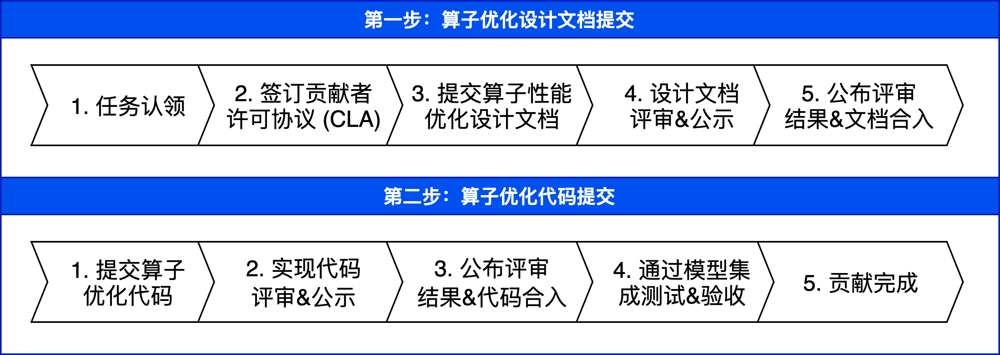

#####################
算子性能优化 提交流程
#####################

飞桨作为一个开源项目，非常欢迎你为 Paddle 框架贡献高性能算子，当你想为飞桨开发或优化算子性能时，请遵守此下述贡献流程，在 GitHub 上完成文档设计和代码设计并提交至相应的 GitHub 仓库。

算子性能优化贡献流程
::::::::::::::::::::::

流程介绍
::::::::::::::::::::::

**1. 任务认领**

如果你想参与飞桨 OP 开源贡献，可以在 GitHub Paddle 项目上的 Issue 区域进行任务认领，飞桨官方会发布一些 OP 性能优化任务，你可以认领其中的算子优化任务，并按照此贡献流程提交算子性能优化设计文档。

**2. 签订贡献者许可协议（CLA）**

对于你贡献的源代码，你将拥有合法的知识产权，为了保护你的权益，你需要先签署一份 `贡献者许可协议 <https://cla-assistant.io/PaddlePaddle/Paddle?pullRequest=39047>`_ 。

**注意**：只有当你签署完 CLA 后，我们才能继续对你提交的设计方案和实现代码进行评审及合入。

**3. 提交算子性能优化设计文档**

算子性能优化设计文档的目的是促进社区开发者更容易的参与开源项目共建，开发者通过与飞桨专家和社区其他用户进行广泛的交流，完善设计方案和 PR 请求，在提交实现代码之前确保 OP 性能优化方案设计方案符合飞桨的设计理念，同时也便于后续的代码评审及合入工作。

当你想要发起一个算子性能优化的贡献时，需要首先进行算子优化方案设计并设计文档。飞桨提供了 算子性能优化设计文档模版 ，你可以使用这份模版编写设计文档。完成后，你需要将设计文档提交至 GitHub 开发者社区仓库 ，并根据本地开发指南提交 PR。

此过程请参考相应的开发规范，并提交以下内容：

.. csv-table::
    :header: "提交内容", "参考文档", "提交位置"
    :widths: 10, 30, 30

    "算子性能优化设计文档", "- `算子性能优化设计文档 模版 <https://github.com/PaddlePaddle/community/tree/master/rfcs/OPs-Perf/op_optimization_template.md>`_
    - `算子性能优化设计文档 示例 <https://github.com/PaddlePaddle/community/blob/master/rfcs/OPs-Perf/op_optimization_example.md>`_ ", "`Github 开发者社区仓库 <https://github.com/PaddlePaddle/community/tree/master/rfcs/OPs-Perf>`_"

**4. 设计文档评审&公示**

飞桨专家对你提交的设计文档进行审核，同时此文档也将接受来自开发者社区的评估，所有开发者都可以在 PR 评论区进行广泛的交流。开发者根据飞桨专家和其他开发者的反馈意见进行讨论并做出修改，最终评审通过后会合入。

如果你的设计方案比较复杂，会在社区中针对算子的设计文档发起评审会议。飞桨会提前在 PR 评论区公布会议时间、会议地址、参会人、议题等内容，请及时关注 pr 中最新动态，你也可以在评论区自行申请评审会。会议结束后，会在 PR 中发出会议结论。

**5. 公布评审结果&合入文档**

当设计文档评审&公示通过后，你的算子性能优化设计文档将会合入至 `飞桨开发者社区仓库 <https://github.com/PaddlePaddle/community>`_ ，并在开源社区中同步。

**6. 提交 API 实现代码**

随后，你可以根据评审通过的设计内容进行代码开发。此过程请参考相应的开发规范，并提交以下内容：

.. csv-table::
    :header: "提交内容", "参考文档", "提交位置"
    :widths: 10, 30, 30

    "算子性能优化实现代码", "- `Paddle 代码规范 <https://www.paddlepaddle.org.cn/documentation/docs/zh/dev_guides/style_guides_cn.html>`_
    - `C++ OP 开发指南 <../api_contributing_guides/new_cpp_op_cn.html>`_
    - `OP Benchmark 使用指南 <https://github.com/PaddlePaddle/benchmark/blob/master/api>`_
    - `算子性能优化 优化方法 <./op_optimization_method_introduction_cn.html>`_
    - `算子性能优化 验收规范 <./op_optimization_accpetance_criteria_cn.html>`_
    ", "`Github 飞桨训练框架仓库 <https://github.com/PaddlePaddle/Paddle>`_"

当你完成以上代码设计后，需要将代码提交至 `Github 飞桨训练框架仓库 <https://github.com/PaddlePaddle/Paddle>`_ ，并根据 `本地开发指南 <https://www.paddlepaddle.org.cn/documentation/docs/zh/develop/dev_guides/git_guides/local_dev_guide_cn.html>`_ 提交 PR、准备接受社区的评审。

**7. 实现代码评审&公示**

飞桨官方会及时安排专家进行算子性能优化代码审核，代码也将接受来自开发者社区的评审，所有开发者可以在 PR 评论区进行交流。请你对飞桨专家和其他开发者的反馈意见进行讨论并做出修改，最终评审通过后会在开源社区中同步。

如果你的代码实现逻辑比较复杂，会在社区中针对算子的设计文档发起评审会议。飞桨会提前在 PR 评论区公布会议时间、会议地址、参会人、议题等内容，请及时关注 pr 中最新动态，你也可以在评论区自行申请评审会。会议结束后，会在 PR 中发出会议结论。

**8. 公布评审结果&合入代码**

当算子优化代码评审&公示通过后，官方会在开源社区中同步，你所实现的优化代码将会合入至 `Github 飞桨训练框架仓库 <https://github.com/PaddlePaddle/Paddle>`_ 。

**9. 通过模型集成及验收**

当你的代码合入 `Github 飞桨训练框架仓库 <https://github.com/PaddlePaddle/Paddle>`_ 后，飞桨会对你的性能优化代码进行模型级集成测试，并告知你测试结果。如果测试通过，恭喜你贡献流程已经全部完成；如果测试不通过，会通过 ISSUE 联系你进行代码修复，请及时关注 GitHub 上的最新动态。

**注意**：代码合入 develop 分支之后的第二天，你可以从官网下载 develop 安装包体验此功能。飞桨后续也会将此功能纳入下一个正式版的发版计划。

**10. 贡献完成**

感谢你的贡献！

..  toctree::
    :hidden:

    op_optimization_method_introduction_cn.md
    op_optimization_accpetance_criteria_cn.md
    kernel_primitive_api/index_cn.rst
