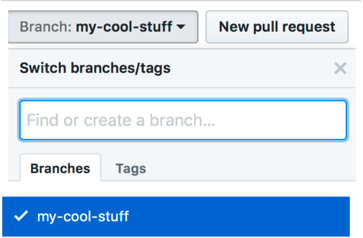

# 提交PR注意事项

## 完成 Pull Request PR创建

切换到所建分支，然后点击 `New pull request`。



选择目标分支：


如果解决了某个Issue的问题创建的 PR，需要关联Issue，参考[Code Reivew 约定](./code_review_cn.html)。并在 PR 的描述说明中，填写 `resolve #Issue编号` 可以在这个 PR 被 merge 后，自动关闭对应的 Issue，具体请见[这里](https://help.github.com/articles/closing-issues-via-commit-messages/)。

接下来等待 review，如果有需要修改的地方，参照上述步骤更新 origin 中的对应分支即可。

## 签署CLA协议和通过单元测试

### 签署CLA

在首次向PaddlePaddle提交Pull Request时，您需要您签署一次CLA(Contributor License Agreement)协议，以保证您的代码可以被合入，具体签署方式如下：

- 请您查看PR中的Check部分，找到license/cla，并点击右侧detail，进入CLA网站

<div align="center">


 </div>

- 请您点击CLA网站中的“Sign in with GitHub to agree”,点击完成后将会跳转回您的Pull Request页面

<div align="center">


 </div>


### 通过单元测试

您在Pull Request中每提交一次新的commit后，会触发CI单元测试，请确认您的commit message中已加入必要的说明，请见[提交（commit）](./local_dev_guide_cn.html#commit)

请您关注您Pull Request中的CI单元测试进程，它将会在几个小时内完成

当所需的测试后都出现了绿色的对勾，表示您本次commit通过了各项单元测试，您只需要关注显示Required任务，不显示的可能是我们正在测试的任务

如果所需的测试后出现了红色叉号，代表您本次的commit未通过某项单元测试，在这种情况下，请您点击detail查看报错详情，并将报错原因截图，以评论的方式添加在您的Pull Request中，我们的工作人员将帮您查看


## 删除远程分支

在 PR 被 merge 进主仓库后，我们可以在 PR 的页面删除远程仓库的分支。


也可以使用 `git push origin :分支名` 删除远程分支，如：

```bash
➜  git push origin :my-cool-stuff
```

## 删除本地分支

最后，删除本地分支。

```bash
# 切换到 develop 分支
➜  git checkout develop

# 删除 my-cool-stuff 分支
➜  git branch -D my-cool-stuff
```

至此，我们就完成了一次代码贡献的过程。
